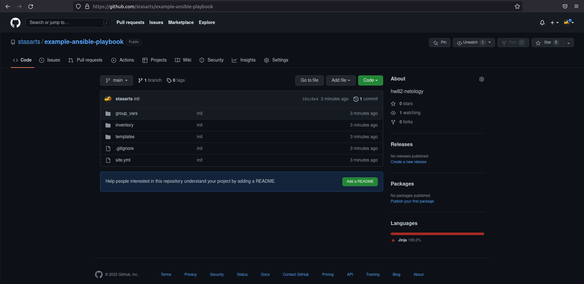

# Домашнее задание к занятию "08.02 Работа с Playbook"

## Подготовка к выполнению
1. Создайте свой собственный (или используйте старый) публичный репозиторий на github с произвольным именем.
2. Скачайте [playbook](./playbook/) из репозитория с домашним заданием и перенесите его в свой репозиторий.
3. Подготовьте хосты в соотвтествии с группами из предподготовленного playbook. 
4. Скачайте дистрибутив [java](https://www.oracle.com/java/technologies/javase-jdk11-downloads.html) и положите его в директорию `playbook/files/`. 

## Основная часть
1. Приготовьте свой собственный inventory файл `prod.yml`.
2. Допишите playbook: нужно сделать ещё один play, который устанавливает и настраивает kibana.
3. При создании tasks рекомендую использовать модули: `get_url`, `template`, `unarchive`, `file`.
4. Tasks должны: скачать нужной версии дистрибутив, выполнить распаковку в выбранную директорию, сгенерировать конфигурацию с параметрами.
5. Запустите `ansible-lint site.yml` и исправьте ошибки, если они есть.
6. Попробуйте запустить playbook на этом окружении с флагом `--check`.
7. Запустите playbook на `prod.yml` окружении с флагом `--diff`. Убедитесь, что изменения на системе произведены.
8. Повторно запустите playbook с флагом `--diff` и убедитесь, что playbook идемпотентен.
9. Подготовьте README.md файл по своему playbook. В нём должно быть описано: что делает playbook, какие у него есть параметры и теги.
10. Готовый playbook выложите в свой репозиторий, в ответ предоставьте ссылку на него.

## Необязательная часть

1. Приготовьте дополнительный хост для установки logstash.
2. Пропишите данный хост в `prod.yml` в новую группу `logstash`.
3. Дополните playbook ещё одним play, который будет исполнять установку logstash только на выделенный для него хост.
4. Все переменные для нового play определите в отдельный файл `group_vars/logstash/vars.yml`.
5. Logstash конфиг должен конфигурироваться в части ссылки на elasticsearch (можно взять, например его IP из facts или определить через vars).
6. Дополните README.md, протестируйте playbook, выложите новую версию в github. В ответ предоставьте ссылку на репозиторий.

---

## Ответ

## Подготовка к выполнению

1-2. Создадим свой собственный публичный [репозиторий на github](https://github.com/stasarts/example-ansible-base), скачаем [playbook](./playbook/playbook/) и перенесем его в свой репозиторий: 
<p align="center">
  
</p>

3. Подготовим хосты в соответствии с группами из предпоготовленного playbook.
```shell
~/ansible/example-ansible-playbook$ docker run --rm -d -it --name elastic-centos7 pycontribs/centos:7
72ceea67dabd55989508973561da692a8111e1ec14acbbb68958b3e54207d3e0
~/ansible/example-ansible-playbook$ docker ps
CONTAINER ID   IMAGE                 COMMAND       CREATED         STATUS         PORTS     NAMES
72ceea67dabd   pycontribs/centos:7   "/bin/bash"   6 seconds ago   Up 5 seconds             elastic-centos7
```

4. Скачайте дистрибутив [java](https://www.oracle.com/java/technologies/javase-jdk11-downloads.html) и положите его в директорию `playbook/files/`. 
```shell
~/ansible/example-ansible-playbook$ ll files
total 164740
drwxrwxr-x 2 stasarts stasarts      4096 июн  7 15:21 ./
drwxrwxr-x 8 stasarts stasarts      4096 июн  7 14:50 ../
-rw-rw-r-- 1 stasarts stasarts 168679847 июн  7 15:02 jdk-11.0.14_linux-x64_bin.tar.gz
```

## Основная часть

1. Приготовьте свой собственный inventory файл `prod.yml`.
```shell
---
  elasticsearch:
    hosts:
      elastic-centos7:
        ansible_connection: docker
```

2. Допишите playbook: нужно сделать ещё один play, который устанавливает и настраивает kibana.
* site.yml
```shell
- name: Install Kibana
  hosts: elasticsearch
  tasks:
    - name: Upload tar.gz Kibana from remote URL
      get_url:
        url: https://artifacts.elastic.co/downloads/kibana/kibana-{{ elastic_version }}-linux-x86_64.tar.gz
        dest: "/tmp/kibana-{{ elastic_version }}-linux-x86_64.tar.gz"
        mode: 0755
        timeout: 60
        force: true
        validate_certs: false
      register: get_kibana
      until: get_kibana is succeeded
      tags: kibana
    - name: Create directrory for Kibana
      become: true
      file:
        state: directory
        path: "{{ kibana_home }}"
        mode: 0755
      tags: kibana
    - name: Extract Kibana in the installation directory
      become: true
      unarchive:
        copy: false
        src: "/tmp/kibana-{{ elastic_version }}-linux-x86_64.tar.gz"
        dest: "{{ kibana_home }}"
        extra_opts: [--strip-components=1]
        creates: "{{ kibana_home }}/bin/kibana"
      tags: kibana
    - name: Set environment Kibana
      become: true
      template:
        src: templates/kibana.sh.j2
        dest: /etc/profile.d/kibana.sh
        mode: 0755
      tags: kibana
```

* templates/kibana.sh.j2
```shell
# Warning: This file is Ansible Managed, manual changes will be overwritten on next playbook run.
#!/usr/bin/env bash

export KIBANA_HOME={{ kibana_home }}
export PATH=$PATH:$KIBANA_HOME/bin
```

* group_vars/elasticsearch/vars.yml
```shell
---
elastic_version: "7.10.1"
elastic_home: "/opt/elastic/{{ elastic_version }}"
kibana_home: "/opt/kibana/{{ elastic_version }}"
```

3. При создании tasks рекомендую использовать модули: `get_url`, `template`, `unarchive`, `file`.  
`OK`

4. Tasks должны: скачать нужной версии дистрибутив, выполнить распаковку в выбранную директорию, сгенерировать конфигурацию с параметрами.  
`OK`

5. Запустим `ansible-lint site.yml` и исправим ошибки.
```shell
~/ansible/example-ansible-playbook$ ansible-lint site.yml
Couldn't parse task at site.yml:5 (conflicting action statements: set_fact, __line__

The error appears to be in '<unicode string>': line 5, column 9, but may
be elsewhere in the file depending on the exact syntax problem.

(could not open file to display line))
{ 'name': 'Set facts for Java 11 vars',
  'set_fact': { '__file__': 'site.yml',
                '__line__': 7,
                'java_home': '/opt/jdk/{{ java_jdk_version }}'},
  'skipped_rules': [],
  'tags': 'java'}
```
* Характер ошибки неясен. Поиск решения результатов не дал. На работоспособности playbook не сказалось.

6. Попробуем запустить playbook на этом окружении с флагом `--check`.
```shell
~/ansible/example-ansible-playbook$ ansible-playbook -i inventory/prod.yml site.yml --check

PLAY [Install Java] ***************************************************************************************************************************************************************************************

TASK [Gathering Facts] ************************************************************************************************************************************************************************************
ok: [elastic-centos7]

TASK [Set facts for Java 11 vars] *************************************************************************************************************************************************************************
ok: [elastic-centos7]

TASK [Upload .tar.gz file containing binaries from local storage] *****************************************************************************************************************************************
changed: [elastic-centos7]

TASK [Ensure installation dir exists] *********************************************************************************************************************************************************************
changed: [elastic-centos7]

TASK [Extract java in the installation directory] *********************************************************************************************************************************************************
An exception occurred during task execution. To see the full traceback, use -vvv. The error was: NoneType: None
fatal: [elastic-centos7]: FAILED! => {"changed": false, "msg": "dest '/opt/jdk/11.0.14' must be an existing dir"}

PLAY RECAP ************************************************************************************************************************************************************************************************
elastic-centos7            : ok=4    changed=2    unreachable=0    failed=1    skipped=0    rescued=0    ignored=0
```

7. Запустим playbook на `prod.yml` окружении с флагом `--diff`. Убедитесь, что изменения на системе произведены.
```shell
~/ansible/example-ansible-playbook$ ansible-playbook -i inventory/prod.yml site.yml --diff

PLAY [Install Java] ***************************************************************************************************************************************************************************************

TASK [Gathering Facts] ************************************************************************************************************************************************************************************
ok: [elastic-centos7]

TASK [Set facts for Java 11 vars] *************************************************************************************************************************************************************************
ok: [elastic-centos7]

TASK [Upload .tar.gz file containing binaries from local storage] *****************************************************************************************************************************************
diff skipped: source file size is greater than 104448
changed: [elastic-centos7]

TASK [Ensure installation dir exists] *********************************************************************************************************************************************************************
--- before
+++ after
@@ -1,4 +1,4 @@
 {
     "path": "/opt/jdk/11.0.14",
-    "state": "absent"
+    "state": "directory"
 }

changed: [elastic-centos7]

TASK [Extract java in the installation directory] *********************************************************************************************************************************************************
changed: [elastic-centos7]

TASK [Export environment variables] ***********************************************************************************************************************************************************************
--- before
+++ after: /home/stasarts/.ansible/tmp/ansible-local-1559981448t8cp7/tmplyf7237d/jdk.sh.j2
@@ -0,0 +1,5 @@
+# Warning: This file is Ansible Managed, manual changes will be overwritten on next playbook run.
+#!/usr/bin/env bash
+
+export JAVA_HOME=/opt/jdk/11.0.14
+export PATH=$PATH:$JAVA_HOME/bin
\ No newline at end of file

changed: [elastic-centos7]

PLAY [Install Elasticsearch] ******************************************************************************************************************************************************************************

TASK [Gathering Facts] ************************************************************************************************************************************************************************************
ok: [elastic-centos7]

TASK [Upload tar.gz Elasticsearch from remote URL] ********************************************************************************************************************************************************
FAILED - RETRYING: Upload tar.gz Elasticsearch from remote URL (3 retries left).
changed: [elastic-centos7]

TASK [Create directrory for Elasticsearch] ****************************************************************************************************************************************************************
--- before
+++ after
@@ -1,4 +1,4 @@
 {
     "path": "/opt/elastic/7.10.1",
-    "state": "absent"
+    "state": "directory"
 }

changed: [elastic-centos7]

TASK [Extract Elasticsearch in the installation directory] ************************************************************************************************************************************************
changed: [elastic-centos7]

TASK [Set environment Elastic] ****************************************************************************************************************************************************************************
--- before
+++ after: /home/stasarts/.ansible/tmp/ansible-local-1559981448t8cp7/tmpfw_s6elm/elk.sh.j2
@@ -0,0 +1,5 @@
+# Warning: This file is Ansible Managed, manual changes will be overwritten on next playbook run.
+#!/usr/bin/env bash
+
+export ES_HOME=/opt/elastic/7.10.1
+export PATH=$PATH:$ES_HOME/bin
\ No newline at end of file

changed: [elastic-centos7]

PLAY [Install Kibana] *************************************************************************************************************************************************************************************

TASK [Gathering Facts] ************************************************************************************************************************************************************************************
ok: [elastic-centos7]

TASK [Upload tar.gz Kibana from remote URL] ***************************************************************************************************************************************************************
changed: [elastic-centos7]

TASK [Create directrory for Kibana] ***********************************************************************************************************************************************************************
--- before
+++ after
@@ -1,4 +1,4 @@
 {
     "path": "/opt/kibana/7.10.1",
-    "state": "absent"
+    "state": "directory"
 }

changed: [elastic-centos7]

TASK [Extract Kibana in the installation directory] *******************************************************************************************************************************************************
changed: [elastic-centos7]

TASK [Set environment Kibana] *****************************************************************************************************************************************************************************
--- before
+++ after: /home/stasarts/.ansible/tmp/ansible-local-1559981448t8cp7/tmp7l4cyevf/kibana.sh.j2
@@ -0,0 +1,5 @@
+# Warning: This file is Ansible Managed, manual changes will be overwritten on next playbook run.
+#!/usr/bin/env bash
+
+export KIBANA_HOME=/opt/kibana/7.10.1
+export PATH=$PATH:$KIBANA_HOME/bin
\ No newline at end of file

changed: [elastic-centos7]

PLAY RECAP ************************************************************************************************************************************************************************************************
elastic-centos7            : ok=16   changed=12   unreachable=0    failed=0    skipped=0    rescued=0    ignored=0
```

8. Повторно запустим playbook с флагом `--diff` и убедимся, что playbook идемпотентен.
```shell
~/ansible/example-ansible-playbook$ ansible-playbook -i inventory/prod.yml site.yml --diff

PLAY [Install Java] ***************************************************************************************************************************************************************************************

TASK [Gathering Facts] ************************************************************************************************************************************************************************************
ok: [elastic-centos7]

TASK [Set facts for Java 11 vars] *************************************************************************************************************************************************************************
ok: [elastic-centos7]

TASK [Upload .tar.gz file containing binaries from local storage] *****************************************************************************************************************************************
ok: [elastic-centos7]

TASK [Ensure installation dir exists] *********************************************************************************************************************************************************************
ok: [elastic-centos7]

TASK [Extract java in the installation directory] *********************************************************************************************************************************************************
skipping: [elastic-centos7]

TASK [Export environment variables] ***********************************************************************************************************************************************************************
ok: [elastic-centos7]

PLAY [Install Elasticsearch] ******************************************************************************************************************************************************************************

TASK [Gathering Facts] ************************************************************************************************************************************************************************************
ok: [elastic-centos7]

TASK [Upload tar.gz Elasticsearch from remote URL] ********************************************************************************************************************************************************
ok: [elastic-centos7]

TASK [Create directrory for Elasticsearch] ****************************************************************************************************************************************************************
ok: [elastic-centos7]

TASK [Extract Elasticsearch in the installation directory] ************************************************************************************************************************************************
skipping: [elastic-centos7]

TASK [Set environment Elastic] ****************************************************************************************************************************************************************************
ok: [elastic-centos7]

PLAY [Install Kibana] *************************************************************************************************************************************************************************************

TASK [Gathering Facts] ************************************************************************************************************************************************************************************
ok: [elastic-centos7]

TASK [Upload tar.gz Kibana from remote URL] ***************************************************************************************************************************************************************
ok: [elastic-centos7]

TASK [Create directrory for Kibana] ***********************************************************************************************************************************************************************
ok: [elastic-centos7]

TASK [Extract Kibana in the installation directory] *******************************************************************************************************************************************************
skipping: [elastic-centos7]

TASK [Set environment Kibana] *****************************************************************************************************************************************************************************
ok: [elastic-centos7]

PLAY RECAP ************************************************************************************************************************************************************************************************
elastic-centos7            : ok=13   changed=0    unreachable=0    failed=0    skipped=3    rescued=0    ignored=0
```

9. Подготовим README.md файл по `playbook`. В нём опишем: что делает playbook, какие у него есть параметры и теги.

[README.md с ответами](https://github.com/stasarts/example-ansible-playbook/blob/main/README.md)

10. Готовый playbook выложите в свой репозиторий, в ответ предоставьте ссылку на него.

[Репозиторий с изменённым `playbook` и заполненным `README.md`](https://github.com/stasarts/example-ansible-playbook)

---