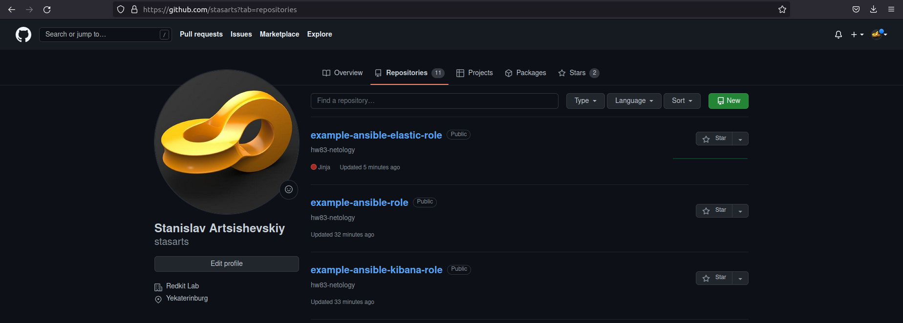
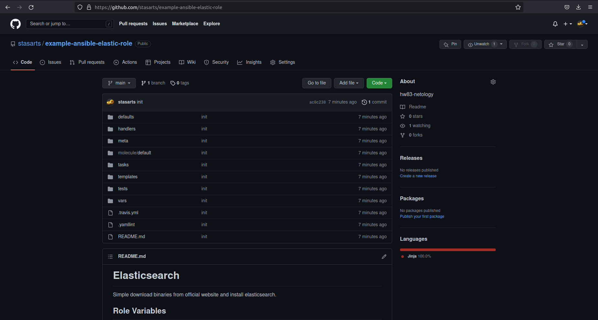
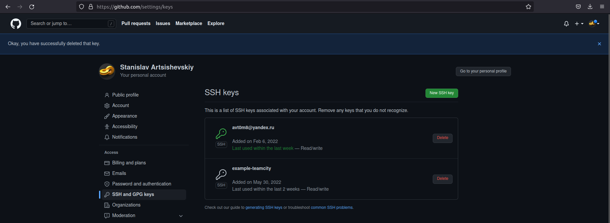

# Домашнее задание к занятию "08.03 Работа с Roles"

## Подготовка к выполнению
1. Создайте два пустых публичных репозитория в любом своём проекте: elastic-role и kibana-role.
2. Скачайте [role](./roles/) из репозитория с домашним заданием и перенесите его в свой репозиторий elastic-role.
3. Скачайте дистрибутив [java](https://www.oracle.com/java/technologies/javase-jdk11-downloads.html) и положите его в директорию `playbook/files/`. 
4. Установите molecule: `pip3 install molecule`
5. Добавьте публичную часть своего ключа к своему профилю в github.

## Основная часть

Наша основная цель - разбить наш playbook на отдельные roles. Задача: сделать roles для elastic, kibana и написать playbook для использования этих ролей. Ожидаемый результат: существуют два ваших репозитория с roles и один репозиторий с playbook.

1. Создать в старой версии playbook файл `requirements.yml` и заполнить его следующим содержимым:
   ```yaml
   ---
     - src: git@github.com:netology-code/mnt-homeworks-ansible.git
       scm: git
       version: "1.0.1"
       name: java 
   ```
2. При помощи `ansible-galaxy` скачать себе эту роль. Запустите  `molecule test`, посмотрите на вывод команды.
3. Перейдите в каталог с ролью elastic-role и создайте сценарий тестирования по умолчаню при помощи `molecule init scenario --driver-name docker`.
4. Добавьте несколько разных дистрибутивов (centos:8, ubuntu:latest) для инстансов и протестируйте роль, исправьте найденные ошибки, если они есть.
5. Создайте новый каталог с ролью при помощи `molecule init role --driver-name docker kibana-role`. Можете использовать другой драйвер, который более удобен вам.
6. На основе tasks из старого playbook заполните новую role. Разнесите переменные между `vars` и `default`. Проведите тестирование на разных дистрибитивах (centos:7, centos:8, ubuntu).
7. Выложите все roles в репозитории. Проставьте тэги, используя семантическую нумерацию.
8. Добавьте roles в `requirements.yml` в playbook.
9. Переработайте playbook на использование roles.
10. Выложите playbook в репозиторий.
11. В ответ приведите ссылки на оба репозитория с roles и одну ссылку на репозиторий с playbook.

## Необязательная часть

1. Проделайте схожие манипуляции для создания роли logstash.
2. Создайте дополнительный набор tasks, который позволяет обновлять стек ELK.
3. В ролях добавьте тестирование в раздел `verify.yml`. Данный раздел должен проверять, что elastic запущен и возвращает успешный статус по API, web-интерфейс kibana отвечает без кодов ошибки, logstash через команду `logstash -e 'input { stdin { } } output { stdout {} }'`.
4. Убедитесь в работоспособности своего стека. Возможно, потребуется тестировать все роли одновременно.
5. Выложите свои roles в репозитории. В ответ приведите ссылки.

---

## Ответ

## Подготовка к выполнению

1. Создадим два пустых публичных репозитория в любом своём проекте: elastic-role и kibana-role.
<p align="center">
  
</p>

2. Скачаем [role](./role/roles/) из репозитория с домашним заданием и перенесем его в свой репозиторий elastic-role.
<p align="center">
  
</p>

3. Скачаем дистрибутив [java](https://www.oracle.com/java/technologies/javase-jdk11-downloads.html) и положим его в директорию `playbook/files/`. 
```shell
~/ansible/example-ansible-role$ ll files
total 164736
drwxrwxr-x 2 stasarts stasarts      4096 июн  8 16:35 ./
drwxrwxr-x 5 stasarts stasarts      4096 июн  8 16:35 ../
-rw-rw-r-- 1 stasarts stasarts 168679847 июн  7 15:02 jdk-11.0.14_linux-x64_bin.tar.gz
```

4. Установим molecule: `pip3 install molecule`
```shell
~/ansible/example-ansible-role$ pip3 install molecule
Collecting molecule
...
Successfully installed
```

```shell
~/ansible/example-ansible-role$ molecule --version
molecule 3.6.1 using python 3.8 
    ansible:2.11.5
    delegated:3.6.1 from molecule
```

6. Добавим публичную часть своего ключа к своему профилю в github.
<p align="center">
  
</p>

## Основная часть

1. Создадим в старой версии playbook файл `requirements.yml` и заполним его следующим содержимым:
   ```yaml
   ---
     - src: git@github.com:netology-code/mnt-homeworks-ansible.git
       scm: git
       version: "1.0.1"
       name: java
   ```

2. При помощи `ansible-galaxy` скачаем себе эту роль. 
```shell
~/ansible/example-ansible-role$ ansible-galaxy install -r requirements.yml --roles-path ./roles
Starting galaxy role install process
- extracting java to /home/stasarts/ansible/example-ansible-role/roles/java
- java (1.0.1) was installed successfully
```
* Workaround:
1. Нужно добавить в meta/main.yml full role name:
```shell
galaxy_info:
  role_name: java
  namespace: avt0m8
```

2. Нужно корректно указать путь до роли в converge.yml:
```shell
---
- name: Converge
  hosts: all
  tasks:
    - name: "Include this role"
      include_role:
        name: "{{ lookup('env', 'MOLECULE_PROJECT_DIRECTORY') | basename }}"
```

Запустим  `molecule test`, посмотрим на вывод команды.
```shell
~/ansible/example-ansible-role/roles/java$ molecule test
INFO     default scenario test matrix: dependency, lint, cleanup, destroy, syntax, create, prepare, converge, idempotence, side_effect, verify, cleanup, destroy
INFO     Performing prerun...
INFO     Set ANSIBLE_LIBRARY=/home/stasarts/.cache/ansible-compat/38a096/modules:/home/stasarts/.ansible/plugins/modules:/usr/share/ansible/plugins/modules
INFO     Set ANSIBLE_COLLECTIONS_PATH=/home/stasarts/.cache/ansible-compat/38a096/collections:/home/stasarts/.ansible/collections:/usr/share/ansible/collections
INFO     Set ANSIBLE_ROLES_PATH=/home/stasarts/.cache/ansible-compat/38a096/roles:/home/stasarts/.ansible/roles:/usr/share/ansible/roles:/etc/ansible/roles
INFO     Using /home/stasarts/.cache/ansible-compat/38a096/roles/avt0m8.java symlink to current repository in order to enable Ansible to find the role using its expected full name.
INFO     Running default > dependency
WARNING  Skipping, missing the requirements file.
WARNING  Skipping, missing the requirements file.
INFO     Running default > lint
INFO     Lint is disabled.
INFO     Running default > cleanup
WARNING  Skipping, cleanup playbook not configured.
INFO     Running default > destroy
INFO     Sanity checks: 'docker'

PLAY [Destroy] *****************************************************************

TASK [Destroy molecule instance(s)] ********************************************
changed: [localhost] => (item=centos7)
changed: [localhost] => (item=centos8)
changed: [localhost] => (item=ubuntu)

TASK [Wait for instance(s) deletion to complete] *******************************
ok: [localhost] => (item=centos7)
ok: [localhost] => (item=centos8)
ok: [localhost] => (item=ubuntu)

TASK [Delete docker networks(s)] ***********************************************

PLAY RECAP *********************************************************************
localhost                  : ok=2    changed=1    unreachable=0    failed=0    skipped=1    rescued=0    ignored=0

INFO     Running default > syntax

playbook: /home/stasarts/ansible/example-ansible-role/roles/java/molecule/default/converge.yml
INFO     Running default > create

PLAY [Create] ******************************************************************

TASK [Log into a Docker registry] **********************************************
skipping: [localhost] => (item=None) 
skipping: [localhost] => (item=None) 
skipping: [localhost] => (item=None) 
skipping: [localhost]

TASK [Check presence of custom Dockerfiles] ************************************
ok: [localhost] => (item={'image': 'docker.io/pycontribs/centos:7', 'name': 'centos7', 'pre_build_image': True})
ok: [localhost] => (item={'image': 'docker.io/pycontribs/centos:8', 'name': 'centos8', 'pre_build_image': True})
ok: [localhost] => (item={'image': 'docker.io/pycontribs/ubuntu:latest', 'name': 'ubuntu', 'pre_build_image': True})

TASK [Create Dockerfiles from image names] *************************************
skipping: [localhost] => (item={'image': 'docker.io/pycontribs/centos:7', 'name': 'centos7', 'pre_build_image': True}) 
skipping: [localhost] => (item={'image': 'docker.io/pycontribs/centos:8', 'name': 'centos8', 'pre_build_image': True}) 
skipping: [localhost] => (item={'image': 'docker.io/pycontribs/ubuntu:latest', 'name': 'ubuntu', 'pre_build_image': True}) 

TASK [Discover local Docker images] ********************************************
ok: [localhost] => (item={'changed': False, 'skipped': True, 'skip_reason': 'Conditional result was False', 'item': {'image': 'docker.io/pycontribs/centos:7', 'name': 'centos7', 'pre_build_image': True}, 'ansible_loop_var': 'item', 'i': 0, 'ansible_index_var': 'i'})
ok: [localhost] => (item={'changed': False, 'skipped': True, 'skip_reason': 'Conditional result was False', 'item': {'image': 'docker.io/pycontribs/centos:8', 'name': 'centos8', 'pre_build_image': True}, 'ansible_loop_var': 'item', 'i': 1, 'ansible_index_var': 'i'})
ok: [localhost] => (item={'changed': False, 'skipped': True, 'skip_reason': 'Conditional result was False', 'item': {'image': 'docker.io/pycontribs/ubuntu:latest', 'name': 'ubuntu', 'pre_build_image': True}, 'ansible_loop_var': 'item', 'i': 2, 'ansible_index_var': 'i'})

TASK [Build an Ansible compatible image (new)] *********************************
skipping: [localhost] => (item=molecule_local/docker.io/pycontribs/centos:7) 
skipping: [localhost] => (item=molecule_local/docker.io/pycontribs/centos:8) 
skipping: [localhost] => (item=molecule_local/docker.io/pycontribs/ubuntu:latest) 

TASK [Create docker network(s)] ************************************************

TASK [Determine the CMD directives] ********************************************
ok: [localhost] => (item={'image': 'docker.io/pycontribs/centos:7', 'name': 'centos7', 'pre_build_image': True})
ok: [localhost] => (item={'image': 'docker.io/pycontribs/centos:8', 'name': 'centos8', 'pre_build_image': True})
ok: [localhost] => (item={'image': 'docker.io/pycontribs/ubuntu:latest', 'name': 'ubuntu', 'pre_build_image': True})

TASK [Create molecule instance(s)] *********************************************
changed: [localhost] => (item=centos7)
changed: [localhost] => (item=centos8)
changed: [localhost] => (item=ubuntu)

TASK [Wait for instance(s) creation to complete] *******************************
changed: [localhost] => (item={'started': 1, 'finished': 0, 'ansible_job_id': '416069385482.1728387', 'results_file': '/home/stasarts/.ansible_async/416069385482.1728387', 'changed': True, 'failed': False, 'item': {'image': 'docker.io/pycontribs/centos:7', 'name': 'centos7', 'pre_build_image': True}, 'ansible_loop_var': 'item'})
changed: [localhost] => (item={'started': 1, 'finished': 0, 'ansible_job_id': '300557505157.1728415', 'results_file': '/home/stasarts/.ansible_async/300557505157.1728415', 'changed': True, 'failed': False, 'item': {'image': 'docker.io/pycontribs/centos:8', 'name': 'centos8', 'pre_build_image': True}, 'ansible_loop_var': 'item'})
changed: [localhost] => (item={'started': 1, 'finished': 0, 'ansible_job_id': '324718509101.1728457', 'results_file': '/home/stasarts/.ansible_async/324718509101.1728457', 'changed': True, 'failed': False, 'item': {'image': 'docker.io/pycontribs/ubuntu:latest', 'name': 'ubuntu', 'pre_build_image': True}, 'ansible_loop_var': 'item'})

PLAY RECAP *********************************************************************
localhost                  : ok=5    changed=2    unreachable=0    failed=0    skipped=4    rescued=0    ignored=0

INFO     Running default > prepare
WARNING  Skipping, prepare playbook not configured.
INFO     Running default > converge

PLAY [Converge] ****************************************************************

TASK [Gathering Facts] *********************************************************
ok: [centos8]
ok: [ubuntu]
ok: [centos7]

TASK [Include this role] *******************************************************

TASK [java : Upload .tar.gz file containing binaries from local storage] *******
skipping: [centos7]
skipping: [centos8]
skipping: [ubuntu]

TASK [java : Upload .tar.gz file conaining binaries from remote storage] *******
changed: [centos7]
changed: [ubuntu]
changed: [centos8]

TASK [java : Ensure installation dir exists] ***********************************
changed: [centos7]
changed: [ubuntu]
changed: [centos8]

TASK [java : Extract java in the installation directory] ***********************
changed: [centos8]
changed: [centos7]
changed: [ubuntu]

TASK [java : Export environment variables] *************************************
changed: [centos7]
changed: [ubuntu]
changed: [centos8]

PLAY RECAP *********************************************************************
centos7                    : ok=5    changed=4    unreachable=0    failed=0    skipped=1    rescued=0    ignored=0
centos8                    : ok=5    changed=4    unreachable=0    failed=0    skipped=1    rescued=0    ignored=0
ubuntu                     : ok=5    changed=4    unreachable=0    failed=0    skipped=1    rescued=0    ignored=0

INFO     Running default > idempotence

PLAY [Converge] ****************************************************************

TASK [Gathering Facts] *********************************************************
ok: [centos8]
ok: [ubuntu]
ok: [centos7]

TASK [Include this role] *******************************************************

TASK [java : Upload .tar.gz file containing binaries from local storage] *******
skipping: [centos7]
skipping: [centos8]
skipping: [ubuntu]

TASK [java : Upload .tar.gz file conaining binaries from remote storage] *******
ok: [centos7]
ok: [ubuntu]
ok: [centos8]

TASK [java : Ensure installation dir exists] ***********************************
ok: [ubuntu]
ok: [centos7]
ok: [centos8]

TASK [java : Extract java in the installation directory] ***********************
skipping: [centos7]
skipping: [ubuntu]
skipping: [centos8]

TASK [java : Export environment variables] *************************************
ok: [centos7]
ok: [ubuntu]
ok: [centos8]

PLAY RECAP *********************************************************************
centos7                    : ok=4    changed=0    unreachable=0    failed=0    skipped=2    rescued=0    ignored=0
centos8                    : ok=4    changed=0    unreachable=0    failed=0    skipped=2    rescued=0    ignored=0
ubuntu                     : ok=4    changed=0    unreachable=0    failed=0    skipped=2    rescued=0    ignored=0

INFO     Idempotence completed successfully.
INFO     Running default > side_effect
WARNING  Skipping, side effect playbook not configured.
INFO     Running default > verify
INFO     Running Ansible Verifier

PLAY [Verify] ******************************************************************

TASK [Check Java can running] **************************************************
ok: [ubuntu]
ok: [centos8]
ok: [centos7]

PLAY RECAP *********************************************************************
centos7                    : ok=1    changed=0    unreachable=0    failed=0    skipped=0    rescued=0    ignored=0
centos8                    : ok=1    changed=0    unreachable=0    failed=0    skipped=0    rescued=0    ignored=0
ubuntu                     : ok=1    changed=0    unreachable=0    failed=0    skipped=0    rescued=0    ignored=0

INFO     Verifier completed successfully.
INFO     Running default > cleanup
WARNING  Skipping, cleanup playbook not configured.
INFO     Running default > destroy

PLAY [Destroy] *****************************************************************

TASK [Destroy molecule instance(s)] ********************************************
changed: [localhost] => (item=centos7)
changed: [localhost] => (item=centos8)
changed: [localhost] => (item=ubuntu)

TASK [Wait for instance(s) deletion to complete] *******************************
FAILED - RETRYING: Wait for instance(s) deletion to complete (300 retries left).
changed: [localhost] => (item=centos7)
changed: [localhost] => (item=centos8)
changed: [localhost] => (item=ubuntu)

TASK [Delete docker networks(s)] ***********************************************

PLAY RECAP *********************************************************************
localhost                  : ok=2    changed=2    unreachable=0    failed=0    skipped=1    rescued=0    ignored=0

INFO     Pruning extra files from scenario ephemeral directory
```

3. Перейдем в каталог с ролью elastic-role и создадим сценарий тестирования по умолчанию при помощи `molecule init scenario --driver-name docker`.
```shell
$ molecule init scenario -d docker
INFO     Initializing new scenario default...
INFO     Initialized scenario in /home/stasarts/ansible/example-ansible-elastic-role/molecule/default successfully.
```

4. Добавим несколько разных дистрибутивов (centos:7, centos:8, ubuntu:latest) для инстансов и протестируем роль, исправим найденные ошибки, если они есть.

* Workaround:
1. Нужно добавить в meta/main.yml full role name:
```shell
galaxy_info:
  role_name: elasticsearch
  namespace: avt0m8
```

2. Нужно корректно указать путь до роли в converge.yml:
```shell
---
- name: Converge
  hosts: all
  tasks:
    - name: "Include elasticsearch"
      include_role:
        name: "{{ lookup('env', 'MOLECULE_PROJECT_DIRECTORY') | basename }}"
```

```shell
~/ansible/example-ansible-elastic-role$ molecule test
INFO     default scenario test matrix: dependency, lint, cleanup, destroy, syntax, create, prepare, converge, idempotence, side_effect, verify, cleanup, destroy
INFO     Performing prerun...
INFO     Set ANSIBLE_LIBRARY=/home/stasarts/.cache/ansible-compat/96c79a/modules:/home/stasarts/.ansible/plugins/modules:/usr/share/ansible/plugins/modules
INFO     Set ANSIBLE_COLLECTIONS_PATH=/home/stasarts/.cache/ansible-compat/96c79a/collections:/home/stasarts/.ansible/collections:/usr/share/ansible/collections
INFO     Set ANSIBLE_ROLES_PATH=/home/stasarts/.cache/ansible-compat/96c79a/roles:/home/stasarts/.ansible/roles:/usr/share/ansible/roles:/etc/ansible/roles
INFO     Using /home/stasarts/.cache/ansible-compat/96c79a/roles/avt0m8.elasticsearch symlink to current repository in order to enable Ansible to find the role using its expected full name.
INFO     Running default > dependency
WARNING  Skipping, missing the requirements file.
WARNING  Skipping, missing the requirements file.
INFO     Running default > lint
INFO     Lint is disabled.
INFO     Running default > cleanup
WARNING  Skipping, cleanup playbook not configured.
INFO     Running default > destroy
INFO     Sanity checks: 'docker'

PLAY [Destroy] *****************************************************************

TASK [Destroy molecule instance(s)] ********************************************
changed: [localhost] => (item=centos7)
changed: [localhost] => (item=centos8)
changed: [localhost] => (item=ubuntu)

TASK [Wait for instance(s) deletion to complete] *******************************
ok: [localhost] => (item=centos7)
ok: [localhost] => (item=centos8)
ok: [localhost] => (item=ubuntu)

TASK [Delete docker networks(s)] ***********************************************

PLAY RECAP *********************************************************************
localhost                  : ok=2    changed=1    unreachable=0    failed=0    skipped=1    rescued=0    ignored=0

INFO     Running default > syntax

playbook: /home/stasarts/ansible/example-ansible-elastic-role/molecule/default/converge.yml
INFO     Running default > create

PLAY [Create] ******************************************************************

TASK [Log into a Docker registry] **********************************************
skipping: [localhost] => (item=None) 
skipping: [localhost] => (item=None) 
skipping: [localhost] => (item=None) 
skipping: [localhost]

TASK [Check presence of custom Dockerfiles] ************************************
ok: [localhost] => (item={'image': 'docker.io/pycontribs/centos:7', 'name': 'centos7', 'pre_build_image': True})
ok: [localhost] => (item={'image': 'docker.io/pycontribs/centos:8', 'name': 'centos8', 'pre_build_image': True})
ok: [localhost] => (item={'image': 'docker.io/pycontribs/ubuntu:latest', 'name': 'ubuntu', 'pre_build_image': True})

TASK [Create Dockerfiles from image names] *************************************
skipping: [localhost] => (item={'image': 'docker.io/pycontribs/centos:7', 'name': 'centos7', 'pre_build_image': True}) 
skipping: [localhost] => (item={'image': 'docker.io/pycontribs/centos:8', 'name': 'centos8', 'pre_build_image': True}) 
skipping: [localhost] => (item={'image': 'docker.io/pycontribs/ubuntu:latest', 'name': 'ubuntu', 'pre_build_image': True}) 

TASK [Discover local Docker images] ********************************************
ok: [localhost] => (item={'changed': False, 'skipped': True, 'skip_reason': 'Conditional result was False', 'item': {'image': 'docker.io/pycontribs/centos:7', 'name': 'centos7', 'pre_build_image': True}, 'ansible_loop_var': 'item', 'i': 0, 'ansible_index_var': 'i'})
ok: [localhost] => (item={'changed': False, 'skipped': True, 'skip_reason': 'Conditional result was False', 'item': {'image': 'docker.io/pycontribs/centos:8', 'name': 'centos8', 'pre_build_image': True}, 'ansible_loop_var': 'item', 'i': 1, 'ansible_index_var': 'i'})
ok: [localhost] => (item={'changed': False, 'skipped': True, 'skip_reason': 'Conditional result was False', 'item': {'image': 'docker.io/pycontribs/ubuntu:latest', 'name': 'ubuntu', 'pre_build_image': True}, 'ansible_loop_var': 'item', 'i': 2, 'ansible_index_var': 'i'})

TASK [Build an Ansible compatible image (new)] *********************************
skipping: [localhost] => (item=molecule_local/docker.io/pycontribs/centos:7) 
skipping: [localhost] => (item=molecule_local/docker.io/pycontribs/centos:8) 
skipping: [localhost] => (item=molecule_local/docker.io/pycontribs/ubuntu:latest) 

TASK [Create docker network(s)] ************************************************

TASK [Determine the CMD directives] ********************************************
ok: [localhost] => (item={'image': 'docker.io/pycontribs/centos:7', 'name': 'centos7', 'pre_build_image': True})
ok: [localhost] => (item={'image': 'docker.io/pycontribs/centos:8', 'name': 'centos8', 'pre_build_image': True})
ok: [localhost] => (item={'image': 'docker.io/pycontribs/ubuntu:latest', 'name': 'ubuntu', 'pre_build_image': True})

TASK [Create molecule instance(s)] *********************************************
changed: [localhost] => (item=centos7)
changed: [localhost] => (item=centos8)
changed: [localhost] => (item=ubuntu)

TASK [Wait for instance(s) creation to complete] *******************************
changed: [localhost] => (item={'started': 1, 'finished': 0, 'ansible_job_id': '113336463730.1740455', 'results_file': '/home/stasarts/.ansible_async/113336463730.1740455', 'changed': True, 'failed': False, 'item': {'image': 'docker.io/pycontribs/centos:7', 'name': 'centos7', 'pre_build_image': True}, 'ansible_loop_var': 'item'})
changed: [localhost] => (item={'started': 1, 'finished': 0, 'ansible_job_id': '772258458588.1740484', 'results_file': '/home/stasarts/.ansible_async/772258458588.1740484', 'changed': True, 'failed': False, 'item': {'image': 'docker.io/pycontribs/centos:8', 'name': 'centos8', 'pre_build_image': True}, 'ansible_loop_var': 'item'})
changed: [localhost] => (item={'started': 1, 'finished': 0, 'ansible_job_id': '277415726709.1740525', 'results_file': '/home/stasarts/.ansible_async/277415726709.1740525', 'changed': True, 'failed': False, 'item': {'image': 'docker.io/pycontribs/ubuntu:latest', 'name': 'ubuntu', 'pre_build_image': True}, 'ansible_loop_var': 'item'})

PLAY RECAP *********************************************************************
localhost                  : ok=5    changed=2    unreachable=0    failed=0    skipped=4    rescued=0    ignored=0

INFO     Running default > prepare
WARNING  Skipping, prepare playbook not configured.
INFO     Running default > converge

PLAY [Converge] ****************************************************************

TASK [Gathering Facts] *********************************************************
ok: [ubuntu]
ok: [centos8]
ok: [centos7]

TASK [Include elasticsearch] ***************************************************

TASK [example-ansible-elastic-role : Upload tar.gz Elasticsearch from remote URL] ***
changed: [centos8]
changed: [ubuntu]
changed: [centos7]

TASK [example-ansible-elastic-role : Create directrory for Elasticsearch] ******
changed: [centos7]
changed: [ubuntu]
changed: [centos8]

TASK [example-ansible-elastic-role : Extract Elasticsearch in the installation directory] ***
changed: [centos8]
changed: [centos7]
changed: [ubuntu]

TASK [example-ansible-elastic-role : Set environment Elastic] ******************
changed: [centos7]
changed: [ubuntu]
changed: [centos8]

PLAY RECAP *********************************************************************
centos7                    : ok=5    changed=4    unreachable=0    failed=0    skipped=0    rescued=0    ignored=0
centos8                    : ok=5    changed=4    unreachable=0    failed=0    skipped=0    rescued=0    ignored=0
ubuntu                     : ok=5    changed=4    unreachable=0    failed=0    skipped=0    rescued=0    ignored=0

INFO     Running default > idempotence

PLAY [Converge] ****************************************************************

TASK [Gathering Facts] *********************************************************
ok: [centos8]
ok: [ubuntu]
ok: [centos7]

TASK [Include elasticsearch] ***************************************************

TASK [example-ansible-elastic-role : Upload tar.gz Elasticsearch from remote URL] ***
ok: [centos7]
ok: [centos8]
ok: [ubuntu]

TASK [example-ansible-elastic-role : Create directrory for Elasticsearch] ******
ok: [centos7]
ok: [ubuntu]
ok: [centos8]

TASK [example-ansible-elastic-role : Extract Elasticsearch in the installation directory] ***
skipping: [centos7]
skipping: [ubuntu]
skipping: [centos8]

TASK [example-ansible-elastic-role : Set environment Elastic] ******************
ok: [ubuntu]
ok: [centos7]
ok: [centos8]

PLAY RECAP *********************************************************************
centos7                    : ok=4    changed=0    unreachable=0    failed=0    skipped=1    rescued=0    ignored=0
centos8                    : ok=4    changed=0    unreachable=0    failed=0    skipped=1    rescued=0    ignored=0
ubuntu                     : ok=4    changed=0    unreachable=0    failed=0    skipped=1    rescued=0    ignored=0

INFO     Idempotence completed successfully.
INFO     Running default > side_effect
WARNING  Skipping, side effect playbook not configured.
INFO     Running default > verify
INFO     Running Ansible Verifier

PLAY [Verify] ******************************************************************

TASK [Example assertion] *******************************************************
ok: [centos8] => {
    "changed": false,
    "msg": "All assertions passed"
}
ok: [centos7] => {
    "changed": false,
    "msg": "All assertions passed"
}
ok: [ubuntu] => {
    "changed": false,
    "msg": "All assertions passed"
}

PLAY RECAP *********************************************************************
centos7                    : ok=1    changed=0    unreachable=0    failed=0    skipped=0    rescued=0    ignored=0
centos8                    : ok=1    changed=0    unreachable=0    failed=0    skipped=0    rescued=0    ignored=0
ubuntu                     : ok=1    changed=0    unreachable=0    failed=0    skipped=0    rescued=0    ignored=0

INFO     Verifier completed successfully.
INFO     Running default > cleanup
WARNING  Skipping, cleanup playbook not configured.
INFO     Running default > destroy

PLAY [Destroy] *****************************************************************

TASK [Destroy molecule instance(s)] ********************************************
changed: [localhost] => (item=centos7)
changed: [localhost] => (item=centos8)
changed: [localhost] => (item=ubuntu)

TASK [Wait for instance(s) deletion to complete] *******************************
changed: [localhost] => (item=centos7)
changed: [localhost] => (item=centos8)
changed: [localhost] => (item=ubuntu)

TASK [Delete docker networks(s)] ***********************************************

PLAY RECAP *********************************************************************
localhost                  : ok=2    changed=2    unreachable=0    failed=0    skipped=1    rescued=0    ignored=0

INFO     Pruning extra files from scenario ephemeral director
```

5. Создадим новый каталог с ролью при помощи `molecule init role --driver-name docker kibana_role`.
```shell
~/ansible/example-ansible-kibana-role$ molecule init role --driver-name docker avt0m8.kibana_role
INFO     Initializing new role kibana_role...
Using /etc/ansible/ansible.cfg as config file
- Role kibana_role was created successfully
localhost | CHANGED => {"backup": "","changed": true,"msg": "line added"}
INFO     Initialized role in /home/stasarts/ansible/example-ansible-kibana-role/kibana_role successfully.
```

5. На основе tasks из старого playbook заполним новую role. Разнесем переменные между `vars` и `default`. 

* Workaround:
1. Нужно добавить в meta/main.yml full role name:
```yaml
galaxy_info:
  role_name: kibana
  namespace: avt0m8
```

2. Нужно корректно указать путь до роли в converge.yml:
```yaml
---
- name: Converge
  hosts: all
  tasks:
    - name: "Include kibana"
      include_role:
        name: "{{ lookup('env', 'MOLECULE_PROJECT_DIRECTORY') | basename }}"
```

3. Перенесем все файлы в корневую директорию ~/ansible/example-ansible-kibana-role.

Проведем тестирование на разных дистрибутивах (centos:7, centos:8, ubuntu).
```shell
~/ansible/example-ansible-kibana-role$ molecule test
INFO     default scenario test matrix: dependency, lint, cleanup, destroy, syntax, create, prepare, converge, idempotence, side_effect, verify, cleanup, destroy
INFO     Performing prerun...
INFO     Set ANSIBLE_LIBRARY=/home/stasarts/.cache/ansible-compat/f476e3/modules:/home/stasarts/.ansible/plugins/modules:/usr/share/ansible/plugins/modules
INFO     Set ANSIBLE_COLLECTIONS_PATH=/home/stasarts/.cache/ansible-compat/f476e3/collections:/home/stasarts/.ansible/collections:/usr/share/ansible/collections
INFO     Set ANSIBLE_ROLES_PATH=/home/stasarts/.cache/ansible-compat/f476e3/roles:/home/stasarts/.ansible/roles:/usr/share/ansible/roles:/etc/ansible/roles
INFO     Using /home/stasarts/.cache/ansible-compat/f476e3/roles/avt0m8.kibana symlink to current repository in order to enable Ansible to find the role using its expected full name.
INFO     Running default > dependency
INFO     Running ansible-galaxy collection install -v community.docker:>=1.9.1
WARNING  Skipping, missing the requirements file.
WARNING  Skipping, missing the requirements file.
INFO     Running default > lint
INFO     Lint is disabled.
INFO     Running default > cleanup
WARNING  Skipping, cleanup playbook not configured.
INFO     Running default > destroy
INFO     Sanity checks: 'docker'

PLAY [Destroy] *****************************************************************

TASK [Destroy molecule instance(s)] ********************************************
changed: [localhost] => (item=centos7)
changed: [localhost] => (item=centos8)
changed: [localhost] => (item=ubuntu)

TASK [Wait for instance(s) deletion to complete] *******************************
ok: [localhost] => (item=centos7)
ok: [localhost] => (item=centos8)
ok: [localhost] => (item=ubuntu)

TASK [Delete docker networks(s)] ***********************************************

PLAY RECAP *********************************************************************
localhost                  : ok=2    changed=1    unreachable=0    failed=0    skipped=1    rescued=0    ignored=0

INFO     Running default > syntax

playbook: /home/stasarts/ansible/example-ansible-kibana-role/molecule/default/converge.yml
INFO     Running default > create

PLAY [Create] ******************************************************************

TASK [Log into a Docker registry] **********************************************
skipping: [localhost] => (item=None) 
skipping: [localhost] => (item=None) 
skipping: [localhost] => (item=None) 
skipping: [localhost]

TASK [Check presence of custom Dockerfiles] ************************************
ok: [localhost] => (item={'image': 'docker.io/pycontribs/centos:7', 'name': 'centos7', 'pre_build_image': True})
ok: [localhost] => (item={'image': 'docker.io/pycontribs/centos:8', 'name': 'centos8', 'pre_build_image': True})
ok: [localhost] => (item={'image': 'docker.io/pycontribs/ubuntu:latest', 'name': 'ubuntu', 'pre_build_image': True})

TASK [Create Dockerfiles from image names] *************************************
skipping: [localhost] => (item={'image': 'docker.io/pycontribs/centos:7', 'name': 'centos7', 'pre_build_image': True}) 
skipping: [localhost] => (item={'image': 'docker.io/pycontribs/centos:8', 'name': 'centos8', 'pre_build_image': True}) 
skipping: [localhost] => (item={'image': 'docker.io/pycontribs/ubuntu:latest', 'name': 'ubuntu', 'pre_build_image': True}) 

TASK [Discover local Docker images] ********************************************
ok: [localhost] => (item={'changed': False, 'skipped': True, 'skip_reason': 'Conditional result was False', 'item': {'image': 'docker.io/pycontribs/centos:7', 'name': 'centos7', 'pre_build_image': True}, 'ansible_loop_var': 'item', 'i': 0, 'ansible_index_var': 'i'})
ok: [localhost] => (item={'changed': False, 'skipped': True, 'skip_reason': 'Conditional result was False', 'item': {'image': 'docker.io/pycontribs/centos:8', 'name': 'centos8', 'pre_build_image': True}, 'ansible_loop_var': 'item', 'i': 1, 'ansible_index_var': 'i'})
ok: [localhost] => (item={'changed': False, 'skipped': True, 'skip_reason': 'Conditional result was False', 'item': {'image': 'docker.io/pycontribs/ubuntu:latest', 'name': 'ubuntu', 'pre_build_image': True}, 'ansible_loop_var': 'item', 'i': 2, 'ansible_index_var': 'i'})

TASK [Build an Ansible compatible image (new)] *********************************
skipping: [localhost] => (item=molecule_local/docker.io/pycontribs/centos:7) 
skipping: [localhost] => (item=molecule_local/docker.io/pycontribs/centos:8) 
skipping: [localhost] => (item=molecule_local/docker.io/pycontribs/ubuntu:latest) 

TASK [Create docker network(s)] ************************************************

TASK [Determine the CMD directives] ********************************************
ok: [localhost] => (item={'image': 'docker.io/pycontribs/centos:7', 'name': 'centos7', 'pre_build_image': True})
ok: [localhost] => (item={'image': 'docker.io/pycontribs/centos:8', 'name': 'centos8', 'pre_build_image': True})
ok: [localhost] => (item={'image': 'docker.io/pycontribs/ubuntu:latest', 'name': 'ubuntu', 'pre_build_image': True})

TASK [Create molecule instance(s)] *********************************************
changed: [localhost] => (item=centos7)
changed: [localhost] => (item=centos8)
changed: [localhost] => (item=ubuntu)

TASK [Wait for instance(s) creation to complete] *******************************
changed: [localhost] => (item={'started': 1, 'finished': 0, 'ansible_job_id': '974678099011.1753269', 'results_file': '/home/stasarts/.ansible_async/974678099011.1753269', 'changed': True, 'failed': False, 'item': {'image': 'docker.io/pycontribs/centos:7', 'name': 'centos7', 'pre_build_image': True}, 'ansible_loop_var': 'item'})
changed: [localhost] => (item={'started': 1, 'finished': 0, 'ansible_job_id': '871159640260.1753298', 'results_file': '/home/stasarts/.ansible_async/871159640260.1753298', 'changed': True, 'failed': False, 'item': {'image': 'docker.io/pycontribs/centos:8', 'name': 'centos8', 'pre_build_image': True}, 'ansible_loop_var': 'item'})
changed: [localhost] => (item={'started': 1, 'finished': 0, 'ansible_job_id': '577743949466.1753339', 'results_file': '/home/stasarts/.ansible_async/577743949466.1753339', 'changed': True, 'failed': False, 'item': {'image': 'docker.io/pycontribs/ubuntu:latest', 'name': 'ubuntu', 'pre_build_image': True}, 'ansible_loop_var': 'item'})

PLAY RECAP *********************************************************************
localhost                  : ok=5    changed=2    unreachable=0    failed=0    skipped=4    rescued=0    ignored=0

INFO     Running default > prepare
WARNING  Skipping, prepare playbook not configured.
INFO     Running default > converge

PLAY [Converge] ****************************************************************

TASK [Gathering Facts] *********************************************************
ok: [ubuntu]
ok: [centos8]
ok: [centos7]

TASK [Include kibana] **********************************************************

TASK [example-ansible-kibana-role : Upload tar.gz Kibana from remote URL] ******
changed: [centos8]
changed: [ubuntu]
changed: [centos7]

TASK [example-ansible-kibana-role : Create directrory for Kibana] **************
changed: [centos7]
changed: [ubuntu]
changed: [centos8]

TASK [example-ansible-kibana-role : Extract Kibana in the installation directory] ***
changed: [centos8]
changed: [centos7]
changed: [ubuntu]

TASK [example-ansible-kibana-role : Set environment Kibana] ********************
changed: [centos7]
changed: [ubuntu]
changed: [centos8]

PLAY RECAP *********************************************************************
centos7                    : ok=5    changed=4    unreachable=0    failed=0    skipped=0    rescued=0    ignored=0
centos8                    : ok=5    changed=4    unreachable=0    failed=0    skipped=0    rescued=0    ignored=0
ubuntu                     : ok=5    changed=4    unreachable=0    failed=0    skipped=0    rescued=0    ignored=0

INFO     Running default > idempotence

PLAY [Converge] ****************************************************************

TASK [Gathering Facts] *********************************************************
ok: [centos8]
ok: [ubuntu]
ok: [centos7]

TASK [Include kibana] **********************************************************

TASK [example-ansible-kibana-role : Upload tar.gz Kibana from remote URL] ******
ok: [centos8]
ok: [centos7]
ok: [ubuntu]

TASK [example-ansible-kibana-role : Create directrory for Kibana] **************
ok: [centos7]
ok: [ubuntu]
ok: [centos8]

TASK [example-ansible-kibana-role : Extract Kibana in the installation directory] ***
skipping: [centos7]
skipping: [centos8]
skipping: [ubuntu]

TASK [example-ansible-kibana-role : Set environment Kibana] ********************
ok: [centos7]
ok: [ubuntu]
ok: [centos8]

PLAY RECAP *********************************************************************
centos7                    : ok=4    changed=0    unreachable=0    failed=0    skipped=1    rescued=0    ignored=0
centos8                    : ok=4    changed=0    unreachable=0    failed=0    skipped=1    rescued=0    ignored=0
ubuntu                     : ok=4    changed=0    unreachable=0    failed=0    skipped=1    rescued=0    ignored=0

INFO     Idempotence completed successfully.
INFO     Running default > side_effect
WARNING  Skipping, side effect playbook not configured.
INFO     Running default > verify
INFO     Running Ansible Verifier

PLAY [Verify] ******************************************************************

TASK [Example assertion] *******************************************************
ok: [centos7] => {
    "changed": false,
    "msg": "All assertions passed"
}
ok: [centos8] => {
    "changed": false,
    "msg": "All assertions passed"
}
ok: [ubuntu] => {
    "changed": false,
    "msg": "All assertions passed"
}

PLAY RECAP *********************************************************************
centos7                    : ok=1    changed=0    unreachable=0    failed=0    skipped=0    rescued=0    ignored=0
centos8                    : ok=1    changed=0    unreachable=0    failed=0    skipped=0    rescued=0    ignored=0
ubuntu                     : ok=1    changed=0    unreachable=0    failed=0    skipped=0    rescued=0    ignored=0

INFO     Verifier completed successfully.
INFO     Running default > cleanup
WARNING  Skipping, cleanup playbook not configured.
INFO     Running default > destroy

PLAY [Destroy] *****************************************************************

TASK [Destroy molecule instance(s)] ********************************************
changed: [localhost] => (item=centos7)
changed: [localhost] => (item=centos8)
changed: [localhost] => (item=ubuntu)

TASK [Wait for instance(s) deletion to complete] *******************************
FAILED - RETRYING: Wait for instance(s) deletion to complete (300 retries left).
changed: [localhost] => (item=centos7)
changed: [localhost] => (item=centos8)
changed: [localhost] => (item=ubuntu)

TASK [Delete docker networks(s)] ***********************************************

PLAY RECAP *********************************************************************
localhost                  : ok=2    changed=2    unreachable=0    failed=0    skipped=1    rescued=0    ignored=0

INFO     Pruning extra files from scenario ephemeral directory
```

7. Выложим все roles в репозитории. Проставим тэги, используя семантическую нумерацию (1.0.1).
`OK`

8. Добавим roles в `requirements.yml` в playbook.
```yaml
---
  - src: git@github.com:netology-code/mnt-homeworks-ansible.git
    scm: git
    version: "1.0.1"
    name: java
  - src: git@github.com:stasarts/example-ansible-elastic-role.git
    scm: git
    version: "1.0.1"
    name: elasticsearch
  - src: git@github.com:stasarts/example-ansible-kibana-role.git
    scm: git
    version: "1.0.1"
    name: kibana
```

9. Переработаем playbook на использование roles.
* site.yml:
```yaml
---
- hosts: all
  roles:
    - java
    - elasticsearch
    - kibana
```

* Установим добавленные роли:
```shell
~/ansible/example-ansible-role$ ansible-galaxy install -r requirements.yml -p ./roles
Starting galaxy role install process
- java (1.0.1) is already installed, skipping.
- extracting elasticsearch to /home/stasarts/ansible/example-ansible-role/roles/elasticsearch
- elasticsearch (1.0.1) was installed successfully
- extracting kibana to /home/stasarts/ansible/example-ansible-role/roles/kibana
- kibana (1.0.1) was installed successfully
```

* Подготовим окружение:
```shell
~/ansible/example-ansible-role$ docker ps
CONTAINER ID   IMAGE                 COMMAND       CREATED          STATUS          PORTS     NAMES
368c49605ace   pycontribs/ubuntu     "/bin/bash"   3 seconds ago    Up 2 seconds              elastic-ubuntu
722f76e570a6   pycontribs/centos:8   "/bin/bash"   9 seconds ago    Up 8 seconds              elastic-centos8
57f4872a0153   pycontribs/centos:7   "/bin/bash"   14 seconds ago   Up 13 seconds             elastic-centos7
```

* Запустим playbook:
```shell
~/ansible/example-ansible-role$ ansible-playbook -i inventory/prod.yml site.yml

PLAY [all] ************************************************************************************************************************************************************************************************

TASK [Gathering Facts] ************************************************************************************************************************************************************************************
ok: [elastic-centos8]
[DEPRECATION WARNING]: Distribution Ubuntu 18.04 on host elastic-ubuntu should use /usr/bin/python3, but is using /usr/bin/python for backward compatibility with prior Ansible releases. A future Ansible
 release will default to using the discovered platform python for this host. See https://docs.ansible.com/ansible-core/2.11/reference_appendices/interpreter_discovery.html for more information. This 
feature will be removed in version 2.12. Deprecation warnings can be disabled by setting deprecation_warnings=False in ansible.cfg.
ok: [elastic-ubuntu]
ok: [elastic-centos7]

TASK [java : Upload .tar.gz file containing binaries from local storage] **********************************************************************************************************************************
skipping: [elastic-centos7]
skipping: [elastic-centos8]
skipping: [elastic-ubuntu]

TASK [java : Upload .tar.gz file conaining binaries from remote storage] **********************************************************************************************************************************
changed: [elastic-centos8]
changed: [elastic-centos7]
changed: [elastic-ubuntu]

TASK [java : Ensure installation dir exists] **************************************************************************************************************************************************************
changed: [elastic-ubuntu]
changed: [elastic-centos7]
changed: [elastic-centos8]

TASK [java : Extract java in the installation directory] **************************************************************************************************************************************************
changed: [elastic-centos8]
changed: [elastic-centos7]
changed: [elastic-ubuntu]

TASK [java : Export environment variables] ****************************************************************************************************************************************************************
changed: [elastic-ubuntu]
changed: [elastic-centos7]
changed: [elastic-centos8]

TASK [elasticsearch : Upload tar.gz Elasticsearch from remote URL] ****************************************************************************************************************************************
changed: [elastic-centos7]
changed: [elastic-ubuntu]
changed: [elastic-centos8]

TASK [elasticsearch : Create directrory for Elasticsearch] ************************************************************************************************************************************************
changed: [elastic-ubuntu]
changed: [elastic-centos7]
changed: [elastic-centos8]

TASK [elasticsearch : Extract Elasticsearch in the installation directory] ********************************************************************************************************************************
changed: [elastic-centos8]
changed: [elastic-centos7]
changed: [elastic-ubuntu]

TASK [elasticsearch : Set environment Elastic] ************************************************************************************************************************************************************
changed: [elastic-ubuntu]
changed: [elastic-centos7]
changed: [elastic-centos8]

TASK [kibana : Upload tar.gz Kibana from remote URL] ******************************************************************************************************************************************************
changed: [elastic-ubuntu]
changed: [elastic-centos7]
changed: [elastic-centos8]

TASK [kibana : Create directrory for Kibana] **************************************************************************************************************************************************************
changed: [elastic-ubuntu]
changed: [elastic-centos7]
changed: [elastic-centos8]

TASK [kibana : Extract Kibana in the installation directory] **********************************************************************************************************************************************
changed: [elastic-centos8]
changed: [elastic-centos7]
changed: [elastic-ubuntu]

TASK [kibana : Set environment Kibana] ********************************************************************************************************************************************************************
changed: [elastic-ubuntu]
changed: [elastic-centos7]
changed: [elastic-centos8]

PLAY RECAP ************************************************************************************************************************************************************************************************
elastic-centos7            : ok=13   changed=12   unreachable=0    failed=0    skipped=1    rescued=0    ignored=0   
elastic-centos8            : ok=13   changed=12   unreachable=0    failed=0    skipped=1    rescued=0    ignored=0   
elastic-ubuntu             : ok=13   changed=12   unreachable=0    failed=0    skipped=1    rescued=0    ignored=0
```

* Проверим, что все установилось:
```shell
~/ansible/example-ansible-role$ docker exec -it 57f4872a0153 bash
[root@57f4872a0153 /]# java --version
openjdk 11 2018-09-25
OpenJDK Runtime Environment 18.9 (build 11+28)
OpenJDK 64-Bit Server VM 18.9 (build 11+28, mixed mode)
[root@57f4872a0153 /]# elasticsearch --version
OpenJDK 64-Bit Server VM warning: Option UseConcMarkSweepGC was deprecated in version 9.0 and will likely be removed in a future release.
Version: 7.10.1, Build: default/tar/1c34507e66d7db1211f66f3513706fdf548736aa/2020-12-05T01:00:33.671820Z, JVM: 11
[root@57f4872a0153 /]# kibana --allow-root --version
7.10.1
[root@57f4872a0153 /]# exit
exit
```

10. Выложим playbook в репозиторий.
`OK`

11. В ответ приведите ссылки на оба репозитория с roles и одну ссылку на репозиторий с playbook.

[Репозиторий с playbook](https://github.com/stasarts/example-ansible-role)

[Репозиторий с ролью elasticsearch](https://github.com/stasarts/example-ansible-elastic-role)

[Репозиторий с ролью kibana](https://github.com/stasarts/example-ansible-kibana-role)

---