# Домашнее задание к занятию "09.02 CI\CD"

---

## Знакомоство с SonarQube

### Подготовка к выполнению

1. Выполняем `docker pull sonarqube:8.7-community`
2. Выполняем `docker run -d --name sonarqube -e SONAR_ES_BOOTSTRAP_CHECKS_DISABLE=true -p 9000:9000 sonarqube:8.7-community`
3. Ждём запуск, смотрим логи через `docker logs -f sonarqube`
4. Проверяем готовность сервиса через [браузер](http://localhost:9000)
5. Заходим под admin\admin, меняем пароль на свой

В целом, в [этой статье](https://docs.sonarqube.org/latest/setup/install-server/) описаны все варианты установки, включая и docker, но так как нам он нужен разово, то достаточно того набора действий, который я указал выше.

### Основная часть

1. Создаём новый проект, название произвольное
2. Скачиваем пакет sonar-scanner, который нам предлагает скачать сам sonarqube
3. Делаем так, чтобы binary был доступен через вызов в shell (или меняем переменную PATH или любой другой удобный вам способ)
4. Проверяем `sonar-scanner --version`
5. Запускаем анализатор против кода из директории [example](./example) с дополнительным ключом `-Dsonar.coverage.exclusions=fail.py`
6. Смотрим результат в интерфейсе
7. Исправляем ошибки, которые он выявил(включая warnings)
8. Запускаем анализатор повторно - проверяем, что QG пройдены успешно
9. Делаем скриншот успешного прохождения анализа, прикладываем к решению ДЗ

## Ответ

### Подготовка к выполнению

1. Выполняем.
```shell
$ docker pull sonarqube:8.7-community
8.7-community: Pulling from library/sonarqube
22599d3e9e25: Pull complete 
00bb4d95f2aa: Pull complete 
3ef8cf8a60c8: Pull complete 
928990dd1bda: Pull complete 
07cca701c22e: Pull complete 
Digest: sha256:70496f44067bea15514f0a275ee898a7e4a3fedaaa6766e7874d24a39be336dc
Status: Downloaded newer image for sonarqube:8.7-community
docker.io/library/sonarqube:8.7-community

```

2. Выполняем.
```shell
$ docker run -d --name sonarqube -e SONAR_ES_BOOTSTRAP_CHECKS_DISABLE=true -p 9000:9000 sonarqube:8.7-community
aef847a0f4f043d9e791a1fcf82ed6f07e4ee8af839dc45208d3beefbf4336dd
```

3. Cмотрим логи через `docker logs -f sonarqube`.
```shell
$ docker logs -f sonarqube
2022.05.22 06:45:41 INFO  app[][o.s.a.AppFileSystem] Cleaning or creating temp directory /opt/sonarqube/temp
2022.05.22 06:45:41 INFO  app[][o.s.a.es.EsSettings] Elasticsearch listening on [HTTP: 127.0.0.1:9001, TCP: 127.0.0.1:38355]
2022.05.22 06:45:41 INFO  app[][o.s.a.ProcessLauncherImpl] Launch process[[key='es', ipcIndex=1, logFilenamePrefix=es]] from [/opt/sonarqube/elasticsearch]: /opt/sonarqube/elasticsearch/bin/elasticsearch
2022.05.22 06:45:41 INFO  app[][o.s.a.SchedulerImpl] Waiting for Elasticsearch to be up and running
warning: no-jdk distributions that do not bundle a JDK are deprecated and will be removed in a future release
OpenJDK 64-Bit Server VM warning: Option UseConcMarkSweepGC was deprecated in version 9.0 and will likely be removed in a future release.
2022.05.22 06:45:44 INFO  es[][o.e.n.Node] version[7.10.2], pid[42], build[oss/tar/747e1cc71def077253878a59143c1f785afa92b9/2021-01-13T00:42:12.435326Z], OS[Linux/5.13.0-41-generic/amd64], JVM[AdoptOpenJDK/OpenJDK 64-Bit Server VM/11.0.10/11.0.10+9]
2022.05.22 06:45:44 INFO  es[][o.e.n.Node] JVM home [/opt/java/openjdk]
...
2022.05.22 06:46:59 INFO  app[][o.s.a.SchedulerImpl] SonarQube is up
```

4. Проверяем готовность сервиса через [браузер](http://localhost:9000).
5. Заходим под admin\admin, меняем пароль на свой.
<p align="center">
  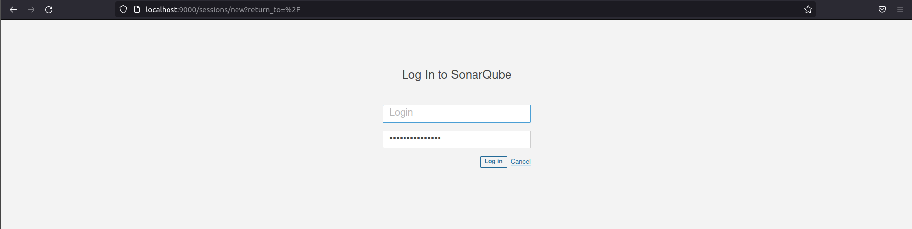
</p>

### Основная часть

1. Создаём новый проект, название произвольное.
<p align="center">
  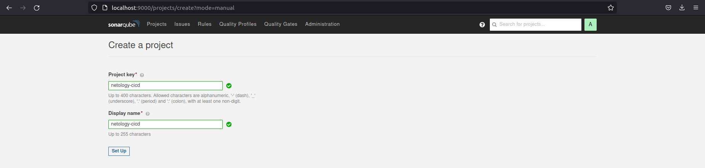
</p>

<p align="center">
  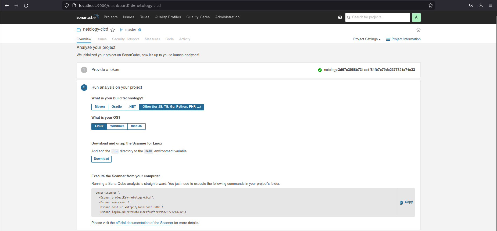
</p>

2. Скачиваем пакет [sonar-scanner](https://docs.sonarqube.org/latest/analysis/scan/sonarscanner/).
<p align="center">
  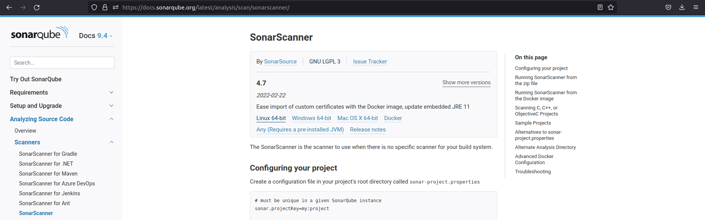
</p>
Распакуем архив в: /opt/sonar-scanner-4.7.0.2747-linux/

3. Делаем так, чтобы binary был доступен через вызов в shell.
```shell
$ nano ~/.bashrc
```
```shell
export PATH=$PATH:/opt/sonar-scanner-4.7.0.2747-linux/bin
```
```shell
$ source ~/.bashrc
```

4. Проверяем.
```shell
$ sonar-scanner --version
INFO: Scanner configuration file: /opt/sonar-scanner-4.7.0.2747-linux/conf/sonar-scanner.properties
INFO: Project root configuration file: NONE
INFO: SonarScanner 4.7.0.2747
INFO: Java 11.0.14.1 Eclipse Adoptium (64-bit)
INFO: Linux 5.13.0-41-generic amd64
```

5. Запускаем анализатор против кода из директории [example](./example) с дополнительным ключом `-Dsonar.coverage.exclusions=fail.py`.
```shell
$ sonar-scanner \
  -Dsonar.projectKey=netology-cicd \
  -Dsonar.sources=. \
  -Dsonar.host.url=http://localhost:9000 \
  -Dsonar.login=3d67c3968b731ae1f84fb7c79da2377321a74e33 \
  -Dsonar.coverage.exclusions=fail.py
INFO: Scanner configuration file: /opt/sonar-scanner-4.7.0.2747-linux/conf/sonar-scanner.properties
INFO: Project root configuration file: NONE
INFO: SonarScanner 4.7.0.2747
INFO: Java 11.0.14.1 Eclipse Adoptium (64-bit)
INFO: Linux 5.13.0-41-generic amd64
INFO: User cache: /home/stasarts/.sonar/cache
INFO: Scanner configuration file: /opt/sonar-scanner-4.7.0.2747-linux/conf/sonar-scanner.properties
INFO: Project root configuration file: NONE
INFO: Analyzing on SonarQube server 8.7.1
INFO: Default locale: "en_US", source code encoding: "UTF-8" (analysis is platform dependent)
INFO: Load global settings
INFO: Load global settings (done) | time=97ms
INFO: Server id: BF41A1F2-AYDqhB1VfuZRTcmyoWLO
INFO: User cache: /home/stasarts/.sonar/cache
INFO: Load/download plugins
INFO: Load plugins index
INFO: Load plugins index (done) | time=38ms
INFO: Load/download plugins (done) | time=1025ms
INFO: Process project properties
INFO: Process project properties (done) | time=9ms
INFO: Execute project builders
INFO: Execute project builders (done) | time=2ms
INFO: Project key: netology-cicd
INFO: Base dir: /home/stasarts/netology/netology-devops/cicd/example
INFO: Working dir: /home/stasarts/netology/netology-devops/cicd/example/.scannerwork
INFO: Load project settings for component key: 'netology-cicd'
INFO: Load project settings for component key: 'netology-cicd' (done) | time=39ms
INFO: Load quality profiles
INFO: Load quality profiles (done) | time=94ms
INFO: Load active rules
INFO: Load active rules (done) | time=2042ms
INFO: Indexing files...
INFO: Project configuration:
INFO:   Excluded sources for coverage: fail.py
INFO: 1 file indexed
INFO: 0 files ignored because of scm ignore settings
INFO: Quality profile for py: Sonar way
INFO: ------------- Run sensors on module netology-cicd
INFO: Load metrics repository
INFO: Load metrics repository (done) | time=35ms
INFO: Sensor Python Sensor [python]
INFO: Starting global symbols computation
INFO: 1 source files to be analyzed
INFO: Load project repositories
INFO: Load project repositories (done) | time=34ms
INFO: Starting rules execution
INFO: 1/1 source files have been analyzed
INFO: 1 source files to be analyzed
INFO: Sensor Python Sensor [python] (done) | time=6345ms
INFO: 1/1 source files have been analyzed
INFO: Sensor Cobertura Sensor for Python coverage [python]
INFO: Sensor Cobertura Sensor for Python coverage [python] (done) | time=15ms
INFO: Sensor PythonXUnitSensor [python]
INFO: Sensor PythonXUnitSensor [python] (done) | time=1ms
INFO: Sensor CSS Rules [cssfamily]
INFO: No CSS, PHP, HTML or VueJS files are found in the project. CSS analysis is skipped.
INFO: Sensor CSS Rules [cssfamily] (done) | time=1ms
INFO: Sensor JaCoCo XML Report Importer [jacoco]
INFO: 'sonar.coverage.jacoco.xmlReportPaths' is not defined. Using default locations: target/site/jacoco/jacoco.xml,target/site/jacoco-it/jacoco.xml,build/reports/jacoco/test/jacocoTestReport.xml
INFO: No report imported, no coverage information will be imported by JaCoCo XML Report Importer
INFO: Sensor JaCoCo XML Report Importer [jacoco] (done) | time=4ms
INFO: Sensor C# Properties [csharp]
INFO: Sensor C# Properties [csharp] (done) | time=1ms
INFO: Sensor JavaXmlSensor [java]
INFO: Sensor JavaXmlSensor [java] (done) | time=1ms
INFO: Sensor HTML [web]
INFO: Sensor HTML [web] (done) | time=4ms
INFO: Sensor VB.NET Properties [vbnet]
INFO: Sensor VB.NET Properties [vbnet] (done) | time=1ms
INFO: ------------- Run sensors on project
INFO: Sensor Zero Coverage Sensor
INFO: Sensor Zero Coverage Sensor (done) | time=0ms
INFO: SCM Publisher SCM provider for this project is: git
INFO: SCM Publisher 1 source file to be analyzed
INFO: SCM Publisher 0/1 source files have been analyzed (done) | time=52ms
WARN: Missing blame information for the following files:
WARN:   * fail.py
WARN: This may lead to missing/broken features in SonarQube
INFO: CPD Executor Calculating CPD for 1 file
INFO: CPD Executor CPD calculation finished (done) | time=8ms
INFO: Analysis report generated in 99ms, dir size=92 KB
INFO: Analysis report compressed in 15ms, zip size=12 KB
INFO: Analysis report uploaded in 82ms
INFO: ANALYSIS SUCCESSFUL, you can browse http://localhost:9000/dashboard?id=netology-cicd
INFO: Note that you will be able to access the updated dashboard once the server has processed the submitted analysis report
INFO: More about the report processing at http://localhost:9000/api/ce/task?id=AYDrJx_ofuZRTcmyobKa
INFO: Analysis total time: 10.765 s
INFO: ------------------------------------------------------------------------
INFO: EXECUTION SUCCESS
INFO: ------------------------------------------------------------------------
INFO: Total time: 13.053s
INFO: Final Memory: 7M/37M
INFO: ------------------------------------------------------------------------
```

6. Смотрим результат в интерфейсе.
<p align="center">
  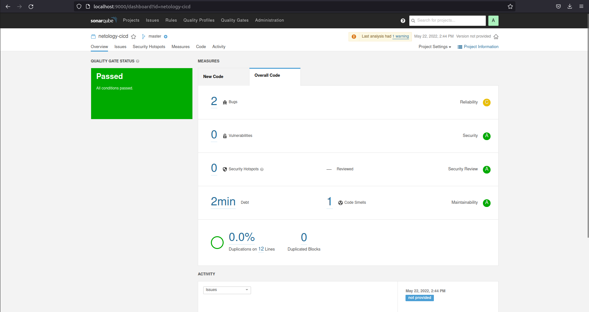
</p>

7. Исправляем ошибки, которые он выявил (включая warnings). Исправленный код запишем в pass.py.
```python
def increment(param):
    param += 1
    return param
def get_square(numb):
    return numb*numb
def print_numb(numb):
    print("Number is {}".format(numb))

index = 0
while (index < 10):
    index = increment(index)
    print(get_square(index))
```

8. Запускаем анализатор повторно - проверяем, что QG пройдены успешно.
```shell
$ sonar-scanner \
  -Dsonar.projectKey=netology-cicd \
  -Dsonar.sources=. \
  -Dsonar.host.url=http://localhost:9000 \
  -Dsonar.login=3d67c3968b731ae1f84fb7c79da2377321a74e33 \
  -Dsonar.coverage.exclusions=pass.py
INFO: Scanner configuration file: /opt/sonar-scanner-4.7.0.2747-linux/conf/sonar-scanner.properties
INFO: Project root configuration file: NONE
INFO: SonarScanner 4.7.0.2747
INFO: Java 11.0.14.1 Eclipse Adoptium (64-bit)
INFO: Linux 5.13.0-41-generic amd64
INFO: User cache: /home/stasarts/.sonar/cache
INFO: Scanner configuration file: /opt/sonar-scanner-4.7.0.2747-linux/conf/sonar-scanner.properties
INFO: Project root configuration file: NONE
INFO: Analyzing on SonarQube server 8.7.1
INFO: Default locale: "en_US", source code encoding: "UTF-8" (analysis is platform dependent)
INFO: Load global settings
INFO: Load global settings (done) | time=119ms
INFO: Server id: BF41A1F2-AYDqhB1VfuZRTcmyoWLO
INFO: User cache: /home/stasarts/.sonar/cache
INFO: Load/download plugins
INFO: Load plugins index
INFO: Load plugins index (done) | time=62ms
INFO: Load/download plugins (done) | time=164ms
INFO: Process project properties
INFO: Process project properties (done) | time=11ms
INFO: Execute project builders
INFO: Execute project builders (done) | time=3ms
INFO: Project key: netology-cicd
INFO: Base dir: /home/stasarts/netology/netology-devops/cicd/example
INFO: Working dir: /home/stasarts/netology/netology-devops/cicd/example/.scannerwork
INFO: Load project settings for component key: 'netology-cicd'
INFO: Load project settings for component key: 'netology-cicd' (done) | time=23ms
INFO: Load quality profiles
INFO: Load quality profiles (done) | time=63ms
INFO: Load active rules
INFO: Load active rules (done) | time=1751ms
INFO: Indexing files...
INFO: Project configuration:
INFO:   Excluded sources for coverage: pass.py
INFO: 2 files indexed
INFO: Quality profile for py: Sonar way
INFO: ------------- Run sensors on module netology-cicd
INFO: Load metrics repository
INFO: Load metrics repository (done) | time=35ms
INFO: Sensor Python Sensor [python]
INFO: Starting global symbols computation
INFO: 2 source files to be analyzed
INFO: Load project repositories
INFO: Load project repositories (done) | time=24ms
INFO: Starting rules execution
INFO: 2/2 source files have been analyzed
INFO: 2 source files to be analyzed
INFO: 2/2 source files have been analyzed
INFO: Sensor Python Sensor [python] (done) | time=7123ms
INFO: Sensor Cobertura Sensor for Python coverage [python]
INFO: Sensor Cobertura Sensor for Python coverage [python] (done) | time=12ms
INFO: Sensor PythonXUnitSensor [python]
INFO: Sensor PythonXUnitSensor [python] (done) | time=1ms
INFO: Sensor CSS Rules [cssfamily]
INFO: No CSS, PHP, HTML or VueJS files are found in the project. CSS analysis is skipped.
INFO: Sensor CSS Rules [cssfamily] (done) | time=1ms
INFO: Sensor JaCoCo XML Report Importer [jacoco]
INFO: 'sonar.coverage.jacoco.xmlReportPaths' is not defined. Using default locations: target/site/jacoco/jacoco.xml,target/site/jacoco-it/jacoco.xml,build/reports/jacoco/test/jacocoTestReport.xml
INFO: No report imported, no coverage information will be imported by JaCoCo XML Report Importer
INFO: Sensor JaCoCo XML Report Importer [jacoco] (done) | time=4ms
INFO: Sensor C# Properties [csharp]
INFO: Sensor C# Properties [csharp] (done) | time=2ms
INFO: Sensor JavaXmlSensor [java]
INFO: Sensor JavaXmlSensor [java] (done) | time=1ms
INFO: Sensor HTML [web]
INFO: Sensor HTML [web] (done) | time=4ms
INFO: Sensor VB.NET Properties [vbnet]
INFO: Sensor VB.NET Properties [vbnet] (done) | time=2ms
INFO: ------------- Run sensors on project
INFO: Sensor Zero Coverage Sensor
INFO: Sensor Zero Coverage Sensor (done) | time=10ms
INFO: SCM Publisher is disabled
INFO: CPD Executor Calculating CPD for 2 files
INFO: CPD Executor CPD calculation finished (done) | time=12ms
INFO: Analysis report generated in 99ms, dir size=92 KB
INFO: Analysis report compressed in 31ms, zip size=13 KB
INFO: Analysis report uploaded in 64ms
INFO: ANALYSIS SUCCESSFUL, you can browse http://localhost:9000/dashboard?id=netology-cicd
INFO: Note that you will be able to access the updated dashboard once the server has processed the submitted analysis report
INFO: More about the report processing at http://localhost:9000/api/ce/task?id=AYDrOKChfuZRTcmyobKd
INFO: Analysis total time: 11.082 s
INFO: ------------------------------------------------------------------------
INFO: EXECUTION SUCCESS
INFO: ------------------------------------------------------------------------
INFO: Total time: 12.498s
INFO: Final Memory: 7M/34M
INFO: ------------------------------------------------------------------------
```

9. Делаем скриншот успешного прохождения анализа.
<p align="center">
  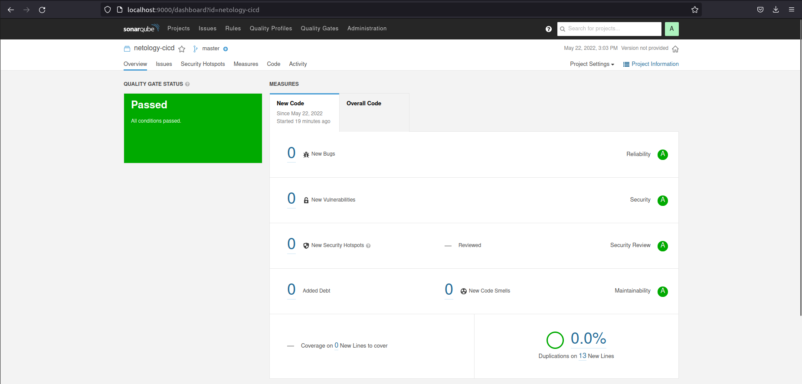
</p>

---

## Знакомство с Nexus

### Подготовка к выполнению

1. Выполняем `docker pull sonatype/nexus3`
2. Выполняем `docker run -d -p 8081:8081 --name nexus sonatype/nexus3`
3. Ждём запуск, смотрим логи через `docker logs -f nexus`
4. Проверяем готовность сервиса через [бразуер](http://localhost:8081)
5. Узнаём пароль от admin через `docker exec -it nexus /bin/bash`
6. Подключаемся под админом, меняем пароль, сохраняем анонимный доступ

### Основная часть

1. В репозиторий `maven-public` загружаем артефакт с GAV параметрами:
   1. groupId: netology
   2. artifactId: java
   3. version: 8_282
   4. classifier: distrib
   5. type: tar.gz
2. В него же загружаем такой же артефакт, но с version: 8_102
3. Проверяем, что все файлы загрузились успешно
4. В ответе присылаем файл `maven-metadata.xml` для этого артефекта

## Ответ

### Подготовка к выполнению

1. Выполняем.
```shell
$ docker pull sonatype/nexus3
Using default tag: latest
latest: Pulling from sonatype/nexus3
f70d60810c69: Pull complete 
545277d80005: Pull complete 
6e6913462068: Pull complete 
10b49635409a: Pull complete 
Digest: sha256:3fd7e90bcf49fb55d87d852cab854e5669ed115b09bdb25f47c45ee0797231aa
Status: Downloaded newer image for sonatype/nexus3:latest
docker.io/sonatype/nexus3:latest
```

2. Выполняем.
```shell
$ docker run -d -p 8081:8081 --name nexus sonatype/nexus3
ff5d80708286e8ad06beb9d2d22c08d033c14bd68765f87cb0d83c7c5104ef61
```

3. Смотрим логи через `docker logs -f nexus`.
```shell
2022-05-22 11:07:48,693+0000 INFO  [FelixStartLevel] *SYSTEM org.sonatype.nexus.pax.logging.NexusLogActivator - start
...
-------------------------------------------------

Started Sonatype Nexus OSS 3.39.0-01

-------------------------------------------------
```

4. Проверяем готовность сервиса через [бразуер](http://localhost:8081).
<p align="center">
  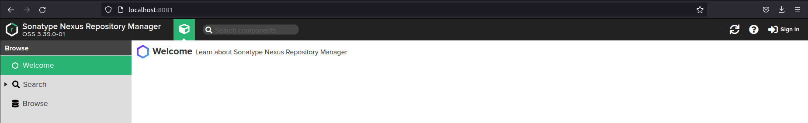
</p>

5. Узнаём пароль от admin через `docker exec -it nexus /bin/bash`.
```shell
$ docker exec -it nexus /bin/bash
bash-4.4$ cat nexus-data/admin.password 
01db3ec8-d9d3-4fbc-9a04-53dc94fe3020
```

6. Подключаемся под админом, меняем пароль, сохраняем анонимный доступ.
<p align="center">
  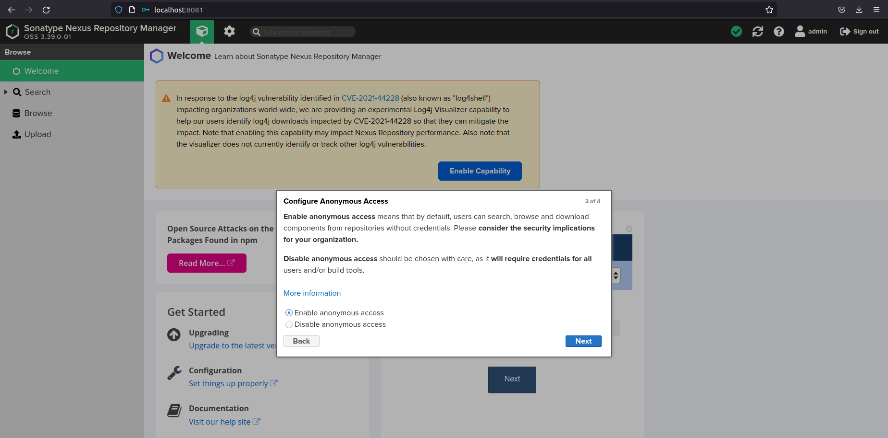
</p>

### Основная часть

1. В репозиторий `maven-public` загружаем артефакт с GAV параметрами:
   1. groupId: netology
   2. artifactId: java
   3. version: 8_282
   4. classifier: distrib
   5. type: tar.gz
<p align="center">
  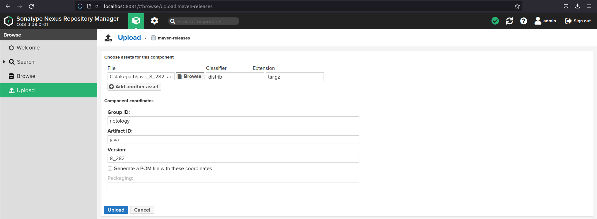
</p>

2. В него же загружаем такой же артефакт, но с version: 8_102.
<p align="center">
  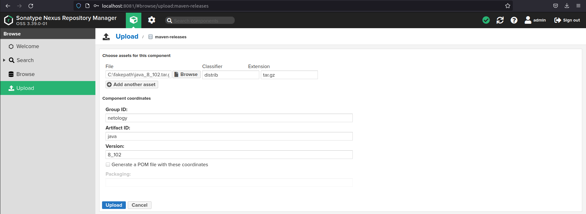
</p>

3. Проверяем, что все файлы загрузились успешно.
<p align="center">
  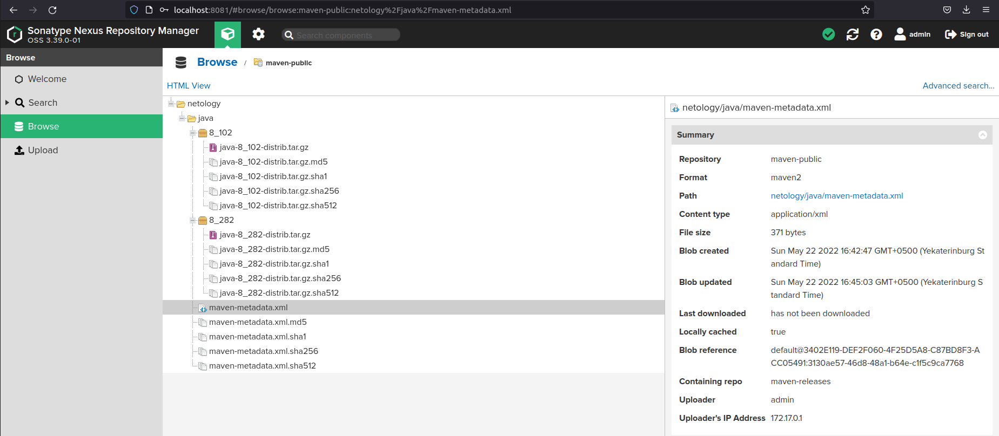
</p>

4. В ответе присылаем файл `maven-metadata.xml` для этого артефекта.
<p align="center">
  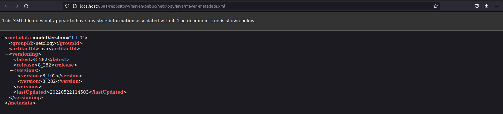
</p>

---

### Знакомство с Maven

### Подготовка к выполнению

1. Скачиваем дистрибутив с [maven](https://maven.apache.org/download.cgi)
2. Разархивируем, делаем так, чтобы binary был доступен через вызов в shell (или меняем переменную PATH или любой другой удобный вам способ)
3. Проверяем `mvn --version`
4. Забираем директорию [mvn](./mvn) с pom

### Основная часть

1. Меняем в `pom.xml` блок с зависимостями под наш артефакт из первого пункта задания для Nexus (java с версией 8_282)
2. Запускаем команду `mvn package` в директории с `pom.xml`, ожидаем успешного окончания
3. Проверяем директорию `~/.m2/repository/`, находим наш артефакт
4. В ответе присылаем исправленный файл `pom.xml`

## Ответ

1. Скачиваем дистрибутив с [maven](https://maven.apache.org/download.cgi)
<p align="center">
  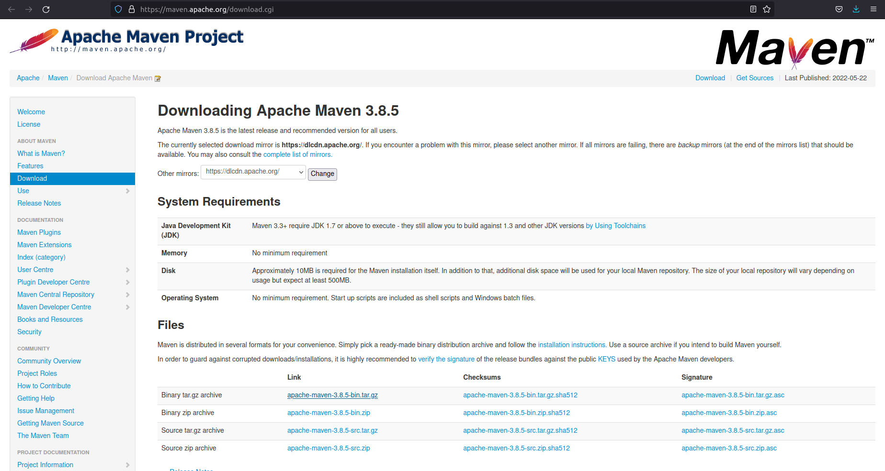
</p>

2. Разархивируем, делаем так, чтобы binary был доступен через вызов в shell.
```shell
$ sudo tar xzvf apache-maven-3.8.5-bin.tar.gz -C /opt
```
```shell
$ nano ~/.bashrc
```
```shell
export PATH=$PATH:/opt/apache-maven-3.8.5/bin
```
```shell
$ source ~/.bashrc
```

3. Проверяем.
```shell
$ mvn --version
Apache Maven 3.8.5 (3599d3414f046de2324203b78ddcf9b5e4388aa0)
Maven home: /opt/apache-maven-3.8.5
Java version: 1.8.0_312, vendor: Private Build, runtime: /usr/lib/jvm/java-8-openjdk-amd64/jre
Default locale: en_US, platform encoding: UTF-8
OS name: "linux", version: "5.13.0-41-generic", arch: "amd64", family: "unix"
```

4. Забираем директорию [mvn](./mvn) с pom.

### Основная часть

1. Меняем в `pom.xml` блок с зависимостями под наш артефакт из первого пункта задания для Nexus (java с версией 8_282).
```xml
<project xmlns="http://maven.apache.org/POM/4.0.0" xmlns:xsi="http://www.w3.org/2001/XMLSchema-instance"
  xsi:schemaLocation="http://maven.apache.org/POM/4.0.0 http://maven.apache.org/xsd/maven-4.0.0.xsd">
  <modelVersion>4.0.0</modelVersion>
 
  <groupId>com.netology.app</groupId>
  <artifactId>simple-app</artifactId>
  <version>1.0-SNAPSHOT</version>
   <repositories>
    <repository>
      <id>my-repo</id>
      <name>maven-public</name>
      <url>http://localhost:8081/repository/maven-public/</url>
    </repository>
  </repositories>
  <dependencies>
     <dependency>
      <groupId>netology</groupId>
      <artifactId>java</artifactId>
      <version>8_282</version>
      <classifier>distrib</classifier>
      <type>tar.gz</type>
    </dependency>
  </dependencies>
</project>
```

2. Запускаем команду `mvn package` в директории с `pom.xml`, ожидаем успешного окончания.
```shell
$ mvn package
[INFO] Scanning for projects...
[INFO] 
[INFO] --------------------< com.netology.app:simple-app >---------------------
[INFO] Building simple-app 1.0-SNAPSHOT
[INFO] --------------------------------[ jar ]---------------------------------
...
[INFO] Building jar: /home/stasarts/netology/netology-devops/cicd/mvn/target/simple-app-1.0-SNAPSHOT.jar
[INFO] ------------------------------------------------------------------------
[INFO] BUILD SUCCESS
[INFO] ------------------------------------------------------------------------
[INFO] Total time:  42.615 s
[INFO] Finished at: 2022-05-22T17:14:54+05:00
[INFO] ------------------------------------------------------------------------
```

3. Проверяем директорию `~/.m2/repository/`, находим наш артефакт.
```shell
$ ll ~/.m2/repository/netology/java/8_282
total 20
drwxrwxr-x 2 stasarts stasarts 4096 мая 22 17:14 ./
drwxrwxr-x 3 stasarts stasarts 4096 мая 22 17:14 ../
-rw-rw-r-- 1 stasarts stasarts    0 мая 22 17:14 java-8_282-distrib.tar.gz
-rw-rw-r-- 1 stasarts stasarts   40 мая 22 17:14 java-8_282-distrib.tar.gz.sha1
-rw-rw-r-- 1 stasarts stasarts  383 мая 22 17:14 java-8_282.pom.lastUpdated
-rw-rw-r-- 1 stasarts stasarts  176 мая 22 17:14 _remote.repositories
```

4. В ответе присылаем исправленный файл `pom.xml`.
```shell
[Исправленный pom.xml](./mvn/pom.xml)
```
---