# Домашнее задание к занятию "09.03 Jenkins"

## Подготовка к выполнению

1. Установить jenkins по любой из [инструкций](https://www.jenkins.io/download/)
2. Запустить и проверить работоспособность
3. Сделать первоначальную настройку
4. Настроить под свои нужды
5. Поднять отдельный cloud
6. Для динамических агентов можно использовать [образ](https://hub.docker.com/repository/docker/aragast/agent)
7. Обязательный параметр: поставить label для динамических агентов: `ansible_docker`
8. Сделать форк репозитория с [playbook](https://github.com/aragastmatb/example-playbook)

## Основная часть

1. Сделать Freestyle Job, который будет запускать `ansible-playbook` из форка репозитория
2. Сделать Declarative Pipeline, который будет выкачивать репозиторий с плейбукой и запускать её
3. Перенести Declarative Pipeline в репозиторий в файл `Jenkinsfile`
4. Перенастроить Job на использование `Jenkinsfile` из репозитория
5. Создать Scripted Pipeline, наполнить его скриптом из [pipeline](./pipeline)
6. Заменить credentialsId на свой собственный
7. Проверить работоспособность, исправить ошибки, исправленный Pipeline вложить в репозитрий в файл `ScriptedJenkinsfile`
8. Отправить ссылку на репозиторий в ответе

# Ответ

## Подготовка к выполнению

#### 1. Установим jenkins по инструкции для [docker](https://www.jenkins.io/doc/book/installing/docker/).

* Создадим bridge-network в docker для jenkins.
```shell
$ docker network create jenkins
d917904ba4d318f457069815cbeecdd5a88fcc93c7526ee6e7cb51bdef19eeba
```

* Для того, чтобы запускать docker-команды на агентах jenkins, скачаем и запустим docker:dind docker образ.
```shell
$ docker run \
>   --name jenkins-docker \
>   --rm \
>   --detach \
>   --privileged \
>   --network jenkins \
>   --network-alias docker \
>   --env DOCKER_TLS_CERTDIR=/certs \
>   --volume jenkins-docker-certs:/certs/client \
>   --volume jenkins-data:/var/jenkins_home \
>   --publish 2376:2376 \
>   docker:dind \
>   --storage-driver overlay2
Unable to find image 'docker:dind' locally
dind: Pulling from library/docker
df9b9388f04a: Pull complete 
c60e3bd692ff: Pull complete 
36df9e333c70: Pull complete 
fe685014da74: Pull complete 
a2351d0885d2: Pull complete 
356b5f84352c: Pull complete 
e15ec7fa702d: Pull complete 
382dd215f2e8: Pull complete 
ab41171eab52: Pull complete 
130e3c8e652a: Pull complete 
c46ad92381d7: Pull complete 
3e34c9708c7b: Pull complete 
d0fd6e0c0320: Pull complete 
Digest: sha256:d8b7b9468fe6dc26f008f6eadafa2845dc0408a3c5e86fc9e04f6bcc2d98bf13
Status: Downloaded newer image for docker:dind
0d5e1ac0b3b94183e5b9e3d7e9dc9e0cc2e7baf677bd46c84a6e5413a2ed220a
```

* Настроим официальный docker образ jenkins. Создадим Dockerfile:
```shell
FROM jenkins/jenkins:2.332.3-jdk11
USER root
RUN apt-get update && apt-get install -y lsb-release
RUN curl -fsSLo /usr/share/keyrings/docker-archive-keyring.asc \
  https://download.docker.com/linux/debian/gpg
RUN echo "deb [arch=$(dpkg --print-architecture) \
  signed-by=/usr/share/keyrings/docker-archive-keyring.asc] \
  https://download.docker.com/linux/debian \
  $(lsb_release -cs) stable" > /etc/apt/sources.list.d/docker.list
RUN apt-get update && apt-get install -y docker-ce-cli
USER jenkins
RUN jenkins-plugin-cli --plugins "blueocean:1.25.3 docker-workflow:1.28"
``` 

* Соберем новый docker образ из этого Dockerfile.
```shell
$ docker build -t myjenkins-blueocean:2.332.3-1 .
Sending build context to Docker daemon   2.56kB
Step 1/8 : FROM jenkins/jenkins:2.332.3-jdk11
 ---> 401e7c3f4746
...
Successfully built b8e48c85622d
Successfully tagged myjenkins-blueocean:2.332.3-1
```

* Запустим контейнер с jenkins.
```shell
docker run \
  --name jenkins-blueocean \
  --restart=on-failure \
  --detach \
  --network jenkins \
  --env DOCKER_HOST=tcp://docker:2376 \
  --env DOCKER_CERT_PATH=/certs/client \
  --env DOCKER_TLS_VERIFY=1 \
  --publish 8080:8080 \
  --publish 50000:50000 \
  --volume jenkins-data:/var/jenkins_home \
  --volume jenkins-docker-certs:/certs/client:ro \
  myjenkins-blueocean:2.332.3-1
```

#### 2. Запустим и проверим работоспособность.
* Откроем в браузере http://localhost:8080/
<p align="center">
  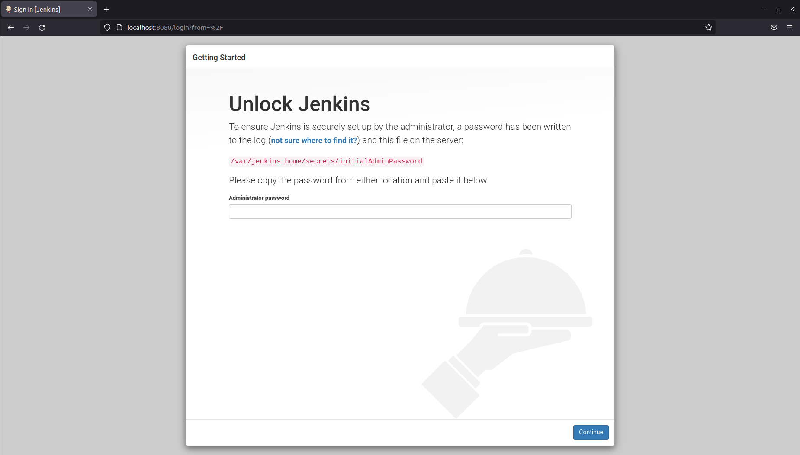
</p>

* Разблокируем jenkins. Для этого посмотрим логи контейнера и скопируем автоматически сгенерированный пароль.
```shell
$ docker logs jenkins-blueocean
Running from: /usr/share/jenkins/jenkins.war
...
*************************************************************

Jenkins initial setup is required. An admin user has been created and a password generated.
Please use the following password to proceed to installation:

2872e315e28b42bf8f0fdb1625e9550e

This may also be found at: /var/jenkins_home/secrets/initialAdminPassword

*************************************************************
```

* Выберем установку с рекомендуемыми плагинами. Создадим пользователя. Завершим установку.
<p align="center">
  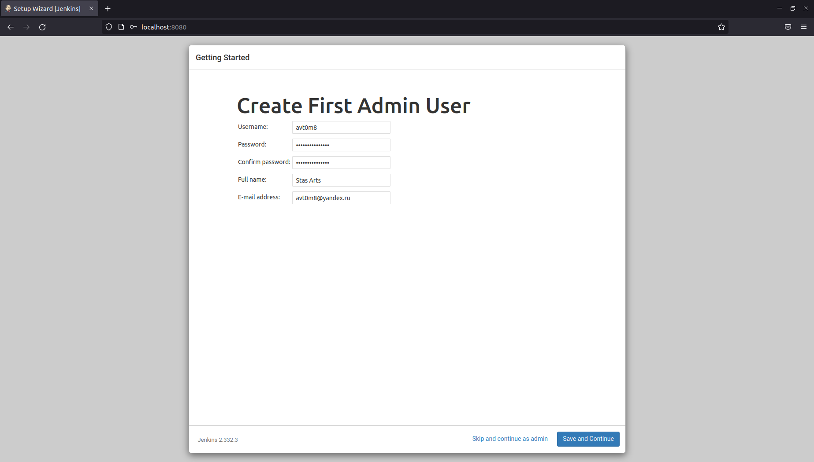
</p>

* Откроем в браузере http://localhost:8080/.
<p align="center">
  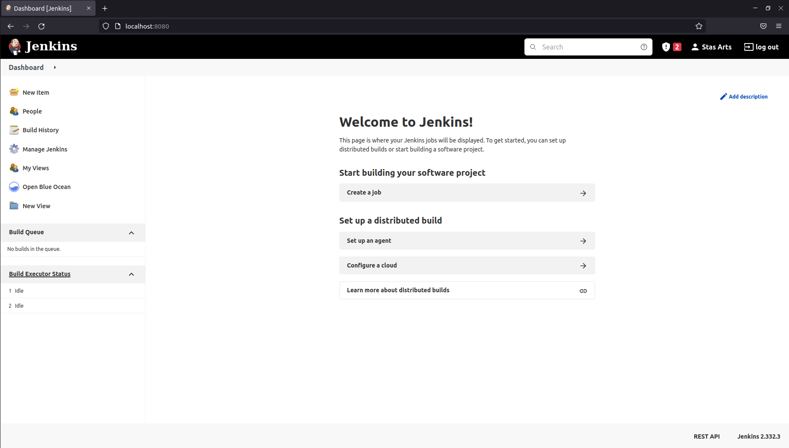
</p>

#### 3-4-5. Поднимем агента по [инструкции](https://www.jenkins.io/doc/book/using/using-agents/).

* Сгенерируем ssh key pair. Создадим Jenkins SSH credential, куда добавим приватную часть ключа.
<p align="center">
  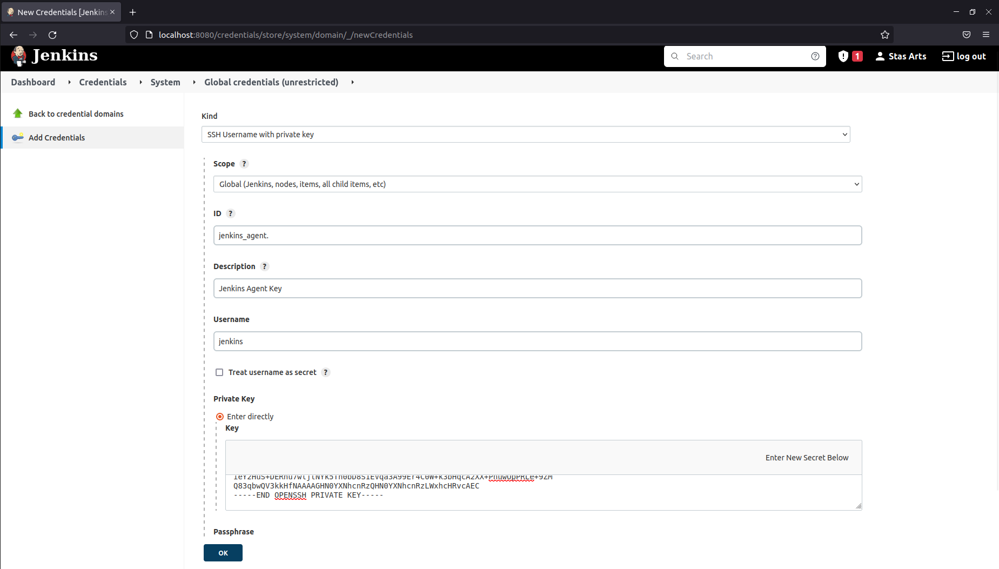
</p>

* Поднимем docker контейнер агента, используя образ jenkins/ssh-agent. Передадим в переменные окружения публичную часть ключа.
```shell
$ docker run -d --rm \
  --name agent \
  --network jenkins \
  --env DOCKER_HOST=tcp://docker:2376 \
  --env DOCKER_CERT_PATH=/certs/client \
  --env DOCKER_TLS_VERIFY=1 \
  -e "JENKINS_AGENT_SSH_PUBKEY=[jenkins_agent.pub]" \
  jenkins/ssh-agent
```

* Посмотрим ip-адрес поднятого контейнера.
```shell
$ docker network inspect jenkins
[
    {
        "Name": "jenkins",
        "Id": "d917904ba4d318f457069815cbeecdd5a88fcc93c7526ee6e7cb51bdef19eeba",
        "Created": "2022-05-26T17:38:51.561649885+05:00",
        "Scope": "local",
        "Driver": "bridge",
        "EnableIPv6": false,
        "IPAM": {
            "Driver": "default",
            "Options": {},
            "Config": [
                {
                    "Subnet": "172.19.0.0/16",
                    "Gateway": "172.19.0.1"
                }
            ]
        },
        "Internal": false,
        "Attachable": false,
        "Ingress": false,
        "ConfigFrom": {
            "Network": ""
        },
        "ConfigOnly": false,
        "Containers": {
            "0d5e1ac0b3b94183e5b9e3d7e9dc9e0cc2e7baf677bd46c84a6e5413a2ed220a": {
                "Name": "jenkins-docker",
                "EndpointID": "cf8c8fe5f358b7fe0094f44e4acea48d89067ddfa2bd1f56fe29bd41dbf369e7",
                "MacAddress": "02:42:ac:13:00:02",
                "IPv4Address": "172.19.0.2/16",
                "IPv6Address": ""
            },
            "c14c964493783de3d2b7233d318087a57296198f024afd9da3bca4442ca88f6e": {
                "Name": "jenkins-blueocean",
                "EndpointID": "a6c7f935c8df1efa3f1cc9edc2f469c24f9a9f2b84def3e25d46e203701daeb8",
                "MacAddress": "02:42:ac:13:00:03",
                "IPv4Address": "172.19.0.3/16",
                "IPv6Address": ""
            },
            "c79492bd9fbe774754b7e9da2c197629fa7bad21e7c68491c506efc72a44b194": {
                "Name": "agent",
                "EndpointID": "7925b1d3bacd8da485a3b49ff240f0d3410a6a0866450563882b31905c80631d",
                "MacAddress": "02:42:ac:13:00:04",
                "IPv4Address": "172.19.0.4/16",
                "IPv6Address": ""
            }
        },
        "Options": {},
        "Labels": {}
    }
]
```

* Настроим агента на контроллере jenkins.
<p align="center">
  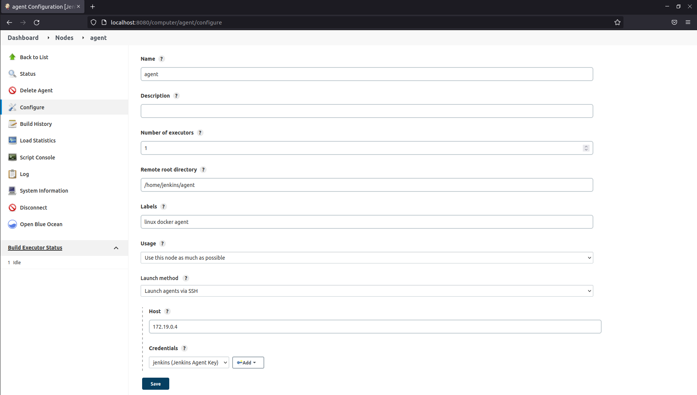
</p>

* Зайдем на вновь созданного агента в jenkins, посмотрим лог.
```shell
SSHLauncher{host='172.19.0.4', port=22, credentialsId='jenkins_agent', jvmOptions='', javaPath='', prefixStartSlaveCmd='', suffixStartSlaveCmd='', launchTimeoutSeconds=60, maxNumRetries=10, retryWaitTime=15, sshHostKeyVerificationStrategy=hudson.plugins.sshslaves.verifiers.NonVerifyingKeyVerificationStrategy, tcpNoDelay=true, trackCredentials=true}
[05/27/22 05:33:35] [SSH] Opening SSH connection to 172.19.0.4:22.
[05/27/22 05:33:35] [SSH] WARNING: SSH Host Keys are not being verified. Man-in-the-middle attacks may be possible against this connection.
[05/27/22 05:33:35] [SSH] Authentication successful.
[05/27/22 05:33:35] [SSH] The remote user's environment is:
BASH=/bin/bash
BASHOPTS=checkwinsize:cmdhist:complete_fullquote:extquote:force_fignore:globasciiranges:hostcomplete:interactive_comments:progcomp:promptvars:sourcepath
BASH_ALIASES=()
BASH_ARGC=([0]="0")
BASH_ARGV=()
BASH_CMDS=()
BASH_EXECUTION_STRING=set
BASH_LINENO=()
BASH_SOURCE=()
BASH_VERSINFO=([0]="5" [1]="1" [2]="4" [3]="1" [4]="release" [5]="x86_64-pc-linux-gnu")
BASH_VERSION='5.1.4(1)-release'
DIRSTACK=()
DOCKER_CERT_PATH=/certs/client
DOCKER_HOST=tcp://docker:2376
DOCKER_TLS_VERIFY=1
EUID=1000
GROUPS=()
HOME=/home/jenkins
HOSTNAME=c79492bd9fbe
HOSTTYPE=x86_64
IFS=$' \t\n'
JAVA_HOME=/opt/java/openjdk
JENKINS_AGENT_HOME=/home/jenkins
JENKINS_AGENT_SSH_PUBKEY='ssh-rsa AAAAB3NzaC1yc2EAAAADAQABAAABgQCqA0xXw8llqR3XlMnWdtynWz6jDrCjcxANsfYn62XqPsgdkiFyOhCywsZVeGyFKDZs9fPgDFozTLKVpL64jAh0qMnI7BGbRylxASpYt0Hw5L60hxLLh8akjhIhycE+G590OkLt/BXrhrNyLyS4jmGyklZuJY3nbRVYc19m0hGPkd53Zw2vFRoZkMfZw1THMSoK6vl7GS279iN0qnpFjR/RsHiKeQ2spheZvTJKLctYHpAzvhhw/c24G7F+i6GUopKOTeqMVDAkyzxjJ3fcjOkc7gqZ1TkU8T1HNrvbDSh+nY7/VMQnzLTIhDaQF5tSVjC7hPIacK5UDoilVrEETZGWv1TN+ZVUfuXBEFAO7j2zZXv+OeDYkQnDZwIeAZ0AawDSSA8zhTuGjip0CT1tWRwW+loSx2kUpK4nf52lVUZeaAMFAKwI3WDwDs3ZiUf4My2p3fYu54og7sin5O7LzQVSotohlOaUx3C/xiLW3AG9JuYBUv9re/O+GRWe3ZzUMwU= stasarts@stasarts-laptop'
LC_ALL=C.UTF-8
LOGNAME=jenkins
MACHTYPE=x86_64-pc-linux-gnu
MOTD_SHOWN=pam
OPTERR=1
OPTIND=1
OSTYPE=linux-gnu
PATH=/opt/java/openjdk/bin:/usr/local/sbin:/usr/local/bin:/usr/sbin:/usr/bin:/sbin:/bin
PIPESTATUS=([0]="0")
PPID=182
PS4='+ '
PWD=/home/jenkins
SHELL=/bin/bash
SHELLOPTS=braceexpand:hashall:interactive-comments
SHLVL=1
SSH_CLIENT='172.19.0.3 58086 22'
SSH_CONNECTION='172.19.0.3 58086 172.19.0.4 22'
TERM=dumb
UID=1000
USER=jenkins
_=']'
Checking Java version in the PATH

openjdk version "11.0.14.1" 2022-02-08
OpenJDK Runtime Environment Temurin-11.0.14.1+1 (build 11.0.14.1+1)
OpenJDK 64-Bit Server VM Temurin-11.0.14.1+1 (build 11.0.14.1+1, mixed mode)
[05/27/22 05:33:36] [SSH] Checking java version of /home/jenkins/agent/jdk/bin/java
Couldn't figure out the Java version of /home/jenkins/agent/jdk/bin/java
bash: line 1: /home/jenkins/agent/jdk/bin/java: No such file or directory

[05/27/22 05:33:36] [SSH] Checking java version of java
[05/27/22 05:33:36] [SSH] java -version returned 11.0.14.1.
[05/27/22 05:33:36] [SSH] Starting sftp client.
[05/27/22 05:33:36] [SSH] Copying latest remoting.jar...
Source agent hash is 2CD82A2A033CE354B17F4B5DF54FD296. Installed agent hash is 2CD82A2A033CE354B17F4B5DF54FD296
Verified agent jar. No update is necessary.
Expanded the channel window size to 4MB
[05/27/22 05:33:36] [SSH] Starting agent process: cd "/home/jenkins/agent" && java  -jar remoting.jar -workDir /home/jenkins/agent -jar-cache /home/jenkins/agent/remoting/jarCache
May 27, 2022 5:33:36 AM org.jenkinsci.remoting.engine.WorkDirManager initializeWorkDir
INFO: Using /home/jenkins/agent/remoting as a remoting work directory
May 27, 2022 5:33:36 AM org.jenkinsci.remoting.engine.WorkDirManager setupLogging
INFO: Both error and output logs will be printed to /home/jenkins/agent/remoting
<===[JENKINS REMOTING CAPACITY]===>channel started

Remoting version: 4.13
This is a Unix agent
WARNING: An illegal reflective access operation has occurred
WARNING: Illegal reflective access by jenkins.slaves.StandardOutputSwapper$ChannelSwapper to constructor java.io.FileDescriptor(int)
WARNING: Please consider reporting this to the maintainers of jenkins.slaves.StandardOutputSwapper$ChannelSwapper
WARNING: Use --illegal-access=warn to enable warnings of further illegal reflective access operations
WARNING: All illegal access operations will be denied in a future release
Evacuated stdout
Agent successfully connected and online
```

* Запретим выполнять сборки на контроллере.
<p align="center">
  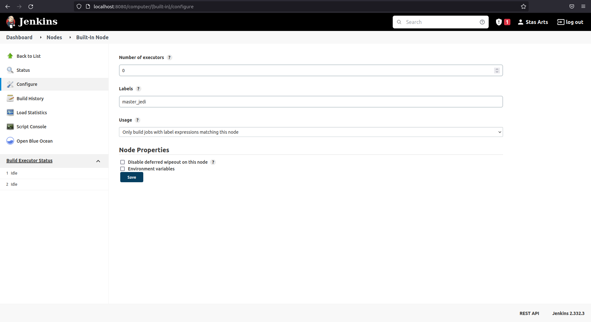
</p>

<p align="center">
  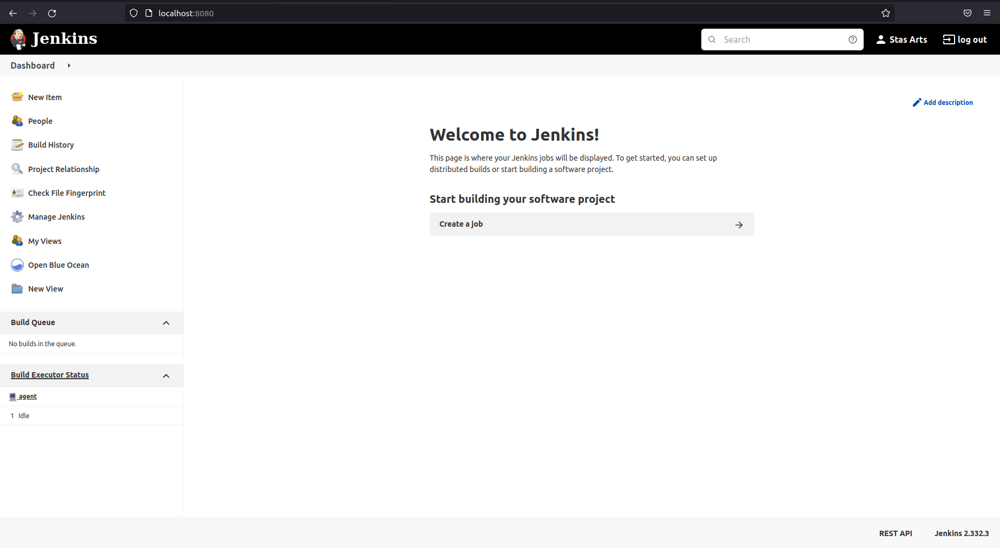
</p>

#### 6-7. ДЗ выполняется локально на docker контейнерах.

#### 8. Сделаем форк репозитория с playbook.
<p align="center">
  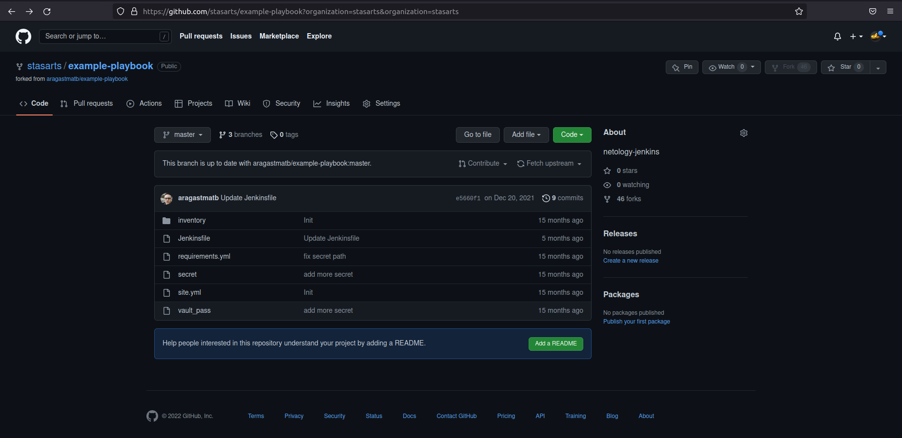
</p>

## Основная часть

### DISCLAIMER!!!
Т.к. без занятий по ansible и без каких-либо пояснений к этому ДЗ непонятно как работать с [репозиторием](https://github.com/aragastmatb/example-playbook), сделаем основную часть с вольной трактовкой.

#### 1. Сделаем Freestyle Job, который будет выводить ```java --version``` на агенте.
* Конфигурация Freestyle Job:
<p align="center">
  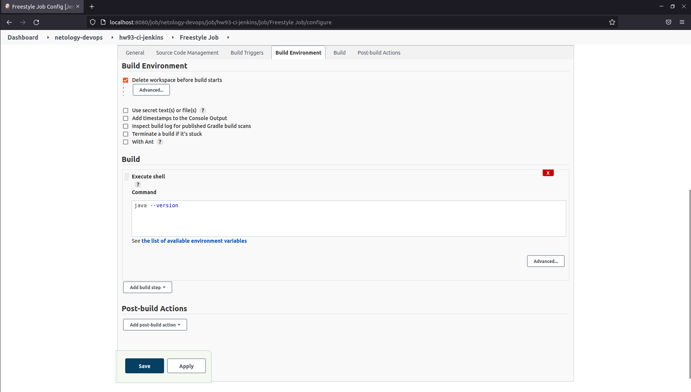
</p>

* Успешное выполнение с выводом результатов в консоль:
<p align="center">
  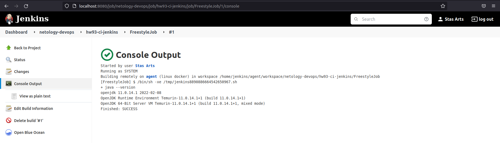
</p>

#### 2. Сделаем Declarative Pipeline, который будет выкачивать [репозиторий](https://github.com/stasarts/example-jenkins) со скриптом и запускать его.
* Создадим репозиторий на github.
* Поместим в него скрипт, который выводит версию java на агенте, а также выводит больше она или меньше 10 версии.
```shell
#!/bin/bash
if type -p java; then
    echo found java executable in PATH
    _java=java
elif [[ -n "$JAVA_HOME" ]] && [[ -x "$JAVA_HOME/bin/java" ]];  then
    echo found java executable in JAVA_HOME     
    _java="$JAVA_HOME/bin/java"
else
    echo "no java"
fi

if [[ "$_java" ]]; then
    version=$("$_java" -version 2>&1 | awk -F '"' '/version/ {print $2}')
    echo version "$version"
    if [[ "$version" > "10" ]]; then
        echo version is more than 10
    else         
        echo version is less than 10
    fi
fi
```

* Конфигурация Declarative Pipeline:
```shell
pipeline {
    agent any
    
    environment {
      REPO_URL = "git@github.com:stasarts/example-jenkins.git"
      BRANCH= "main"
    }
    stages {
        stage('Git checkout') {
            steps {
                git branch: env.BRANCH, credentialsId: 'github_jenkins', url: env.REPO_URL
                sshagent (['github_jenkins']) {
                    sh 'git config user.name "avt0m8"'
                    sh 'git config user.email "avt0m8@yandex.ru"'
                    sh 'git config -l'
                }
            }
        }
        stage('Script Launch') {
            steps {
                sh "$WORKSPACE/java_version.sh"
            }
        }
    }
    post {
        always {
            cleanWs()
            echo 'Finish!'
        }
        success {
            echo 'Successful build!'
        }
        failure {
            echo 'Failed build!'
        }
    }
}
```

* Скриншот с успешным выполнением:
<p align="center">
  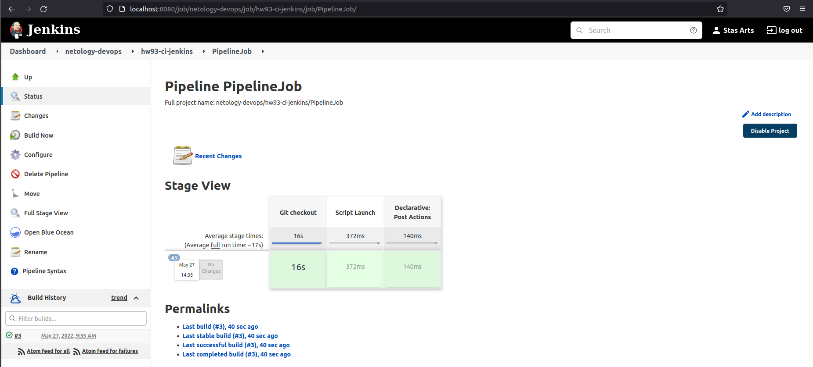
</p>

* Console Output:
```shell
Started by user Stas Arts
[Pipeline] Start of Pipeline
[Pipeline] node
Running on agent in /home/jenkins/agent/workspace/netology-devops/hw93-ci-jenkins/PipelineJob
[Pipeline] {
[Pipeline] withEnv
[Pipeline] {
[Pipeline] stage
[Pipeline] { (Git checkout)
[Pipeline] git
The recommended git tool is: NONE
using credential github_jenkins
Cloning the remote Git repository
Cloning repository git@github.com:stasarts/example-jenkins.git
 > git init /home/jenkins/agent/workspace/netology-devops/hw93-ci-jenkins/PipelineJob # timeout=10
Fetching upstream changes from git@github.com:stasarts/example-jenkins.git
 > git --version # timeout=10
 > git --version # 'git version 2.30.2'
using GIT_SSH to set credentials Github SSH Access for Jenkins
 > git fetch --tags --force --progress -- git@github.com:stasarts/example-jenkins.git +refs/heads/*:refs/remotes/origin/* # timeout=10
Avoid second fetch
Checking out Revision e9ca785597a68912b7a7df8d47938596d4120db6 (refs/remotes/origin/main)
Commit message: "add java_version.sh"
 > git config remote.origin.url git@github.com:stasarts/example-jenkins.git # timeout=10
 > git config --add remote.origin.fetch +refs/heads/*:refs/remotes/origin/* # timeout=10
 > git rev-parse refs/remotes/origin/main^{commit} # timeout=10
 > git config core.sparsecheckout # timeout=10
 > git checkout -f e9ca785597a68912b7a7df8d47938596d4120db6 # timeout=10
 > git branch -a -v --no-abbrev # timeout=10
 > git checkout -b main e9ca785597a68912b7a7df8d47938596d4120db6 # timeout=10
 > git rev-list --no-walk e9ca785597a68912b7a7df8d47938596d4120db6 # timeout=10
[Pipeline] sshagent
[ssh-agent] Using credentials avt0m8 (Github SSH Access for Jenkins)
[ssh-agent] Looking for ssh-agent implementation...
[ssh-agent]   Exec ssh-agent (binary ssh-agent on a remote machine)
$ ssh-agent
SSH_AUTH_SOCK=/tmp/ssh-DojVkdpsxjMO/agent.6528
SSH_AGENT_PID=6530
Running ssh-add (command line suppressed)
Identity added: /home/jenkins/agent/workspace/netology-devops/hw93-ci-jenkins/PipelineJob@tmp/private_key_15123384788842218336.key (avt0m8@yandex.ru)
[ssh-agent] Started.
[Pipeline] {
[Pipeline] sh
+ git config user.name avt0m8
[Pipeline] sh
+ git config user.email avt0m8@yandex.ru
[Pipeline] sh
+ git config -l
filter.lfs.clean=git-lfs clean -- %f
filter.lfs.smudge=git-lfs smudge -- %f
filter.lfs.process=git-lfs filter-process
filter.lfs.required=true
core.repositoryformatversion=0
core.filemode=true
core.bare=false
core.logallrefupdates=true
remote.origin.url=git@github.com:stasarts/example-jenkins.git
remote.origin.fetch=+refs/heads/*:refs/remotes/origin/*
user.name=avt0m8
user.email=avt0m8@yandex.ru
[Pipeline] }
$ ssh-agent -k
unset SSH_AUTH_SOCK;
unset SSH_AGENT_PID;
echo Agent pid 6530 killed;
[ssh-agent] Stopped.
[Pipeline] // sshagent
[Pipeline] }
[Pipeline] // stage
[Pipeline] stage
[Pipeline] { (Script Launch)
[Pipeline] sh
+ /home/jenkins/agent/workspace/netology-devops/hw93-ci-jenkins/PipelineJob/java_version.sh
/opt/java/openjdk/bin/java
found java executable in PATH
version 11.0.14.1
version is more than 10
[Pipeline] }
[Pipeline] // stage
[Pipeline] stage
[Pipeline] { (Declarative: Post Actions)
[Pipeline] cleanWs
[WS-CLEANUP] Deleting project workspace...
[WS-CLEANUP] Deferred wipeout is used...
[WS-CLEANUP] done
[Pipeline] echo
Finish!
[Pipeline] echo
Successful build!
[Pipeline] }
[Pipeline] // stage
[Pipeline] }
[Pipeline] // withEnv
[Pipeline] }
[Pipeline] // node
[Pipeline] End of Pipeline
Finished: SUCCESS
```

#### 3. Перенести Declarative Pipeline в репозиторий в файл `Jenkinsfile`.
* Поместим в репозиторий Jenkinsfile:
```shell
pipeline {
    agent any
    
    environment {
      REPO_URL = "git@github.com:stasarts/example-jenkins.git"
      BRANCH= "main"
    }
    stages {
        stage('Git checkout') {
            steps {
                git branch: env.BRANCH, credentialsId: 'github_jenkins', url: env.REPO_URL
                sshagent (['github_jenkins']) {
                    sh 'git config user.name "avt0m8"'
                    sh 'git config user.email "avt0m8@yandex.ru"'
                    sh 'git config -l'
                }
            }
        }
        stage('Script Launch') {
            steps {
                sh "$WORKSPACE/java_version.sh"
            }
        }
    }
    post {
        always {
            cleanWs()
            echo 'Finish!'
        }
        success {
            echo 'Successful build!'
        }
        failure {
            echo 'Failed build!'
        }
    }
}
```

#### 4. Создадим MultibranchPipline с использованием `Jenkinsfile` из репозитория.
* Конфигурация MultibranchPipeline:
<p align="center">
  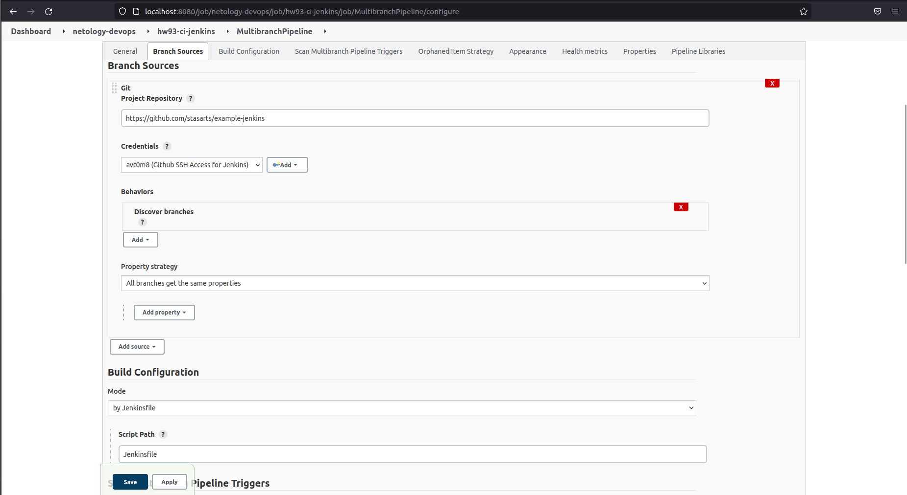
</p>

* Scan Multibranch Pipeline Log:
<p align="center">
  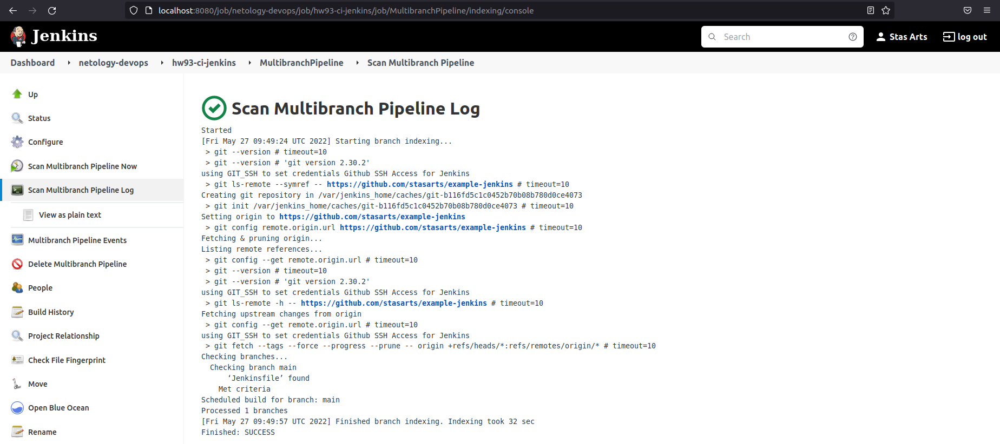
</p>

* Dashboard после сканирования:
<p align="center">
  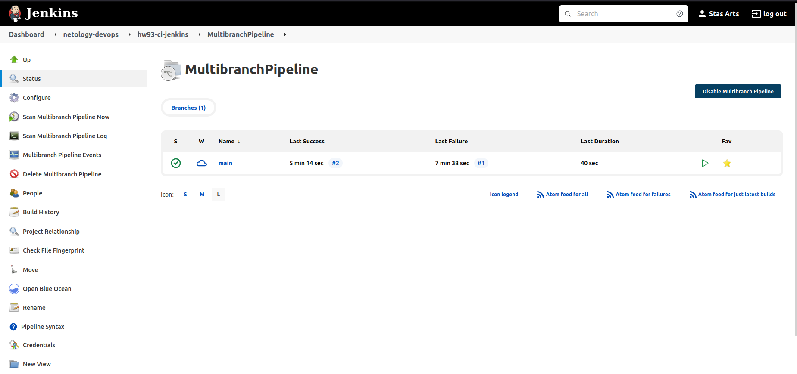
</p>

* Скриншот с успешным выполнением:
<p align="center">
  <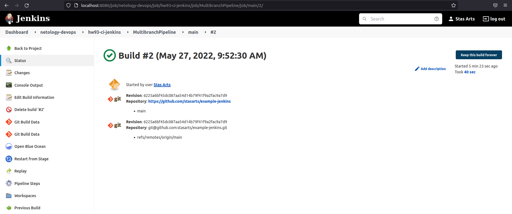
</p>

* Console Output:
```shell
Started by user Stas Arts
 > git rev-parse --resolve-git-dir /var/jenkins_home/caches/git-b116fd5c1c0452b70b08b780d0ce4073/.git # timeout=10
Setting origin to https://github.com/stasarts/example-jenkins
 > git config remote.origin.url https://github.com/stasarts/example-jenkins # timeout=10
Fetching origin...
Fetching upstream changes from origin
 > git --version # timeout=10
 > git --version # 'git version 2.30.2'
 > git config --get remote.origin.url # timeout=10
using GIT_SSH to set credentials Github SSH Access for Jenkins
 > git fetch --tags --force --progress -- origin +refs/heads/*:refs/remotes/origin/* # timeout=10
Seen branch in repository origin/main
Seen 1 remote branch
Obtained Jenkinsfile from 6225a6bf45dc087aa54d14b79f41f9a2fac9a7d9
[Pipeline] Start of Pipeline
[Pipeline] node
Running on agent in /home/jenkins/agent/workspace/jenkins_MultibranchPipeline_main
[Pipeline] {
[Pipeline] stage
[Pipeline] { (Declarative: Checkout SCM)
[Pipeline] checkout
Selected Git installation does not exist. Using Default
The recommended git tool is: NONE
using credential github_jenkins
Cloning the remote Git repository
Cloning with configured refspecs honoured and without tags
Cloning repository https://github.com/stasarts/example-jenkins
 > git init /home/jenkins/agent/workspace/jenkins_MultibranchPipeline_main # timeout=10
Fetching upstream changes from https://github.com/stasarts/example-jenkins
 > git --version # timeout=10
 > git --version # 'git version 2.30.2'
using GIT_SSH to set credentials Github SSH Access for Jenkins
 > git fetch --no-tags --force --progress -- https://github.com/stasarts/example-jenkins +refs/heads/*:refs/remotes/origin/* # timeout=10
Avoid second fetch
Checking out Revision 6225a6bf45dc087aa54d14b79f41f9a2fac9a7d9 (main)
Commit message: "add Jenkinsfile"
 > git config remote.origin.url https://github.com/stasarts/example-jenkins # timeout=10
 > git config --add remote.origin.fetch +refs/heads/*:refs/remotes/origin/* # timeout=10
 > git config core.sparsecheckout # timeout=10
 > git checkout -f 6225a6bf45dc087aa54d14b79f41f9a2fac9a7d9 # timeout=10
 > git rev-list --no-walk 6225a6bf45dc087aa54d14b79f41f9a2fac9a7d9 # timeout=10
[Pipeline] }
[Pipeline] // stage
[Pipeline] withEnv
[Pipeline] {
[Pipeline] withEnv
[Pipeline] {
[Pipeline] stage
[Pipeline] { (Git checkout)
[Pipeline] git
Selected Git installation does not exist. Using Default
The recommended git tool is: NONE
using credential github_jenkins
Fetching changes from the remote Git repository
 > git rev-parse --resolve-git-dir /home/jenkins/agent/workspace/jenkins_MultibranchPipeline_main/.git # timeout=10
 > git config remote.origin.url git@github.com:stasarts/example-jenkins.git # timeout=10
Fetching upstream changes from git@github.com:stasarts/example-jenkins.git
 > git --version # timeout=10
 > git --version # 'git version 2.30.2'
using GIT_SSH to set credentials Github SSH Access for Jenkins
 > git fetch --tags --force --progress -- git@github.com:stasarts/example-jenkins.git +refs/heads/*:refs/remotes/origin/* # timeout=10
Checking out Revision 6225a6bf45dc087aa54d14b79f41f9a2fac9a7d9 (refs/remotes/origin/main)
Commit message: "add Jenkinsfile"
First time build. Skipping changelog.
[Pipeline] sshagent
[ssh-agent] Using credentials avt0m8 (Github SSH Access for Jenkins)
[ssh-agent] Looking for ssh-agent implementation...
[ssh-agent]   Exec ssh-agent (binary ssh-agent on a remote machine)
$ ssh-agent
SSH_AUTH_SOCK=/tmp/ssh-5Zs0jnUdLKpd/agent.6802
SSH_AGENT_PID=6804
Running ssh-add (command line suppressed)
Identity added: /home/jenkins/agent/workspace/jenkins_MultibranchPipeline_main@tmp/private_key_17673576127697593678.key (avt0m8@yandex.ru)
[ssh-agent] Started.
[Pipeline] {
[Pipeline] sh
 > git rev-parse refs/remotes/origin/main^{commit} # timeout=10
 > git config core.sparsecheckout # timeout=10
 > git checkout -f 6225a6bf45dc087aa54d14b79f41f9a2fac9a7d9 # timeout=10
 > git branch -a -v --no-abbrev # timeout=10
 > git checkout -b main 6225a6bf45dc087aa54d14b79f41f9a2fac9a7d9 # timeout=10
+ git config user.name avt0m8
[Pipeline] sh
+ git config user.email avt0m8@yandex.ru
[Pipeline] sh
+ git config -l
filter.lfs.clean=git-lfs clean -- %f
filter.lfs.smudge=git-lfs smudge -- %f
filter.lfs.process=git-lfs filter-process
filter.lfs.required=true
core.repositoryformatversion=0
core.filemode=true
core.bare=false
core.logallrefupdates=true
remote.origin.url=git@github.com:stasarts/example-jenkins.git
remote.origin.fetch=+refs/heads/*:refs/remotes/origin/*
user.name=avt0m8
user.email=avt0m8@yandex.ru
[Pipeline] }
$ ssh-agent -k
unset SSH_AUTH_SOCK;
unset SSH_AGENT_PID;
echo Agent pid 6804 killed;
[ssh-agent] Stopped.
[Pipeline] // sshagent
[Pipeline] }
[Pipeline] // stage
[Pipeline] stage
[Pipeline] { (Script Launch)
[Pipeline] sh
+ /home/jenkins/agent/workspace/jenkins_MultibranchPipeline_main/java_version.sh
/opt/java/openjdk/bin/java
found java executable in PATH
version 11.0.14.1
version is more than 10
[Pipeline] }
[Pipeline] // stage
[Pipeline] stage
[Pipeline] { (Declarative: Post Actions)
[Pipeline] cleanWs
[WS-CLEANUP] Deleting project workspace...
[WS-CLEANUP] Deferred wipeout is used...
[WS-CLEANUP] done
[Pipeline] echo
Finish!
[Pipeline] echo
Successful build!
[Pipeline] }
[Pipeline] // stage
[Pipeline] }
[Pipeline] // withEnv
[Pipeline] }
[Pipeline] // withEnv
[Pipeline] }
[Pipeline] // node
[Pipeline] End of Pipeline
Finished: SUCCESS
```

#### 5-6-7. Невозможно сделать без занятий по ansible и пояснений к этому ДЗ (которых не было).

#### 8. Отправить ссылку на репозиторий в ответе.

[РЕПОЗИТОРИЙ](https://github.com/stasarts/example-jenkins).

---

## Необязательная часть

1. Создать скрипт на groovy, который будет собирать все Job, которые завершились хотя бы раз неуспешно. Добавить скрипт в репозиторий с решеним с названием `AllJobFailure.groovy`
2. Установить customtools plugin
3. Поднять инстанс с локальным nexus, выложить туда в анонимный доступ  .tar.gz с `ansible`  версии 2.9.x
4. Создать джобу, которая будет использовать `ansible` из `customtool`
5. Джоба должна просто исполнять команду `ansible --version`, в ответ прислать лог исполнения джобы 

---
