# Домашнее задание к занятию "09.04 Teamcity"

## Подготовка к выполнению

1. Поднимите инфраструктуру [teamcity](./teamcity/docker-compose.yml)
2. Если хочется, можете создать свою собственную инфраструктуру на основе той технологии, которая нравится. Инструкция по установке из [документации](https://www.jetbrains.com/help/teamcity/installing-and-configuring-the-teamcity-server.html)
3. Дождитесь запуска teamcity, выполните первоначальную настройку
4. Авторизуйте агент
5. Сделайте fork [репозитория](https://github.com/aragastmatb/example-teamcity)

## Основная часть

1. Создайте новый проект в teamcity на основе fork
2. Сделайте autodetect конфигурации
3. Сохраните необходимые шаги, запустите первую сборку master'a
4. Поменяйте условия сборки: если сборка по ветке `master`, то должен происходит `mvn clean package`, иначе `mvn clean test`
5. Мигрируйте `build configuration` в репозиторий
6. Создайте отдельную ветку `feature/add_reply` в репозитории
7. Напишите новый метод для класса Welcomer: метод должен возвращать произвольную реплику, содержащую слово `hunter`
8. Дополните тест для нового метода на поиск слова `hunter` в новой реплике
9. Сделайте push всех изменений в новую ветку в репозиторий
10. Убедитесь что сборка самостоятельно запустилась, тесты прошли успешно
11. Внесите изменения из произвольной ветки `feature/add_reply` в `master` через `Merge`
12. Убедитесь, что нет собранного артефакта в сборке по ветке `master`
13. Настройте конфигурацию так, чтобы она собирала `.jar` в артефакты сборки
14. Проведите повторную сборку мастера, убедитесь, что сбора прошла успешно и артефакты собраны
15. Проверьте, что конфигурация в репозитории содержит все настройки конфигурации из teamcity
16. В ответ предоставьте ссылку на репозиторий

---

# Ответ

## Подготовка к выполнению

#### 1-2. Поднимем инфраструктуру [teamcity](./teamcity/docker-compose.yml).
```shell
$ docker compose up
[+] Running 24/24
 ⠿ teamcity Pulled                                                                                                                                                                                 2479.5s
   ⠿ 8e5c1b329fe3 Pull complete                                                                                                                                                                      52.9s
   ⠿ 64dee48628f0 Pull complete                                                                                                                                                                      53.5s
   ⠿ 5a2d719b40dc Pull complete                                                                                                                                                                     416.8s
   ⠿ ca2e8e6655af Pull complete                                                                                                                                                                     416.9s
   ⠿ 4c008ffb7caf Pull complete                                                                                                                                                                     420.7s
   ⠿ 175900217477 Pull complete                                                                                                                                                                     420.8s
   ⠿ 975c3a4cd854 Pull complete                                                                                                                                                                     420.9s
   ⠿ 2f5d07f4b386 Pull complete                                                                                                                                                                     421.0s
   ⠿ ae346c1c7409 Pull complete                                                                                                                                                                     421.0s
   ⠿ 00688a883120 Pull complete                                                                                                                                                                     421.1s
   ⠿ 3e7bbae24930 Pull complete                                                                                                                                                                    2474.9s
   ⠿ 9cee82ded787 Pull complete                                                                                                                                                                    2475.0s
 ⠿ teamcity-agent Pulled                                                                                                                                                                           1727.2s
   ⠿ af04e3b0d368 Pull complete                                                                                                                                                                     374.0s
   ⠿ 751fa93adcf3 Pull complete                                                                                                                                                                     800.7s
   ⠿ 9804fd17adee Pull complete                                                                                                                                                                     800.8s
   ⠿ abd0efc03b48 Pull complete                                                                                                                                                                     800.9s
   ⠿ c9676889c693 Pull complete                                                                                                                                                                     801.0s
   ⠿ a8ef19137703 Pull complete                                                                                                                                                                    1101.1s
   ⠿ e354b09d03a9 Pull complete                                                                                                                                                                    1101.2s
   ⠿ 4e83712a9f67 Pull complete                                                                                                                                                                    1101.3s
   ⠿ 76f757d1188f Pull complete                                                                                                                                                                    1101.3s
   ⠿ a515f4a9ff60 Pull complete                                                                                                                                                                    1719.1s
[+] Running 3/3
 ⠿ Network teamcity_default             Created                                                                                                                                                       0.1s
 ⠿ Container teamcity-teamcity-1        Created                                                                                                                                                       0.8s
 ⠿ Container teamcity-teamcity-agent-1  Created                                                                                                                                                       1.9s
Attaching to teamcity-teamcity-1, teamcity-teamcity-agent-1
teamcity-teamcity-1        | /run-services.sh
teamcity-teamcity-1        | /services/check-server-volumes.sh
teamcity-teamcity-1        | 
teamcity-teamcity-1        | /run-server.sh
teamcity-teamcity-1        | TeamCity server.xml parameter: -config conf/server.xml
teamcity-teamcity-agent-1  | /run-services.sh
teamcity-teamcity-agent-1  | /services/run-docker.sh
teamcity-teamcity-agent-1  | /run-agent.sh
teamcity-teamcity-agent-1  | Will create new buildAgent.properties using distributive
teamcity-teamcity-agent-1  | TeamCity URL is provided: http://teamcity:8111
teamcity-teamcity-agent-1  | Will prepare agent config
teamcity-teamcity-agent-1  | run agent.sh configure --server-url http://teamcity:8111
teamcity-teamcity-1        | Java executable is found: '/opt/java/openjdk/bin/java'
teamcity-teamcity-1        | 2022-05-29 18:57:47 UTC: Starting TeamCity server
teamcity-teamcity-1        | 2022-05-29 18:57:47 UTC: TeamCity process PID is 134
teamcity-teamcity-1        | NOTE: Picked up JDK_JAVA_OPTIONS:  --add-opens jdk.management/com.sun.management.internal=ALL-UNNAMED -XX:+IgnoreUnrecognizedVMOptions --add-opens=java.base/java.lang=ALL-UNNAMED --add-opens=java.base/java.io=ALL-UNNAMED --add-opens=java.base/java.util=ALL-UNNAMED --add-opens=java.base/java.util.concurrent=ALL-UNNAMED --add-opens=java.rmi/sun.rmi.transport=ALL-UNNAMED
teamcity-teamcity-agent-1  | Java executable is found: '/opt/java/openjdk/bin/java'
teamcity-teamcity-agent-1  | Configuring TeamCity build agent...
...
teamcity-teamcity-1        | =======================================================================
teamcity-teamcity-1        | TeamCity initialized, server UUID: eaeb2956-a59d-4856-809a-3261dabd8d42, URL: http://localhost
teamcity-teamcity-1        | TeamCity is running in professional mode
teamcity-teamcity-1        | [TeamCity] Super user authentication token: 2218301546918840945 (use empty username with the token as the password to access the server)
teamcity-teamcity-agent-1  | [2022-05-29 20:02:31,197]   INFO - ldServer.AGENT.PollingProtocol - Start polling server for commands
teamcity-teamcity-agent-1  | [2022-05-29 20:02:31,197]   INFO - buildServer.AGENT.registration - Connection to TeamCity Server has been restored using the 'polling' protocol
teamcity-teamcity-agent-1  | [2022-05-29 20:02:31,202]   INFO -    jetbrains.buildServer.AGENT - Agent name was '', but server returned new name 'teamcity-teamcity-agent-1'. Agent name will be updated.
teamcity-teamcity-agent-1  | [2022-05-29 20:02:31,259]   INFO - ldServer.AGENT.PollingProtocol - New command is received from server "testLocal" {id = 1} (enable debug to see command body)
teamcity-teamcity-agent-1  | [2022-05-29 20:02:33,206]   INFO -    jetbrains.buildServer.AGENT - Updating agent parameters on the server: AgentDetails{Name='teamcity-teamcity-agent-1', AgentId=1, BuildId=null, AgentOwnAddress='null', AlternativeAddresses=[], Port=9090, Version='108502', PluginsVersion='108502-md5-896857e809298fc4681bcfedc4bb8309', AvailableRunners=[Ant, cargo-deploy-runner, csharpScript, DockerCommand, dotnet, dotnet-tools-dupfinder, dotnet-tools-inspectcode, Duplicator, ftp-deploy-runner, gradle-runner, Inspection, jetbrains_powershell, JPS, kotlinScript, Maven2, nodejs-runner, python-runner, Qodana, rake-runner, SBT, simpleRunner, smb-deploy-runner, ssh-deploy-runner, ssh-exec-runner], AvailableVcs=[tfs, jetbrains.git, mercurial, svn, perforce], AuthorizationToken='adc51f6516e757448ea0209a6194e97d', PingCode='oNBqluV253GDk7gDjhynvkXIdY1LxbNX'}
```

#### 3. Дождемся запуска teamcity, выполним первоначальную настройку.

* Для учебных целей воспользуемся внутренней БД (Internal(HSQLDB)).
<p align="center">
  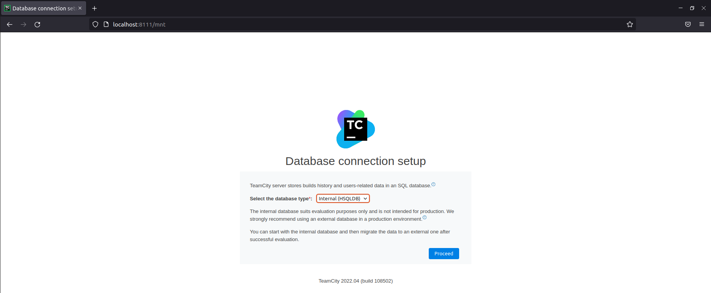
</p>

* Создадим нового пользователя.
<p align="center">
  
</p>

#### 4. Авторизуем агента.
<p align="center">
  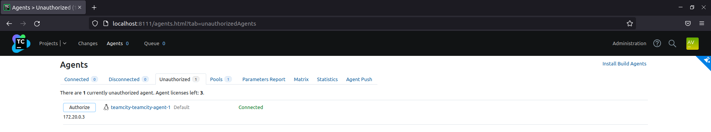
</p>

<p align="center">
  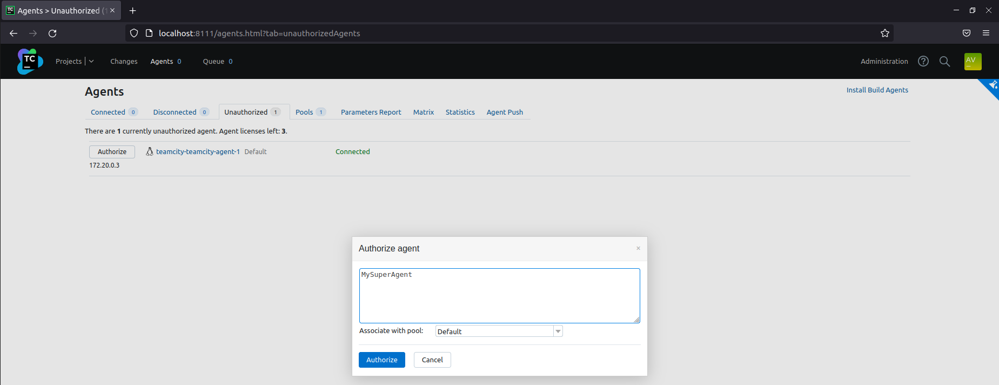
</p>

<p align="center">
  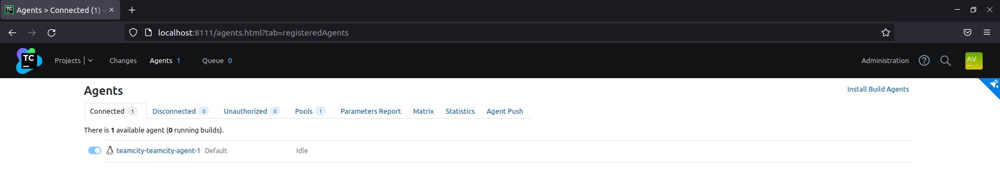
</p>

#### 5. Сделайте fork [репозитория](https://github.com/aragastmatb/example-teamcity).
<p align="center">
  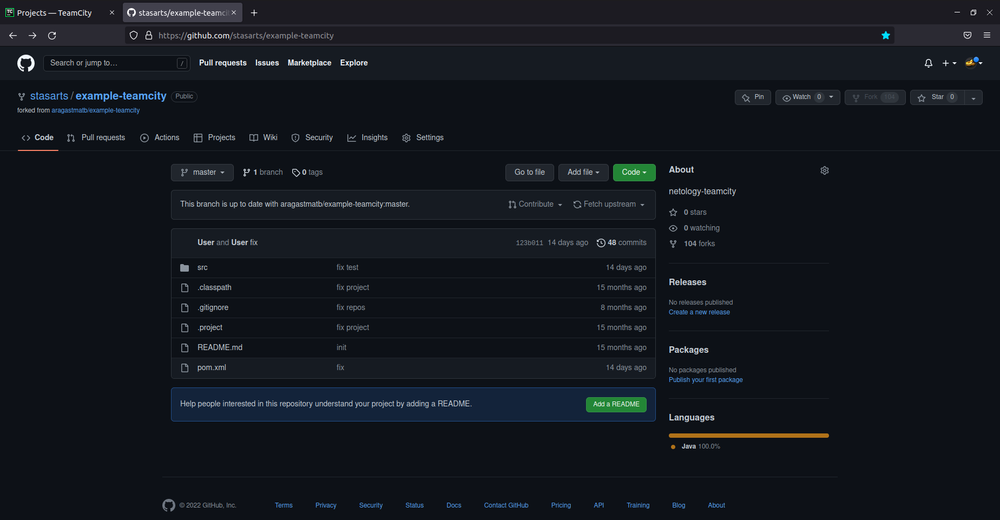
</p>

## Основная часть

#### 1. Создадим новый проект в teamcity на основе fork.
<p align="center">
  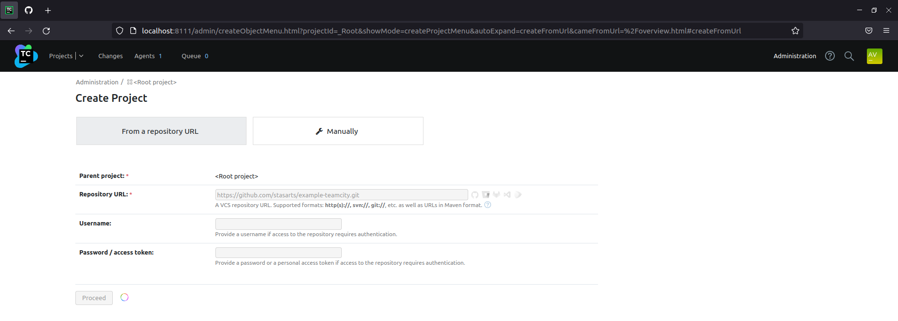
</p>

<p align="center">
  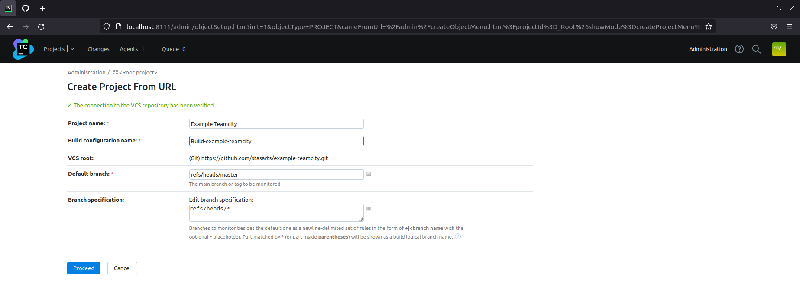
</p>

#### 2. Сделаем autodetect конфигурации.
<p align="center">
  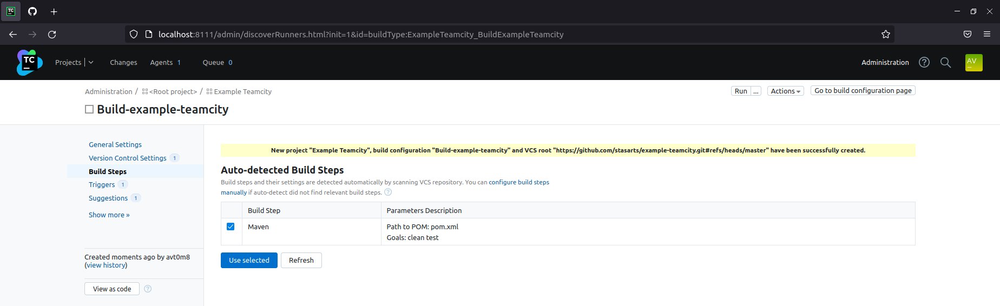
</p>

<p align="center">
  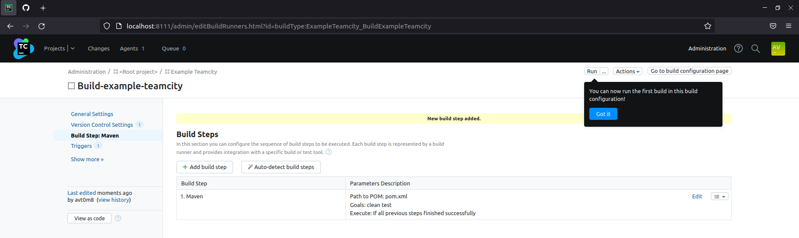
</p>

#### 3. Сохраним необходимые шаги, запустим первую сборку master'a.
<p align="center">
  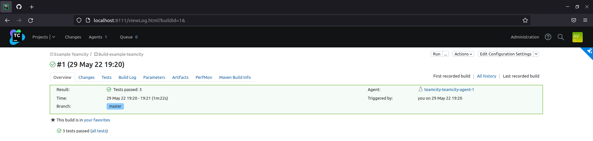
</p>

#### 4. Поменяйте условия сборки: если сборка по ветке `master`, то должен происходить `mvn clean package`, иначе `mvn clean test`.
<p align="center">
  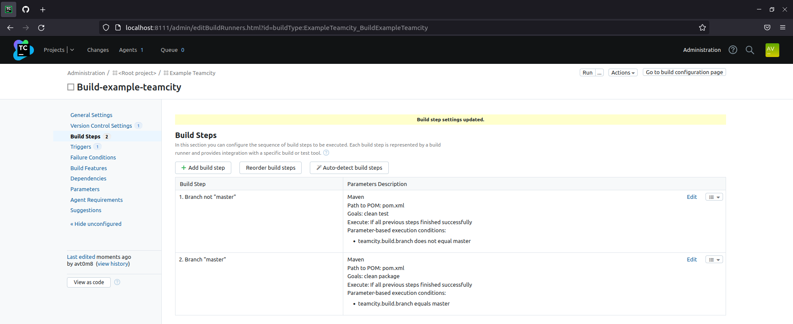
</p>

#### 5. Мигрируем `build configuration` в репозиторий.
<p align="center">
  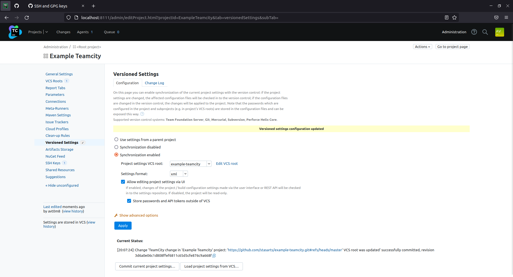
</p>

<p align="center">
  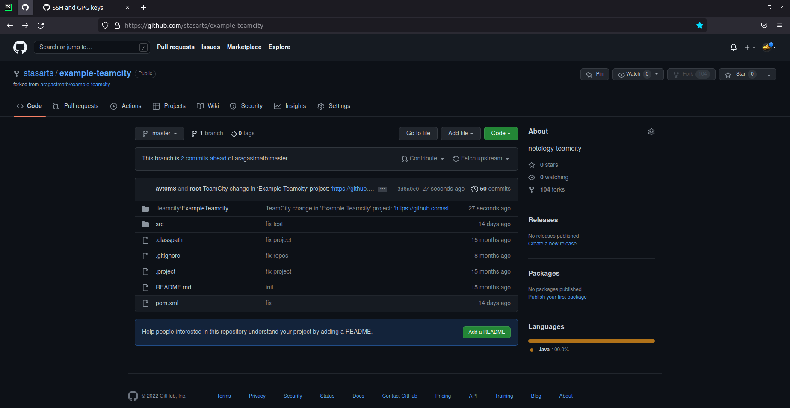
</p>

#### 6. Создадим отдельную ветку `feature/add_reply` в репозитории.
```shell
$ git checkout -b feature/add_reply
Switched to a new branch 'feature/add_reply'
```

#### 7. Напишем новый метод для класса Welcomer: метод должен возвращать произвольную реплику, содержащую слово `hunter`.
```
public String saySoothed() {
        return "Good hunter... Your presence somehow soothes... I sense the ancient echoes, they course your veins...";
}

```

#### 8. Дополним тест для нового метода на поиск слова `hunter` в новой реплике.
```
	@Test
	public void welcomerSaysHunter() {
		assertThat(welcomer.sayWelcome(), containsString("hunter"));
		assertThat(welcomer.sayFarewell(), containsString("hunter"));
        assertThat(welcomer.saySoothed(), containsString("hunter"));
	}
```

#### 9. Сделаем push всех изменений в новую ветку в репозиторий.
[Изменения.](https://github.com/stasarts/example-teamcity/commit/033d9486774ac6c12425938e3f735a32597cfd9f)

#### 10. Убедимся что сборка самостоятельно запустилась, тесты прошли успешно.
<p align="center">
  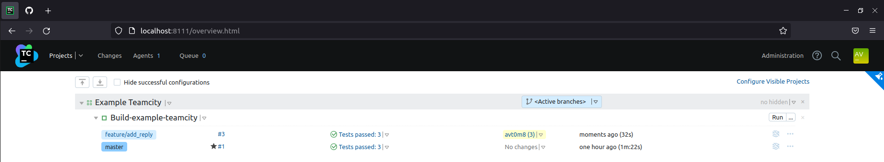
</p>

#### 11. Внесем изменения из ветки `feature/add_reply` в `master` через `Merge`.
<p align="center">
  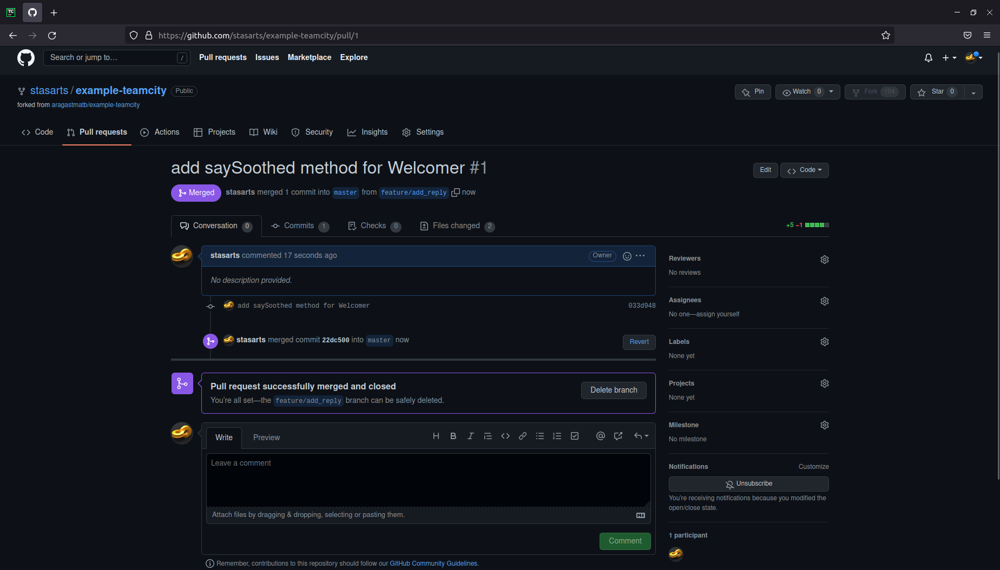
</p>

<p align="center">
  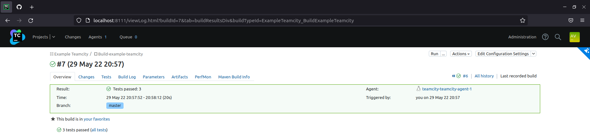
</p>

#### 12. Убедимся, что нет собранного артефакта в сборке по ветке `master`.
<p align="center">
  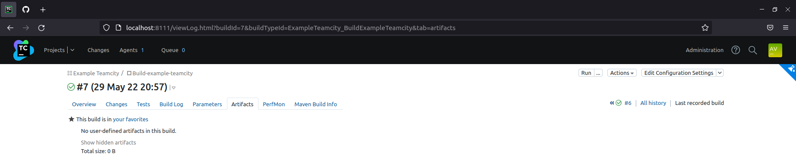
</p>

#### 13. Настроим конфигурацию так, чтобы она собирала `.jar` в артефакты сборки.
<p align="center">
  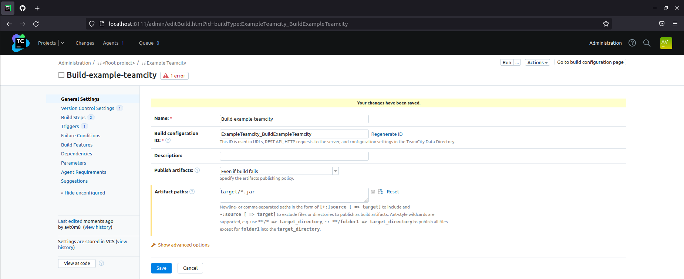
</p>

#### 14. Проведем повторную сборку мастера, убедитесь, что сбора прошла успешно и артефакты собраны.
<p align="center">
  
</p>

<p align="center">
  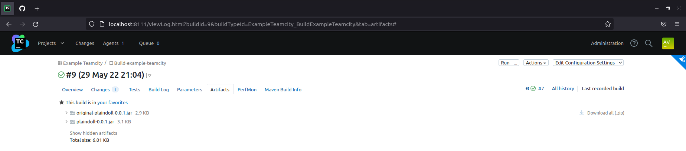
</p>

#### 15. Проверим, что конфигурация в репозитории содержит все настройки конфигурации из teamcity.
[Конфигурация в репозитории.](https://github.com/stasarts/example-teamcity/tree/master/.teamcity/ExampleTeamcity)

#### 16. Ссылка на репозиторий.
[Ссылка на репозиторий.](https://github.com/stasarts/example-teamcity)

---