# Домашнее задание к занятию "09.05 Gitlab"

## Подготовка к выполнению

1. Необходимо [зарегистрироваться](https://about.gitlab.com/free-trial/)
2. Создайте свой новый проект
3. Создайте новый репозиторий в gitlab, наполните его [файлами](./repository)
4. Проект должен быть публичным, остальные настройки по желанию

## Основная часть

### DevOps

В репозитории содержится код проекта на python. Проект - RESTful API сервис. Ваша задача автоматизировать сборку образа с выполнением python-скрипта:
1. Образ собирается на основе [centos:7](https://hub.docker.com/_/centos?tab=tags&page=1&ordering=last_updated)
2. Python версии не ниже 3.7
3. Установлены зависимости: `flask` `flask-jsonpify` `flask-restful`
4. Создана директория `/python_api`
5. Скрипт из репозитория размещён в /python_api
6. Точка вызова: запуск скрипта
7. Если сборка происходит на ветке `master`: Образ должен пушится в docker registry вашего gitlab `python-api:latest`, иначе этот шаг нужно пропустить

### Product Owner

Вашему проекту нужна бизнесовая доработка: необходимо поменять JSON ответа на вызов метода GET `/rest/api/get_info`, необходимо создать Issue в котором указать:
1. Какой метод необходимо исправить
2. Текст с `{ "message": "Already started" }` на `{ "message": "Running"}`
3. Issue поставить label: feature

### Developer

Вам пришел новый Issue на доработку, вам необходимо:
1. Создать отдельную ветку, связанную с этим issue
2. Внести изменения по тексту из задания
3. Подготовить Merge Requst, влить необходимые изменения в `master`, проверить, что сборка прошла успешно

### Tester

Разработчики выполнили новый Issue, необходимо проверить валидность изменений:
1. Поднять докер-контейнер с образом `python-api:latest` и проверить возврат метода на корректность
2. Закрыть Issue с комментарием об успешности прохождения, указав желаемый результат и фактически достигнутый

## Итог

После успешного прохождения всех ролей - отправьте ссылку на ваш проект в гитлаб, как решение домашнего задания

---

## Ответ

### Подготовка к выполнению

1. [Зарегистрируемся.](https://about.gitlab.com/free-trial/)
<p align="center">
  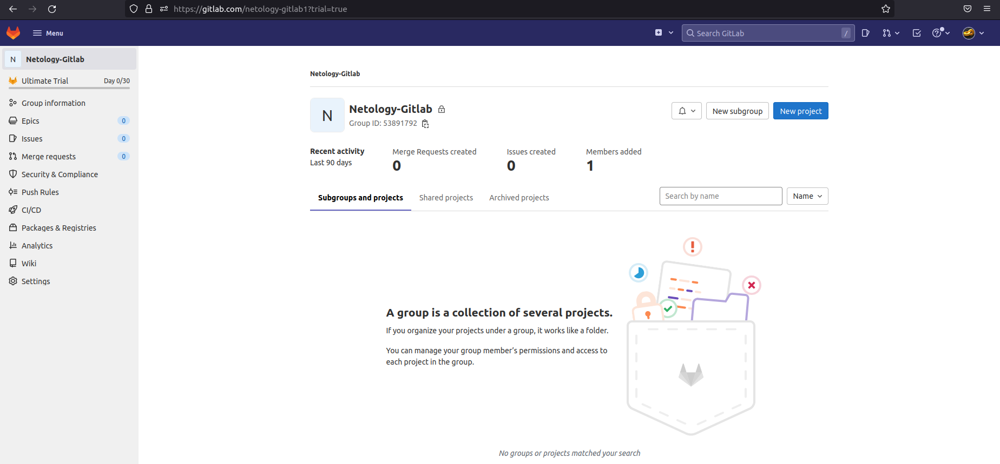
</p>

2. Создадим свой новый проект.
<p align="center">
  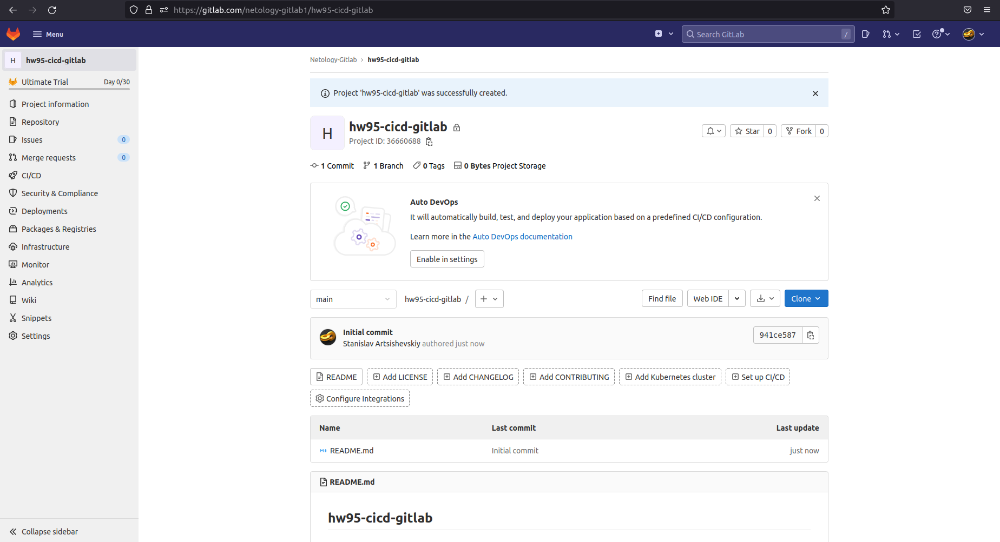
</p>

3. Создадим новый репозиторий в gitlab, наполним его [файлами](./repository).
<p align="center">
  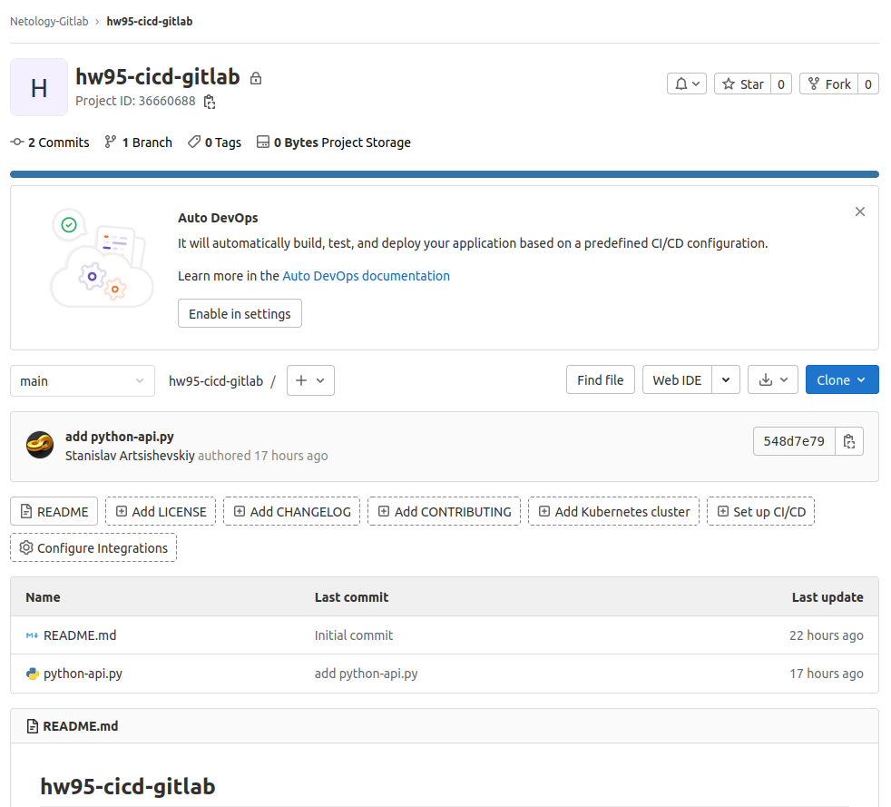
</p>

4. Проект должен быть публичным.
<p align="center">
  
</p>

<p align="center">
  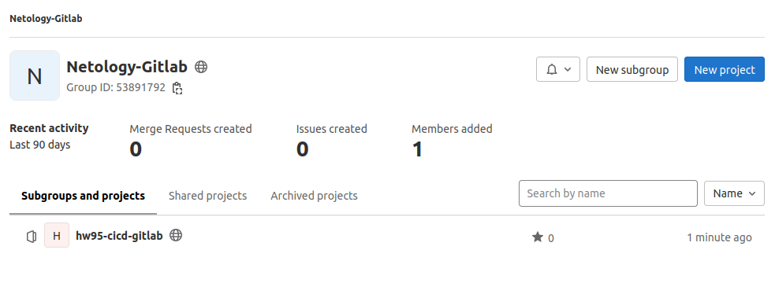
</p>

### Основная часть

#### DevOps

В репозитории содержится код проекта на python. Проект - RESTful API сервис. Задача автоматизировать сборку образа с выполнением python-скрипта:
1. Образ собирается на основе [centos:7](https://hub.docker.com/_/centos?tab=tags&page=1&ordering=last_updated).
2. Python версии не ниже 3.7.
3. Установлены зависимости: `flask` `flask-jsonpify` `flask-restful`.
4. Создана директория `/python_api`.
5. Скрипт из репозитория размещён в /python_api.
6. Точка вызова: запуск скрипта.
7. Если сборка происходит на ветке `master`: Образ должен пушится в docker registry вашего gitlab `python-api:latest`, иначе этот шаг нужно пропустить.

* Dockerfile для сборки образа:
```
FROM centos:7

RUN yum -y install wget make gcc openssl-devel bzip2-devel libffi-devel && \
    cd /tmp/ && \
    wget https://www.python.org/ftp/python/3.7.9/Python-3.7.9.tgz && \
    tar xzf Python-3.7.9.tgz && \
    cd Python-3.7.9 && \
    ./configure --enable-optimizations && \
    make altinstall && \
    ln -sfn /usr/local/bin/python3.7 /usr/bin/python3.7 && \
    ln -sfn /usr/local/bin/pip3.7 /usr/bin/pip3.7 && \
    python3.7 -m pip install --upgrade pip
RUN pip3.7 install flask flask-restful flask-jsonpify

COPY python-api.py /python_api/python-api.py
CMD ["python3.7", "/python_api/python-api.py"]
```

* Автоматизируем сборку образа:
1) Из-за недоступности shared runners, установим раннер в докер-контейнере на локальной машине.
```shell
$ docker run -d --name gitlab-runner --restart always \
>   -v ~/gitlab/gitlab-runner/config:/etc/gitlab-runner \
>   -v /var/run/docker.sock:/var/run/docker.sock \
>   gitlab/gitlab-runner:latest
Unable to find image 'gitlab/gitlab-runner:latest' locally
latest: Pulling from gitlab/gitlab-runner
d5fd17ec1767: Pull complete 
731cbd0aa564: Pull complete 
97bfca62190b: Pull complete 
Digest: sha256:e8664d02ca608d40bbea5f0c5e3f86a306adf44c0089bcef69d6838026201217
Status: Downloaded newer image for gitlab/gitlab-runner:latest
a9a0f05ad9c24885ad9d7255f63b609278929d9dceef7b62c0f2909accf4dd67
```

2) Зарегистрируем раннера. Для этого узнаем токен на странице Settings -> CICD -> Runners:
<p align="center">
  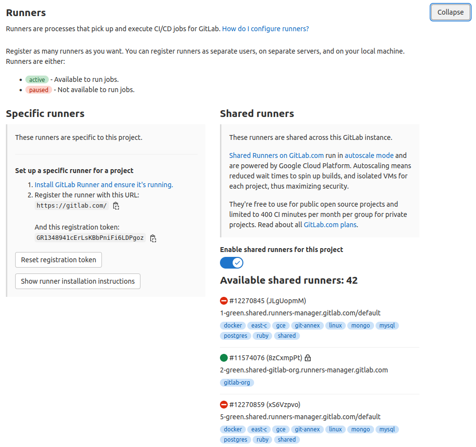
</p>

3) Выполним непосредственно регистрацию:
```shell
$ docker run --rm -it -v ~/gitlab/gitlab-runner/config:/etc/gitlab-runner gitlab/gitlab-runner register
Runtime platform                                    arch=amd64 os=linux pid=7 revision=febb2a09 version=15.0.0
Running in system-mode.                            
                                                   
Enter the GitLab instance URL (for example, https://gitlab.com/):
https://gitlab.com/
Enter the registration token:
GR1348941cErLsKBbPniFi6LDPgoz
Enter a description for the runner:
[de5d4d817f16]: laptop-runner
Enter tags for the runner (comma-separated):
laptop
Enter optional maintenance note for the runner:

Registering runner... succeeded                     runner=GR1348941cErLsKBb
Enter an executor: docker-ssh+machine, custom, docker-ssh, parallels, shell, ssh, virtualbox, docker+machine, docker, kubernetes:
docker
Enter the default Docker image (for example, ruby:2.7):
centos7    
Runner registered successfully. Feel free to start it, but if it's running already the config should be automatically reloaded! 
```

4) Необходимо поправить конфигурацию раннера (gitlab-runner/config/config.toml)
```shell
concurrent = 1
check_interval = 0

[session_server]
  session_timeout = 1800

[[runners]]
  name = "laptop-runner"
  url = "https://gitlab.com/"
  token = "gyMaZiGhcRfESjdyQkZt"
  executor = "docker"
  [runners.custom_build_dir]
  [runners.cache]
    [runners.cache.s3]
    [runners.cache.gcs]
    [runners.cache.azure]
  [runners.docker]
    tls_verify = false
    image = "centos7"
    privileged = true
    disable_entrypoint_overwrite = false
    oom_kill_disable = false
    disable_cache = false
    volumes = ["/cache", "/var/run/docker.sock:/var/run/docker.sock"]
    shm_size = 0
```

5) Перезапустим раннера:
```shell
$ docker restart gitlab-runner
gitlab-runner
```

6) Проверим, что раннер появился в gitlab:
<p align="center">
  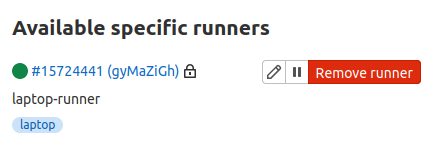
</p>

<p align="center">
  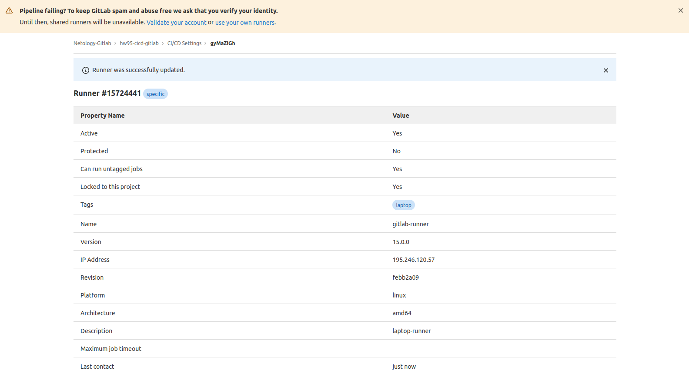
</p>

7) В настройках CICD проекта отключим использование shared runners. 
<p align="center">
  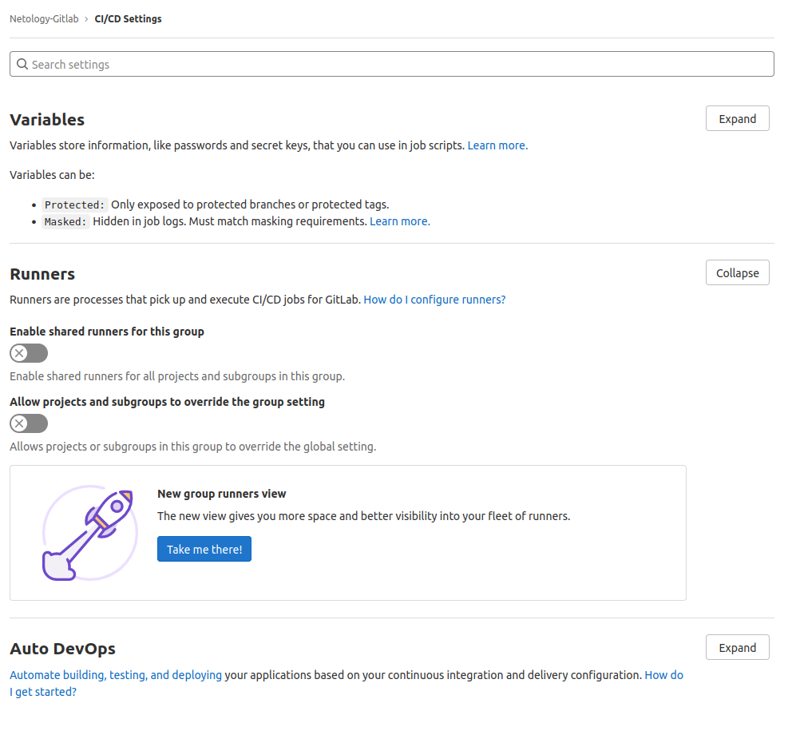
</p>

8) Перейдем в CICD -> Pipelines -> Docker и добавим .gitlab-ci.yml:
```shell
stages:
  - build
  - deploy
image: docker:dind
services:
  - docker:dind
build image:
  stage: build
  script:
    - docker build -t python-api:latest .
  except:
    - main
deploy to registry:
  stage: deploy
  script:
    - docker build -t $CI_REGISTRY/$CI_PROJECT_PATH/python-api:latest .
    - docker login -u $CI_REGISTRY_USER -p $CI_REGISTRY_PASSWORD $CI_REGISTRY
    - docker push $CI_REGISTRY/$CI_PROJECT_PATH/python-api:latest
  only:
    - main
```

9) Лог успешной сборки образа раннером:
<p align="center">
  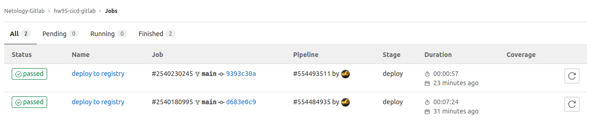
</p>

```shell
Running with gitlab-runner 15.0.0 (febb2a09)
  on laptop-runner gyMaZiGh
Resolving secrets 00:00
Preparing the "docker" executor 00:38
Using Docker executor with image docker:dind ...
Starting service docker:dind ...
Pulling docker image docker:dind ...
Using docker image sha256:1f6c0346b90562fa44a32011666df7a7f413ee260a0510b52ca974bef4d50f15 for docker:dind with digest docker@sha256:56ef400f08be1ca817d7e2cfdb43803786ab28d84c8167e8590622d9bab5b415 ...
Waiting for services to be up and running (timeout 30 seconds)...
*** WARNING: Service runner-gymazigh-project-36660688-concurrent-0-0a983818192d01f5-docker-0 probably didn't start properly.
Health check error:
service "runner-gymazigh-project-36660688-concurrent-0-0a983818192d01f5-docker-0-wait-for-service" timeout
Health check container logs:
Service container logs:
2022-06-02T17:34:00.354205574Z Generating RSA private key, 4096 bit long modulus (2 primes)
2022-06-02T17:34:00.542390761Z ..........................................++++
2022-06-02T17:34:00.778214793Z .......................................................++++
2022-06-02T17:34:00.778577728Z e is 65537 (0x010001)
2022-06-02T17:34:00.802559928Z Generating RSA private key, 4096 bit long modulus (2 primes)
2022-06-02T17:34:01.959271895Z ..............................................................................................................................................................................................................................................++++
2022-06-02T17:34:02.380068242Z ...................................................................++++
2022-06-02T17:34:02.380675792Z e is 65537 (0x010001)
2022-06-02T17:34:02.428045752Z Signature ok
2022-06-02T17:34:02.428077471Z subject=CN = docker:dind server
2022-06-02T17:34:02.428408947Z Getting CA Private Key
2022-06-02T17:34:02.448893416Z /certs/server/cert.pem: OK
2022-06-02T17:34:02.454663074Z Generating RSA private key, 4096 bit long modulus (2 primes)
2022-06-02T17:34:04.486867266Z ...............................................................................................................................................................................................................................................................................................................................................++++
2022-06-02T17:34:04.765984259Z .............................................++++
2022-06-02T17:34:04.766599433Z e is 65537 (0x010001)
2022-06-02T17:34:04.801164566Z Signature ok
2022-06-02T17:34:04.801204630Z subject=CN = docker:dind client
2022-06-02T17:34:04.801387611Z Getting CA Private Key
2022-06-02T17:34:04.822337146Z /certs/client/cert.pem: OK
2022-06-02T17:34:04.916302573Z time="2022-06-02T17:34:04.916137246Z" level=info msg="Starting up"
2022-06-02T17:34:04.918225609Z time="2022-06-02T17:34:04.918146882Z" level=warning msg="could not change group /var/run/docker.sock to docker: group docker not found"
2022-06-02T17:34:04.918315326Z failed to load listeners: can't create unix socket /var/run/docker.sock: device or resource busy
*********
Using docker image sha256:1f6c0346b90562fa44a32011666df7a7f413ee260a0510b52ca974bef4d50f15 for docker:dind with digest docker@sha256:56ef400f08be1ca817d7e2cfdb43803786ab28d84c8167e8590622d9bab5b415 ...
Preparing environment 00:00
Running on runner-gymazigh-project-36660688-concurrent-0 via a9a0f05ad9c2...
Getting source from Git repository 00:02
Fetching changes with git depth set to 20...
Reinitialized existing Git repository in /builds/netology-gitlab1/hw95-cicd-gitlab/.git/
Checking out d683e0c9 as main...
Skipping Git submodules setup
Executing "step_script" stage of the job script
Using docker image sha256:1f6c0346b90562fa44a32011666df7a7f413ee260a0510b52ca974bef4d50f15 for docker:dind with digest docker@sha256:56ef400f08be1ca817d7e2cfdb43803786ab28d84c8167e8590622d9bab5b415 ...
$ docker build -t $CI_REGISTRY/$CI_PROJECT_PATH/python-api:latest .
Step 1/5 : FROM centos:7
 ---> eeb6ee3f44bd
Step 2/5 : RUN yum -y install wget make gcc openssl-devel bzip2-devel libffi-devel &&     cd /tmp/ &&     wget https://www.python.org/ftp/python/3.7.9/Python-3.7.9.tgz &&     tar xzf Python-3.7.9.tgz &&     cd Python-3.7.9 &&     ./configure --enable-optimizations &&     make altinstall &&     ln -sfn /usr/local/bin/python3.7 /usr/bin/python3.7 &&     ln -sfn /usr/local/bin/pip3.7 /usr/bin/pip3.7 &&     python3.7 -m pip install --upgrade pip
 ---> Using cache
 ---> 2f39ee3b704d
Step 3/5 : RUN pip3.7 install flask flask-restful flask-jsonpify
 ---> Using cache
 ---> 922f9a25be62
Step 4/5 : COPY python-api.py /python_api/python-api.py
 ---> 636f2f655785
Step 5/5 : CMD ["python3.7", "/python_api/python-api.py"]
 ---> Running in 45dc3568522e
Removing intermediate container 45dc3568522e
 ---> 251f4cc15a1e
Successfully built 251f4cc15a1e
Successfully tagged registry.gitlab.com/netology-gitlab1/hw95-cicd-gitlab/python-api:latest
$ docker login -u $CI_REGISTRY_USER -p $CI_REGISTRY_PASSWORD $CI_REGISTRY
WARNING! Using --password via the CLI is insecure. Use --password-stdin.
WARNING! Your password will be stored unencrypted in /root/.docker/config.json.
Configure a credential helper to remove this warning. See
https://docs.docker.com/engine/reference/commandline/login/#credentials-store
Login Succeeded
$ docker push $CI_REGISTRY/$CI_PROJECT_PATH/python-api:latest
The push refers to repository [registry.gitlab.com/netology-gitlab1/hw95-cicd-gitlab/python-api]
fe88da3e81a5: Preparing
bcc428694475: Preparing
4ba1b703d8af: Preparing
174f56854903: Preparing
fe88da3e81a5: Pushed
bcc428694475: Pushed
174f56854903: Pushed
4ba1b703d8af: Pushed
latest: digest: sha256:22c51406f258b69a3d8a33b7eafb85959f320af8e2c74030609f979d3a6c84e3 size: 1160
Cleaning up project directory and file based variables 00:00
Job succeeded
```

10) Перейдем в Packages & Registries -> Container Registry и убедимся, что образ запушился.
<p align="center">
  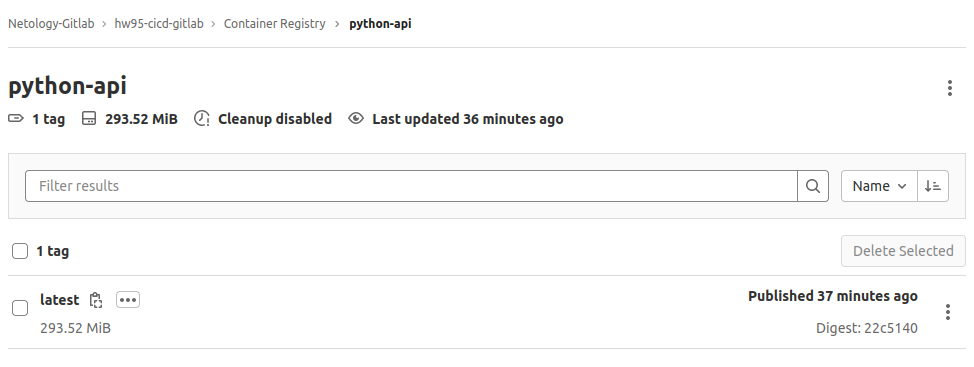
</p>

#### Product Owner

Вашему проекту нужна бизнесовая доработка: необходимо поменять JSON ответа на вызов метода GET `/rest/api/get_info`, необходимо создать Issue в котором указать:
1. Какой метод необходимо исправить
2. Текст с `{ "message": "Already started" }` на `{ "message": "Running"}`
3. Issue поставить label: feature

* Перейдем в Issues и создадим новый запрос:
<p align="center">
  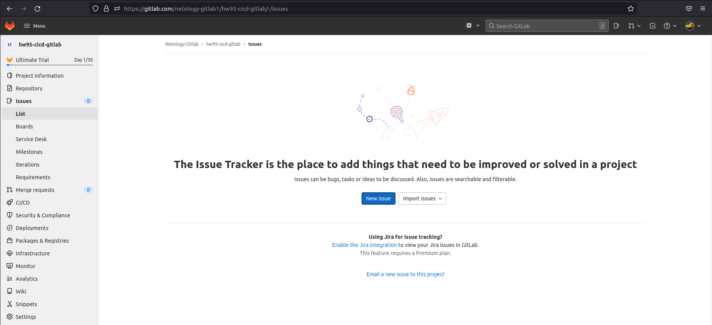
</p>

<p align="center">
  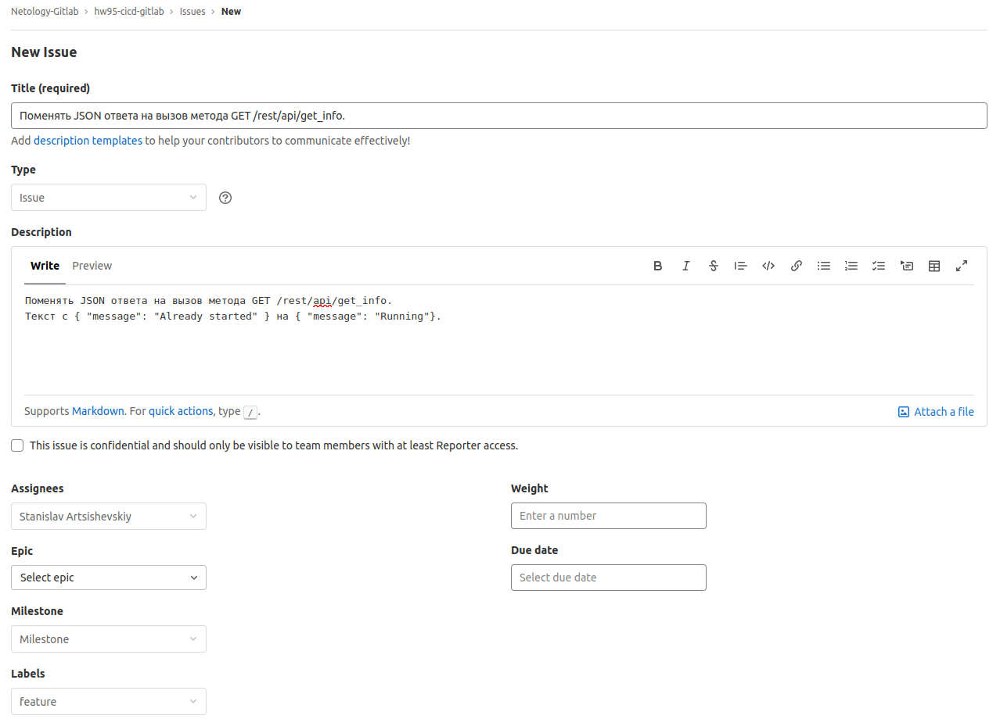
</p>

<p align="center">
  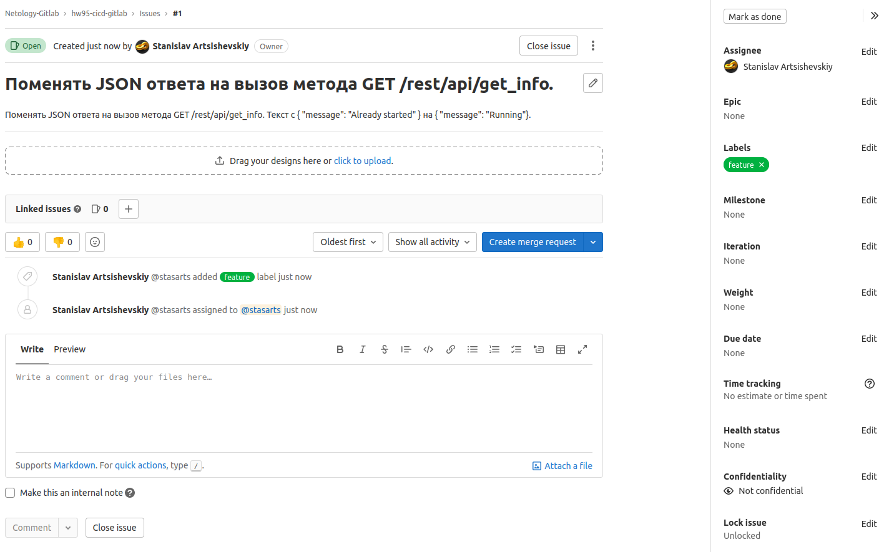
</p>

#### Developer

Вам пришел новый Issue на доработку, вам необходимо:
1. Создать отдельную ветку, связанную с этим issue.
2. Внести изменения по тексту из задания.
3. Подготовить Merge Requst, влить необходимые изменения в `master`, проверить, что сборка прошла успешно.

* Создадим отдельную ветку, связанную с этим запросом:
```shell
$ git checkout -b hw95-cicd-gitlab#1
Switched to a new branch 'hw95-cicd-gitlab#1'
```

* Внесем изменения по заданию и отправим изменения в репозиторий:
```shell
$ nano python-api.py
---
from flask import Flask, request
from flask_restful import Resource, Api
from json import dumps
from flask_jsonpify import jsonify

app = Flask(__name__)
api = Api(app)

class Info(Resource):
    def get(self):
        return {'version': 3, 'method': 'GET', 'message': 'Running'} # Fetches first column that is Employee ID

api.add_resource(Info, '/get_info') # Route_1

if __name__ == '__main__':
     app.run(host='0.0.0.0', port='5290')
---
$ git add .
$ git commit -m "change JSON response on GET /rest/api/get_info"
[hw95-cicd-gitlab#1 46a8af6] change JSON response on GET /rest/api/get_info
 1 file changed, 1 insertion(+), 1 deletion(-)
$ git push origin main hw95-cicd-gitlab#1
Enumerating objects: 5, done.
Counting objects: 100% (5/5), done.
Delta compression using up to 8 threads
Compressing objects: 100% (3/3), done.
Writing objects: 100% (3/3), 320 bytes | 320.00 KiB/s, done.
Total 3 (delta 2), reused 0 (delta 0)
remote: 
remote: To create a merge request for hw95-cicd-gitlab#1, visit:
remote:   https://gitlab.com/netology-gitlab1/hw95-cicd-gitlab/-/merge_requests/new?merge_request%5Bsource_branch%5D=hw95-cicd-gitlab%231
remote: 
To gitlab.com:netology-gitlab1/hw95-cicd-gitlab.git
 * [new branch]      hw95-cicd-gitlab#1 -> hw95-cicd-gitlab#1
```

* Подготовим Merge Request:
<p align="center">
  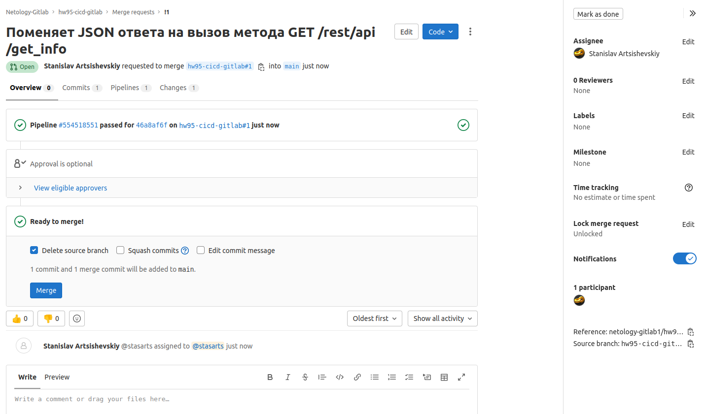
</p>

<p align="center">
  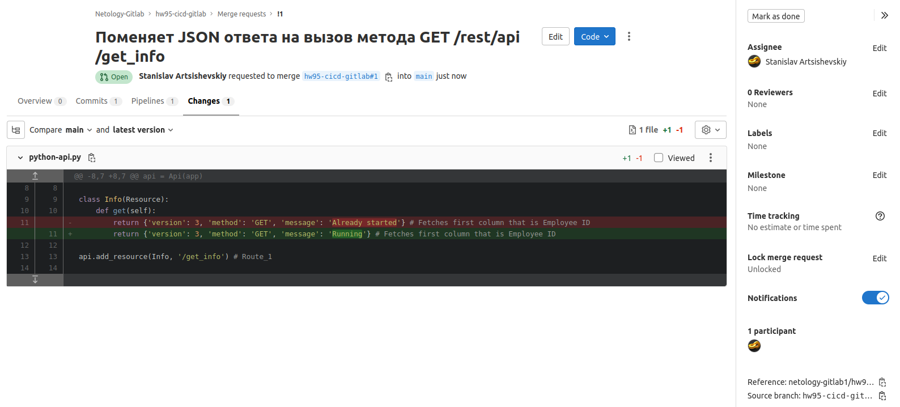
</p>

* Вольем изменения в `master`:
<p align="center">
  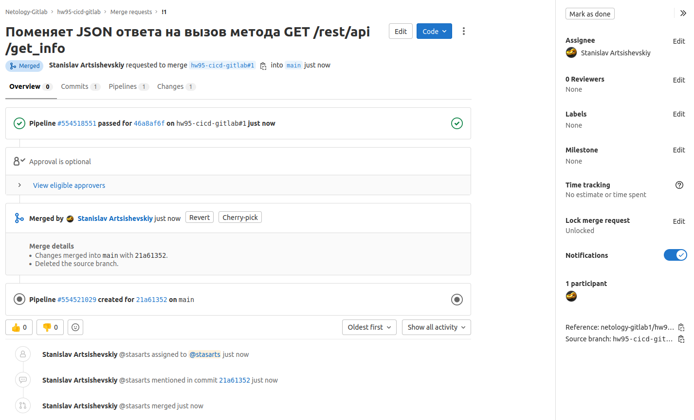
</p>

* Проверим, что сборка прошла успешно:
<p align="center">
  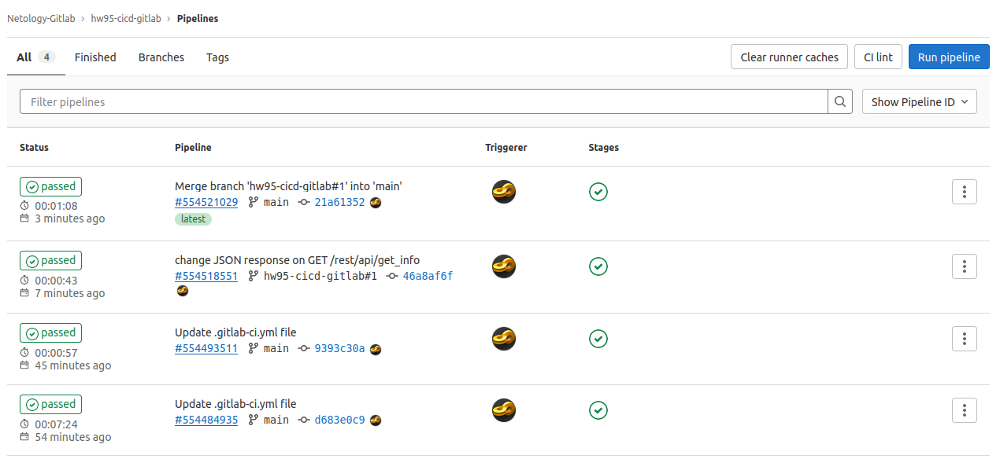
</p>

#### Tester

Разработчики выполнили новый Issue, необходимо проверить валидность изменений:
1. Поднять докер-контейнер с образом `python-api:latest` и проверить возврат метода на корректность.
2. Закрыть Issue с комментарием об успешности прохождения, указав желаемый результат и фактически достигнутый.

* Поднимем докер-контейнер с образом `python-api:latest` и проверить возврат метода на корректность:
```shell
$ docker run -d --rm --name netology-gitlab -p 5290:5290 registry.gitlab.com/netology-gitlab1/hw95-cicd-gitlab/python-api
$ curl localhost:5290/get_info
{"version": 3, "method": "GET", "message": "Running"}
```

* Закроем Issue с комментарием об успешности прохождения, указав желаемый результат и фактически достигнутый:
<p align="center">
  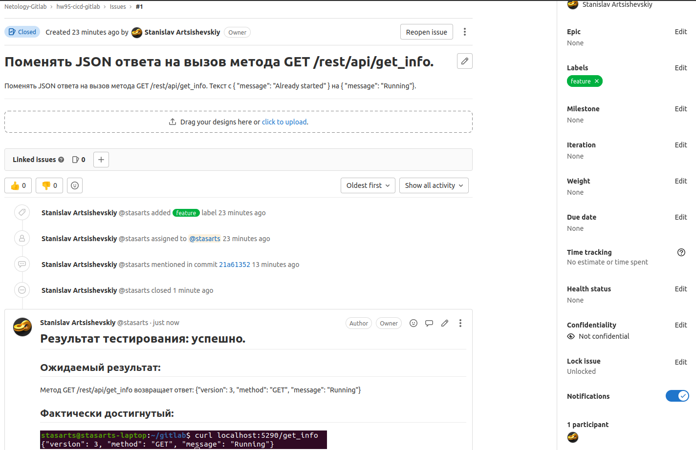
</p>

## Итог

[Cсылка на проект в гитлаб](https://gitlab.com/netology-gitlab1)

---
