# Дипломное задание по курсу «DevOps-инженер»

<details>
  <summary>Задание</summary>

  * [Цели:](#цели)
  * [Этапы выполнения:](#этапы-выполнения)
      * [Регистрация доменного имени](#регистрация-доменного-имени)
      * [Создание инфраструктуры](#создание-инфраструктуры)
          * [Установка Nginx и LetsEncrypt](#установка-nginx)
          * [Установка кластера MySQL](#установка-mysql)
          * [Установка WordPress](#установка-wordpress)
          * [Установка Gitlab CE, Gitlab Runner и настройка CI/CD](#установка-gitlab)
          * [Установка Prometheus, Alert Manager, Node Exporter и Grafana](#установка-prometheus)
  * [Что необходимо для сдачи задания?](#что-необходимо-для-сдачи-задания)
  * [Как правильно задавать вопросы дипломному руководителю?](#как-правильно-задавать-вопросы-дипломному-руководителю)

---
## Цели:

1. Зарегистрировать доменное имя (любое на ваш выбор в любой доменной зоне).
2. Подготовить инфраструктуру с помощью Terraform на базе облачного провайдера YandexCloud.
3. Настроить внешний Reverse Proxy на основе Nginx и LetsEncrypt.
4. Настроить кластер MySQL.
5. Установить WordPress.
6. Развернуть Gitlab CE и Gitlab Runner.
7. Настроить CI/CD для автоматического развёртывания приложения.
8. Настроить мониторинг инфраструктуры с помощью стека: Prometheus, Alert Manager и Grafana.

---
## Этапы выполнения:

### Регистрация доменного имени

Подойдет любое доменное имя на ваш выбор в любой доменной зоне.

ПРИМЕЧАНИЕ: Далее в качестве примера используется домен `you.domain` замените его вашим доменом.

Рекомендуемые регистраторы:
  - [nic.ru](https://nic.ru)
  - [reg.ru](https://reg.ru)

Цель:

1. Получить возможность выписывать [TLS сертификаты](https://letsencrypt.org) для веб-сервера.

Ожидаемые результаты:

1. У вас есть доступ к личному кабинету на сайте регистратора.
2. Вы зарезистрировали домен и можете им управлять (редактировать dns записи в рамках этого домена).

### Создание инфраструктуры

Для начала необходимо подготовить инфраструктуру в YC при помощи [Terraform](https://www.terraform.io/).

Особенности выполнения:

- Бюджет купона ограничен, что следует иметь в виду при проектировании инфраструктуры и использовании ресурсов;
- Следует использовать последнюю стабильную версию [Terraform](https://www.terraform.io/).

Предварительная подготовка:

1. Создайте сервисный аккаунт, который будет в дальнейшем использоваться Terraform для работы с инфраструктурой с необходимыми и достаточными правами. Не стоит использовать права суперпользователя
2. Подготовьте [backend](https://www.terraform.io/docs/language/settings/backends/index.html) для Terraform:  
   а. Рекомендуемый вариант: [Terraform Cloud](https://app.terraform.io/)  
   б. Альтернативный вариант: S3 bucket в созданном YC аккаунте.
3. Настройте [workspaces](https://www.terraform.io/docs/language/state/workspaces.html)  
   а. Рекомендуемый вариант: создайте два workspace: *stage* и *prod*. В случае выбора этого варианта все последующие шаги должны учитывать факт существования нескольких workspace.  
   б. Альтернативный вариант: используйте один workspace, назвав его *stage*. Пожалуйста, не используйте workspace, создаваемый Terraform-ом по-умолчанию (*default*).
4. Создайте VPC с подсетями в разных зонах доступности.
5. Убедитесь, что теперь вы можете выполнить команды `terraform destroy` и `terraform apply` без дополнительных ручных действий.
6. В случае использования [Terraform Cloud](https://app.terraform.io/) в качестве [backend](https://www.terraform.io/docs/language/settings/backends/index.html) убедитесь, что применение изменений успешно проходит, используя web-интерфейс Terraform cloud.

Цель:

1. Повсеместно применять IaaC подход при организации (эксплуатации) инфраструктуры.
2. Иметь возможность быстро создавать (а также удалять) виртуальные машины и сети. С целью экономии денег на вашем аккаунте в YandexCloud.

Ожидаемые результаты:

1. Terraform сконфигурирован и создание инфраструктуры посредством Terraform возможно без дополнительных ручных действий.
2. Полученная конфигурация инфраструктуры является предварительной, поэтому в ходе дальнейшего выполнения задания возможны изменения.

---
### Установка Nginx и LetsEncrypt

Необходимо разработать Ansible роль для установки Nginx и LetsEncrypt.

**Для получения LetsEncrypt сертификатов во время тестов своего кода пользуйтесь [тестовыми сертификатами](https://letsencrypt.org/docs/staging-environment/), так как количество запросов к боевым серверам LetsEncrypt [лимитировано](https://letsencrypt.org/docs/rate-limits/).**

Рекомендации:
  - Имя сервера: `you.domain`
  - Характеристики: 2vCPU, 2 RAM, External address (Public) и Internal address.

Цель:

1. Создать reverse proxy с поддержкой TLS для обеспечения безопасного доступа к веб-сервисам по HTTPS.

Ожидаемые результаты:

1. В вашей доменной зоне настроены все A-записи на внешний адрес этого сервера:
    - `https://www.you.domain` (WordPress)
    - `https://gitlab.you.domain` (Gitlab)
    - `https://grafana.you.domain` (Grafana)
    - `https://prometheus.you.domain` (Prometheus)
    - `https://alertmanager.you.domain` (Alert Manager)
2. Настроены все upstream для выше указанных URL, куда они сейчас ведут на этом шаге не важно, позже вы их отредактируете и укажите верные значения.
2. В браузере можно открыть любой из этих URL и увидеть ответ сервера (502 Bad Gateway). На текущем этапе выполнение задания это нормально!

___
### Установка кластера MySQL

Необходимо разработать Ansible роль для установки кластера MySQL.

Рекомендации:
  - Имена серверов: `db01.you.domain` и `db02.you.domain`
  - Характеристики: 4vCPU, 4 RAM, Internal address.

Цель:

1. Получить отказоустойчивый кластер баз данных MySQL.

Ожидаемые результаты:

1. MySQL работает в режиме репликации Master/Slave.
2. В кластере автоматически создаётся база данных c именем `wordpress`.
3. В кластере автоматически создаётся пользователь `wordpress` с полными правами на базу `wordpress` и паролем `wordpress`.

**Вы должны понимать, что в рамках обучения это допустимые значения, но в боевой среде использование подобных значений не приемлимо! Считается хорошей практикой использовать логины и пароли повышенного уровня сложности. В которых будут содержаться буквы верхнего и нижнего регистров, цифры, а также специальные символы!**

___
### Установка WordPress

Необходимо разработать Ansible роль для установки WordPress.

Рекомендации:
  - Имя сервера: `app.you.domain`
  - Характеристики: 4vCPU, 4 RAM, Internal address.

Цель:

1. Установить [WordPress](https://wordpress.org/download/). Это система управления содержимым сайта ([CMS](https://ru.wikipedia.org/wiki/Система_управления_содержимым)) с открытым исходным кодом.


По данным W3techs, WordPress используют 64,7% всех веб-сайтов, которые сделаны на CMS. Это 41,1% всех существующих в мире сайтов. Эту платформу для своих блогов используют The New York Times и Forbes. Такую популярность WordPress получил за удобство интерфейса и большие возможности.

Ожидаемые результаты:

1. Виртуальная машина на которой установлен WordPress и Nginx/Apache (на ваше усмотрение).
2. В вашей доменной зоне настроена A-запись на внешний адрес reverse proxy:
    - `https://www.you.domain` (WordPress)
3. На сервере `you.domain` отредактирован upstream для выше указанного URL и он смотрит на виртуальную машину на которой установлен WordPress.
4. В браузере можно открыть URL `https://www.you.domain` и увидеть главную страницу WordPress.
---
### Установка Gitlab CE и Gitlab Runner

Необходимо настроить CI/CD систему для автоматического развертывания приложения при изменении кода.

Рекомендации:
  - Имена серверов: `gitlab.you.domain` и `runner.you.domain`
  - Характеристики: 4vCPU, 4 RAM, Internal address.

Цель:
1. Построить pipeline доставки кода в среду эксплуатации, то есть настроить автоматический деплой на сервер `app.you.domain` при коммите в репозиторий с WordPress.

Подробнее об [Gitlab CI](https://about.gitlab.com/stages-devops-lifecycle/continuous-integration/)

Ожидаемый результат:

1. Интерфейс Gitlab доступен по https.
2. В вашей доменной зоне настроена A-запись на внешний адрес reverse proxy:
    - `https://gitlab.you.domain` (Gitlab)
3. На сервере `you.domain` отредактирован upstream для выше указанного URL и он смотрит на виртуальную машину на которой установлен Gitlab.
3. При любом коммите в репозиторий с WordPress и создании тега (например, v1.0.0) происходит деплой на виртуальную машину.

___
### Установка Prometheus, Alert Manager, Node Exporter и Grafana

Необходимо разработать Ansible роль для установки Prometheus, Alert Manager и Grafana.

Рекомендации:
  - Имя сервера: `monitoring.you.domain`
  - Характеристики: 4vCPU, 4 RAM, Internal address.

Цель:

1. Получение метрик со всей инфраструктуры.

Ожидаемые результаты:

1. Интерфейсы Prometheus, Alert Manager и Grafana доступены по https.
2. В вашей доменной зоне настроены A-записи на внешний адрес reverse proxy:
  - `https://grafana.you.domain` (Grafana)
  - `https://prometheus.you.domain` (Prometheus)
  - `https://alertmanager.you.domain` (Alert Manager)
3. На сервере `you.domain` отредактированы upstreams для выше указанных URL и они смотрят на виртуальную машину на которой установлены Prometheus, Alert Manager и Grafana.
4. На всех серверах установлен Node Exporter и его метрики доступны Prometheus.
5. У Alert Manager есть необходимый [набор правил](https://awesome-prometheus-alerts.grep.to/rules.html) для создания алертов.
2. В Grafana есть дашборд отображающий метрики из Node Exporter по всем серверам.
3. В Grafana есть дашборд отображающий метрики из MySQL (*).
4. В Grafana есть дашборд отображающий метрики из WordPress (*).

*Примечание: дашборды со звёздочкой являются опциональными заданиями повышенной сложности их выполнение желательно, но не обязательно.*

---
## Что необходимо для сдачи задания?

1. Репозиторий со всеми Terraform манифестами и готовность продемонстрировать создание всех ресурсов с нуля.
2. Репозиторий со всеми Ansible ролями и готовность продемонстрировать установку всех сервисов с нуля.
3. Скриншоты веб-интерфейсов всех сервисов работающих по HTTPS на вашем доменном имени.
  - `https://www.you.domain` (WordPress)
  - `https://gitlab.you.domain` (Gitlab)
  - `https://grafana.you.domain` (Grafana)
  - `https://prometheus.you.domain` (Prometheus)
  - `https://alertmanager.you.domain` (Alert Manager)
4. Все репозитории рекомендуется хранить на одном из ресурсов ([github.com](https://github.com) или [gitlab.com](https://gitlab.com)).

---

</details>

<details>
  <summary>Выполнение</summary>

<details>
  <summary>1. Регистрация доменного имени</summary>

* Зарегистрируем домен `avt0m8.ru` на [reg.ru](https://reg.ru).

* Доступ к личному кабинету на сайте регистратора:

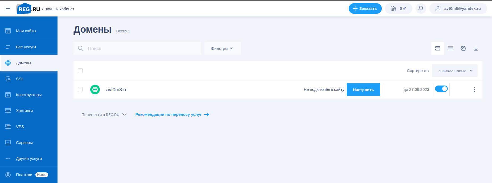

* Есть возможность управлять доменом (домен делегирован DNS `YC`):

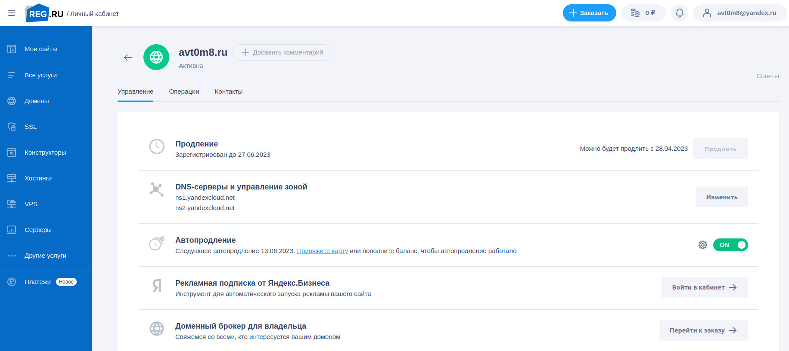

</details>

<details>
  <summary>2. Создание инфраструктуры</summary>

### Подготовим инфраструктуру в YC при помощи Terraform.

#### Предварительная подготовка:

##### 1. Создадим сервисный аккаунт, который будет в дальнейшем использоваться Terraform для работы с инфраструктурой с правами `editor`:

* Создадим сервисный аккаунт:
```shell
$ yc iam service-account create --name netology-devops
id: <serviceAccount_id>
folder_id: <folder_id>
created_at: "2022-07-28T04:39:09.585658371Z"
name: netology-devops
```

* Назначим сервисному аккаунту роль `editor`:
```shell
$ yc resource-manager folder add-access-binding <folder_id> \
>    --role editor \
>    --subject serviceAccount:<serviceAccount_id>
done (1s)
```

* Создадим статический ключ доступа для сервисного аккаунта:
```shell
$ yc iam access-key create --service-account-name netology-devops
access_key:
  id: aje5eer0vlsaqp9a0tvn
  service_account_id: <serviceAccount_id>
  created_at: "2022-07-28T04:44:38.668319289Z"
  key_id: <access_key>
secret: <secret_key>
```

* Передадим в переменные окружения OAuth token от `YC`:
```shell
export TF_VAR_token=<OAuth_token>
```

##### 2. Подготовим `backend` для `Terraform` (будем использовать `Object Storage` в `YC`):

* Создадим бакет:


##### 3. Настроим `workspaces`.

* Используем один `workspace`, назвав его `stage`:

<details>
  <summary>variables.tf</summary>

```terraform
variable "hosts" {
  type = map(map(map(string)))
  default = {
    stage = {
      vm1 = {
        name = "db01"
        cores = "2"
        memory = "2"
        core_fraction = "20"
      }
      vm2 = {
        name = "db02"
        cores = "2"
        memory = "2"
        core_fraction = "20"
      }
      vm3 = {
        name = "app"
        cores = "2"
        memory = "2"
        core_fraction = "20"
      }
      vm4 = {
        name = "gitlab"
        cores = "2"
        memory = "8"
        core_fraction = "20"
      }
      vm5 = {
        name = "runner"
        cores = "2"
        memory = "8"
        core_fraction = "20"
      }
      vm6 = {
        name = "monitoring"
        cores = "2"
        memory = "2"
        core_fraction = "20"
      }
    }
  }
}
```

</details>

##### 4. Создадим VPC с подсетями в разных зонах доступности.

<details>
  <summary>network.tf</summary>

```terraform
# Создаем подсети в разных зонах доступности
resource "yandex_vpc_subnet" "avt0m8-subnet-a" {
  v4_cidr_blocks = ["172.16.0.0/24"]
  zone           = "${var.zone}a"
  network_id     = "${yandex_vpc_network.avt0m8-net.id}"
  route_table_id = "${yandex_vpc_route_table.nat-int.id}"
}

resource "yandex_vpc_subnet" "avt0m8-subnet-b" {
  v4_cidr_blocks = ["172.16.1.0/24"]
  zone           = "${var.zone}b"
  network_id     = "${yandex_vpc_network.avt0m8-net.id}"
  route_table_id = "${yandex_vpc_route_table.nat-int.id}"
}
```

</details>

##### 5. Убедимся, что можно выполнить команды terraform destroy и terraform apply без дополнительных ручных действий.

* Инициализируем `terraform`:
```shell
$ terraform init -backend-config=backend.conf

Initializing the backend...

Successfully configured the backend "s3"! Terraform will automatically
use this backend unless the backend configuration changes.

Initializing provider plugins...
- Finding latest version of hashicorp/null...
- Finding latest version of hashicorp/local...
- Finding latest version of yandex-cloud/yandex...
- Installing hashicorp/null v3.1.1...
- Installed hashicorp/null v3.1.1 (unauthenticated)
- Installing hashicorp/local v2.2.3...
- Installed hashicorp/local v2.2.3 (unauthenticated)
- Installing yandex-cloud/yandex v0.77.0...
- Installed yandex-cloud/yandex v0.77.0 (unauthenticated)

Terraform has created a lock file .terraform.lock.hcl to record the provider
selections it made above. Include this file in your version control repository
so that Terraform can guarantee to make the same selections by default when
you run "terraform init" in the future.

Terraform has been successfully initialized!

You may now begin working with Terraform. Try running "terraform plan" to see
any changes that are required for your infrastructure. All Terraform commands
should now work.

If you ever set or change modules or backend configuration for Terraform,
rerun this command to reinitialize your working directory. If you forget, other
commands will detect it and remind you to do so if necessary.
```

* Cоздадим `workspace` `stage`:
```shell
terraform workspace new stage
Created and switched to workspace "stage"!

You're now on a new, empty workspace. Workspaces isolate their state,
so if you run "terraform plan" Terraform will not see any existing state
for this configuration.
```

<details>
  <summary>Terraform plan</summary>

```shell
$ terraform plan
data.yandex_client_config.me: Reading...
data.yandex_compute_image.image: Reading...
data.yandex_client_config.me: Read complete after 1s [id=3519557346]
data.yandex_compute_image.image: Read complete after 2s [id=fd8ju9iqf6g5bcq77jns]

Terraform used the selected providers to generate the following execution plan. Resource actions are indicated with the following symbols:
  + create

Terraform will perform the following actions:

  # local_file.inventory will be created
  + resource "local_file" "inventory" {
      + content              = (known after apply)
      + directory_permission = "0777"
      + file_permission      = "0644"
      + filename             = "../ansible/inventory.yml"
      + id                   = (known after apply)
    }

  # null_resource.ansible will be created
  + resource "null_resource" "ansible" {
      + id = (known after apply)
    }

  # null_resource.wait will be created
  + resource "null_resource" "wait" {
      + id = (known after apply)
    }

  # yandex_compute_instance.hosts["vm1"] will be created
  + resource "yandex_compute_instance" "hosts" {
      + allow_stopping_for_update = true
      + created_at                = (known after apply)
      + folder_id                 = (known after apply)
      + fqdn                      = (known after apply)
      + hostname                  = "db01"
      + id                        = (known after apply)
      + metadata                  = {
          + "ssh-keys" = <<-EOT
                ubuntu:ssh-rsa <ssh_key>
            EOT
        }
      + name                      = "db01"
      + network_acceleration_type = "standard"
      + platform_id               = "standard-v1"
      + service_account_id        = (known after apply)
      + status                    = (known after apply)
      + zone                      = "ru-central1-a"

      + boot_disk {
          + auto_delete = true
          + device_name = (known after apply)
          + disk_id     = (known after apply)
          + mode        = (known after apply)

          + initialize_params {
              + block_size  = (known after apply)
              + description = (known after apply)
              + image_id    = "fd8ju9iqf6g5bcq77jns"
              + name        = (known after apply)
              + size        = 10
              + snapshot_id = (known after apply)
              + type        = "network-hdd"
            }
        }

      + network_interface {
          + index              = (known after apply)
          + ip_address         = (known after apply)
          + ipv4               = true
          + ipv6               = (known after apply)
          + ipv6_address       = (known after apply)
          + mac_address        = (known after apply)
          + nat                = (known after apply)
          + nat_ip_address     = (known after apply)
          + nat_ip_version     = (known after apply)
          + security_group_ids = (known after apply)
          + subnet_id          = (known after apply)
        }

      + placement_policy {
          + host_affinity_rules = (known after apply)
          + placement_group_id  = (known after apply)
        }

      + resources {
          + core_fraction = 20
          + cores         = 2
          + memory        = 2
        }

      + scheduling_policy {
          + preemptible = true
        }
    }

  # yandex_compute_instance.hosts["vm2"] will be created
  + resource "yandex_compute_instance" "hosts" {
      + allow_stopping_for_update = true
      + created_at                = (known after apply)
      + folder_id                 = (known after apply)
      + fqdn                      = (known after apply)
      + hostname                  = "db02"
      + id                        = (known after apply)
      + metadata                  = {
          + "ssh-keys" = <<-EOT
                ubuntu:ssh-rsa <ssh_key>
            EOT
        }
      + name                      = "db02"
      + network_acceleration_type = "standard"
      + platform_id               = "standard-v1"
      + service_account_id        = (known after apply)
      + status                    = (known after apply)
      + zone                      = "ru-central1-b"

      + boot_disk {
          + auto_delete = true
          + device_name = (known after apply)
          + disk_id     = (known after apply)
          + mode        = (known after apply)

          + initialize_params {
              + block_size  = (known after apply)
              + description = (known after apply)
              + image_id    = "fd8ju9iqf6g5bcq77jns"
              + name        = (known after apply)
              + size        = 10
              + snapshot_id = (known after apply)
              + type        = "network-hdd"
            }
        }

      + network_interface {
          + index              = (known after apply)
          + ip_address         = (known after apply)
          + ipv4               = true
          + ipv6               = (known after apply)
          + ipv6_address       = (known after apply)
          + mac_address        = (known after apply)
          + nat                = (known after apply)
          + nat_ip_address     = (known after apply)
          + nat_ip_version     = (known after apply)
          + security_group_ids = (known after apply)
          + subnet_id          = (known after apply)
        }

      + placement_policy {
          + host_affinity_rules = (known after apply)
          + placement_group_id  = (known after apply)
        }

      + resources {
          + core_fraction = 20
          + cores         = 2
          + memory        = 2
        }

      + scheduling_policy {
          + preemptible = true
        }
    }

  # yandex_compute_instance.hosts["vm3"] will be created
  + resource "yandex_compute_instance" "hosts" {
      + allow_stopping_for_update = true
      + created_at                = (known after apply)
      + folder_id                 = (known after apply)
      + fqdn                      = (known after apply)
      + hostname                  = "app"
      + id                        = (known after apply)
      + metadata                  = {
          + "ssh-keys" = <<-EOT
                ubuntu:ssh-rsa <ssh_key>
            EOT
        }
      + name                      = "app"
      + network_acceleration_type = "standard"
      + platform_id               = "standard-v1"
      + service_account_id        = (known after apply)
      + status                    = (known after apply)
      + zone                      = "ru-central1-a"

      + boot_disk {
          + auto_delete = true
          + device_name = (known after apply)
          + disk_id     = (known after apply)
          + mode        = (known after apply)

          + initialize_params {
              + block_size  = (known after apply)
              + description = (known after apply)
              + image_id    = "fd8ju9iqf6g5bcq77jns"
              + name        = (known after apply)
              + size        = 10
              + snapshot_id = (known after apply)
              + type        = "network-hdd"
            }
        }

      + network_interface {
          + index              = (known after apply)
          + ip_address         = (known after apply)
          + ipv4               = true
          + ipv6               = (known after apply)
          + ipv6_address       = (known after apply)
          + mac_address        = (known after apply)
          + nat                = (known after apply)
          + nat_ip_address     = (known after apply)
          + nat_ip_version     = (known after apply)
          + security_group_ids = (known after apply)
          + subnet_id          = (known after apply)
        }

      + placement_policy {
          + host_affinity_rules = (known after apply)
          + placement_group_id  = (known after apply)
        }

      + resources {
          + core_fraction = 20
          + cores         = 2
          + memory        = 2
        }

      + scheduling_policy {
          + preemptible = true
        }
    }

  # yandex_compute_instance.hosts["vm4"] will be created
  + resource "yandex_compute_instance" "hosts" {
      + allow_stopping_for_update = true
      + created_at                = (known after apply)
      + folder_id                 = (known after apply)
      + fqdn                      = (known after apply)
      + hostname                  = "gitlab"
      + id                        = (known after apply)
      + metadata                  = {
          + "ssh-keys" = <<-EOT
                ubuntu:ssh-rsa <ssh_key>
            EOT
        }
      + name                      = "gitlab"
      + network_acceleration_type = "standard"
      + platform_id               = "standard-v1"
      + service_account_id        = (known after apply)
      + status                    = (known after apply)
      + zone                      = "ru-central1-a"

      + boot_disk {
          + auto_delete = true
          + device_name = (known after apply)
          + disk_id     = (known after apply)
          + mode        = (known after apply)

          + initialize_params {
              + block_size  = (known after apply)
              + description = (known after apply)
              + image_id    = "fd8ju9iqf6g5bcq77jns"
              + name        = (known after apply)
              + size        = 10
              + snapshot_id = (known after apply)
              + type        = "network-hdd"
            }
        }

      + network_interface {
          + index              = (known after apply)
          + ip_address         = (known after apply)
          + ipv4               = true
          + ipv6               = (known after apply)
          + ipv6_address       = (known after apply)
          + mac_address        = (known after apply)
          + nat                = (known after apply)
          + nat_ip_address     = (known after apply)
          + nat_ip_version     = (known after apply)
          + security_group_ids = (known after apply)
          + subnet_id          = (known after apply)
        }

      + placement_policy {
          + host_affinity_rules = (known after apply)
          + placement_group_id  = (known after apply)
        }

      + resources {
          + core_fraction = 20
          + cores         = 2
          + memory        = 8
        }

      + scheduling_policy {
          + preemptible = true
        }
    }

  # yandex_compute_instance.hosts["vm5"] will be created
  + resource "yandex_compute_instance" "hosts" {
      + allow_stopping_for_update = true
      + created_at                = (known after apply)
      + folder_id                 = (known after apply)
      + fqdn                      = (known after apply)
      + hostname                  = "runner"
      + id                        = (known after apply)
      + metadata                  = {
          + "ssh-keys" = <<-EOT
                ubuntu:ssh-rsa <ssh_key>
            EOT
        }
      + name                      = "runner"
      + network_acceleration_type = "standard"
      + platform_id               = "standard-v1"
      + service_account_id        = (known after apply)
      + status                    = (known after apply)
      + zone                      = "ru-central1-a"

      + boot_disk {
          + auto_delete = true
          + device_name = (known after apply)
          + disk_id     = (known after apply)
          + mode        = (known after apply)

          + initialize_params {
              + block_size  = (known after apply)
              + description = (known after apply)
              + image_id    = "fd8ju9iqf6g5bcq77jns"
              + name        = (known after apply)
              + size        = 10
              + snapshot_id = (known after apply)
              + type        = "network-hdd"
            }
        }

      + network_interface {
          + index              = (known after apply)
          + ip_address         = (known after apply)
          + ipv4               = true
          + ipv6               = (known after apply)
          + ipv6_address       = (known after apply)
          + mac_address        = (known after apply)
          + nat                = (known after apply)
          + nat_ip_address     = (known after apply)
          + nat_ip_version     = (known after apply)
          + security_group_ids = (known after apply)
          + subnet_id          = (known after apply)
        }

      + placement_policy {
          + host_affinity_rules = (known after apply)
          + placement_group_id  = (known after apply)
        }

      + resources {
          + core_fraction = 20
          + cores         = 2
          + memory        = 8
        }

      + scheduling_policy {
          + preemptible = true
        }
    }

  # yandex_compute_instance.hosts["vm6"] will be created
  + resource "yandex_compute_instance" "hosts" {
      + allow_stopping_for_update = true
      + created_at                = (known after apply)
      + folder_id                 = (known after apply)
      + fqdn                      = (known after apply)
      + hostname                  = "monitoring"
      + id                        = (known after apply)
      + metadata                  = {
          + "ssh-keys" = <<-EOT
                ubuntu:ssh-rsa <ssh_key>
            EOT
        }
      + name                      = "monitoring"
      + network_acceleration_type = "standard"
      + platform_id               = "standard-v1"
      + service_account_id        = (known after apply)
      + status                    = (known after apply)
      + zone                      = "ru-central1-a"

      + boot_disk {
          + auto_delete = true
          + device_name = (known after apply)
          + disk_id     = (known after apply)
          + mode        = (known after apply)

          + initialize_params {
              + block_size  = (known after apply)
              + description = (known after apply)
              + image_id    = "fd8ju9iqf6g5bcq77jns"
              + name        = (known after apply)
              + size        = 10
              + snapshot_id = (known after apply)
              + type        = "network-hdd"
            }
        }

      + network_interface {
          + index              = (known after apply)
          + ip_address         = (known after apply)
          + ipv4               = true
          + ipv6               = (known after apply)
          + ipv6_address       = (known after apply)
          + mac_address        = (known after apply)
          + nat                = (known after apply)
          + nat_ip_address     = (known after apply)
          + nat_ip_version     = (known after apply)
          + security_group_ids = (known after apply)
          + subnet_id          = (known after apply)
        }

      + placement_policy {
          + host_affinity_rules = (known after apply)
          + placement_group_id  = (known after apply)
        }

      + resources {
          + core_fraction = 20
          + cores         = 2
          + memory        = 2
        }

      + scheduling_policy {
          + preemptible = true
        }
    }

  # yandex_compute_instance.nginx[0] will be created
  + resource "yandex_compute_instance" "nginx" {
      + allow_stopping_for_update = true
      + created_at                = (known after apply)
      + folder_id                 = (known after apply)
      + fqdn                      = (known after apply)
      + hostname                  = "nginx"
      + id                        = (known after apply)
      + metadata                  = {
          + "ssh-keys" = <<-EOT
                ubuntu:ssh-rsa <ssh_key>
            EOT
        }
      + name                      = "nginx"
      + network_acceleration_type = "standard"
      + platform_id               = "standard-v1"
      + service_account_id        = (known after apply)
      + status                    = (known after apply)
      + zone                      = "ru-central1-a"

      + boot_disk {
          + auto_delete = true
          + device_name = (known after apply)
          + disk_id     = (known after apply)
          + mode        = (known after apply)

          + initialize_params {
              + block_size  = (known after apply)
              + description = (known after apply)
              + image_id    = "fd8ju9iqf6g5bcq77jns"
              + name        = (known after apply)
              + size        = 10
              + snapshot_id = (known after apply)
              + type        = "network-hdd"
            }
        }

      + network_interface {
          + index              = (known after apply)
          + ip_address         = "172.16.0.200"
          + ipv4               = true
          + ipv6               = (known after apply)
          + ipv6_address       = (known after apply)
          + mac_address        = (known after apply)
          + nat                = true
          + nat_ip_address     = (known after apply)
          + nat_ip_version     = (known after apply)
          + security_group_ids = (known after apply)
          + subnet_id          = (known after apply)
        }

      + placement_policy {
          + host_affinity_rules = (known after apply)
          + placement_group_id  = (known after apply)
        }

      + resources {
          + core_fraction = 20
          + cores         = 2
          + memory        = 4
        }

      + scheduling_policy {
          + preemptible = (known after apply)
        }
    }

  # yandex_dns_recordset.rs1 will be created
  + resource "yandex_dns_recordset" "rs1" {
      + data    = (known after apply)
      + id      = (known after apply)
      + name    = "avt0m8.ru."
      + ttl     = 600
      + type    = "A"
      + zone_id = (known after apply)
    }

  # yandex_dns_recordset.rs2 will be created
  + resource "yandex_dns_recordset" "rs2" {
      + data    = (known after apply)
      + id      = (known after apply)
      + name    = "www"
      + ttl     = 600
      + type    = "A"
      + zone_id = (known after apply)
    }

  # yandex_dns_recordset.rs3 will be created
  + resource "yandex_dns_recordset" "rs3" {
      + data    = (known after apply)
      + id      = (known after apply)
      + name    = "gitlab"
      + ttl     = 600
      + type    = "A"
      + zone_id = (known after apply)
    }

  # yandex_dns_recordset.rs4 will be created
  + resource "yandex_dns_recordset" "rs4" {
      + data    = (known after apply)
      + id      = (known after apply)
      + name    = "runner"
      + ttl     = 600
      + type    = "A"
      + zone_id = (known after apply)
    }

  # yandex_dns_recordset.rs5 will be created
  + resource "yandex_dns_recordset" "rs5" {
      + data    = (known after apply)
      + id      = (known after apply)
      + name    = "grafana"
      + ttl     = 600
      + type    = "A"
      + zone_id = (known after apply)
    }

  # yandex_dns_recordset.rs6 will be created
  + resource "yandex_dns_recordset" "rs6" {
      + data    = (known after apply)
      + id      = (known after apply)
      + name    = "prometheus"
      + ttl     = 600
      + type    = "A"
      + zone_id = (known after apply)
    }

  # yandex_dns_recordset.rs7 will be created
  + resource "yandex_dns_recordset" "rs7" {
      + data    = (known after apply)
      + id      = (known after apply)
      + name    = "alertmanager"
      + ttl     = 600
      + type    = "A"
      + zone_id = (known after apply)
    }

  # yandex_dns_zone.avt0m8-zone will be created
  + resource "yandex_dns_zone" "avt0m8-zone" {
      + created_at       = (known after apply)
      + folder_id        = (known after apply)
      + id               = (known after apply)
      + name             = "avt0m8-public-zone"
      + private_networks = (known after apply)
      + public           = true
      + zone             = "avt0m8.ru."
    }

  # yandex_vpc_network.avt0m8-net will be created
  + resource "yandex_vpc_network" "avt0m8-net" {
      + created_at                = (known after apply)
      + default_security_group_id = (known after apply)
      + folder_id                 = (known after apply)
      + id                        = (known after apply)
      + labels                    = (known after apply)
      + name                      = "avt0m8"
      + subnet_ids                = (known after apply)
    }

  # yandex_vpc_route_table.nat-int will be created
  + resource "yandex_vpc_route_table" "nat-int" {
      + created_at = (known after apply)
      + folder_id  = (known after apply)
      + id         = (known after apply)
      + labels     = (known after apply)
      + network_id = (known after apply)

      + static_route {
          + destination_prefix = "0.0.0.0/0"
          + next_hop_address   = "172.16.0.200"
        }
    }

  # yandex_vpc_subnet.avt0m8-subnet-a will be created
  + resource "yandex_vpc_subnet" "avt0m8-subnet-a" {
      + created_at     = (known after apply)
      + folder_id      = (known after apply)
      + id             = (known after apply)
      + labels         = (known after apply)
      + name           = (known after apply)
      + network_id     = (known after apply)
      + route_table_id = (known after apply)
      + v4_cidr_blocks = [
          + "172.16.0.0/24",
        ]
      + v6_cidr_blocks = (known after apply)
      + zone           = "ru-central1-a"
    }

  # yandex_vpc_subnet.avt0m8-subnet-b will be created
  + resource "yandex_vpc_subnet" "avt0m8-subnet-b" {
      + created_at     = (known after apply)
      + folder_id      = (known after apply)
      + id             = (known after apply)
      + labels         = (known after apply)
      + name           = (known after apply)
      + network_id     = (known after apply)
      + route_table_id = (known after apply)
      + v4_cidr_blocks = [
          + "172.16.1.0/24",
        ]
      + v6_cidr_blocks = (known after apply)
      + zone           = "ru-central1-b"
    }

Plan: 22 to add, 0 to change, 0 to destroy.

Changes to Outputs:
  + public-ip-for-ingress = (known after apply)

──────────────────────────────────────────────────────────────────────────────────────────────────────────────────────────────────────────────────────────────────────────────────────────────────────────

Note: You didn't use the -out option to save this plan, so Terraform can't guarantee to take exactly these actions if you run "terraform apply" now.

```

</details>

<details>
  <summary>Terraform apply</summary>

```shell
Plan: 20 to add, 0 to change, 0 to destroy.

Changes to Outputs:
  + public-ip-for-ingress = (known after apply)
$ terraform apply
data.yandex_compute_image.image: Reading...
data.yandex_client_config.me: Reading...
data.yandex_client_config.me: Read complete after 1s [id=722491375]
data.yandex_compute_image.image: Read complete after 1s [id=fd8ju9iqf6g5bcq77jns]

Terraform used the selected providers to generate the following execution plan. Resource actions are indicated with the following symbols:
  + create

Terraform will perform the following actions:

********

Do you want to perform these actions in workspace "stage"?
  Terraform will perform the actions described above.
  Only 'yes' will be accepted to approve.

  Enter a value: yes

yandex_vpc_network.avt0m8-net: Creating...
yandex_dns_zone.avt0m8-zone: Creating...
yandex_dns_zone.avt0m8-zone: Creation complete after 2s [id=dns5t06000srm1puc471]
yandex_vpc_network.avt0m8-net: Creation complete after 2s [id=enpqviogjvjfs83u9cfe]
yandex_vpc_route_table.nat-int: Creating...
yandex_vpc_route_table.nat-int: Creation complete after 1s [id=enp2jcgao9to90u442fh]
yandex_vpc_subnet.avt0m8-subnet-b: Creating...
yandex_vpc_subnet.avt0m8-subnet-a: Creating...
yandex_vpc_subnet.avt0m8-subnet-a: Creation complete after 1s [id=e9bku2efii0qg6ok8q75]
yandex_compute_instance.nginx[0]: Creating...
yandex_vpc_subnet.avt0m8-subnet-b: Creation complete after 2s [id=e2leg7l686blu03svled]
yandex_compute_instance.hosts["vm2"]: Creating...
yandex_compute_instance.hosts["vm1"]: Creating...
yandex_compute_instance.hosts["vm5"]: Creating...
yandex_compute_instance.hosts["vm3"]: Creating...
yandex_compute_instance.hosts["vm4"]: Creating...
yandex_compute_instance.hosts["vm6"]: Creating...
yandex_compute_instance.nginx[0]: Still creating... [10s elapsed]
yandex_compute_instance.hosts["vm1"]: Still creating... [10s elapsed]
yandex_compute_instance.hosts["vm2"]: Still creating... [10s elapsed]
yandex_compute_instance.hosts["vm3"]: Still creating... [10s elapsed]
yandex_compute_instance.hosts["vm5"]: Still creating... [10s elapsed]
yandex_compute_instance.hosts["vm6"]: Still creating... [10s elapsed]
yandex_compute_instance.hosts["vm4"]: Still creating... [10s elapsed]
yandex_compute_instance.nginx[0]: Still creating... [20s elapsed]
yandex_compute_instance.hosts["vm1"]: Still creating... [20s elapsed]
yandex_compute_instance.hosts["vm2"]: Still creating... [20s elapsed]
yandex_compute_instance.hosts["vm4"]: Still creating... [20s elapsed]
yandex_compute_instance.hosts["vm6"]: Still creating... [20s elapsed]
yandex_compute_instance.hosts["vm5"]: Still creating... [20s elapsed]
yandex_compute_instance.hosts["vm3"]: Still creating... [20s elapsed]
yandex_compute_instance.hosts["vm4"]: Creation complete after 23s [id=fhm8atcl9ia0ljog7jtp]
yandex_compute_instance.hosts["vm1"]: Creation complete after 23s [id=fhmqkq6btuh6rca8caf3]
yandex_compute_instance.hosts["vm3"]: Creation complete after 24s [id=fhmqtobt74djjii028pf]
yandex_compute_instance.hosts["vm5"]: Creation complete after 26s [id=fhm5o4hpsec7iin0kkbh]
yandex_compute_instance.hosts["vm6"]: Creation complete after 27s [id=fhmkrqbo2ikong1b1u0c]
yandex_compute_instance.nginx[0]: Still creating... [30s elapsed]
yandex_compute_instance.hosts["vm2"]: Still creating... [30s elapsed]
yandex_compute_instance.hosts["vm2"]: Creation complete after 32s [id=epdp29hfeosbu0p89d0j]
yandex_compute_instance.nginx[0]: Creation complete after 33s [id=fhmfthhg4cni5r09tta1]
yandex_dns_recordset.rs4: Creating...
yandex_dns_recordset.rs2: Creating...
yandex_dns_recordset.rs5: Creating...
yandex_dns_recordset.rs3: Creating...
yandex_dns_recordset.rs6: Creating...
yandex_dns_recordset.rs7: Creating...
yandex_dns_recordset.rs1: Creating...
local_file.inventory: Creating...
local_file.inventory: Creation complete after 0s [id=099cc577a9d44c258c8278f0e7e3ba7ace2dd3ec]
yandex_dns_recordset.rs2: Creation complete after 0s [id=dns5t06000srm1puc471/www/A]
yandex_dns_recordset.rs1: Creation complete after 1s [id=dns5t06000srm1puc471/avt0m8.ru./A]
yandex_dns_recordset.rs3: Creation complete after 1s [id=dns5t06000srm1puc471/gitlab/A]
yandex_dns_recordset.rs4: Creation complete after 1s [id=dns5t06000srm1puc471/runner/A]
yandex_dns_recordset.rs7: Creation complete after 2s [id=dns5t06000srm1puc471/alertmanager/A]
yandex_dns_recordset.rs6: Creation complete after 2s [id=dns5t06000srm1puc471/prometheus/A]
yandex_dns_recordset.rs5: Creation complete after 2s [id=dns5t06000srm1puc471/grafana/A]

Apply complete! Resources: 20 added, 0 changed, 0 destroyed.

Outputs:

public-ip-for-ingress = "51.250.85.51"
```

</details>

<details>
  <summary>Terraform destroy</summary>

```shell
$ terraform destroy
data.yandex_client_config.me: Reading...
data.yandex_compute_image.image: Reading...
yandex_vpc_network.avt0m8-net: Refreshing state... [id=enpqviogjvjfs83u9cfe]
yandex_dns_zone.avt0m8-zone: Refreshing state... [id=dns5t06000srm1puc471]
data.yandex_client_config.me: Read complete after 1s [id=3237050756]
yandex_vpc_route_table.nat-int: Refreshing state... [id=enp2jcgao9to90u442fh]
yandex_vpc_subnet.avt0m8-subnet-b: Refreshing state... [id=e2leg7l686blu03svled]
yandex_vpc_subnet.avt0m8-subnet-a: Refreshing state... [id=e9bku2efii0qg6ok8q75]
data.yandex_compute_image.image: Read complete after 6s [id=fd8ju9iqf6g5bcq77jns]
yandex_compute_instance.hosts["vm4"]: Refreshing state... [id=fhm8atcl9ia0ljog7jtp]
yandex_compute_instance.hosts["vm5"]: Refreshing state... [id=fhm5o4hpsec7iin0kkbh]
yandex_compute_instance.hosts["vm1"]: Refreshing state... [id=fhmqkq6btuh6rca8caf3]
yandex_compute_instance.hosts["vm2"]: Refreshing state... [id=epdp29hfeosbu0p89d0j]
yandex_compute_instance.nginx[0]: Refreshing state... [id=fhmfthhg4cni5r09tta1]
yandex_compute_instance.hosts["vm3"]: Refreshing state... [id=fhmqtobt74djjii028pf]
yandex_compute_instance.hosts["vm6"]: Refreshing state... [id=fhmkrqbo2ikong1b1u0c]
yandex_dns_recordset.rs6: Refreshing state... [id=dns5t06000srm1puc471/prometheus/A]
local_file.inventory: Refreshing state... [id=099cc577a9d44c258c8278f0e7e3ba7ace2dd3ec]
yandex_dns_recordset.rs3: Refreshing state... [id=dns5t06000srm1puc471/gitlab/A]
yandex_dns_recordset.rs4: Refreshing state... [id=dns5t06000srm1puc471/runner/A]
yandex_dns_recordset.rs2: Refreshing state... [id=dns5t06000srm1puc471/www/A]
yandex_dns_recordset.rs5: Refreshing state... [id=dns5t06000srm1puc471/grafana/A]
yandex_dns_recordset.rs7: Refreshing state... [id=dns5t06000srm1puc471/alertmanager/A]
yandex_dns_recordset.rs1: Refreshing state... [id=dns5t06000srm1puc471/avt0m8.ru./A]

Terraform used the selected providers to generate the following execution plan. Resource actions are indicated with the following symbols:
  - destroy

Terraform will perform the following actions:

********

Plan: 0 to add, 0 to change, 20 to destroy.

Changes to Outputs:
  - public-ip-for-ingress = "51.250.85.51" -> null

Do you really want to destroy all resources in workspace "stage"?
  Terraform will destroy all your managed infrastructure, as shown above.
  There is no undo. Only 'yes' will be accepted to confirm.

  Enter a value: yes

local_file.inventory: Destroying... [id=099cc577a9d44c258c8278f0e7e3ba7ace2dd3ec]
local_file.inventory: Destruction complete after 0s
yandex_dns_recordset.rs1: Destroying... [id=dns5t06000srm1puc471/avt0m8.ru./A]
yandex_dns_recordset.rs2: Destroying... [id=dns5t06000srm1puc471/www/A]
yandex_dns_recordset.rs6: Destroying... [id=dns5t06000srm1puc471/prometheus/A]
yandex_dns_recordset.rs4: Destroying... [id=dns5t06000srm1puc471/runner/A]
yandex_dns_recordset.rs3: Destroying... [id=dns5t06000srm1puc471/gitlab/A]
yandex_dns_recordset.rs5: Destroying... [id=dns5t06000srm1puc471/grafana/A]
yandex_compute_instance.hosts["vm3"]: Destroying... [id=fhmqtobt74djjii028pf]
yandex_compute_instance.hosts["vm4"]: Destroying... [id=fhm8atcl9ia0ljog7jtp]
yandex_compute_instance.hosts["vm5"]: Destroying... [id=fhm5o4hpsec7iin0kkbh]
yandex_compute_instance.hosts["vm2"]: Destroying... [id=epdp29hfeosbu0p89d0j]
yandex_dns_recordset.rs6: Destruction complete after 1s
yandex_compute_instance.hosts["vm6"]: Destroying... [id=fhmkrqbo2ikong1b1u0c]
yandex_dns_recordset.rs1: Destruction complete after 2s
yandex_dns_recordset.rs7: Destroying... [id=dns5t06000srm1puc471/alertmanager/A]
yandex_dns_recordset.rs3: Destruction complete after 2s
yandex_compute_instance.hosts["vm1"]: Destroying... [id=fhmqkq6btuh6rca8caf3]
yandex_dns_recordset.rs4: Destruction complete after 2s
yandex_dns_recordset.rs5: Destruction complete after 3s
yandex_dns_recordset.rs7: Destruction complete after 1s
yandex_dns_recordset.rs2: Destruction complete after 3s
yandex_dns_zone.avt0m8-zone: Destroying... [id=dns5t06000srm1puc471]
yandex_compute_instance.nginx[0]: Destroying... [id=fhmfthhg4cni5r09tta1]
yandex_dns_zone.avt0m8-zone: Destruction complete after 1s
yandex_compute_instance.hosts["vm4"]: Still destroying... [id=fhm8atcl9ia0ljog7jtp, 10s elapsed]
yandex_compute_instance.hosts["vm5"]: Still destroying... [id=fhm5o4hpsec7iin0kkbh, 10s elapsed]
yandex_compute_instance.hosts["vm3"]: Still destroying... [id=fhmqtobt74djjii028pf, 10s elapsed]
yandex_compute_instance.hosts["vm2"]: Still destroying... [id=epdp29hfeosbu0p89d0j, 10s elapsed]
yandex_compute_instance.hosts["vm6"]: Still destroying... [id=fhmkrqbo2ikong1b1u0c, 10s elapsed]
yandex_compute_instance.hosts["vm1"]: Still destroying... [id=fhmqkq6btuh6rca8caf3, 10s elapsed]
yandex_compute_instance.nginx[0]: Still destroying... [id=fhmfthhg4cni5r09tta1, 10s elapsed]
yandex_compute_instance.hosts["vm5"]: Destruction complete after 15s
yandex_compute_instance.hosts["vm6"]: Destruction complete after 15s
yandex_compute_instance.hosts["vm1"]: Destruction complete after 15s
yandex_compute_instance.hosts["vm3"]: Destruction complete after 17s
yandex_compute_instance.hosts["vm4"]: Destruction complete after 17s
yandex_compute_instance.nginx[0]: Destruction complete after 16s
yandex_compute_instance.hosts["vm2"]: Still destroying... [id=epdp29hfeosbu0p89d0j, 20s elapsed]
yandex_compute_instance.hosts["vm2"]: Destruction complete after 21s
yandex_vpc_subnet.avt0m8-subnet-a: Destroying... [id=e9bku2efii0qg6ok8q75]
yandex_vpc_subnet.avt0m8-subnet-b: Destroying... [id=e2leg7l686blu03svled]
yandex_vpc_subnet.avt0m8-subnet-a: Destruction complete after 4s
yandex_vpc_subnet.avt0m8-subnet-b: Destruction complete after 7s
yandex_vpc_route_table.nat-int: Destroying... [id=enp2jcgao9to90u442fh]
yandex_vpc_route_table.nat-int: Destruction complete after 1s
yandex_vpc_network.avt0m8-net: Destroying... [id=enpqviogjvjfs83u9cfe]
yandex_vpc_network.avt0m8-net: Destruction complete after 0s

Destroy complete! Resources: 20 destroyed.
```

</details>

##### 6. Убедимся, что в бакете сохраняется состояние.

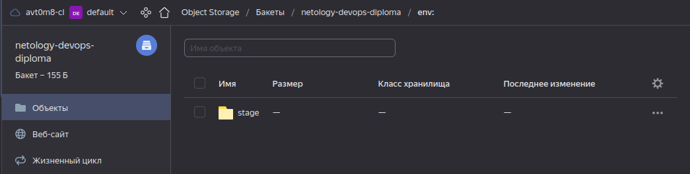

##### Созданные ВМ.

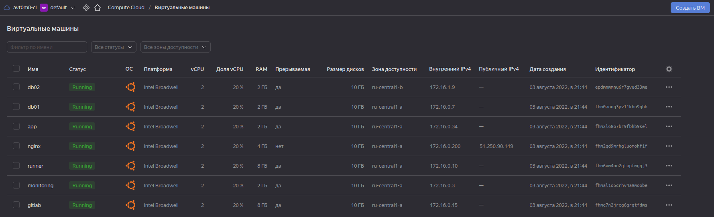

##### DNS A-записи настроены на внешний адрес reverse-proxy сервера nginx.


</details>

<details>
  <summary>3. Установка Nginx и LetsEncrypt</summary>

* Устанавливается ansible-role `nginx`:

```shell
$ tree nginx
nginx
├── defaults
│   └── main.yml
├── handlers
│   └── main.yml
├── tasks
│   ├── certbot.yml
│   ├── cert.yml
│   ├── conf.yml
│   └── main.yml
├── templates
│   ├── nginx.conf
│   ├── nginx_default.conf
│   └── nginx_vhosts.conf
└── vars
    └── main.yml

5 directories, 10 files
```

</details>

<details>
  <summary>4. Установка кластера MySQL</summary>

* Устанавливается ansible-role `mysql`:

```shell
$ tree mysql
mysql
├── defaults
│   └── main.yml
├── handlers
│   └── main.yml
├── tasks
│   ├── main.yml
│   └── replication.yml
└── templates
    ├── master.cnf
    └── slave.cnf

4 directories, 6 files
```

</details>

<details>
  <summary>5. Установка WordPress</summary>

* Устанавливается ansible-role `wordpress`:

```shell
$ tree wordpress
wordpress
├── defaults
│   └── main.yml
├── handlers
│   └── main.yml
├── tasks
│   └── main.yml
└── templates
    ├── nginx.conf
    ├── nginx_default.conf
    └── wp-config.php.j2

4 directories, 6 files
```

* После установки зайдем по адресу `https://avt0m8.ru/`:

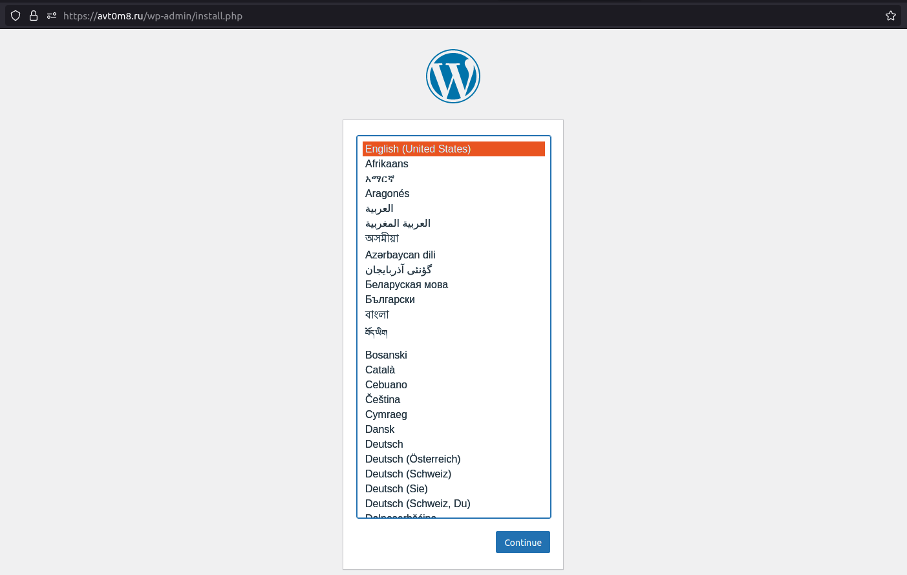

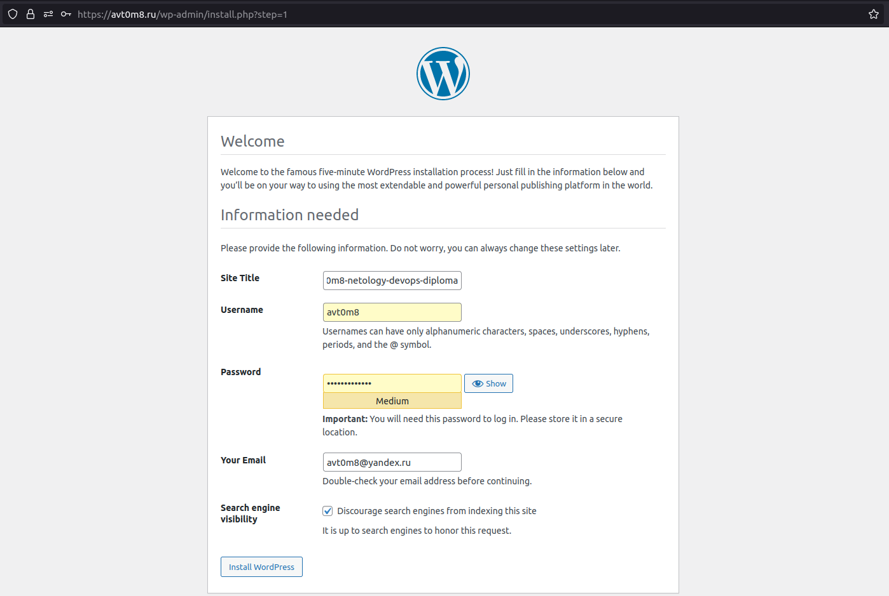

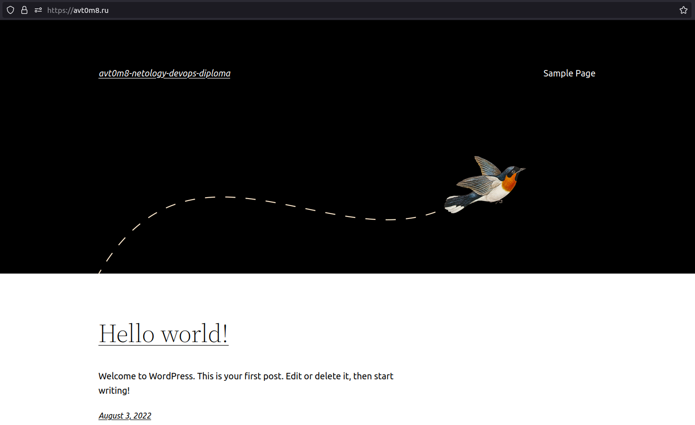

</details>

<details>
  <summary>6. Установка Gitlab CE и Gitlab Runner</summary>

* Gitlab CE устанавливается ansible-role `gitlab`:

```shell
$ tree gitlab
gitlab
├── defaults
│   └── main.yml
├── handlers
│   └── main.yml
└── tasks
    └── main.yml

3 directories, 3 files
```

* После установки зайдем по адресу `https://gitlab.avt0m8.ru/`.

- Войдем под учетной записью `root`, пароль в переменной `gitlab_rails['initial_root_password']` в файле `./ansible/roles/gitlab/tasks/main.yml`:

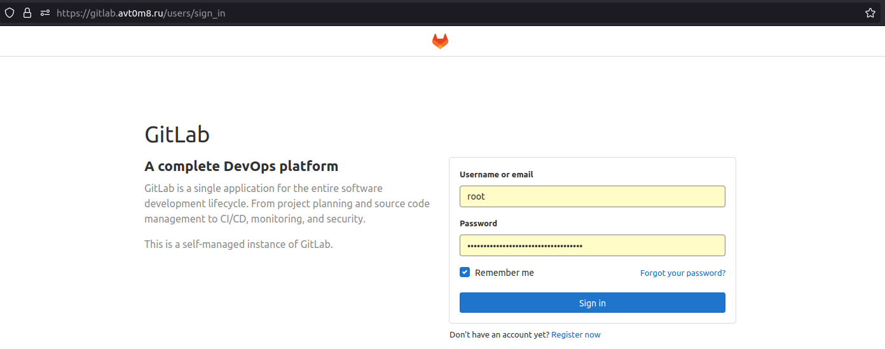

- Создадим новый проект `netology-wp`:

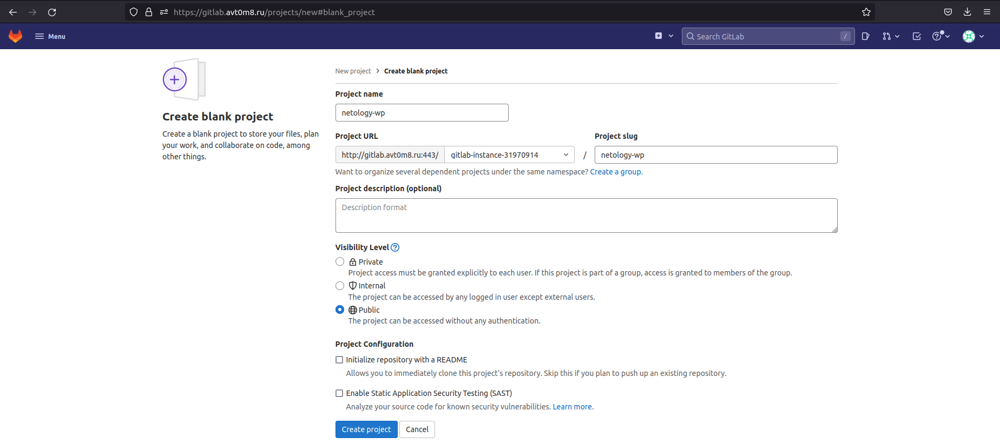

- Добавим в него файлы из директории `./netology-wp`:

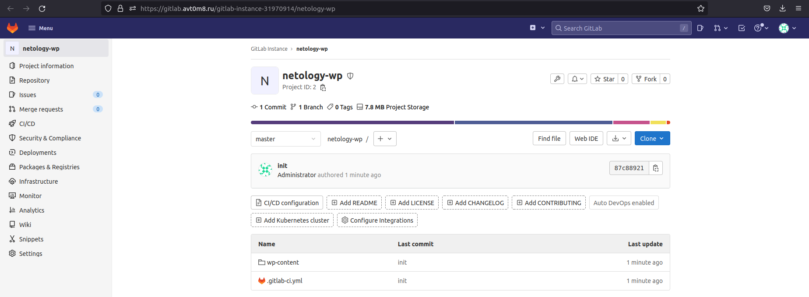

* Gitlab Runner устанавливается ansible-role `ansible-gitlab-runner`:

- Запускается отдельно, после разворачивания инфраструктуры командой: `ansible-playbook ./ansible/runner.yml -i ./ansible/inventory.yml -l run`.
- Перед запуском необходимо вписать переменную `gitlab_runner_registration_token` в файле `./ansible/roles/ansible-gitlab-runner/defaults/main.yml` (взять в gui gitlab в настройках CI/CD проекта).
- Также в gui gitlab в настройках CI/CD проекта нужно добавить переменную ssh-key (для доступа `runner` к серверу с `wordpress`).

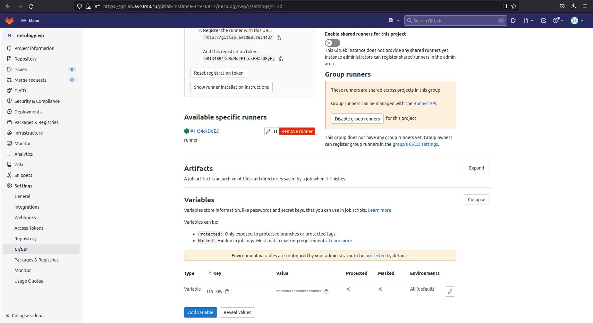

```shell
$ tree ansible-gitlab-runner
ansible-gitlab-runner
├── defaults
│   └── main.yml
├── handlers
│   └── main.yml
├── LICENSE
├── meta
│   └── main.yml
├── README.md
├── tasks
│   ├── config-runner-container.yml
│   ├── config-runners-container.yml
│   ├── config-runners-windows.yml
│   ├── config-runners.yml
│   ├── config-runner-windows.yml
│   ├── config-runner.yml
│   ├── Container.yml
│   ├── global-setup-windows.yml
│   ├── global-setup.yml
│   ├── install-arch.yml
│   ├── install-container.yml
│   ├── install-debian.yml
│   ├── install-macos.yml
│   ├── install-redhat.yml
│   ├── install-windows.yml
│   ├── line-config-runner-windows.yml
│   ├── line-config-runner.yml
│   ├── main.yml
│   ├── register-runner-container.yml
│   ├── register-runner-windows.yml
│   ├── register-runner.yml
│   ├── section-config-runner-windows.yml
│   ├── section-config-runner.yml
│   ├── systemd-reload.yml
│   ├── Unix.yml
│   ├── update-config-runner-windows.yml
│   ├── update-config-runner.yml
│   └── Windows.yml
├── tests
│   ├── files
│   │   └── mock_gitlab_runner_ci.py
│   ├── inventory
│   ├── test.yml
│   ├── travis-bootstrap-ansible.ps1
│   └── vars
│       ├── default.yml
│       └── Windows.yml
└── vars
    ├── Archlinux.yml
    ├── Darwin.yml
    ├── Debian.yml
    ├── default.yml
    ├── main.yml
    ├── RedHat.yml
    └── Windows.yml

8 directories, 46 files
```

</details>

<details>
  <summary>7. Установка Prometheus, Alert Manager, Node Exporter и Grafana</summary>

* Gitlab Runner устанавливается ansible-role `monitoring`:

```shell
$ tree monitoring
monitoring
├── defaults
│   └── main.yml
├── handlers
│   └── main.yml
├── tasks
│   ├── alertmanager.yml
│   ├── dashboards.yml
│   ├── grafana.yml
│   ├── main.yml
│   └── prometheus.yml
├── templates
│   ├── alertmanager.systemd.j2
│   ├── alertmanager.yml.j2
│   ├── alert.rules.j2
│   ├── prometheus.service.j2
│   └── prometheus.yml.j2
└── vars
    └── main.yml

5 directories, 13 files
```

* Создан `pipeline`, который осуществляет `deploy` при создании тега (например, v1.0.0) в репозиторий с WordPress:

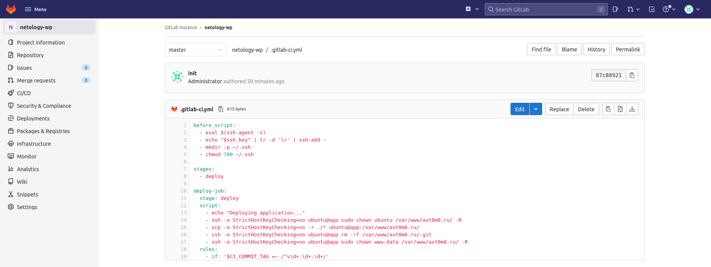

* Сделаем `commit` в репозитории `wordpress`. (`deploy` только по `commit` не происходит):

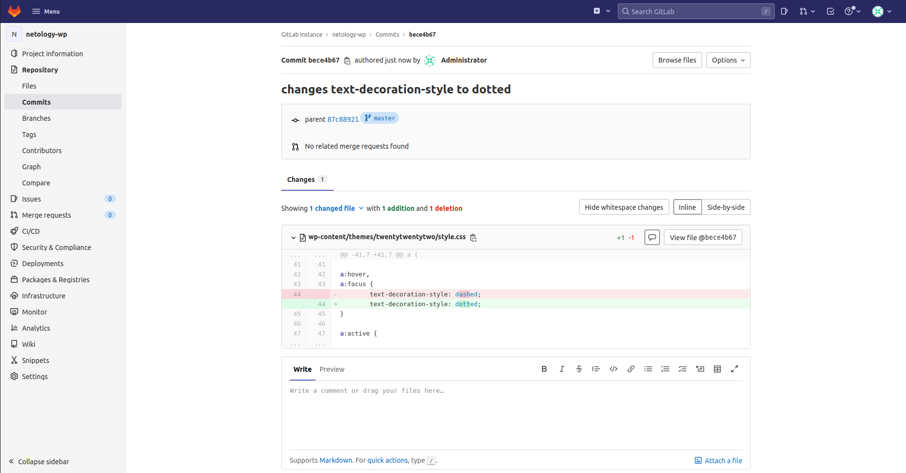

* Сделаем еще один `commit` в репозитории `wordpress`:

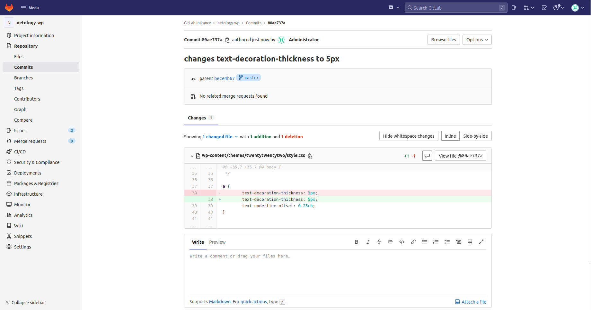

* Сделаем `tag` в репозитории `wordpress`:

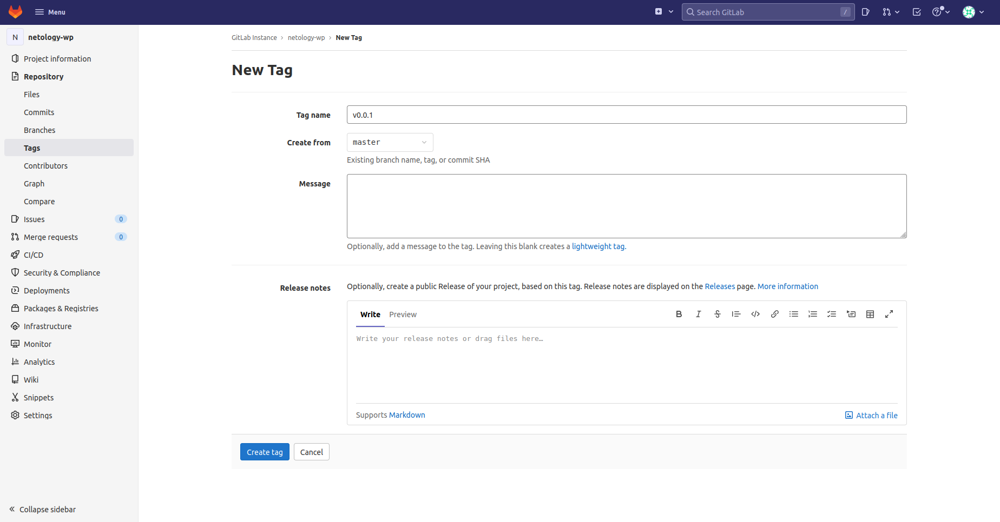

* Убедимся, что `deploy-job` успешно выполнилась при добавлении `tag` (по второму `commit`):

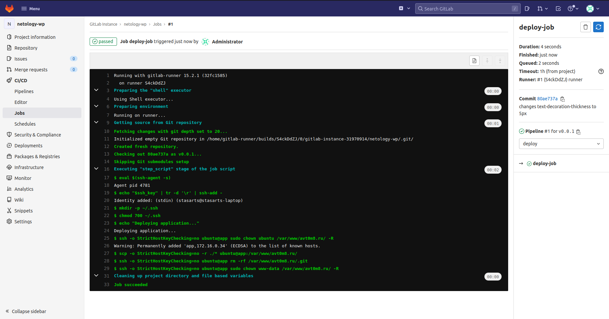

* Убедимся, что изменения на `https://www.avt0m8.ru` применились:

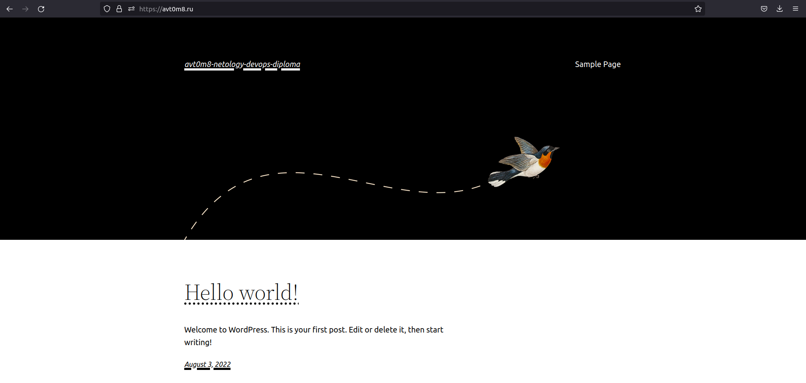

</details>

<details>
  <summary>Необходимое для сдачи задания</summary>

1,2 [Репозиторий со всеми Terraform манифестами и со всеми Ansible ролями.](https://github.com/stasarts/netology-DevOps-diploma)

3 Скриншоты веб-интерфейсов всех сервисов работающих по HTTPS на доменном имени `avt0m8.ru`

* `https://www.avt0m8.ru (WordPress)`:


* `https://gitlab.avt0m8.ru  (Gitlab)`:


* `https://grafana.avt0m8.ru  (Grafana)`:

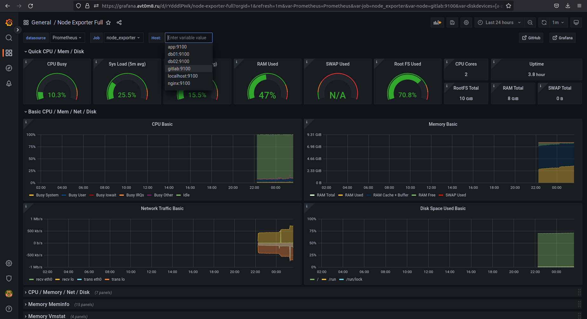

* `https://prometheus.avt0m8.ru  (Prometheus)`:

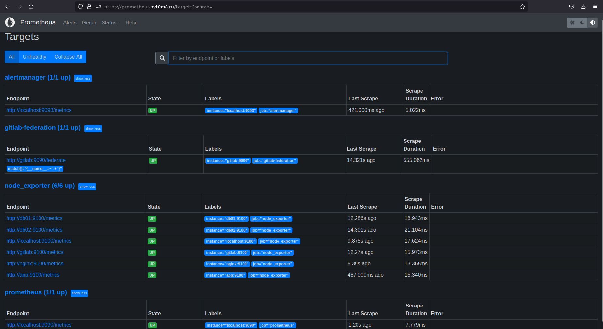

* `https://alertmanager.avt0m8.ru  (Alert Manager)`:

- Остановим одну из ВМ:

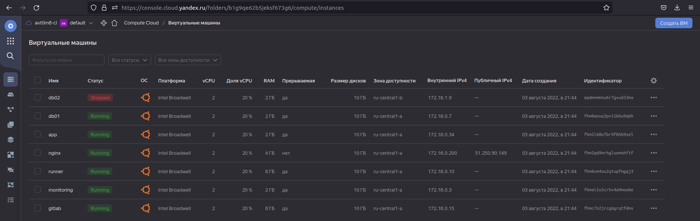

- Убедимся, что сработал `alert`:

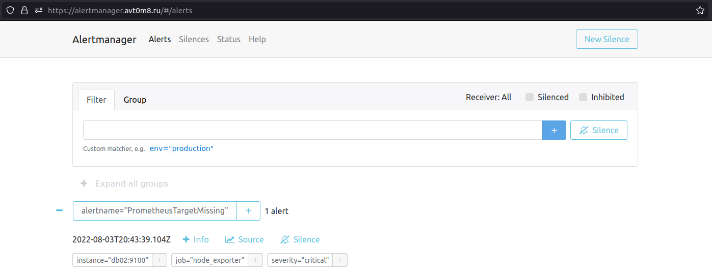

</details>

</details>

---