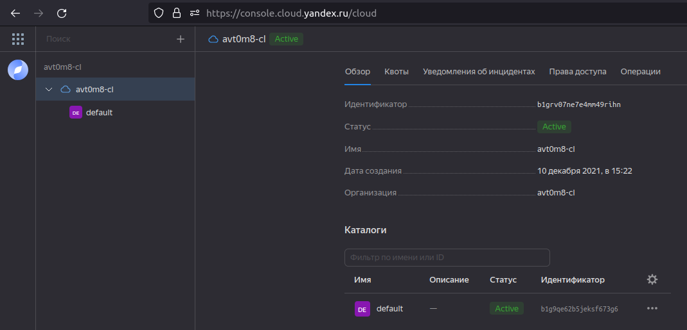
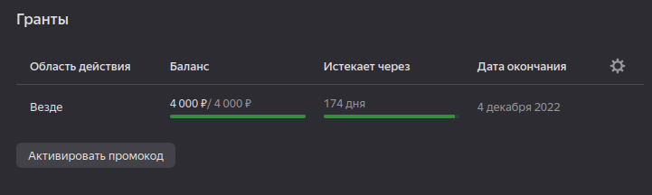
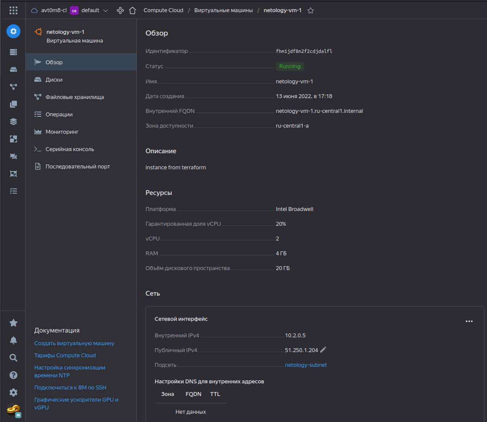
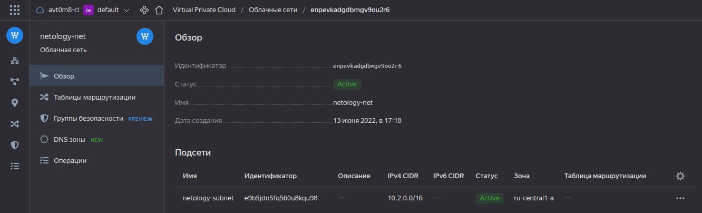

# Домашнее задание к занятию "7.2. Облачные провайдеры и синтаксис Terraform."

<details>
  <summary>Задание</summary>

Зачастую разбираться в новых инструментах гораздо интересней понимая то, как они работают изнутри. 
Поэтому в рамках первого *необязательного* задания предлагается завести свою учетную запись в AWS (Amazon Web Services) или Yandex.Cloud.
Идеально будет познакомится с обоими облаками, потому что они отличаются. 

## Задача 1 (вариант с AWS). Регистрация в aws и знакомство с основами (необязательно, но крайне желательно).

Остальные задания можно будет выполнять и без этого аккаунта, но с ним можно будет увидеть полный цикл процессов. 

AWS предоставляет достаточно много бесплатных ресурсов в первый год после регистрации, подробно описано [здесь](https://aws.amazon.com/free/).
1. Создайте аккаут aws.
1. Установите c aws-cli https://aws.amazon.com/cli/.
1. Выполните первичную настройку aws-sli https://docs.aws.amazon.com/cli/latest/userguide/cli-configure-quickstart.html.
1. Создайте IAM политику для терраформа c правами
    * AmazonEC2FullAccess
    * AmazonS3FullAccess
    * AmazonDynamoDBFullAccess
    * AmazonRDSFullAccess
    * CloudWatchFullAccess
    * IAMFullAccess
1. Добавьте переменные окружения 
    ```
    export AWS_ACCESS_KEY_ID=(your access key id)
    export AWS_SECRET_ACCESS_KEY=(your secret access key)
    ```
1. Создайте, остановите и удалите ec2 инстанс (любой с пометкой `free tier`) через веб интерфейс. 

В виде результата задания приложите вывод команды `aws configure list`.

## Задача 1 (Вариант с Yandex.Cloud). Регистрация в ЯО и знакомство с основами (необязательно, но крайне желательно).

1. Подробная инструкция на русском языке содержится [здесь](https://cloud.yandex.ru/docs/solutions/infrastructure-management/terraform-quickstart).
2. Обратите внимание на период бесплатного использования после регистрации аккаунта. 
3. Используйте раздел "Подготовьте облако к работе" для регистрации аккаунта. Далее раздел "Настройте провайдер" для подготовки
базового терраформ конфига.
4. Воспользуйтесь [инструкцией](https://registry.terraform.io/providers/yandex-cloud/yandex/latest/docs) на сайте терраформа, что бы 
не указывать авторизационный токен в коде, а терраформ провайдер брал его из переменных окружений.

## Задача 2. Создание aws ec2 или yandex_compute_instance через терраформ. 

1. В каталоге `terraform` вашего основного репозитория, который был создан в начале курсе, создайте файл `main.tf` и `versions.tf`.
2. Зарегистрируйте провайдер 
   1. для [aws](https://registry.terraform.io/providers/hashicorp/aws/latest/docs). В файл `main.tf` добавьте
   блок `provider`, а в `versions.tf` блок `terraform` с вложенным блоком `required_providers`. Укажите любой выбранный вами регион 
   внутри блока `provider`.
   2. либо для [yandex.cloud](https://registry.terraform.io/providers/yandex-cloud/yandex/latest/docs). Подробную инструкцию можно найти 
   [здесь](https://cloud.yandex.ru/docs/solutions/infrastructure-management/terraform-quickstart).
3. Внимание! В гит репозиторий нельзя пушить ваши личные ключи доступа к аккаунту. Поэтому в предыдущем задании мы указывали
их в виде переменных окружения. 
4. В файле `main.tf` воспользуйтесь блоком `data "aws_ami` для поиска ami образа последнего Ubuntu.  
5. В файле `main.tf` создайте рессурс 
   1. либо [ec2 instance](https://registry.terraform.io/providers/hashicorp/aws/latest/docs/resources/instance).
   Постарайтесь указать как можно больше параметров для его определения. Минимальный набор параметров указан в первом блоке 
   `Example Usage`, но желательно, указать большее количество параметров.
   2. либо [yandex_compute_image](https://registry.terraform.io/providers/yandex-cloud/yandex/latest/docs/resources/compute_image).
6. Также в случае использования aws:
   1. Добавьте data-блоки `aws_caller_identity` и `aws_region`.
   2. В файл `outputs.tf` поместить блоки `output` с данными об используемых в данный момент: 
       * AWS account ID,
       * AWS user ID,
       * AWS регион, который используется в данный момент, 
       * Приватный IP ec2 инстансы,
       * Идентификатор подсети в которой создан инстанс.  
7. Если вы выполнили первый пункт, то добейтесь того, что бы команда `terraform plan` выполнялась без ошибок. 


В качестве результата задания предоставьте:
1. Ответ на вопрос: при помощи какого инструмента (из разобранных на прошлом занятии) можно создать свой образ ami?
1. Ссылку на репозиторий с исходной конфигурацией терраформа.  

</details>

<details>
  <summary>Ответ</summary>

## Задача 1 (Вариант с Yandex.Cloud). Регистрация в ЯО и знакомство с основами (необязательно, но крайне желательно).

1. Подробная инструкция на русском языке содержится [здесь](https://cloud.yandex.ru/docs/solutions/infrastructure-management/terraform-quickstart).
<p align="center">
  
</p>

2. Период бесплатного использования после регистрации аккаунта. 
<p align="center">
  
</p>

3. Используем раздел "Подготовьте облако к работе" для регистрации аккаунта. Далее раздел "Настройте провайдер" для подготовки базового терраформ конфига.

<details>
  <summary>Установим terraform:</summary>

```shell
~$ curl -fsSL https://apt.releases.hashicorp.com/gpg | sudo apt-key add -
OK

~$ sudo apt-add-repository "deb [arch=amd64] https://apt.releases.hashicorp.com $(lsb_release -cs) main"
Hit:1 http://apt.postgresql.org/pub/repos/apt focal-pgdg InRelease
Hit:2 http://ru.archive.ubuntu.com/ubuntu focal InRelease                                                                                                                                                
Hit:3 http://security.ubuntu.com/ubuntu focal-security InRelease                                                                                                                                         
Hit:4 http://dl.google.com/linux/chrome/deb stable InRelease                                                    
Hit:5 https://apt.releases.hashicorp.com focal InRelease                                  
Hit:6 http://ppa.launchpad.net/eivnaes/network-manager-sstp/ubuntu focal InRelease
Hit:7 https://download.docker.com/linux/ubuntu focal InRelease
Reading package lists... Done

~$ sudo apt-get update && sudo apt-get install terraform
Hit:1 http://dl.google.com/linux/chrome/deb stable InRelease
Hit:2 http://apt.postgresql.org/pub/repos/apt focal-pgdg InRelease
Hit:3 http://ppa.launchpad.net/eivnaes/network-manager-sstp/ubuntu focal InRelease                                                                   
Hit:4 http://ru.archive.ubuntu.com/ubuntu focal InRelease                                                                                            
Hit:5 http://security.ubuntu.com/ubuntu focal-security InRelease                          
Hit:6 https://download.docker.com/linux/ubuntu focal InRelease      
Hit:7 https://apt.releases.hashicorp.com focal InRelease
Reading package lists... Done
Reading package lists... Done
Building dependency tree       
Reading state information... Done
The following packages were automatically installed and are no longer required:
  libpython2-dev libpython2.7 libpython2.7-dev python2-dev python2.7-dev python3-argcomplete python3-jinja2 python3-jmespath python3-kerberos python3-libcloud python3-netaddr python3-ntlm-auth
  python3-requests-kerberos python3-requests-ntlm python3-selinux python3-winrm python3-xmltodict
Use 'sudo apt autoremove' to remove them.
The following NEW packages will be installed:
  terraform
0 upgraded, 1 newly installed, 0 to remove and 0 not upgraded.
Need to get 19,9 MB of archives.
After this operation, 62,9 MB of additional disk space will be used.
Get:1 https://apt.releases.hashicorp.com focal/main amd64 terraform amd64 1.2.2 [19,9 MB]
Fetched 19,9 MB in 2min 19s (143 kB/s)                                                                                                                                                                   
Selecting previously unselected package terraform.
(Reading database ... 297158 files and directories currently installed.)
Preparing to unpack .../terraform_1.2.2_amd64.deb ...
Unpacking terraform (1.2.2) ...
Setting up terraform (1.2.2) ...

~$ terraform --version
Terraform v1.2.2
on linux_amd64
```

</details>

<details>
  <summary>Подготовим облако:</summary>

* Создадим директорию для конфигурации `yandex-cloud-terraform`, поместим в нее конфигурационный файл `main.tf`, в начало добавим следующие строки:
```shell
# Provider
provider "yandex" {
  token     = var.yc_token
  cloud_id  = var.yc_cloud_id
  folder_id = yc_folder_id
  zone      = var.yc_region
}
```

* Также поместим в директорию с конфигурацией файл `vars.tf` с переменными для провайдера:
```shell
variable "yc_token" {
   default = ""
}

variable "yc_cloud_id" {
  default = ""
}

variable "yc_folder_id" {
  default = ""
}

variable "yc_region" {
  default = "ru-central1-a"
}
```

* Откроем файл конфигурации Terraform CLI `nano ~/.terraformrc` и добавим следующие строки:
```shell
provider_installation {
  network_mirror {
    url = "https://terraform-mirror.yandexcloud.net/"
    include = ["registry.terraform.io/*/*"]
  }
  direct {
    exclude = ["registry.terraform.io/*/*"]
  }
}
```

</details>

4. Воспользуемся [инструкцией](https://registry.terraform.io/providers/yandex-cloud/yandex/latest/docs) на сайте терраформа, что бы не указывать авторизационный токен в коде, а терраформ провайдер брал его из переменных окружений.

* Реинициализируем yc:
```shell
~/terraform/yandex-cloud-terraform$ yc init
Welcome! This command will take you through the configuration process.
Pick desired action:
 [1] Re-initialize this profile 'default' with new settings 
 [2] Create a new profile
Please enter your numeric choice: 1
Please go to https://oauth.yandex.ru/authorize?response_type=token&client_id=1a6990aa636648e9b2ef855fa7bec2fb in order to obtain OAuth token.

Please enter OAuth token: [AQAAAABZl*********************BJPynu-aI] AQAAAABZl*********************BJPynu-aI
You have one cloud available: 'avt0m8-cl' (id = b1grv07ne7e4mm49rihn). It is going to be used by default.
Please choose folder to use:
 [1] default (id = b1g9qe62b5jeksf673g6)
 [2] Create a new folder
Please enter your numeric choice: 1
Your current folder has been set to 'default' (id = b1g9qe62b5jeksf673g6).
Do you want to configure a default Compute zone? [Y/n] Y
Which zone do you want to use as a profile default?
 [1] ru-central1-a
 [2] ru-central1-b
 [3] ru-central1-c
 [4] Don't set default zone
Please enter your numeric choice: 1
Your profile default Compute zone has been set to 'ru-central1-a'.
```

* Получим необходимые для авторизации в yc параметры, и укажем их в `vars.tf`.
```shell
~/terraform/yandex-cloud-terraform$ yc config profile get default
token: AQAAAABZl*********************BJPynu-aI
cloud-id: b1grv07ne7e4mm49rihn
folder-id: b1g9qe62b5jeksf673g6
compute-default-zone: ru-central1-a
```

* Для того, чтобы не указывать авторизационный токен в коде, а терраформ провайдер брал его из переменных окружения, передадим его в переменную окружения `YC_TOKEN`:
```shell
~/terraform/yandex-cloud-terraform$ export YC_TOKEN=AQAAAABZl*********************BJPynu-aI
```

## Задача 2. Создание yandex_compute_instance через terraform.

1. Создадим файл `main.tf` и `versions.tf`.
* `main.tf` создан в ходе выполнения "Задача 1".
* `versions.tf`:
```shell
terraform {
  required_providers {
    yandex = {
      source  = "yandex-cloud/yandex"
      version = "0.75.0"
    }
  }
}
```

2. Зарегистрируем провайдер для [yandex.cloud](https://registry.terraform.io/providers/yandex-cloud/yandex/latest/docs). Подробную инструкцию можно найти [здесь](https://cloud.yandex.ru/docs/solutions/infrastructure-management/terraform-quickstart).
3. Внимание! В гит репозиторий нельзя пушить личные ключи доступа к аккаунту. Поэтому в предыдущем задании мы указали их в виде переменных окружения.

`2-3 Сделано в ходе выполнения "Задача 1"`

4. В файле `main.tf` создадим ресурс [yandex_compute_image](https://registry.terraform.io/providers/yandex-cloud/yandex/latest/docs/resources/compute_image).
* Поместим ресурс в отдельный файл:

<details>
  <summary>`instance.tf`</summary>

```shell
variable network_name { default =  "netology-net" }
variable subnet_name { default =  "netology-subnet" }

variable image { default =  "ubuntu-2004-lts" }
variable name { default = "netology-vm"}

variable instance_count { default = 1 }
variable count_format { default = "%01d" } #server number format (-1, -2, etc.)
variable count_offset { default = 0 } #start numbering from X+1 (e.g. name-1 if '0', name-3 if '2', etc.)
variable platform_id { default = "standard-v1"}
variable description { default =  "instance from terraform" }
variable zone { default =  "" }
variable folder_id { default =  "" }

variable cores { default = "2"}
variable memory { default = "4"}
variable core_fraction { default = "20"}

variable boot_disk { default =  "network-hdd" }
variable disk_size { default =  "20" }

variable subnet_id { default = ""}
variable nat { default = "true"}
variable ipv6 { default = "false"}

variable users { default = "ubuntu"}


resource "yandex_vpc_network" "net" {
  name = var.network_name
}

resource "yandex_vpc_subnet" "subnet" {
  name           = var.subnet_name
  network_id     = resource.yandex_vpc_network.net.id
  v4_cidr_blocks = ["10.2.0.0/16"]
  zone           = var.zone
}

data "yandex_compute_image" "image" {
  family = var.image
}

resource "yandex_compute_instance" "netology-vm" {
  count = var.instance_count
  name = "${var.name}-${format(var.count_format, var.count_offset+count.index+1)}"
  platform_id = var.platform_id
  hostname = "${var.name}-${format(var.count_format, var.count_offset+count.index+1)}"
  description = var.description
  zone = var.zone
  folder_id = var.folder_id

  resources {
    cores  = var.cores
    memory = var.memory
    core_fraction = var.core_fraction
  }
  boot_disk {
    initialize_params {
      image_id = data.yandex_compute_image.image.id
      type = var.boot_disk
      size = var.disk_size
    }
  }
  network_interface {
    subnet_id = resource.yandex_vpc_subnet.subnet.id
    nat       = var.nat
    ipv6      = var.ipv6
  }

  metadata = {
    ssh-keys = "${var.users}:${file("~/.ssh/id_rsa.pub")}"
  }
}
```

</details>

5. Добьемся того, что бы команда `terraform plan` выполнялась без ошибок. 
* Инициализируем terraform:
```shell
~/terraform/yandex-cloud-terraform$ terraform init

Initializing the backend...

Initializing provider plugins...
- Finding yandex-cloud/yandex versions matching "0.75.0"...
- Installing yandex-cloud/yandex v0.75.0...
- Installed yandex-cloud/yandex v0.75.0 (unauthenticated)

Terraform has created a lock file .terraform.lock.hcl to record the provider
selections it made above. Include this file in your version control repository
so that Terraform can guarantee to make the same selections by default when
you run "terraform init" in the future.

Terraform has been successfully initialized!

You may now begin working with Terraform. Try running "terraform plan" to see
any changes that are required for your infrastructure. All Terraform commands
should now work.

If you ever set or change modules or backend configuration for Terraform,
rerun this command to reinitialize your working directory. If you forget, other
commands will detect it and remind you to do so if necessary.
```

* Выполним проверку конфигурации:
```shell
~/terraform/yandex-cloud-terraform$ terraform validate
Success! The configuration is valid.
```

* Выполним планирование изменений:

<details>
  <summary>`terraform plan`</summary>

```shell
~/terraform/yandex-cloud-terraform$ terraform plan
data.yandex_compute_image.image: Reading...
data.yandex_compute_image.image: Read complete after 2s [id=fd8mn5e1cksb3s1pcq12]

Terraform used the selected providers to generate the following execution plan. Resource actions are indicated with the following symbols:
  + create

Terraform will perform the following actions:

  # yandex_compute_instance.netology-vm[0] will be created
  + resource "yandex_compute_instance" "netology-vm" {
      + created_at                = (known after apply)
      + description               = "instance from terraform"
      + folder_id                 = (known after apply)
      + fqdn                      = (known after apply)
      + hostname                  = "netology-vm-1"
      + id                        = (known after apply)
      + metadata                  = {
          + "ssh-keys" = <<-EOT
                ubuntu:ssh-rsa AAAA*****= stasarts@stasarts
            EOT
        }
      + name                      = "netology-vm-1"
      + network_acceleration_type = "standard"
      + platform_id               = "standard-v1"
      + service_account_id        = (known after apply)
      + status                    = (known after apply)
      + zone                      = (known after apply)

      + boot_disk {
          + auto_delete = true
          + device_name = (known after apply)
          + disk_id     = (known after apply)
          + mode        = (known after apply)

          + initialize_params {
              + block_size  = (known after apply)
              + description = (known after apply)
              + image_id    = "fd8mn5e1cksb3s1pcq12"
              + name        = (known after apply)
              + size        = 20
              + snapshot_id = (known after apply)
              + type        = "network-hdd"
            }
        }

      + network_interface {
          + index              = (known after apply)
          + ip_address         = (known after apply)
          + ipv4               = true
          + ipv6               = false
          + ipv6_address       = (known after apply)
          + mac_address        = (known after apply)
          + nat                = true
          + nat_ip_address     = (known after apply)
          + nat_ip_version     = (known after apply)
          + security_group_ids = (known after apply)
          + subnet_id          = (known after apply)
        }

      + placement_policy {
          + host_affinity_rules = (known after apply)
          + placement_group_id  = (known after apply)
        }

      + resources {
          + core_fraction = 20
          + cores         = 2
          + memory        = 4
        }

      + scheduling_policy {
          + preemptible = (known after apply)
        }
    }

  # yandex_vpc_network.net will be created
  + resource "yandex_vpc_network" "net" {
      + created_at                = (known after apply)
      + default_security_group_id = (known after apply)
      + folder_id                 = (known after apply)
      + id                        = (known after apply)
      + labels                    = (known after apply)
      + name                      = "netology-net"
      + subnet_ids                = (known after apply)
    }

  # yandex_vpc_subnet.subnet will be created
  + resource "yandex_vpc_subnet" "subnet" {
      + created_at     = (known after apply)
      + folder_id      = (known after apply)
      + id             = (known after apply)
      + labels         = (known after apply)
      + name           = "netology-subnet"
      + network_id     = (known after apply)
      + v4_cidr_blocks = [
          + "10.2.0.0/16",
        ]
      + v6_cidr_blocks = (known after apply)
      + zone           = (known after apply)
    }

Plan: 3 to add, 0 to change, 0 to destroy.

─────────────────────────────────────────────────────────────────────────────────────────────────────────────────────────────────────────────────────────────────────────────────────────────────────────

Note: You didn't use the -out option to save this plan, so Terraform can't guarantee to take exactly these actions if you run "terraform apply" now.

```

</details>

* Применим изменения:

<details>
  <summary>`terraform apply`</summary>

```shell
~/terraform/yandex-cloud-terraform$ terraform apply
data.yandex_compute_image.image: Reading...
data.yandex_compute_image.image: Read complete after 3s [id=fd8mn5e1cksb3s1pcq12]

Terraform used the selected providers to generate the following execution plan. Resource actions are indicated with the following symbols:
  + create

Terraform will perform the following actions:

  # yandex_compute_instance.netology-vm[0] will be created
  + resource "yandex_compute_instance" "netology-vm" {
      + created_at                = (known after apply)
      + description               = "instance from terraform"
      + folder_id                 = (known after apply)
      + fqdn                      = (known after apply)
      + hostname                  = "netology-vm-1"
      + id                        = (known after apply)
      + metadata                  = {
          + "ssh-keys" = <<-EOT
                ubuntu:ssh-rsa AAAA*****= stasarts@stasarts
            EOT
        }
      + name                      = "netology-vm-1"
      + network_acceleration_type = "standard"
      + platform_id               = "standard-v1"
      + service_account_id        = (known after apply)
      + status                    = (known after apply)
      + zone                      = (known after apply)

      + boot_disk {
          + auto_delete = true
          + device_name = (known after apply)
          + disk_id     = (known after apply)
          + mode        = (known after apply)

          + initialize_params {
              + block_size  = (known after apply)
              + description = (known after apply)
              + image_id    = "fd8mn5e1cksb3s1pcq12"
              + name        = (known after apply)
              + size        = 20
              + snapshot_id = (known after apply)
              + type        = "network-hdd"
            }
        }

      + network_interface {
          + index              = (known after apply)
          + ip_address         = (known after apply)
          + ipv4               = true
          + ipv6               = false
          + ipv6_address       = (known after apply)
          + mac_address        = (known after apply)
          + nat                = true
          + nat_ip_address     = (known after apply)
          + nat_ip_version     = (known after apply)
          + security_group_ids = (known after apply)
          + subnet_id          = (known after apply)
        }

      + placement_policy {
          + host_affinity_rules = (known after apply)
          + placement_group_id  = (known after apply)
        }

      + resources {
          + core_fraction = 20
          + cores         = 2
          + memory        = 4
        }

      + scheduling_policy {
          + preemptible = (known after apply)
        }
    }

  # yandex_vpc_network.net will be created
  + resource "yandex_vpc_network" "net" {
      + created_at                = (known after apply)
      + default_security_group_id = (known after apply)
      + folder_id                 = (known after apply)
      + id                        = (known after apply)
      + labels                    = (known after apply)
      + name                      = "netology-net"
      + subnet_ids                = (known after apply)
    }

  # yandex_vpc_subnet.subnet will be created
  + resource "yandex_vpc_subnet" "subnet" {
      + created_at     = (known after apply)
      + folder_id      = (known after apply)
      + id             = (known after apply)
      + labels         = (known after apply)
      + name           = "netology-subnet"
      + network_id     = (known after apply)
      + v4_cidr_blocks = [
          + "10.2.0.0/16",
        ]
      + v6_cidr_blocks = (known after apply)
      + zone           = (known after apply)
    }

Plan: 3 to add, 0 to change, 0 to destroy.

Do you want to perform these actions?
  Terraform will perform the actions described above.
  Only 'yes' will be accepted to approve.

  Enter a value: yes

yandex_vpc_network.net: Creating...
yandex_vpc_network.net: Creation complete after 3s [id=enpevkadgdbmgv9ou2r6]
yandex_vpc_subnet.subnet: Creating...
yandex_vpc_subnet.subnet: Creation complete after 2s [id=e9b5jdn5fq560u8kqu98]
yandex_compute_instance.netology-vm[0]: Creating...
yandex_compute_instance.netology-vm[0]: Still creating... [10s elapsed]
yandex_compute_instance.netology-vm[0]: Still creating... [20s elapsed]
yandex_compute_instance.netology-vm[0]: Creation complete after 25s [id=fhm1jdf8n2f2cdjdalfl]

Apply complete! Resources: 3 added, 0 changed, 0 destroyed.

```

</details>

* Зайдем в ЯО и убедимся, что ВМ, сеть и подсеть созданы согласно конфигурации.

<p align="center">
  
</p>

<p align="center">
  
</p>

* Подключимся к созданной машине по `ssh` с авторизацией по ключу:

```shell
~/terraform/yandex-cloud-terraform$ ssh ubuntu@51.250.1.204
The authenticity of host '51.250.1.204 (51.250.1.204)' can't be established.
ECDSA key fingerprint is SHA256:et66hjUPU6skPWQ4bmG3R91/I+tl8Yk3RHVZiKZqyX0.
Are you sure you want to continue connecting (yes/no/[fingerprint])? yes
Warning: Permanently added '51.250.1.204' (ECDSA) to the list of known hosts.
Welcome to Ubuntu 20.04.4 LTS (GNU/Linux 5.4.0-117-generic x86_64)

 * Documentation:  https://help.ubuntu.com
 * Management:     https://landscape.canonical.com
 * Support:        https://ubuntu.com/advantage

The programs included with the Ubuntu system are free software;
the exact distribution terms for each program are described in the
individual files in /usr/share/doc/*/copyright.

Ubuntu comes with ABSOLUTELY NO WARRANTY, to the extent permitted by
applicable law.

To run a command as administrator (user "root"), use "sudo <command>".
See "man sudo_root" for details.

ubuntu@netology-vm-1:~$ ll
total 28
drwxr-xr-x 4 ubuntu ubuntu 4096 Jun 13 12:19 ./
drwxr-xr-x 3 root   root   4096 Jun 13 12:19 ../
-rw-r--r-- 1 ubuntu ubuntu  220 Feb 25  2020 .bash_logout
-rw-r--r-- 1 ubuntu ubuntu 3771 Feb 25  2020 .bashrc
drwx------ 2 ubuntu ubuntu 4096 Jun 13 12:19 .cache/
-rw-r--r-- 1 ubuntu ubuntu  807 Feb 25  2020 .profile
drwx------ 2 ubuntu ubuntu 4096 Jun 13 12:19 .ssh/
```

* Освободим ресурсы в ЯО:

<details>
  <summary>`terraform destroy`</summary>

```shell
~/terraform/yandex-cloud-terraform$ terraform destroy
data.yandex_compute_image.image: Reading...
yandex_vpc_network.net: Refreshing state... [id=enpevkadgdbmgv9ou2r6]
data.yandex_compute_image.image: Read complete after 3s [id=fd8mn5e1cksb3s1pcq12]
yandex_vpc_subnet.subnet: Refreshing state... [id=e9b5jdn5fq560u8kqu98]
yandex_compute_instance.netology-vm[0]: Refreshing state... [id=fhm1jdf8n2f2cdjdalfl]

Terraform used the selected providers to generate the following execution plan. Resource actions are indicated with the following symbols:
  - destroy

Terraform will perform the following actions:

  # yandex_compute_instance.netology-vm[0] will be destroyed
  - resource "yandex_compute_instance" "netology-vm" {
      - created_at                = "2022-06-13T12:18:22Z" -> null
      - description               = "instance from terraform" -> null
      - folder_id                 = "b1g9qe62b5jeksf673g6" -> null
      - fqdn                      = "netology-vm-1.ru-central1.internal" -> null
      - hostname                  = "netology-vm-1" -> null
      - id                        = "fhm1jdf8n2f2cdjdalfl" -> null
      - labels                    = {} -> null
      - metadata                  = {
          - "ssh-keys" = <<-EOT
                ubuntu:ssh-rsa AAAA*****= stasarts@stasarts
            EOT
        } -> null
      - name                      = "netology-vm-1" -> null
      - network_acceleration_type = "standard" -> null
      - platform_id               = "standard-v1" -> null
      - status                    = "running" -> null
      - zone                      = "ru-central1-a" -> null

      - boot_disk {
          - auto_delete = true -> null
          - device_name = "fhmiiidloqahkaj76s0s" -> null
          - disk_id     = "fhmiiidloqahkaj76s0s" -> null
          - mode        = "READ_WRITE" -> null

          - initialize_params {
              - block_size = 4096 -> null
              - image_id   = "fd8mn5e1cksb3s1pcq12" -> null
              - size       = 20 -> null
              - type       = "network-hdd" -> null
            }
        }

      - network_interface {
          - index              = 0 -> null
          - ip_address         = "10.2.0.5" -> null
          - ipv4               = true -> null
          - ipv6               = false -> null
          - mac_address        = "d0:0d:19:b5:e8:b8" -> null
          - nat                = true -> null
          - nat_ip_address     = "51.250.1.204" -> null
          - nat_ip_version     = "IPV4" -> null
          - security_group_ids = [] -> null
          - subnet_id          = "e9b5jdn5fq560u8kqu98" -> null
        }

      - placement_policy {
          - host_affinity_rules = [] -> null
        }

      - resources {
          - core_fraction = 20 -> null
          - cores         = 2 -> null
          - gpus          = 0 -> null
          - memory        = 4 -> null
        }

      - scheduling_policy {
          - preemptible = false -> null
        }
    }

  # yandex_vpc_network.net will be destroyed
  - resource "yandex_vpc_network" "net" {
      - created_at = "2022-06-13T12:18:19Z" -> null
      - folder_id  = "b1g9qe62b5jeksf673g6" -> null
      - id         = "enpevkadgdbmgv9ou2r6" -> null
      - labels     = {} -> null
      - name       = "netology-net" -> null
      - subnet_ids = [
          - "e9b5jdn5fq560u8kqu98",
        ] -> null
    }

  # yandex_vpc_subnet.subnet will be destroyed
  - resource "yandex_vpc_subnet" "subnet" {
      - created_at     = "2022-06-13T12:18:20Z" -> null
      - folder_id      = "b1g9qe62b5jeksf673g6" -> null
      - id             = "e9b5jdn5fq560u8kqu98" -> null
      - labels         = {} -> null
      - name           = "netology-subnet" -> null
      - network_id     = "enpevkadgdbmgv9ou2r6" -> null
      - v4_cidr_blocks = [
          - "10.2.0.0/16",
        ] -> null
      - v6_cidr_blocks = [] -> null
      - zone           = "ru-central1-a" -> null
    }

Plan: 0 to add, 0 to change, 3 to destroy.

Do you really want to destroy all resources?
  Terraform will destroy all your managed infrastructure, as shown above.
  There is no undo. Only 'yes' will be accepted to confirm.

  Enter a value: yes

yandex_compute_instance.netology-vm[0]: Destroying... [id=fhm1jdf8n2f2cdjdalfl]
yandex_compute_instance.netology-vm[0]: Still destroying... [id=fhm1jdf8n2f2cdjdalfl, 10s elapsed]
yandex_compute_instance.netology-vm[0]: Still destroying... [id=fhm1jdf8n2f2cdjdalfl, 20s elapsed]
yandex_compute_instance.netology-vm[0]: Destruction complete after 24s
yandex_vpc_subnet.subnet: Destroying... [id=e9b5jdn5fq560u8kqu98]
yandex_vpc_subnet.subnet: Destruction complete after 5s
yandex_vpc_network.net: Destroying... [id=enpevkadgdbmgv9ou2r6]
yandex_vpc_network.net: Destruction complete after 1s

Destroy complete! Resources: 3 destroyed.
```

</details>

## Результаты выполнения задания:

1. При помощи какого инструмента можно создать свой образ ami?

[`Packer`](https://www.packer.io/)

2. [Ссылка на репозиторий с исходной конфигурацией terraform.](https://github.com/stasarts/example-terraform-yc)

</details>

---