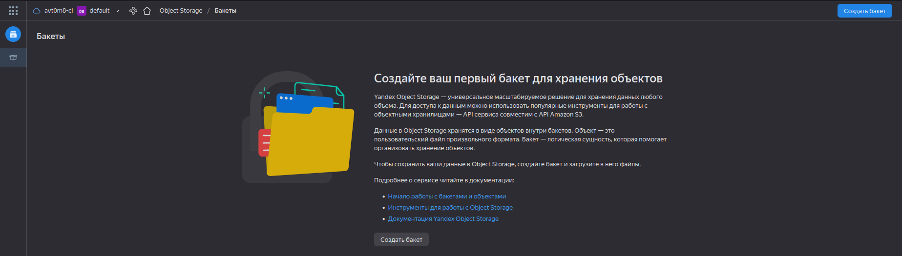
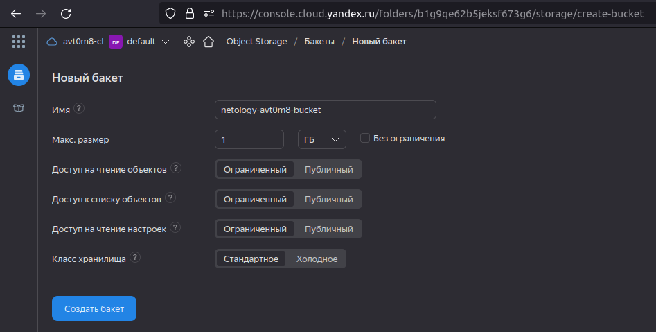
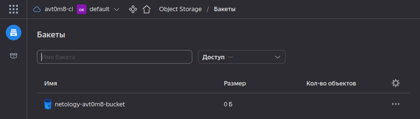
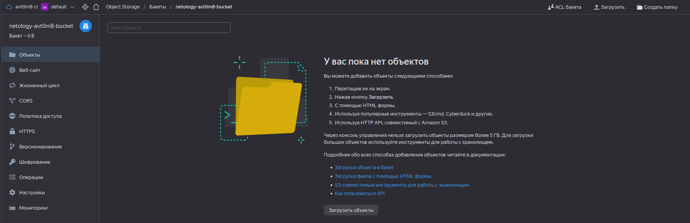
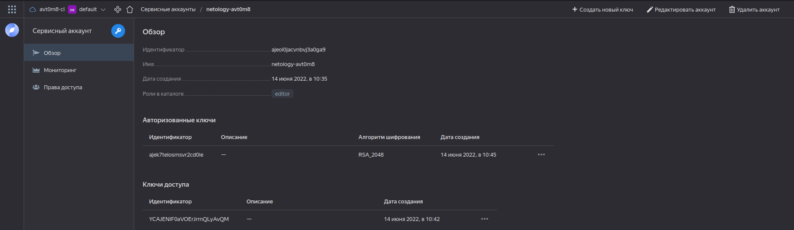
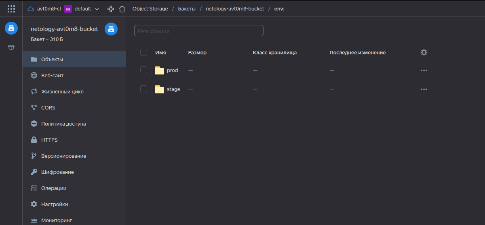
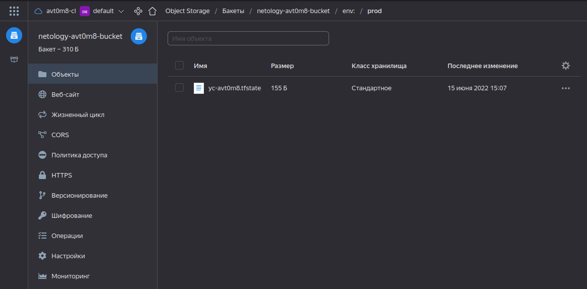

# Домашнее задание к занятию "7.3. Основы и принцип работы Терраформ"

<details>
  <summary>Задание</summary>

## Задача 1. Создадим бэкэнд в S3 (необязательно, но крайне желательно).

Если в рамках предыдущего задания у вас уже есть аккаунт AWS, то давайте продолжим знакомство со взаимодействием
терраформа и aws. 

1. Создайте s3 бакет, iam роль и пользователя от которого будет работать терраформ. Можно создать отдельного пользователя,
а можно использовать созданного в рамках предыдущего задания, просто добавьте ему необходимы права, как описано 
[здесь](https://www.terraform.io/docs/backends/types/s3.html).
2. Зарегистрируйте бэкэнд в терраформ проекте как описано по ссылке выше. 


## Задача 2. Инициализируем проект и создаем воркспейсы. 

1. Выполните `terraform init`:
    * если был создан бэкэнд в S3, то терраформ создат файл стейтов в S3 и запись в таблице 
dynamodb.
    * иначе будет создан локальный файл со стейтами.  
1. Создайте два воркспейса `stage` и `prod`.
1. В уже созданный `aws_instance` добавьте зависимость типа инстанса от вокспейса, что бы в разных ворскспейсах 
использовались разные `instance_type`.
1. Добавим `count`. Для `stage` должен создаться один экземпляр `ec2`, а для `prod` два. 
1. Создайте рядом еще один `aws_instance`, но теперь определите их количество при помощи `for_each`, а не `count`.
1. Что бы при изменении типа инстанса не возникло ситуации, когда не будет ни одного инстанса добавьте параметр
жизненного цикла `create_before_destroy = true` в один из рессурсов `aws_instance`.
1. При желании поэкспериментируйте с другими параметрами и рессурсами.

В виде результата работы пришлите:
* Вывод команды `terraform workspace list`.
* Вывод команды `terraform plan` для воркспейса `prod`.  

</details>

<details>
  <summary>Ответ</summary>

## Задача 1. Создадим бэкэнд в Object Storage YC.

В рамках предыдущего ДЗ уже есть аккаунт `YC`, продолжим знакомство со взаимодействием `terraform` и `YC`. 

#### 1. Создадим `Object Storage` бакет, `iam` роль и пользователя от которого будет работать `terraform`.

<details>
  <summary>Создадим бакет в ЯО</summary>

<p align="center">
  
</p>

<p align="center">
  
</p>

<p align="center">
  
</p>

<p align="center">
  
</p>

</details>


<details>
  <summary>Создадим servcice-account</summary>

* Создадим сервисный аккаунт:
```shell
~/terraform/yandex-cloud-terraform$ yc iam service-account create --name netology-avt0m8
id: ajeoi0jacvnbvj3a0ga9
folder_id: b1g9qe62b5jeksf673g6
created_at: "2022-06-14T05:35:53.270090759Z"
name: netology-avt0m8
```

* Назначим сервисному аккаунту роль `editor`:
```shell
~/terraform/yandex-cloud-terraform$ yc resource-manager folder add-access-binding b1g9qe62b5jeksf673g6 \
>   --role editor \
>   --subject serviceAccount:ajeoi0jacvnbvj3a0ga9
done (1s)
```

* Создадим статический ключ доступа для сервисного аккаунта:
```shell
~/terraform/yandex-cloud-terraform$ yc iam access-key create --service-account-name netology-avt0m8
access_key:
  id: ajed2te1nana8trp41d8
  service_account_id: ajeoi0jacvnbvj3a0ga9
  created_at: "2022-06-14T05:42:04.703831570Z"
  key_id: <key_id>
secret: <secret>
```

* Создадим авторизованные ключи для сервисного аккаунта:
```shell
~/terraform/yandex-cloud-terraform$ yc iam key create --service-account-name netology-avt0m8 --output key.json
id: ajek7teiosmsvr2cd0ie
service_account_id: ajeoi0jacvnbvj3a0ga9
created_at: "2022-06-14T05:45:51.464161161Z"
key_algorithm: RSA_2048
```

* Создадим профиль и назначим ему авторизованные ключи сервисного аккаунта:
```shell
~/terraform/yandex-cloud-terraform$ yc config profile create netology-avt0m8
Profile 'netology-avt0m8' created and activated

~/terraform/yandex-cloud-terraform$ yc config set service-account-key key.json
```

* Убедимся, что сервисный аккаунт и все ключи созданы и привязаны.
<p align="center">
  
</p>

</details>


#### 2. Зарегистрируем бэкэнд в терраформ проекте как описано по [ссылке](https://cloud.yandex.ru/docs/tutorials/infrastructure-management/terraform-state-storage). 
* Добавим файл `s3.tf`.
```terraform
terraform {
  backend "s3" {
    endpoint   = "storage.yandexcloud.net"
    bucket     = "netology-avt0m8-bucket"
    region     = "ru-central1"
    key        = "yc-avt0m8.tfstate"
    access_key = <access_key>
    secret_key = <secret_key>

    skip_region_validation      = true
    skip_credentials_validation = true
  }
}
```

## Задача 2. Инициализируем проект и создадим воркспейсы. 

#### 1. Выполним `terraform init`.

* если был создан бэкэнд в S3, то терраформ создат файл состояния в S3.

```shell
~/terraform/yc-terra-workspaces$ terraform init
Initializing modules...
- yc_instance_count in modules/instance
- yc_instance_for_each in modules/instance

Initializing the backend...

Successfully configured the backend "s3"! Terraform will automatically
use this backend unless the backend configuration changes.

Initializing provider plugins...
- Finding yandex-cloud/yandex versions matching "0.75.0"...
- Installing yandex-cloud/yandex v0.75.0...
- Installed yandex-cloud/yandex v0.75.0 (unauthenticated)

Terraform has created a lock file .terraform.lock.hcl to record the provider
selections it made above. Include this file in your version control repository
so that Terraform can guarantee to make the same selections by default when
you run "terraform init" in the future.

Terraform has been successfully initialized!

You may now begin working with Terraform. Try running "terraform plan" to see
any changes that are required for your infrastructure. All Terraform commands
should now work.

If you ever set or change modules or backend configuration for Terraform,
rerun this command to reinitialize your working directory. If you forget, other
commands will detect it and remind you to do so if necessary.

```

#### 2. Создадим два воркспейса `stage` и `prod`.

```shell
~/terraform/yc-terra-workspaces$ terraform workspace new stage
Created and switched to workspace "stage"!

Youre now on a new, empty workspace. Workspaces isolate their state,
so if you run "terraform plan" Terraform will not see any existing state
for this configuration.

~/terraform/yc-terra-workspaces$ terraform workspace new prod
Created and switched to workspace "prod"!

Youre now on a new, empty workspace. Workspaces isolate their state,
so if you run "terraform plan" Terraform will not see any existing state
for this configuration.

~/terraform/yc-terra-workspaces$ terraform workspace select stage
Switched to workspace "stage".

~/terraform/yc-terra-workspaces$ terraform validate
Success! The configuration is valid.

~/terraform/yandex-cloud-terraform$ terraform workspace list
  default
  prod
* stage

```

#### 3. В уже созданный `main.tf` добавим зависимость инстанса от вокспейса, что бы в разных ворскспейсах использовались разные параметры для инстанса.
```terraform
module "yc_instance_count" {
  source = "./modules/instance/"
  instance_count = local.yc_instance_count[terraform.workspace]
  cores         = local.yc_cores[terraform.workspace]
  memory        = local.yc_memory[terraform.workspace]
  core_fraction = local.yc_core_fraction[terraform.workspace]
  disk_size     = local.yc_disk_size[terraform.workspace]
  subnet_id     = resource.yandex_vpc_subnet.subnet.id
  description   = "instance depends on workspace by count"
}
```

#### 4. Добавим `count` (и другие параметры). Для `stage` должен создаться один экземпляр `yc_compute_instance`, а для `prod` два. 
```terraform
locals {
  yc_instance_count = {
    stage = 1
    prod  = 2
  }
  yc_cores = {
    stage = 2
    prod  = 4
  }
  yc_memory = {
    stage = 4
    prod  = 8
  }
  yc_core_fraction = {
    stage = 20
    prod  = 100
  }
  yc_disk_size = {
    stage = 20
    prod  = 40
  }
}
```

#### 5. Создадим рядом еще один `yc_compute_instance`, но теперь определим их количество при помощи `for_each`, а не `count`.

* `main.tf`:
```terraform
module "yc_instance_for_each" {
  source        = "./modules/instance/"
  for_each      = local.for_each_map[terraform.workspace]
  name          = "${each.key}-netology-vm-foreach"
  cores         = local.yc_cores[terraform.workspace]
  memory        = local.yc_memory[terraform.workspace]
  core_fraction = local.yc_core_fraction[terraform.workspace]
  disk_size     = local.yc_disk_size[terraform.workspace]
  subnet_id     = resource.yandex_vpc_subnet.subnet.id
  description   = "instance depends on workspace by for_each"
}
```
```terraform
locals {
  for_each_map = {
    stage = toset(["s1"])
    prod  = toset(["p1", "p2"])
  }
  network_names = {
    stage = "stage-netology-network"
    prod  = "prod-netology-network"
  }
  subnet_names = {
    stage = "stage-netology-subnet"
    prod  = "prod-netology"
  }
}
```

#### 6. Что бы при изменении типа инстанса не возникло ситуации, когда не будет ни одного инстанса добавим параметр жизненного цикла `create_before_destroy = true` в один из ресурсов `yc_compute_instance`.

`OK`

</details>

<details>
  <summary>Результат</summary>

* [Ссылка на репозиторий с конфигурацией.](https://github.com/stasarts/example-terraform-yc-ws)

* Вывод команды `terraform workspace list`:
```shell
~/terraform/yc-terra-workspaces$ terraform workspace list
  default
* prod
  stage
```

* Вывод команды `terraform plan` для воркспейса `prod`:

<details>
  <summary>terraform plan</summary>

```shell
~/terraform/yc-terra-workspaces$ terraform plan
module.yc_instance_for_each["p1"].data.yandex_compute_image.image: Reading...
module.yc_instance_count.data.yandex_compute_image.image: Reading...
module.yc_instance_for_each["p2"].data.yandex_compute_image.image: Reading...
module.yc_instance_for_each["p1"].data.yandex_compute_image.image: Read complete after 3s [id=fd8mn5e1cksb3s1pcq12]
module.yc_instance_for_each["p2"].data.yandex_compute_image.image: Read complete after 3s [id=fd8mn5e1cksb3s1pcq12]
module.yc_instance_count.data.yandex_compute_image.image: Read complete after 3s [id=fd8mn5e1cksb3s1pcq12]

Terraform used the selected providers to generate the following execution plan. Resource actions are indicated with the following symbols:
  + create

Terraform will perform the following actions:

  # yandex_vpc_network.net will be created
  + resource "yandex_vpc_network" "net" {
      + created_at                = (known after apply)
      + default_security_group_id = (known after apply)
      + folder_id                 = (known after apply)
      + id                        = (known after apply)
      + labels                    = (known after apply)
      + name                      = "prod-netology-network"
      + subnet_ids                = (known after apply)
    }

  # yandex_vpc_subnet.subnet will be created
  + resource "yandex_vpc_subnet" "subnet" {
      + created_at     = (known after apply)
      + folder_id      = (known after apply)
      + id             = (known after apply)
      + labels         = (known after apply)
      + name           = "prod-netology"
      + network_id     = (known after apply)
      + v4_cidr_blocks = [
          + "10.3.0.0/16",
        ]
      + v6_cidr_blocks = (known after apply)
      + zone           = "ru-central1-a"
    }

  # module.yc_instance_count.yandex_compute_instance.instance[0] will be created
  + resource "yandex_compute_instance" "instance" {
      + created_at                = (known after apply)
      + description               = "instance depends on workspace by count"
      + folder_id                 = (known after apply)
      + fqdn                      = (known after apply)
      + hostname                  = "netology-vm-count-1"
      + id                        = (known after apply)
      + metadata                  = {
          + "ssh-keys" = <<-EOT
                ubuntu:ssh-rsa AAAAB*****UipZk= stasarts@stasarts
            EOT
        }
      + name                      = "prod-1-netology-vm-count"
      + network_acceleration_type = "standard"
      + platform_id               = "standard-v1"
      + service_account_id        = (known after apply)
      + status                    = (known after apply)
      + zone                      = (known after apply)

      + boot_disk {
          + auto_delete = true
          + device_name = (known after apply)
          + disk_id     = (known after apply)
          + mode        = (known after apply)

          + initialize_params {
              + block_size  = (known after apply)
              + description = (known after apply)
              + image_id    = "fd8mn5e1cksb3s1pcq12"
              + name        = (known after apply)
              + size        = 40
              + snapshot_id = (known after apply)
              + type        = "network-hdd"
            }
        }

      + network_interface {
          + index              = (known after apply)
          + ip_address         = (known after apply)
          + ipv4               = true
          + ipv6               = false
          + ipv6_address       = (known after apply)
          + mac_address        = (known after apply)
          + nat                = true
          + nat_ip_address     = (known after apply)
          + nat_ip_version     = (known after apply)
          + security_group_ids = (known after apply)
          + subnet_id          = (known after apply)
        }

      + placement_policy {
          + host_affinity_rules = (known after apply)
          + placement_group_id  = (known after apply)
        }

      + resources {
          + core_fraction = 100
          + cores         = 4
          + memory        = 8
        }

      + scheduling_policy {
          + preemptible = (known after apply)
        }
    }

  # module.yc_instance_count.yandex_compute_instance.instance[1] will be created
  + resource "yandex_compute_instance" "instance" {
      + created_at                = (known after apply)
      + description               = "instance depends on workspace by count"
      + folder_id                 = (known after apply)
      + fqdn                      = (known after apply)
      + hostname                  = "netology-vm-count-2"
      + id                        = (known after apply)
      + metadata                  = {
          + "ssh-keys" = <<-EOT
                ubuntu:ssh-rsa AAAAB*****UipZk= stasarts@stasarts            
            EOT
        }
      + name                      = "prod-2-netology-vm-count"
      + network_acceleration_type = "standard"
      + platform_id               = "standard-v1"
      + service_account_id        = (known after apply)
      + status                    = (known after apply)
      + zone                      = (known after apply)

      + boot_disk {
          + auto_delete = true
          + device_name = (known after apply)
          + disk_id     = (known after apply)
          + mode        = (known after apply)

          + initialize_params {
              + block_size  = (known after apply)
              + description = (known after apply)
              + image_id    = "fd8mn5e1cksb3s1pcq12"
              + name        = (known after apply)
              + size        = 40
              + snapshot_id = (known after apply)
              + type        = "network-hdd"
            }
        }

      + network_interface {
          + index              = (known after apply)
          + ip_address         = (known after apply)
          + ipv4               = true
          + ipv6               = false
          + ipv6_address       = (known after apply)
          + mac_address        = (known after apply)
          + nat                = true
          + nat_ip_address     = (known after apply)
          + nat_ip_version     = (known after apply)
          + security_group_ids = (known after apply)
          + subnet_id          = (known after apply)
        }

      + placement_policy {
          + host_affinity_rules = (known after apply)
          + placement_group_id  = (known after apply)
        }

      + resources {
          + core_fraction = 100
          + cores         = 4
          + memory        = 8
        }

      + scheduling_policy {
          + preemptible = (known after apply)
        }
    }

  # module.yc_instance_for_each["p1"].yandex_compute_instance.instance[0] will be created
  + resource "yandex_compute_instance" "instance" {
      + created_at                = (known after apply)
      + description               = "instance depends on workspace by for_each"
      + folder_id                 = (known after apply)
      + fqdn                      = (known after apply)
      + hostname                  = "p1-netology-vm-foreach-1"
      + id                        = (known after apply)
      + metadata                  = {
          + "ssh-keys" = <<-EOT
                ubuntu:ssh-rsa AAAAB*****UipZk= stasarts@stasarts            
            EOT
        }
      + name                      = "prod-1-p1-netology-vm-foreach"
      + network_acceleration_type = "standard"
      + platform_id               = "standard-v1"
      + service_account_id        = (known after apply)
      + status                    = (known after apply)
      + zone                      = (known after apply)

      + boot_disk {
          + auto_delete = true
          + device_name = (known after apply)
          + disk_id     = (known after apply)
          + mode        = (known after apply)

          + initialize_params {
              + block_size  = (known after apply)
              + description = (known after apply)
              + image_id    = "fd8mn5e1cksb3s1pcq12"
              + name        = (known after apply)
              + size        = 40
              + snapshot_id = (known after apply)
              + type        = "network-hdd"
            }
        }

      + network_interface {
          + index              = (known after apply)
          + ip_address         = (known after apply)
          + ipv4               = true
          + ipv6               = false
          + ipv6_address       = (known after apply)
          + mac_address        = (known after apply)
          + nat                = true
          + nat_ip_address     = (known after apply)
          + nat_ip_version     = (known after apply)
          + security_group_ids = (known after apply)
          + subnet_id          = (known after apply)
        }

      + placement_policy {
          + host_affinity_rules = (known after apply)
          + placement_group_id  = (known after apply)
        }

      + resources {
          + core_fraction = 100
          + cores         = 4
          + memory        = 8
        }

      + scheduling_policy {
          + preemptible = (known after apply)
        }
    }

  # module.yc_instance_for_each["p2"].yandex_compute_instance.instance[0] will be created
  + resource "yandex_compute_instance" "instance" {
      + created_at                = (known after apply)
      + description               = "instance depends on workspace by for_each"
      + folder_id                 = (known after apply)
      + fqdn                      = (known after apply)
      + hostname                  = "p2-netology-vm-foreach-1"
      + id                        = (known after apply)
      + metadata                  = {
          + "ssh-keys" = <<-EOT
                ubuntu:ssh-rsa AAAAB*****UipZk= stasarts@stasarts
            EOT
        }
      + name                      = "prod-1-p2-netology-vm-foreach"
      + network_acceleration_type = "standard"
      + platform_id               = "standard-v1"
      + service_account_id        = (known after apply)
      + status                    = (known after apply)
      + zone                      = (known after apply)

      + boot_disk {
          + auto_delete = true
          + device_name = (known after apply)
          + disk_id     = (known after apply)
          + mode        = (known after apply)

          + initialize_params {
              + block_size  = (known after apply)
              + description = (known after apply)
              + image_id    = "fd8mn5e1cksb3s1pcq12"
              + name        = (known after apply)
              + size        = 40
              + snapshot_id = (known after apply)
              + type        = "network-hdd"
            }
        }

      + network_interface {
          + index              = (known after apply)
          + ip_address         = (known after apply)
          + ipv4               = true
          + ipv6               = false
          + ipv6_address       = (known after apply)
          + mac_address        = (known after apply)
          + nat                = true
          + nat_ip_address     = (known after apply)
          + nat_ip_version     = (known after apply)
          + security_group_ids = (known after apply)
          + subnet_id          = (known after apply)
        }

      + placement_policy {
          + host_affinity_rules = (known after apply)
          + placement_group_id  = (known after apply)
        }

      + resources {
          + core_fraction = 100
          + cores         = 4
          + memory        = 8
        }

      + scheduling_policy {
          + preemptible = (known after apply)
        }
    }

Plan: 6 to add, 0 to change, 0 to destroy.

─────────────────────────────────────────────────────────────────────────────────────────────────────────────────────────────────────────────────────────────────────────────────────────────────────────

Note: You didn't use the -out option to save this plan, so Terraform can't guarantee to take exactly these actions if you run "terraform apply" now.
```

</details> 


* Состояние облака в результате применения `terraform apply` для `stage` и `prod`:

`Object Storage`:
<p align="center">
  
</p>

<p align="center">
  
</p>

`Compute Cloud`
<p align="center">
  
</p>

</details> 

---