# Домашнее задание к занятию "7.4. Средства командной работы над инфраструктурой."

  
Задание

## Задача 1. Настроить terraform cloud (необязательно, но крайне желательно).

В это задании предлагается познакомиться со средством командой работы над инфраструктурой предоставляемым
разработчиками терраформа. 

1. Зарегистрируйтесь на [https://app.terraform.io/](https://app.terraform.io/).
(регистрация бесплатная и не требует использования платежных инструментов).
1. Создайте в своем github аккаунте (или другом хранилище репозиториев) отдельный репозиторий с
 конфигурационными файлами прошлых занятий (или воспользуйтесь любым простым конфигом).
1. Зарегистрируйте этот репозиторий в [https://app.terraform.io/](https://app.terraform.io/).
1. Выполните plan и apply. 

В качестве результата задания приложите снимок экрана с успешным применением конфигурации.

## Задача 2. Написать серверный конфиг для атлантиса. 

Смысл задания – познакомиться с документацией 
о [серверной](https://www.runatlantis.io/docs/server-side-repo-config.html) конфигурации и конфигурации уровня 
 [репозитория](https://www.runatlantis.io/docs/repo-level-atlantis-yaml.html).

Создай `server.yaml` который скажет атлантису:
1. Укажите, что атлантис должен работать только для репозиториев в вашем github (или любом другом) аккаунте.
1. На стороне клиентского конфига разрешите изменять `workflow`, то есть для каждого репозитория можно 
будет указать свои дополнительные команды. 
1. В `workflow` используемом по-умолчанию сделайте так, что бы во время планирования не происходил `lock` состояния.

Создай `atlantis.yaml` который, если поместить в корень terraform проекта, скажет атлантису:
1. Надо запускать планирование и аплай для двух воркспейсов `stage` и `prod`.
1. Необходимо включить автопланирование при изменении любых файлов `*.tf`.

В качестве результата приложите ссылку на файлы `server.yaml` и `atlantis.yaml`.

## Задача 3. Знакомство с каталогом модулей. 

1. В [каталоге модулей](https://registry.terraform.io/browse/modules) найдите официальный модуль от aws для создания
`ec2` инстансов. 
2. Изучите как устроен модуль. Задумайтесь, будете ли в своем проекте использовать этот модуль или непосредственно 
ресурс `aws_instance` без помощи модуля?
3. В рамках предпоследнего задания был создан ec2 при помощи ресурса `aws_instance`. 
Создайте аналогичный инстанс при помощи найденного модуля.   

В качестве результата задания приложите ссылку на созданный блок конфигураций. 

  
Ответ

## Задача 1. Настроить terraform cloud.

В этом задании предлагается познакомиться со средством командой работы над инфраструктурой предоставляемым
разработчиками терраформа. 

#### 1. Зарегистрируемся на [https://app.terraform.io/](https://app.terraform.io/).

  
Скриншот

  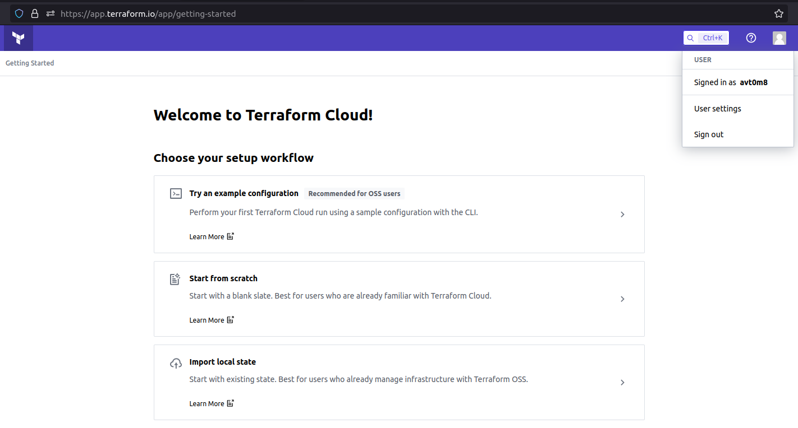

#### 2. Создадим в github [отдельный репозиторий](https://github.com/stasarts/example-terraform-teamwork) с конфигурацией.

#### 3. Зарегистрируем этот репозиторий в [https://app.terraform.io/](https://app.terraform.io/).

  
Скриншоты

  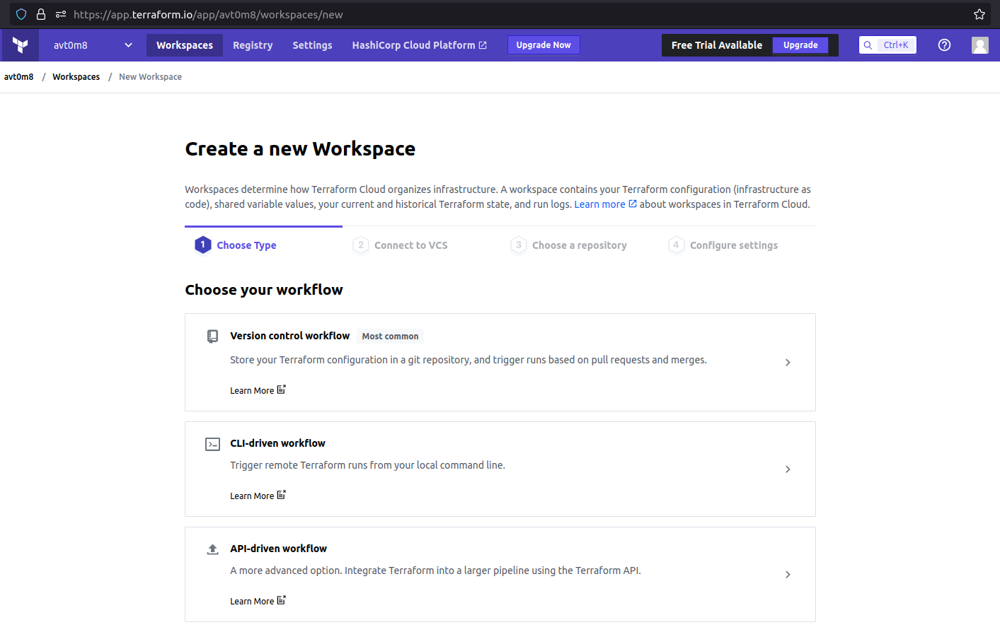

  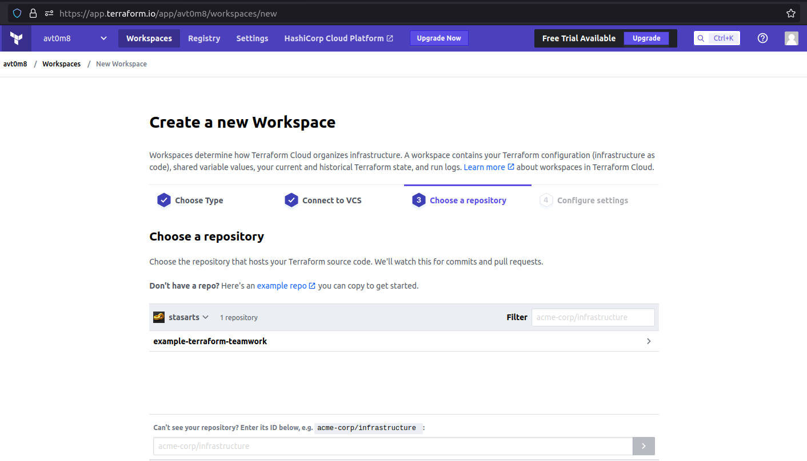

  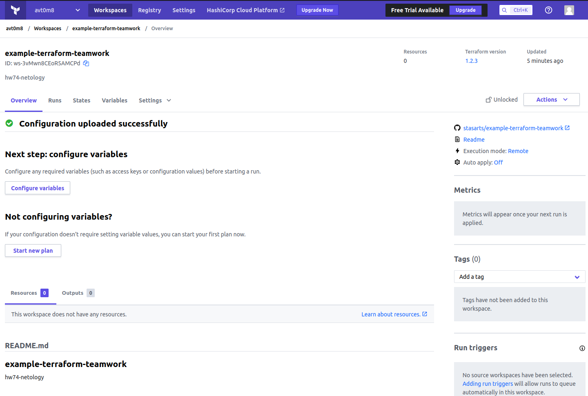

#### 4. Выполним plan и apply. 

  
Скриншоты

* Добавим `sensitive` переменную `yc_token`.

  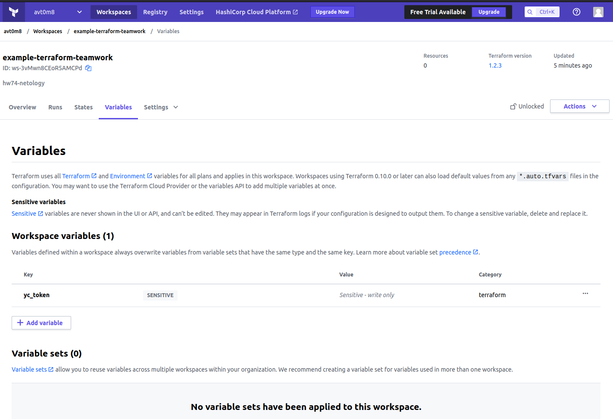

* Первый запуск `plan` не прошел, т.к. в репозитории не было ssh ключа, хранящегося локально.

  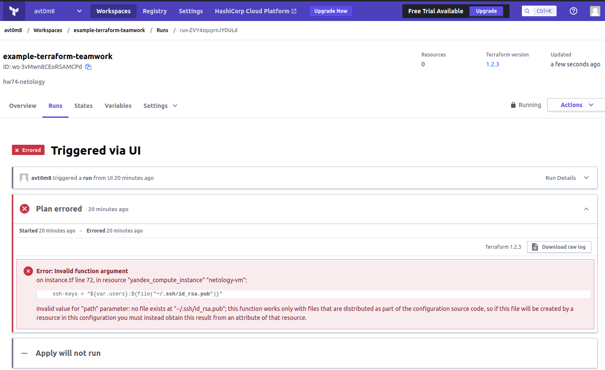

* После коммита (публичной части ssh ключа для подключения к ВМ) в репозиторий, автоматически запустился `plan`.

  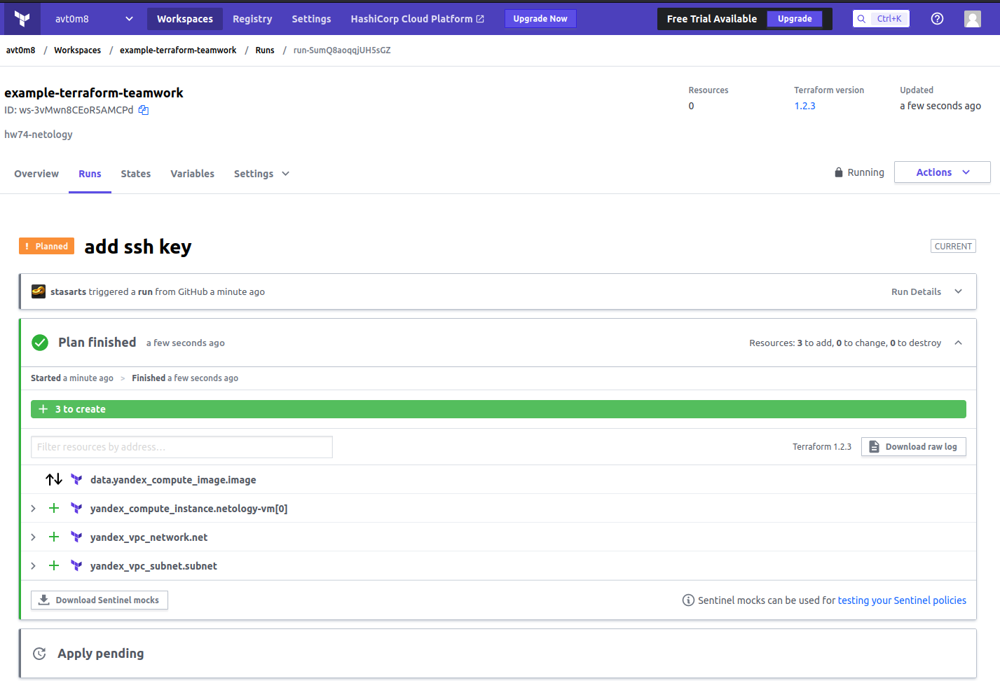

* Для выполнения `apply` оставим комментарий с подтверждением плана.

  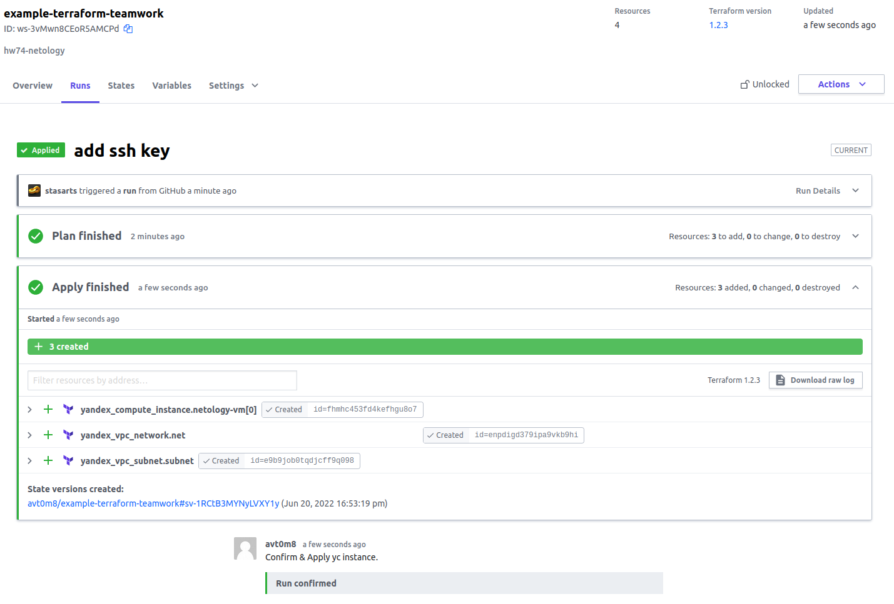

* Зайдем в ЯО и убедимся, что ВМ с указанным в TC id создалась с указанными параметрами.

  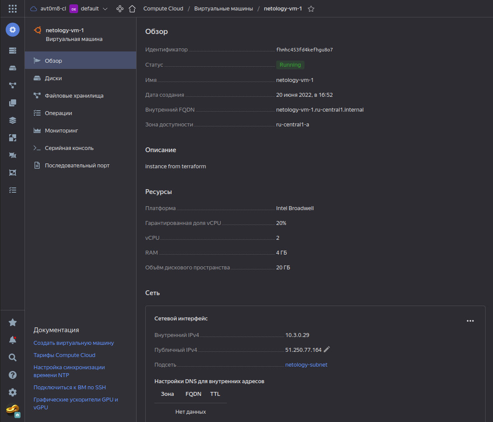

* Сделаем коммит в репозиторий с конфигурацией, изменим параметры ВМ. Запуск плана в TC запускается автоматически.

  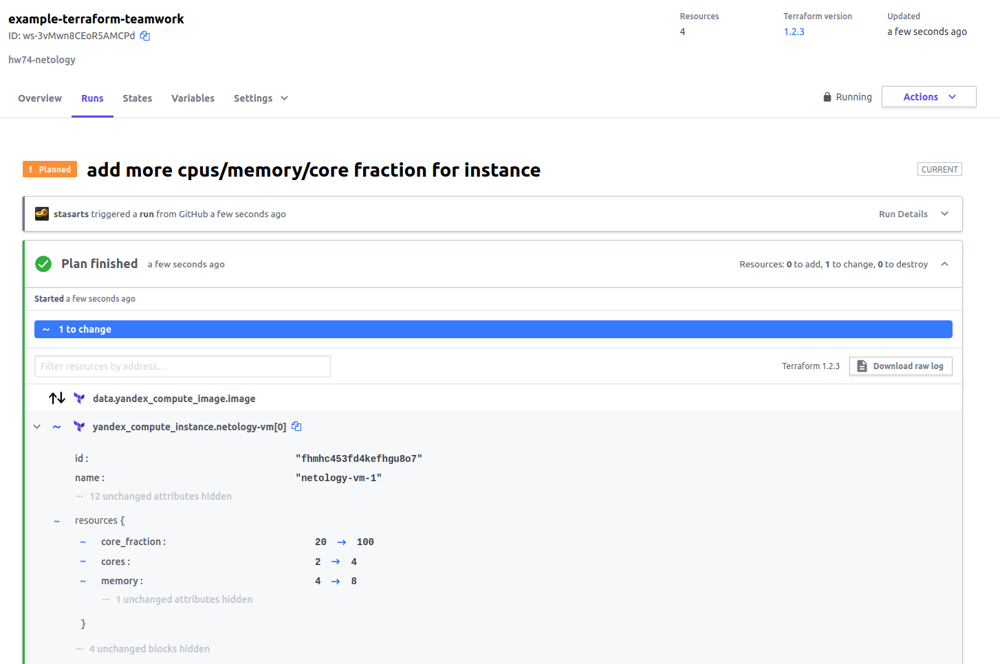

* После подтверждения плана комментарием, `apply` не прошел, т.к. для модификации ВМ в ЯО ее необходимо останавливать.

  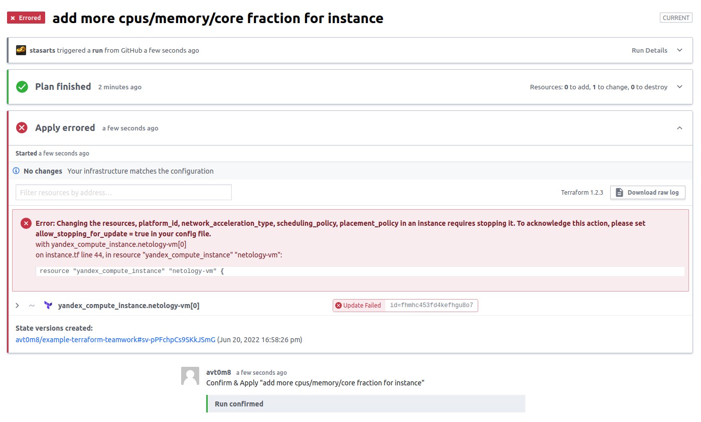

* Успешный `apply` после добавления параметра `allow_stopping_for_update`.

  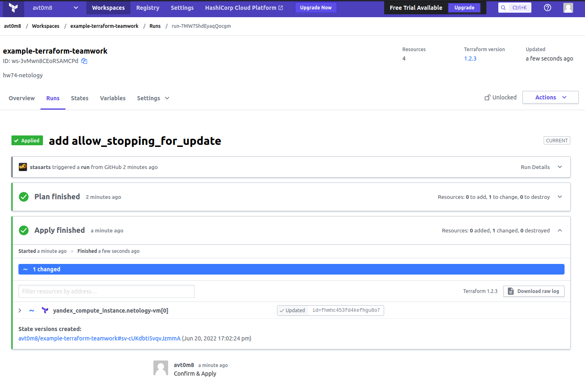

* Зайдем в ЯО и убедимся, что у ВМ изменились параметры согласно плану.

  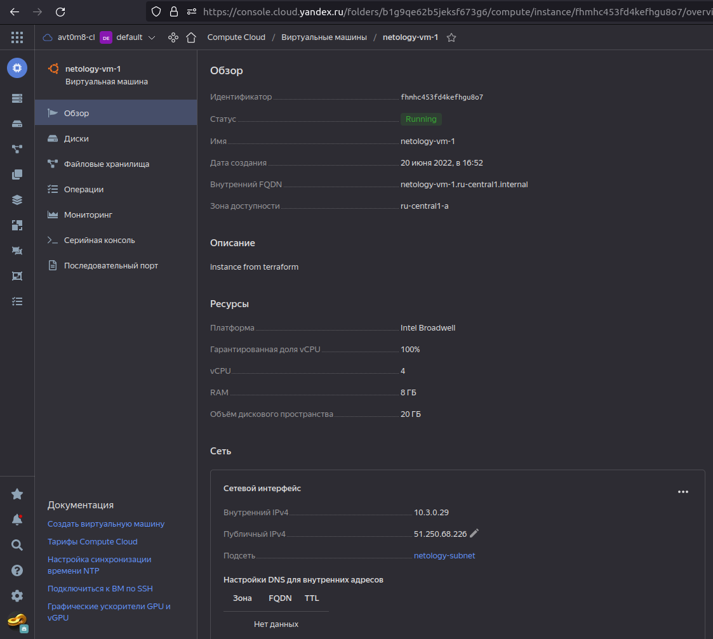

* Освободим ресурсы в ЯО.

  
Скриншоты

  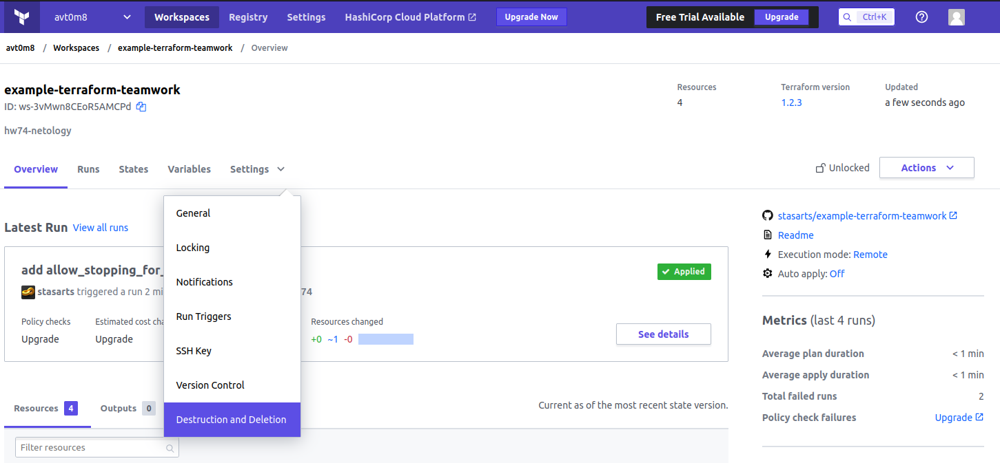

  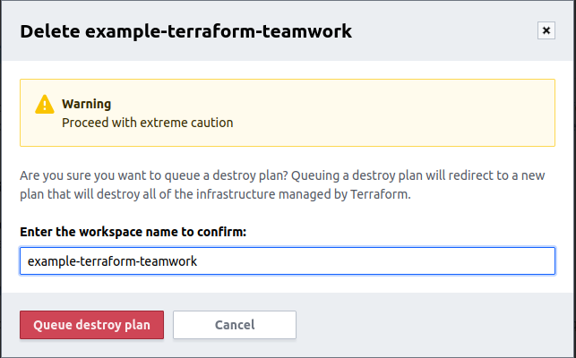

  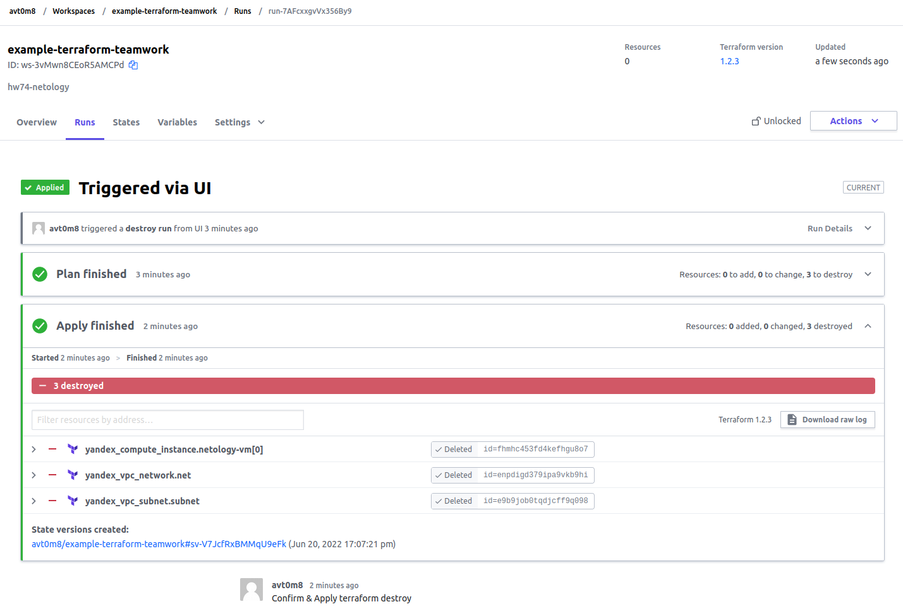

## Задача 2. Написать серверный конфиг для `atlantis`. 

Смысл задания – познакомиться с документацией:
* [серверной](https://www.runatlantis.io/docs/server-side-repo-config.html) конфигурации
* конфигурации уровня [репозитория](https://www.runatlantis.io/docs/repo-level-atlantis-yaml.html)

Создадим `server.yaml` который скажет атлантису:

[server.yml](./src/server.yaml)

Создадим `atlantis.yaml` который, если поместить в корень terraform проекта, скажет `atlantis`:

[atlantis.yaml](./src/atlantis.yaml)

## Задача 3. Знакомство с каталогом модулей. 

#### 1. В [каталоге модулей](https://registry.terraform.io/browse/modules) найдем [модуль для ЯО](https://registry.terraform.io/modules/hamnsk/vpc/yandex/0.5.0) для создания `VPC + Network + Subnets`. 
#### 2. Изучим как устроен модуль. Будете ли в своем проекте использовать этот модуль или непосредственно ресурсы `VPC + Network + Subnets` без помощи модуля?

Да, возможно буду использовать. Модуль позволяет автоматически создавать `folder` в ЯО, а также сети и подсети для последующего поднятия ВМ.

#### 3. Создадим `VPC + Network + Subnets` при помощи найденного модуля.

[Ссылка на конфигурацию с подключением модуля vpc.](./src/vpc.tf)

---