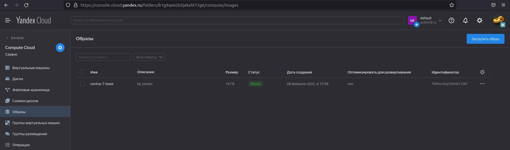
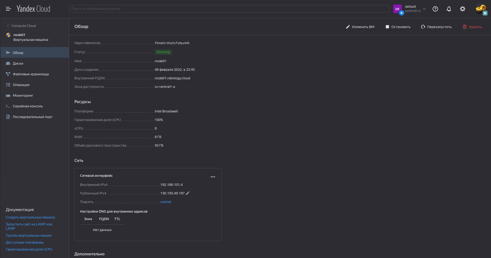
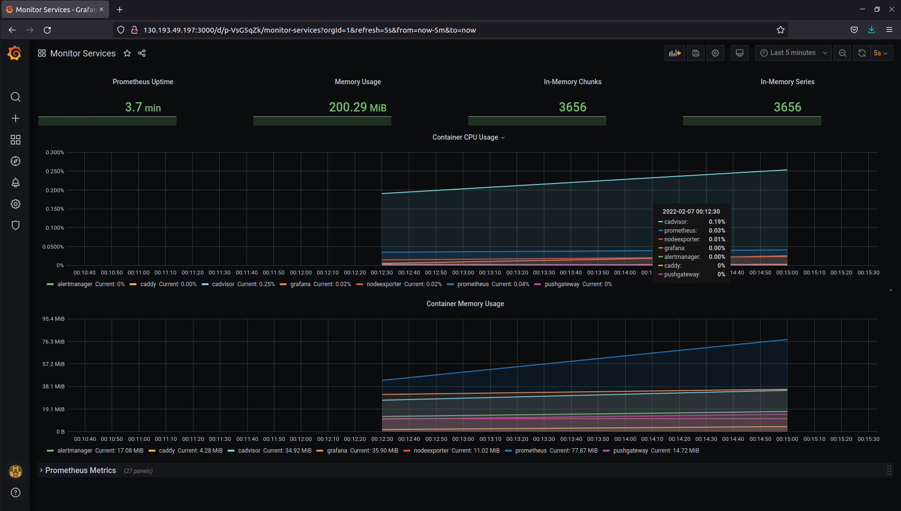

# Домашнее задание к занятию "5.4. Оркестрация группой Docker контейнеров на примере Docker Compose"

---

## Подготовка
1) Установим утилиту yc.
```shell
$ curl https://storage.yandexcloud.net/yandexcloud-yc/install.sh | bash
$ source ~/.bashrc
$ yc --version
Yandex.Cloud CLI 0.87.0 linux/amd64
```

2) Установим Packer.
```shell
$ curl -fsSL https://apt.releases.hashicorp.com/gpg | sudo apt-key add -
OK
$ sudo apt-add-repository "deb [arch=amd64] https://apt.releases.hashicorp.com $(lsb_release -cs) main"
Hit:1 http://ru.archive.ubuntu.com/ubuntu focal InRelease
Hit:2 http://ppa.launchpad.net/eivnaes/network-manager-sstp/ubuntu focal InRelease                                                         
Hit:3 http://dl.google.com/linux/chrome/deb stable InRelease                                                                               
Hit:4 https://apt.releases.hashicorp.com focal InRelease                                                                                   
Get:5 http://security.ubuntu.com/ubuntu focal-security InRelease [114 kB]
Hit:6 https://download.docker.com/linux/ubuntu focal InRelease
Fetched 114 kB in 11s (10,7 kB/s)                     
Reading package lists... Done
$ sudo apt-get update && sudo apt-get install packer
Hit:1 http://ru.archive.ubuntu.com/ubuntu focal InRelease                                                                                  
Hit:2 http://ppa.launchpad.net/eivnaes/network-manager-sstp/ubuntu focal InRelease                                                         
Hit:3 https://download.docker.com/linux/ubuntu focal InRelease                                                                             
Hit:4 http://dl.google.com/linux/chrome/deb stable InRelease                                                                   
Hit:5 https://apt.releases.hashicorp.com focal InRelease                                                                       
Get:6 http://security.ubuntu.com/ubuntu focal-security InRelease [114 kB]
Fetched 114 kB in 11s (10,7 kB/s)   
Reading package lists... Done
Reading package lists... Done
Building dependency tree       
Reading state information... Done
The following NEW packages will be installed:
  packer
0 upgraded, 1 newly installed, 0 to remove and 0 not upgraded.
Need to get 32,1 MB of archives.
After this operation, 152 MB of additional disk space will be used.
Get:1 https://apt.releases.hashicorp.com focal/main amd64 packer amd64 1.7.10 [32,1 MB]
Fetched 32,1 MB in 4min 35s (117 kB/s)                                                                                                     
Selecting previously unselected package packer.
(Reading database ... 260934 files and directories currently installed.)
Preparing to unpack .../packer_1.7.10_amd64.deb ...
Unpacking packer (1.7.10) ...
Setting up packer (1.7.10) ...
$ packer --version
1.7.10
```

3) Установим Terraform.
```shell
$ sudo apt-get update && sudo apt-get install terraform
Hit:1 http://dl.google.com/linux/chrome/deb stable InRelease
Hit:2 http://ru.archive.ubuntu.com/ubuntu focal InRelease                                                                                  
Get:3 http://security.ubuntu.com/ubuntu focal-security InRelease [114 kB]                                                                  
Hit:4 http://ppa.launchpad.net/eivnaes/network-manager-sstp/ubuntu focal InRelease                                                         
Hit:5 https://download.docker.com/linux/ubuntu focal InRelease                                                                             
Hit:6 https://apt.releases.hashicorp.com focal InRelease                                                             
Get:7 http://security.ubuntu.com/ubuntu focal-security/main amd64 DEP-11 Metadata [40,7 kB]
Get:8 http://security.ubuntu.com/ubuntu focal-security/universe amd64 DEP-11 Metadata [66,3 kB]
Get:9 http://security.ubuntu.com/ubuntu focal-security/multiverse amd64 DEP-11 Metadata [2 464 B]
Fetched 223 kB in 11s (21,1 kB/s)                                          
Reading package lists... Done
Reading package lists... Done
Building dependency tree       
Reading state information... Done
The following NEW packages will be installed:
  terraform
0 upgraded, 1 newly installed, 0 to remove and 0 not upgraded.
Need to get 18,8 MB of archives.
After this operation, 63,0 MB of additional disk space will be used.
Get:1 https://apt.releases.hashicorp.com focal/main amd64 terraform amd64 1.1.5 [18,8 MB]
Fetched 18,8 MB in 2min 12s (142 kB/s)                                                                                                     
Selecting previously unselected package terraform.
(Reading database ... 260937 files and directories currently installed.)
Preparing to unpack .../terraform_1.1.5_amd64.deb ...
Unpacking terraform (1.1.5) ...
Setting up terraform (1.1.5) ...
$ terraform --version
Terraform v1.1.5
on linux_amd64
```

4) Подготовим проект в соответствии с ДЗ.
```shell
$ tree
.
├── ansible
│   ├── ansible.cfg
│   ├── inventory
│   ├── provision.yml
│   └── stack
│       ├── alertmanager
│       │   └── config.yml
│       ├── caddy
│       │   └── Caddyfile
│       ├── docker-compose.yaml
│       ├── exporters
│       │   └── docker-compose.exporters.yaml
│       ├── grafana
│       │   └── provisioning
│       │       ├── dashboards
│       │       │   ├── dashboard.yml
│       │       │   ├── general_docker_host.json
│       │       │   └── general_monitor_services.json
│       │       └── datasources
│       │           └── datasource.yml
│       └── prometheus
│           ├── alert.rules
│           └── prometheus.yml
├── packer
│   └── centos-7-base.json
└── terraform
    ├── key.json
    ├── network.tf
    ├── node01.tf
    ├── output.tf
    ├── provider.tf
    ├── terraform.tfstate
    ├── terraform.tfstate.backup
    ├── variables.tf
    └── versions

12 directories, 23 files
```

## Задача 1

Создать собственный образ операционной системы с помощью Packer.

### Ответ

1) Инициализируем профиль yc.
```shell
$ yc init
Welcome! This command will take you through the configuration process.
Please go to https://oauth.yandex.ru/authorize?response_type=<token&client_id> in order to obtain OAuth token.

Please enter OAuth token: <OAuth token>
You have one cloud available: 'avt0m8-cl' (id = <id>). It is going to be used by default.
Please choose folder to use:
 [1] default (id = <id>)
 [2] Create a new folder
Please enter your numeric choice: 1
Your current folder has been set to 'default' (id = <folder_id>).
Do you want to configure a default Compute zone? [Y/n] Y
Which zone do you want to use as a profile default?
 [1] ru-central1-a
 [2] ru-central1-b
 [3] ru-central1-c
 [4] Don't set default zone
Please enter your numeric choice: 1
Your profile default Compute zone has been set to 'ru-central1-a'.
$ yc config list
token: <token>
cloud-id: <cloud-id>
folder-id: <folder-id>
compute-default-zone: ru-central1-a
```

2) Инициализируем сеть.
```shell
$ yc vpc network create \
     --name net \
     --labels my-label=netology \
     --description "my first network via yc"
id: <id>
folder_id: <folder_id>
created_at: "2022-02-06T10:03:03Z"
name: net
description: my first network via yc
labels:
  my-label: netology

```

3) Инициализируем подсеть.
```shell
$ yc vpc subnet create \
    --name my-subnet-a \
    --zone ru-central1-a \
    --range 10.1.2.0/24 \
    --network-name net \
    --description "my first subnet via yc"
id: <subnet_id>
folder_id: <folder_id>
created_at: "2022-02-06T10:08:31Z"
name: my-subnet-a
description: my first subnet via yc
network_id: <network_id>
zone_id: ru-central1-a
v4_cidr_blocks:
- 10.1.2.0/24

```

4) Опишем конфигурацию ВМ.
```shell
$ nano ./packer/centos-7-base.json
```
```
{
  "builders": [
    {
      "disk_type": "network-nvme",
      "folder_id": "<folder_id>",
      "image_description": "by packer",
      "image_family": "centos",
      "image_name": "centos-7-base",
      "source_image_family": "centos-7",
      "ssh_username": "centos",
      "subnet_id": "<subnet_id>",
      "token": "<OAuth token>",
      "type": "yandex",
      "use_ipv4_nat": true,
      "zone": "ru-central1-a"
    }
  ],
  "provisioners": [
    {
      "inline": [
        "sudo yum -y update",
        "sudo yum -y install bridge-utils bind-utils iptables curl net-tools tcpdump rsync telnet openssh-server"
      ],
      "type": "shell"
    }
  ]
}
```

5) Ссоберем образ виртуальной машины в Яндекс.Облаке.
```shell
$ cd packer
$ packer validate centos-7-base.json
The configuration is valid.
$ packer build centos-7-base.json
yandex: output will be in this color.

==> yandex: Creating temporary RSA SSH key for instance...
==> yandex: Using as source image: <image_id> (name: "centos-7-v20220131", family: "centos-7")
==> yandex: Use provided subnet id <subnet_id>
==> yandex: Creating disk...
==> yandex: Creating instance...
==> yandex: Waiting for instance with id <id> to become active...
    yandex: Detected instance IP: 84.201.129.240
==> yandex: Using SSH communicator to connect: 84.201.129.240
==> yandex: Waiting for SSH to become available...
==> yandex: Connected to SSH!
==> yandex: Provisioning with shell script: /tmp/packer-shell1722913145
    yandex: Loaded plugins: fastestmirror
    yandex: Loading mirror speeds from cached hostfile
    yandex:  * base: mirror.yandex.ru
    yandex:  * extras: mirror.yandex.ru
    yandex:  * updates: mirror.yandex.ru
    yandex: No packages marked for update
    yandex: Loaded plugins: fastestmirror
    yandex: Loading mirror speeds from cached hostfile
    yandex:  * base: mirror.yandex.ru
    yandex:  * extras: mirror.yandex.ru
    yandex:  * updates: mirror.yandex.ru
    yandex: Package iptables-1.4.21-35.el7.x86_64 already installed and latest version
    yandex: Package curl-7.29.0-59.el7_9.1.x86_64 already installed and latest version
    yandex: Package net-tools-2.0-0.25.20131004git.el7.x86_64 already installed and latest version
    yandex: Package rsync-3.1.2-10.el7.x86_64 already installed and latest version
    yandex: Package openssh-server-7.4p1-22.el7_9.x86_64 already installed and latest version
    yandex: Resolving Dependencies
    yandex: --> Running transaction check
    yandex: ---> Package bind-utils.x86_64 32:9.11.4-26.P2.el7_9.8 will be installed
    yandex: --> Processing Dependency: bind-libs-lite(x86-64) = 32:9.11.4-26.P2.el7_9.8 for package: 32:bind-utils-9.11.4-26.P2.el7_9.8.x86_64
    yandex: --> Processing Dependency: bind-libs(x86-64) = 32:9.11.4-26.P2.el7_9.8 for package: 32:bind-utils-9.11.4-26.P2.el7_9.8.x86_64
    yandex: --> Processing Dependency: liblwres.so.160()(64bit) for package: 32:bind-utils-9.11.4-26.P2.el7_9.8.x86_64
    yandex: --> Processing Dependency: libisccfg.so.160()(64bit) for package: 32:bind-utils-9.11.4-26.P2.el7_9.8.x86_64
    yandex: --> Processing Dependency: libisc.so.169()(64bit) for package: 32:bind-utils-9.11.4-26.P2.el7_9.8.x86_64
    yandex: --> Processing Dependency: libirs.so.160()(64bit) for package: 32:bind-utils-9.11.4-26.P2.el7_9.8.x86_64
    yandex: --> Processing Dependency: libdns.so.1102()(64bit) for package: 32:bind-utils-9.11.4-26.P2.el7_9.8.x86_64
    yandex: --> Processing Dependency: libbind9.so.160()(64bit) for package: 32:bind-utils-9.11.4-26.P2.el7_9.8.x86_64
    yandex: --> Processing Dependency: libGeoIP.so.1()(64bit) for package: 32:bind-utils-9.11.4-26.P2.el7_9.8.x86_64
    yandex: ---> Package bridge-utils.x86_64 0:1.5-9.el7 will be installed
    yandex: ---> Package tcpdump.x86_64 14:4.9.2-4.el7_7.1 will be installed
    yandex: --> Processing Dependency: libpcap >= 14:1.5.3-10 for package: 14:tcpdump-4.9.2-4.el7_7.1.x86_64
    yandex: --> Processing Dependency: libpcap.so.1()(64bit) for package: 14:tcpdump-4.9.2-4.el7_7.1.x86_64
    yandex: ---> Package telnet.x86_64 1:0.17-66.el7 will be installed
    yandex: --> Running transaction check
    yandex: ---> Package GeoIP.x86_64 0:1.5.0-14.el7 will be installed
    yandex: --> Processing Dependency: geoipupdate for package: GeoIP-1.5.0-14.el7.x86_64
    yandex: ---> Package bind-libs.x86_64 32:9.11.4-26.P2.el7_9.8 will be installed
    yandex: --> Processing Dependency: bind-license = 32:9.11.4-26.P2.el7_9.8 for package: 32:bind-libs-9.11.4-26.P2.el7_9.8.x86_64
    yandex: ---> Package bind-libs-lite.x86_64 32:9.11.4-26.P2.el7_9.8 will be installed
    yandex: ---> Package libpcap.x86_64 14:1.5.3-12.el7 will be installed
    yandex: --> Running transaction check
    yandex: ---> Package bind-license.noarch 32:9.11.4-26.P2.el7_9.8 will be installed
    yandex: ---> Package geoipupdate.x86_64 0:2.5.0-1.el7 will be installed
    yandex: --> Finished Dependency Resolution
    yandex:
    yandex: Dependencies Resolved
    yandex:
    yandex: ================================================================================
    yandex:  Package            Arch       Version                        Repository   Size
    yandex: ================================================================================
    yandex: Installing:
    yandex:  bind-utils         x86_64     32:9.11.4-26.P2.el7_9.8        updates     261 k
    yandex:  bridge-utils       x86_64     1.5-9.el7                      base         32 k
    yandex:  tcpdump            x86_64     14:4.9.2-4.el7_7.1             base        422 k
    yandex:  telnet             x86_64     1:0.17-66.el7                  updates      64 k
    yandex: Installing for dependencies:
    yandex:  GeoIP              x86_64     1.5.0-14.el7                   base        1.5 M
    yandex:  bind-libs          x86_64     32:9.11.4-26.P2.el7_9.8        updates     157 k
    yandex:  bind-libs-lite     x86_64     32:9.11.4-26.P2.el7_9.8        updates     1.1 M
    yandex:  bind-license       noarch     32:9.11.4-26.P2.el7_9.8        updates      91 k
    yandex:  geoipupdate        x86_64     2.5.0-1.el7                    base         35 k
    yandex:  libpcap            x86_64     14:1.5.3-12.el7                base        139 k
    yandex:
    yandex: Transaction Summary
    yandex: ================================================================================
    yandex: Install  4 Packages (+6 Dependent packages)
    yandex:
    yandex: Total download size: 3.8 M
    yandex: Installed size: 9.0 M
    yandex: Downloading packages:
    yandex: --------------------------------------------------------------------------------
    yandex: Total                                              9.5 MB/s | 3.8 MB  00:00
    yandex: Running transaction check
    yandex: Running transaction test
    yandex: Transaction test succeeded
    yandex: Running transaction
    yandex:   Installing : 32:bind-license-9.11.4-26.P2.el7_9.8.noarch                 1/10
    yandex:   Installing : geoipupdate-2.5.0-1.el7.x86_64                              2/10
    yandex:   Installing : GeoIP-1.5.0-14.el7.x86_64                                   3/10
    yandex:   Installing : 32:bind-libs-lite-9.11.4-26.P2.el7_9.8.x86_64               4/10
    yandex:   Installing : 32:bind-libs-9.11.4-26.P2.el7_9.8.x86_64                    5/10
    yandex:   Installing : 14:libpcap-1.5.3-12.el7.x86_64                              6/10
    yandex: pam_tally2: Error opening /var/log/tallylog for update: Permission denied
    yandex: pam_tally2: Authentication error
    yandex: useradd: failed to reset the tallylog entry of user "tcpdump"
    yandex:   Installing : 14:tcpdump-4.9.2-4.el7_7.1.x86_64                           7/10
    yandex:   Installing : 32:bind-utils-9.11.4-26.P2.el7_9.8.x86_64                   8/10
    yandex:   Installing : bridge-utils-1.5-9.el7.x86_64                               9/10
    yandex:   Installing : 1:telnet-0.17-66.el7.x86_64                                10/10
    yandex:   Verifying  : GeoIP-1.5.0-14.el7.x86_64                                   1/10
    yandex:   Verifying  : 1:telnet-0.17-66.el7.x86_64                                 2/10
    yandex:   Verifying  : 14:libpcap-1.5.3-12.el7.x86_64                              3/10
    yandex:   Verifying  : geoipupdate-2.5.0-1.el7.x86_64                              4/10
    yandex:   Verifying  : 14:tcpdump-4.9.2-4.el7_7.1.x86_64                           5/10
    yandex:   Verifying  : 32:bind-license-9.11.4-26.P2.el7_9.8.noarch                 6/10
    yandex:   Verifying  : 32:bind-libs-lite-9.11.4-26.P2.el7_9.8.x86_64               7/10
    yandex:   Verifying  : 32:bind-utils-9.11.4-26.P2.el7_9.8.x86_64                   8/10
    yandex:   Verifying  : 32:bind-libs-9.11.4-26.P2.el7_9.8.x86_64                    9/10
    yandex:   Verifying  : bridge-utils-1.5-9.el7.x86_64                              10/10
    yandex:
    yandex: Installed:
    yandex:   bind-utils.x86_64 32:9.11.4-26.P2.el7_9.8   bridge-utils.x86_64 0:1.5-9.el7
    yandex:   tcpdump.x86_64 14:4.9.2-4.el7_7.1           telnet.x86_64 1:0.17-66.el7
    yandex:
    yandex: Dependency Installed:
    yandex:   GeoIP.x86_64 0:1.5.0-14.el7
    yandex:   bind-libs.x86_64 32:9.11.4-26.P2.el7_9.8
    yandex:   bind-libs-lite.x86_64 32:9.11.4-26.P2.el7_9.8
    yandex:   bind-license.noarch 32:9.11.4-26.P2.el7_9.8
    yandex:   geoipupdate.x86_64 0:2.5.0-1.el7
    yandex:   libpcap.x86_64 14:1.5.3-12.el7
    yandex:
    yandex: Complete!
==> yandex: Stopping instance...
==> yandex: Deleting instance...
    yandex: Instance has been deleted!
==> yandex: Creating image: centos-7-base
==> yandex: Waiting for image to complete...
==> yandex: Success image create...
==> yandex: Destroying boot disk...
    yandex: Disk has been deleted!
Build 'yandex' finished after 2 minutes 53 seconds.

==> Wait completed after 2 minutes 53 seconds

==> Builds finished. The artifacts of successful builds are:
--> yandex: A disk image was created: centos-7-base (id: <image_id>) with family name centos
```

6) Удалим сеть, которая создавалась для сборки образа, чтобы не расходовать лишние ресурсы в облаке.
```shell
$ yc vpc subnet delete --name my-subnet-a && yc vpc network delete --name net
done (10s)
```

7) Образ ВМ.
```shell
$ yc compute image list
+----------------------+---------------+--------+----------------------+--------+
|          ID          |     NAME      | FAMILY |     PRODUCT IDS      | STATUS |
+----------------------+---------------+--------+----------------------+--------+
|      <image_id>      | centos-7-base | centos | f2eacrudv331nbat9ehb | READY  |
+----------------------+---------------+--------+----------------------+--------+
```
Скриншот с образом в Яндекс.Облако.
<p align="center">
  
</p>

## Задача 2

Создать первую виртуальную машину в Яндекс.Облаке.

### Ответ

1) Подготовим конфигурационные файлы.  
Впишем переменные.
```shell
$ nano variables.tf
```
```
# Заменить на ID своего облака
# https://console.cloud.yandex.ru/cloud?section=overview
variable "yandex_cloud_id" {
  default = "<cloud_id>"
}

# Заменить на Folder своего облака
# https://console.cloud.yandex.ru/cloud?section=overview
variable "yandex_folder_id" {
  default = "<folder_id>"
}

# Заменить на ID своего образа
# ID можно узнать с помощью команды yc compute image list
variable "centos-7-base" {
  default = "<image_id>"
}
```

2) Создадим сервисный аккаунт и получим key.json.
```shell
$ yc iam key create --service-account-name netology --output key.json
id: <id>
service_account_id: <service_account_id>
created_at: "2022-02-06T12:51:59.162078257Z"
key_algorithm: RSA_2048
```

3) Инициализируем конфигурацию.
```shell
$ terraform init

Initializing the backend...

Initializing provider plugins...
- Finding latest version of yandex-cloud/yandex...
╷
│ Error: Failed to query available provider packages
│ 
│ Could not retrieve the list of available versions for provider yandex-cloud/yandex: could not connect to registry.terraform.io: Failed to
│ request discovery document: Get "https://registry.terraform.io/.well-known/terraform.json": net/http: request canceled while waiting for
│ connection (Client.Timeout exceeded while awaiting headers)
```
```shell
$ terraform init

Initializing the backend...

Initializing provider plugins...
- Finding latest version of yandex-cloud/yandex...
╷
│ Error: Failed to query available provider packages
│ 
│ Could not retrieve the list of available versions for provider yandex-cloud/yandex: could not query provider registry for
│ registry.terraform.io/yandex-cloud/yandex: the request failed after 2 attempts, please try again later: Get
│ "https://registry.terraform.io/v1/providers/yandex-cloud/yandex/versions": net/http: request canceled while waiting for connection
│ (Client.Timeout exceeded while awaiting headers)
```
При попытке инициализации конфигурации, каждый раз возникает проблема.  
Поиск решения не дал результатов.  
Возможно, трафик блокируется провайдером.  
Указанные адреса доступны через curl и wget.  
(https://registry.terraform.io/.well-known/terraform.json,  
https://registry.terraform.io/v1/providers/yandex-cloud/yandex/versions)  

Установим провайдер yandex как плагин.  
(https://github.com/yandex-cloud/terraform-provider-yandex#readme)  
Скачаем последний релиз.  
(https://github.com/yandex-cloud/terraform-provider-yandex/releases/tag/v0.70.0)  
```shell
$ mkdir -p ~/.terraform.d/plugins
$ cp ./terraform-provider-yandex_0.70.0_linux_amd64.zip ~/.terraform.d/plugins
$ unzip ~/.terraform.d/plugins/terraform-provider-yandex_0.70.0_linux_amd64.zip
```
```shell
$ nano ~/.terraformrc
```
```
provider_installation {
  dev_overrides {
    "yandex-cloud/yandex" = "~/.terraform.d/plugins"
  }

  direct {}
}
```
Продолжим, не инициализируя конфигурацию.

4) Запустим проверку плана.
```shell
$ terraform plan
╷
│ Warning: Provider development overrides are in effect
│ 
│ The following provider development overrides are set in the CLI configuration:
│  - yandex-cloud/yandex in /home/stasarts/.terraform.d/plugins
│ 
│ The behavior may therefore not match any released version of the provider and applying changes may cause the state to become incompatible
│ with published releases.
╵

Terraform used the selected providers to generate the following execution plan. Resource actions are indicated with the following symbols:
  + create

Terraform will perform the following actions:

  # yandex_compute_instance.node01 will be created
  + resource "yandex_compute_instance" "node01" {
      + allow_stopping_for_update = true
      + created_at                = (known after apply)
      + folder_id                 = (known after apply)
      + fqdn                      = (known after apply)
      + hostname                  = "node01.netology.cloud"
      + id                        = (known after apply)
      + metadata                  = {
          + "ssh-keys" = <<-EOT
                centos:ssh-rsa *****
            EOT
        }
      + name                      = "node01"
      + network_acceleration_type = "standard"
      + platform_id               = "standard-v1"
      + service_account_id        = (known after apply)
      + status                    = (known after apply)
      + zone                      = "ru-central1-a"

      + boot_disk {
          + auto_delete = true
          + device_name = (known after apply)
          + disk_id     = (known after apply)
          + mode        = (known after apply)

          + initialize_params {
              + block_size  = (known after apply)
              + description = (known after apply)
              + image_id    = "<image_id>"
              + name        = "root-node01"
              + size        = 50
              + snapshot_id = (known after apply)
              + type        = "network-nvme"
            }
        }

      + network_interface {
          + index              = (known after apply)
          + ip_address         = (known after apply)
          + ipv4               = true
          + ipv6               = (known after apply)
          + ipv6_address       = (known after apply)
          + mac_address        = (known after apply)
          + nat                = true
          + nat_ip_address     = (known after apply)
          + nat_ip_version     = (known after apply)
          + security_group_ids = (known after apply)
          + subnet_id          = (known after apply)
        }

      + placement_policy {
          + placement_group_id = (known after apply)
        }

      + resources {
          + core_fraction = 100
          + cores         = 8
          + memory        = 8
        }

      + scheduling_policy {
          + preemptible = (known after apply)
        }
    }

  # yandex_vpc_network.default will be created
  + resource "yandex_vpc_network" "default" {
      + created_at                = (known after apply)
      + default_security_group_id = (known after apply)
      + folder_id                 = (known after apply)
      + id                        = (known after apply)
      + labels                    = (known after apply)
      + name                      = "net"
      + subnet_ids                = (known after apply)
    }

  # yandex_vpc_subnet.default will be created
  + resource "yandex_vpc_subnet" "default" {
      + created_at     = (known after apply)
      + folder_id      = (known after apply)
      + id             = (known after apply)
      + labels         = (known after apply)
      + name           = "subnet"
      + network_id     = (known after apply)
      + v4_cidr_blocks = [
          + "192.168.101.0/24",
        ]
      + v6_cidr_blocks = (known after apply)
      + zone           = "ru-central1-a"
    }

Plan: 3 to add, 0 to change, 0 to destroy.

Changes to Outputs:
  + external_ip_address_node01_yandex_cloud = (known after apply)
  + internal_ip_address_node01_yandex_cloud = (known after apply)

───────────────────────────────────────────────────────────────────────────────────────────────────────────────────────────────────────────

Note: You didn't use the -out option to save this plan, so Terraform can't guarantee to take exactly these actions if you run "terraform
apply" now.
``` 

5) Запустим план.
```shell
$ terraform apply
╷
│ Warning: Provider development overrides are in effect
│ 
│ The following provider development overrides are set in the CLI configuration:
│  - yandex-cloud/yandex in /home/stasarts/.terraform.d/plugins
│ 
│ The behavior may therefore not match any released version of the provider and applying changes may cause the state to become incompatible
│ with published releases.
╵

Terraform used the selected providers to generate the following execution plan. Resource actions are indicated with the following symbols:
  + create

Terraform will perform the following actions:

  # yandex_compute_instance.node01 will be created
  + resource "yandex_compute_instance" "node01" {
      + allow_stopping_for_update = true
      + created_at                = (known after apply)
      + folder_id                 = (known after apply)
      + fqdn                      = (known after apply)
      + hostname                  = "node01.netology.cloud"
      + id                        = (known after apply)
      + metadata                  = {
          + "ssh-keys" = <<-EOT
                centos:ssh-rsa *****
            EOT
        }
      + name                      = "node01"
      + network_acceleration_type = "standard"
      + platform_id               = "standard-v1"
      + service_account_id        = (known after apply)
      + status                    = (known after apply)
      + zone                      = "ru-central1-a"

      + boot_disk {
          + auto_delete = true
          + device_name = (known after apply)
          + disk_id     = (known after apply)
          + mode        = (known after apply)

          + initialize_params {
              + block_size  = (known after apply)
              + description = (known after apply)
              + image_id    = "<image_id>"
              + name        = "root-node01"
              + size        = 50
              + snapshot_id = (known after apply)
              + type        = "network-nvme"
            }
        }

      + network_interface {
          + index              = (known after apply)
          + ip_address         = (known after apply)
          + ipv4               = true
          + ipv6               = (known after apply)
          + ipv6_address       = (known after apply)
          + mac_address        = (known after apply)
          + nat                = true
          + nat_ip_address     = (known after apply)
          + nat_ip_version     = (known after apply)
          + security_group_ids = (known after apply)
          + subnet_id          = (known after apply)
        }

      + placement_policy {
          + placement_group_id = (known after apply)
        }

      + resources {
          + core_fraction = 100
          + cores         = 8
          + memory        = 8
        }

      + scheduling_policy {
          + preemptible = (known after apply)
        }
    }

  # yandex_vpc_network.default will be created
  + resource "yandex_vpc_network" "default" {
      + created_at                = (known after apply)
      + default_security_group_id = (known after apply)
      + folder_id                 = (known after apply)
      + id                        = (known after apply)
      + labels                    = (known after apply)
      + name                      = "net"
      + subnet_ids                = (known after apply)
    }

  # yandex_vpc_subnet.default will be created
  + resource "yandex_vpc_subnet" "default" {
      + created_at     = (known after apply)
      + folder_id      = (known after apply)
      + id             = (known after apply)
      + labels         = (known after apply)
      + name           = "subnet"
      + network_id     = (known after apply)
      + v4_cidr_blocks = [
          + "192.168.101.0/24",
        ]
      + v6_cidr_blocks = (known after apply)
      + zone           = "ru-central1-a"
    }

Plan: 3 to add, 0 to change, 0 to destroy.

Changes to Outputs:
  + external_ip_address_node01_yandex_cloud = (known after apply)
  + internal_ip_address_node01_yandex_cloud = (known after apply)

Do you want to perform these actions?
  Terraform will perform the actions described above.
  Only 'yes' will be accepted to approve.

  Enter a value: yes

yandex_vpc_network.default: Creating...
yandex_vpc_network.default: Still creating... [10s elapsed]
yandex_vpc_network.default: Still creating... [20s elapsed]
yandex_vpc_network.default: Still creating... [30s elapsed]
yandex_vpc_network.default: Creation complete after 33s [id=<network_id>]
yandex_vpc_subnet.default: Creating...
yandex_vpc_subnet.default: Creation complete after 1s [id=<subnet_id>]
yandex_compute_instance.node01: Creating...
yandex_compute_instance.node01: Still creating... [10s elapsed]
yandex_compute_instance.node01: Still creating... [20s elapsed]
yandex_compute_instance.node01: Still creating... [30s elapsed]
yandex_compute_instance.node01: Still creating... [40s elapsed]
yandex_compute_instance.node01: Still creating... [50s elapsed]
yandex_compute_instance.node01: Creation complete after 52s [id=<id>]

Apply complete! Resources: 3 added, 0 changed, 0 destroyed.

Outputs:

external_ip_address_node01_yandex_cloud = "130.193.49.197"
internal_ip_address_node01_yandex_cloud = "192.168.101.4"
```
Скриншот с ВМ в Яндекс.Облако.
<p align="center">
  
</p>

## Задача 3

Создать ваш первый готовый к боевой эксплуатации компонент мониторинга, состоящий из стека микросервисов.

### Ответ

1) Вставим полученный белый ip в inventory
```shell
$ cd ./ansible
$ nano inventory
```
```
[nodes:children]
manager

[manager]
node01.netology.cloud ansible_host=130.193.49.197
```

2) Запустим ansible-playbook.
```shell
$ ansible-playbook provision.yml 

PLAY [nodes] *******************************************************************************************************************************

TASK [Gathering Facts] *********************************************************************************************************************
ok: [node01.netology.cloud]

TASK [Create directory for ssh-keys] *******************************************************************************************************
ok: [node01.netology.cloud]

TASK [Adding rsa-key in /root/.ssh/authorized_keys] ****************************************************************************************
ok: [node01.netology.cloud]

TASK [Checking DNS] ************************************************************************************************************************
changed: [node01.netology.cloud]

TASK [Installing tools] ********************************************************************************************************************
changed: [node01.netology.cloud] => (item=git)
ok: [node01.netology.cloud] => (item=curl)

TASK [Add docker repository] ***************************************************************************************************************
changed: [node01.netology.cloud]

TASK [Installing docker package] ***********************************************************************************************************
changed: [node01.netology.cloud] => (item=docker-ce)
ok: [node01.netology.cloud] => (item=docker-ce-cli)
ok: [node01.netology.cloud] => (item=containerd.io)

TASK [Enable docker daemon] ****************************************************************************************************************
changed: [node01.netology.cloud]

TASK [Install docker-compose] **************************************************************************************************************
changed: [node01.netology.cloud]

TASK [Synchronization] *********************************************************************************************************************
changed: [node01.netology.cloud]

TASK [Pull all images in compose] **********************************************************************************************************
changed: [node01.netology.cloud]

TASK [Up all services in compose] **********************************************************************************************************
changed: [node01.netology.cloud]

PLAY RECAP *********************************************************************************************************************************
node01.netology.cloud      : ok=12   changed=9    unreachable=0    failed=0    skipped=0    rescued=0    ignored=0
```

Скриншот с дашбордом в графане.
<p align="center">
  
</p>

3) Освободим ресурсы в Яндекс.Облако.
```shell
$ terraform destroy
╷
│ Warning: Provider development overrides are in effect
│ 
│ The following provider development overrides are set in the CLI configuration:
│  - yandex-cloud/yandex in /home/stasarts/.terraform.d/plugins
│ 
│ The behavior may therefore not match any released version of the provider and applying changes may cause the state to become incompatible
│ with published releases.
╵
yandex_vpc_network.default: Refreshing state... [id=<network_id>]
yandex_vpc_subnet.default: Refreshing state... [id=<subnet_id>]
yandex_compute_instance.node01: Refreshing state... [id=<id>]

Terraform used the selected providers to generate the following execution plan. Resource actions are indicated with the following symbols:
  - destroy

Terraform will perform the following actions:

  # yandex_compute_instance.node01 will be destroyed
  - resource "yandex_compute_instance" "node01" {
      - allow_stopping_for_update = true -> null
      - created_at                = "2022-02-06T18:45:06Z" -> null
      - folder_id                 = "<folder_id>" -> null
      - fqdn                      = "node01.netology.cloud" -> null
      - hostname                  = "node01" -> null
      - id                        = "<id>" -> null
      - labels                    = {} -> null
      - metadata                  = {
          - "ssh-keys" = <<-EOT
                centos:ssh-rsa *****
            EOT
        } -> null
      - name                      = "node01" -> null
      - network_acceleration_type = "standard" -> null
      - platform_id               = "standard-v1" -> null
      - status                    = "running" -> null
      - zone                      = "ru-central1-a" -> null

      - boot_disk {
          - auto_delete = true -> null
          - device_name = "<disk_id>" -> null
          - disk_id     = "<disk_id>" -> null
          - mode        = "READ_WRITE" -> null

          - initialize_params {
              - block_size = 4096 -> null
              - image_id   = "<image_id>" -> null
              - name       = "root-node01" -> null
              - size       = 50 -> null
              - type       = "network-ssd" -> null
            }
        }

      - network_interface {
          - index              = 0 -> null
          - ip_address         = "192.168.101.4" -> null
          - ipv4               = true -> null
          - ipv6               = false -> null
          - mac_address        = "d0:0d:a5:8b:66:8a" -> null
          - nat                = true -> null
          - nat_ip_address     = "130.193.49.197" -> null
          - nat_ip_version     = "IPV4" -> null
          - security_group_ids = [] -> null
          - subnet_id          = "<subnet_id>" -> null
        }

      - placement_policy {}

      - resources {
          - core_fraction = 100 -> null
          - cores         = 8 -> null
          - gpus          = 0 -> null
          - memory        = 8 -> null
        }

      - scheduling_policy {
          - preemptible = false -> null
        }
    }

  # yandex_vpc_network.default will be destroyed
  - resource "yandex_vpc_network" "default" {
      - created_at = "2022-02-06T18:44:53Z" -> null
      - folder_id  = "<folder_id>" -> null
      - id         = "<id>" -> null
      - labels     = {} -> null
      - name       = "net" -> null
      - subnet_ids = [
          - "<subnet_id>",
        ] -> null
    }

  # yandex_vpc_subnet.default will be destroyed
  - resource "yandex_vpc_subnet" "default" {
      - created_at     = "2022-02-06T18:44:54Z" -> null
      - folder_id      = "<folder_id>" -> null
      - id             = "<id>" -> null
      - labels         = {} -> null
      - name           = "subnet" -> null
      - network_id     = "<network_id>" -> null
      - v4_cidr_blocks = [
          - "192.168.101.0/24",
        ] -> null
      - v6_cidr_blocks = [] -> null
      - zone           = "ru-central1-a" -> null
    }

Plan: 0 to add, 0 to change, 3 to destroy.

Changes to Outputs:
  - external_ip_address_node01_yandex_cloud = "130.193.49.197" -> null
  - internal_ip_address_node01_yandex_cloud = "192.168.101.4" -> null

Do you really want to destroy all resources?
  Terraform will destroy all your managed infrastructure, as shown above.
  There is no undo. Only 'yes' will be accepted to confirm.

  Enter a value: yes

yandex_compute_instance.node01: Destroying... [id=<id>]
yandex_compute_instance.node01: Still destroying... [id=<id>, 10s elapsed]
yandex_compute_instance.node01: Still destroying... [id=<id>, 20s elapsed]
yandex_compute_instance.node01: Still destroying... [id=<id>, 30s elapsed]
yandex_compute_instance.node01: Still destroying... [id=<id>, 40s elapsed]
yandex_compute_instance.node01: Destruction complete after 45s
yandex_vpc_subnet.default: Destroying... [id=<subnet_id>]
yandex_vpc_subnet.default: Still destroying... [id=<subnet_id>, 10s elapsed]
yandex_vpc_subnet.default: Destruction complete after 15s
yandex_vpc_network.default: Destroying... [id=<network_id>]
yandex_vpc_network.default: Destruction complete after 1s

Destroy complete! Resources: 3 destroyed.
```
