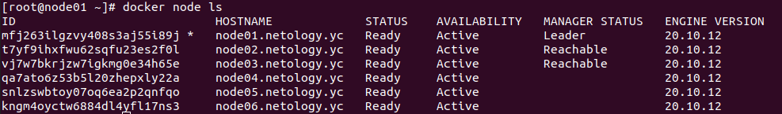
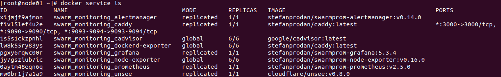

# Домашнее задание к занятию "5.5. Оркестрация кластером Docker контейнеров на примере Docker Swarm"

---
### Подготовка

1) Подготовим проект в соответствии с ДЗ.
```shell
$ tree
.
├── ansible
│   ├── monitoring
│   │   ├── alertmanager
│   │   │   ├── conf
│   │   │   │   ├── alertmanager.yml
│   │   │   │   └── docker-entrypoint.sh
│   │   │   └── Dockerfile
│   │   ├── caddy
│   │   │   └── Caddyfile
│   │   ├── docker-compose.yml
│   │   ├── dockerd-exporter
│   │   │   └── Caddyfile
│   │   ├── grafana
│   │   │   ├── dashboards
│   │   │   │   ├── swarmprom-nodes-dash.json
│   │   │   │   ├── swarmprom-prometheus-dash.json
│   │   │   │   └── swarmprom-services-dash.json
│   │   │   ├── datasources
│   │   │   │   └── prometheus.yaml
│   │   │   ├── Dockerfile
│   │   │   └── swarmprom_dashboards.yml
│   │   ├── node-exporter
│   │   │   ├── conf
│   │   │   │   └── docker-entrypoint.sh
│   │   │   └── Dockerfile
│   │   └── prometheus
│   │       ├── conf
│   │       │   ├── docker-entrypoint.sh
│   │       │   ├── prometheus.yml
│   │       │   └── weave-cortex.yml
│   │       ├── Dockerfile
│   │       └── rules
│   │           ├── swarm_node.rules.yml
│   │           └── swarm_task.rules.yml
│   ├── roles
│   │   ├── configure-hosts-file
│   │   │   └── tasks
│   │   │       └── main.yml
│   │   ├── docker-installation
│   │   │   └── tasks
│   │   │       └── main.yml
│   │   ├── docker-swarm-add-manager
│   │   │   └── tasks
│   │   │       └── main.yml
│   │   ├── docker-swarm-add-worker
│   │   │   └── tasks
│   │   │       └── main.yml
│   │   ├── docker-swarm-init
│   │   │   └── tasks
│   │   │       └── main.yml
│   │   ├── docker-swarm-leave
│   │   │   └── tasks
│   │   │       └── main.yml
│   │   └── install-tools
│   │       └── tasks
│   │           └── main.yml
│   ├── swarm-deploy-cluster.yml
│   ├── swarm-deploy-stack.yml
│   └── swarm-deploy-sync.yml
├── packer
│   └── centos-7-base.json
└── terraform
    ├── ansible.cfg
    ├── ansible.tf
    ├── inventory.tf
    ├── network.tf
    ├── node01.tf
    ├── node02.tf
    ├── node03.tf
    ├── node04.tf
    ├── node05.tf
    ├── node06.tf
    ├── output.tf
    ├── provider.tf
    └── variables.tf

31 directories, 44 files
```

2) Соберем образ ВМ с помощью Packer.
- Укажем переменные для Яндекс.Облако
```shell
$ nano ./packer/centos-7-base.json 
```
- Валидируем конфигурацию.
```shell
$ packer validate ./packer/centos-7-base.json
The configuration is valid.
```
- Запустим сборку.
```shell
packer build ./packer/centos-7-base.json 
yandex: output will be in this color.

==> yandex: Creating temporary RSA SSH key for instance...
==> yandex: Using as source image: fd8gdnd09d0iqdu7ll2a (name: "centos-7-v20220207", family: "centos-7")

*****

Build 'yandex' finished after 2 minutes 43 seconds.

==> Wait completed after 2 minutes 43 seconds

==> Builds finished. The artifacts of successful builds are:
--> yandex: A disk image was created: centos-7-base (id: fd8uqeilr8lhpdm3esti) with family name centos
```
- Освободим ресурсы для сборки образа в облаке.
```shell
$ yc vpc subnet delete --name my-subnet-a && yc vpc network delete --name net
done (10s)
```
- Посмотрим id собранного образа.
```shell
$ yc compute image list
+----------------------+---------------+--------+----------------------+--------+
|          ID          |     NAME      | FAMILY |     PRODUCT IDS      | STATUS |
+----------------------+---------------+--------+----------------------+--------+
| fd8uqeilr8lhpdm3esti | centos-7-base | centos | f2e40ohi7d1hori8m71b | READY  |
+----------------------+---------------+--------+----------------------+--------+
```

---
## Задача 1

Дайте письменые ответы на следующие вопросы:

- В чём отличие режимов работы сервисов в Docker Swarm кластере: replication и global?
- Какой алгоритм выбора лидера используется в Docker Swarm кластере?
- Что такое Overlay Network?

### Ответ

>- В чём отличие режимов работы сервисов в Docker Swarm кластере: replication и global?  

В режиме "global" гарантируется, что сервис будет запущен на каждой ноде в единственном экземпляре.  
В режиме "replication" будет гарантировано запущено указанное пользователем количество экземпляров сервиса, но их распределение не регламентируется (м. б. все на одной ноде).

>- Какой алгоритм выбора лидера используется в Docker Swarm кластере?

В Docker Swarm кластере используется алгоритм выбора лидера [RAFT](https://ru.wikipedia.org/wiki/%D0%90%D0%BB%D0%B3%D0%BE%D1%80%D0%B8%D1%82%D0%BC_Raft).
- Raft — алгоритм для решения задач консенсуса в сети ненадёжных вычислений.  
- Два основных шага алгоритма RAFT:
  * Leader Election (Выбор лидера)
  * Log Replication (Репликация протоколов)
- [Визуализация](https://raft.github.io/) алгоритма RAFT. 

>- Что такое Overlay Network?

[Overlay Network](https://ru.wikipedia.org/wiki/%D0%9E%D0%B2%D0%B5%D1%80%D0%BB%D0%B5%D0%B9%D0%BD%D0%B0%D1%8F_%D1%81%D0%B5%D1%82%D1%8C) - общий случай логической сети, создаваемой поверх другой сети.  
Docker использует технологию vxlan, чтобы создавать overlay-сети, которые используются в swarm-кластерах.

---

## Задача 2

Создать Docker Swarm кластер в Яндекс.Облаке

Для получения зачета, вам необходимо предоставить скриншот из терминала (консоли), с выводом команды:
```
docker node ls
```

### Ответ

1) Запишем переменные для Яндекс.Облако 
```shell
$ nano ./terraform/variables.tf
```

2) Проинициализируем terraform.
```shell
$ terraform init

Initializing the backend...

Initializing provider plugins...
- Finding latest version of hashicorp/null...
- Finding latest version of hashicorp/local...
- Finding latest version of yandex-cloud/yandex...
╷
│ Warning: Provider development overrides are in effect
│ 
│ The following provider development overrides are set in the CLI configuration:
│  - yandex-cloud/yandex in /home/stasarts/.terraform.d/plugins
│ 
│ Skip terraform init when using provider development overrides. It is not necessary and may error unexpectedly.
╵

╷
│ Error: Failed to query available provider packages
│ 
│ Could not retrieve the list of available versions for provider hashicorp/null: could not connect to registry.terraform.io: Failed to
│ request discovery document: Get "https://registry.terraform.io/.well-known/terraform.json": net/http: request canceled (Client.Timeout
│ exceeded while awaiting headers)
╵

╷
│ Error: Failed to query available provider packages
│ 
│ Could not retrieve the list of available versions for provider hashicorp/local: could not query provider registry for
│ registry.terraform.io/hashicorp/local: the request failed after 2 attempts, please try again later: Get
│ "https://registry.terraform.io/v1/providers/hashicorp/local/versions": net/http: request canceled while waiting for connection
│ (Client.Timeout exceeded while awaiting headers)
╵

╷
│ Error: Failed to query available provider packages
│ 
│ Could not retrieve the list of available versions for provider yandex-cloud/yandex: could not query provider registry for
│ registry.terraform.io/yandex-cloud/yandex: the request failed after 2 attempts, please try again later: Get
│ "https://registry.terraform.io/v1/providers/yandex-cloud/yandex/versions": net/http: request canceled while waiting for connection
│ (Client.Timeout exceeded while awaiting headers)
```

Данная проблема проявлялась и при выполнении ДЗ 5.4.  
Возможно трафик terraform блокируется некоторыми провайдерами.  
Тогда удалось установить провайдер Яндекс. Облако как плагин.  
Провайдеры hashicorp/null и hashicorp/local установить как плагины не удалось.  
Проблема решилась подключением к другому провайдеру.  

```shell
$ terraform init

Initializing the backend...

Initializing provider plugins...
- Finding latest version of yandex-cloud/yandex...
- Finding latest version of hashicorp/null...
- Finding latest version of hashicorp/local...
- Installing yandex-cloud/yandex v0.71.0...
- Installed yandex-cloud/yandex v0.71.0 (self-signed, key ID E40F590B50BB8E40)
- Installing hashicorp/null v3.1.0...
- Installed hashicorp/null v3.1.0 (signed by HashiCorp)
- Installing hashicorp/local v2.1.0...
- Installed hashicorp/local v2.1.0 (signed by HashiCorp)

Partner and community providers are signed by their developers.
If you'd like to know more about provider signing, you can read about it here:
https://www.terraform.io/docs/cli/plugins/signing.html

Terraform has created a lock file .terraform.lock.hcl to record the provider
selections it made above. Include this file in your version control repository
so that Terraform can guarantee to make the same selections by default when
you run "terraform init" in the future.

Terraform has been successfully initialized!

You may now begin working with Terraform. Try running "terraform plan" to see
any changes that are required for your infrastructure. All Terraform commands
should now work.

If you ever set or change modules or backend configuration for Terraform,
rerun this command to reinitialize your working directory. If you forget, other
commands will detect it and remind you to do so if necessary.
```

3) Валидируем план.
```shell
$ terraform validate
Success! The configuration is valid.
```

4) Применим план.
```shell
$ terraform apply --auto-approve

Terraform used the selected providers to generate the following execution plan. Resource actions are indicated with the following symbols:
  + create

Terraform will perform the following actions:

*****

Plan: 13 to add, 0 to change, 0 to destroy.

Changes to Outputs:
  + external_ip_address_node01 = (known after apply)
  + external_ip_address_node02 = (known after apply)
  + external_ip_address_node03 = (known after apply)
  + external_ip_address_node04 = (known after apply)
  + external_ip_address_node05 = (known after apply)
  + external_ip_address_node06 = (known after apply)
  + internal_ip_address_node01 = "192.168.101.11"
  + internal_ip_address_node02 = "192.168.101.12"
  + internal_ip_address_node03 = "192.168.101.13"
  + internal_ip_address_node04 = "192.168.101.14"
  + internal_ip_address_node05 = "192.168.101.15"
  + internal_ip_address_node06 = "192.168.101.16"
yandex_vpc_network.default: Creating...
yandex_vpc_network.default: Creation complete after 1s [id=enp3jstnubshudlt9n1k]
yandex_vpc_subnet.default: Creating...
yandex_vpc_subnet.default: Creation complete after 0s [id=e9bekndjqr3i9o6h01a1]
yandex_compute_instance.node02: Creating...
yandex_compute_instance.node01: Creating...
yandex_compute_instance.node04: Creating...
yandex_compute_instance.node06: Creating...
yandex_compute_instance.node03: Creating...
yandex_compute_instance.node05: Creating...

*****

Apply complete! Resources: 13 added, 0 changed, 0 destroyed.

Outputs:

external_ip_address_node01 = "62.84.114.254"
external_ip_address_node02 = "62.84.117.110"
external_ip_address_node03 = "51.250.0.49"
external_ip_address_node04 = "62.84.118.194"
external_ip_address_node05 = "62.84.124.69"
external_ip_address_node06 = "62.84.114.205"
internal_ip_address_node01 = "192.168.101.11"
internal_ip_address_node02 = "192.168.101.12"
internal_ip_address_node03 = "192.168.101.13"
internal_ip_address_node04 = "192.168.101.14"
internal_ip_address_node05 = "192.168.101.15"
internal_ip_address_node06 = "192.168.101.16"
```

5) Зайдем на одну из созданных ВМ и введем команду "docker node ls".
```shell
ssh centos@62.84.114.254
The authenticity of host '62.84.114.254 (62.84.114.254)' can't be established.
ECDSA key fingerprint is SHA256:*****
Are you sure you want to continue connecting (yes/no/[fingerprint])? yes
Warning: Permanently added '62.84.114.254' (ECDSA) to the list of known hosts.
[centos@node01 ~]$ sudo -i
[root@node01 ~]# docker node ls
ID                            HOSTNAME             STATUS    AVAILABILITY   MANAGER STATUS   ENGINE VERSION
mfj263ilgzvy408s3aj55i89j *   node01.netology.yc   Ready     Active         Leader           20.10.12
t7yf9ihxfwu62sqfu23es2f0l     node02.netology.yc   Ready     Active         Reachable        20.10.12
vj7w7bkrjzw7igkmg0e34h65e     node03.netology.yc   Ready     Active         Reachable        20.10.12
qa7ato6z53b5l20zhepxly22a     node04.netology.yc   Ready     Active                          20.10.12
snlzswbtoy07oq6ea2p2qnfqo     node05.netology.yc   Ready     Active                          20.10.12
kngm4oyctw6884dl4yfl17ns3     node06.netology.yc   Ready     Active                          20.10.12
```
Скриншот из терминала с выводом команды.
<p align="center">
  
</p>

---

## Задача 3

Создать готовый к боевой эксплуатации кластер мониторинга, состоящий из стека микросервисов.

Для получения зачета, вам необходимо предоставить скриншот из терминала (консоли), с выводом команды:
```
docker service ls
```

### Ответ


Введем команду "docker service ls".

```shell
[root@node01 ~]# docker service ls
ID             NAME                                MODE         REPLICAS   IMAGE                                          PORTS
xijmjf9ajmon   swarm_monitoring_alertmanager       replicated   1/1        stefanprodan/swarmprom-alertmanager:v0.14.0    
fivl5lef4u2e   swarm_monitoring_caddy              replicated   1/1        stefanprodan/caddy:latest                      *:3000->3000/tcp, *:9090->9090/tcp, *:9093-9094->9093-9094/tcp
1s5s1ckzpnhl   swarm_monitoring_cadvisor           global       6/6        google/cadvisor:latest                         
lw8k55ry83ys   swarm_monitoring_dockerd-exporter   global       6/6        stefanprodan/caddy:latest                      
pgxy6rqwc00r   swarm_monitoring_grafana            replicated   1/1        stefanprodan/swarmprom-grafana:5.3.4           
jy7gsziub7ic   swarm_monitoring_node-exporter      global       6/6        stefanprodan/swarmprom-node-exporter:v0.16.0   
0aytm48eqn6q   swarm_monitoring_prometheus         replicated   1/1        stefanprodan/swarmprom-prometheus:v2.5.0       
mw0br1j7a1a9   swarm_monitoring_unsee              replicated   1/1        cloudflare/unsee:v0.8.0                        

```

Скриншот из терминала с выводом команды.
<p align="center">
  
</p>

---

## Задача 4 (*)

Выполнить на лидере Docker Swarm кластера команду (указанную ниже) и дать письменное описание её функционала, что она делает и зачем она нужна:
```
# см.документацию: https://docs.docker.com/engine/swarm/swarm_manager_locking/
docker swarm update --autolock=true
```

### Ответ

Введем команду "docker swarm update --autolock=true"
```shell
[root@node01 ~]# docker swarm update --autolock=true
Swarm updated.
To unlock a swarm manager after it restarts, run the `docker swarm unlock`
command and provide the following key:

    SWMKEY-1-*****

Please remember to store this key in a password manager, since without it you
will not be able to restart the manager.
```

Данная команда включает автоматическую блокировку manager нод Docker Swarm при перезапуске Docker.  
Docker имеет возможность защищать ключ шифрования TLS и ключ, используемый для шифрования и дешифрования журналов Raft.  
Таким образом, при перезапуске manager ноды потребуется ее ручная разблокировка ключом, выданным при применении "--autolock".

---

Освободим ресурсы в Яндекс.Облако.
```shell
$ terraform destroy --auto-approve
yandex_vpc_network.default: Refreshing state... [id=enp3jstnubshudlt9n1k]
yandex_vpc_subnet.default: Refreshing state... [id=e9bekndjqr3i9o6h01a1]
yandex_compute_instance.node01: Refreshing state... [id=fhmbv7bsfl0bdj86ro2f]
yandex_compute_instance.node03: Refreshing state... [id=fhmhrtnuh1do69h26g80]
yandex_compute_instance.node06: Refreshing state... [id=fhmaqiqtk9s7s1bvoijb]
yandex_compute_instance.node05: Refreshing state... [id=fhmmijfv9fpa462kltog]
yandex_compute_instance.node04: Refreshing state... [id=fhmrei9kig7n8c7tap8k]
yandex_compute_instance.node02: Refreshing state... [id=fhm96c6rrgjm2sua2cg8]
local_file.inventory: Refreshing state... [id=ba0561c8946597f9f0f85edb5fb75a16d0bc1f75]
null_resource.wait: Refreshing state... [id=7551685941625329722]
null_resource.cluster: Refreshing state... [id=1546961460812575202]
null_resource.sync: Refreshing state... [id=6978957258613799670]
null_resource.monitoring: Refreshing state... [id=7508689765393940903]

Terraform used the selected providers to generate the following execution plan. Resource actions are indicated with the following symbols:
  - destroy

Terraform will perform the following actions:

*****

Destroy complete! Resources: 13 destroyed.
```